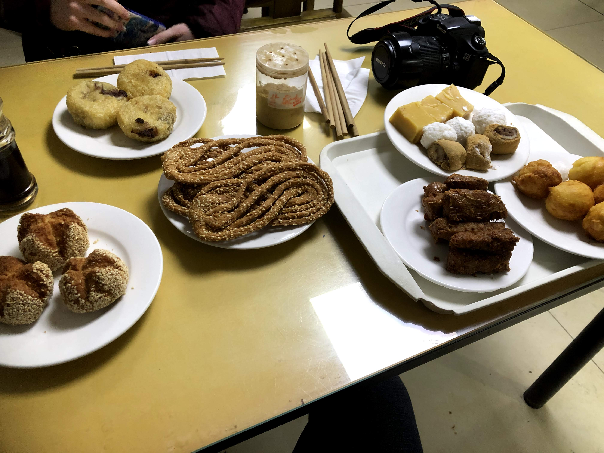
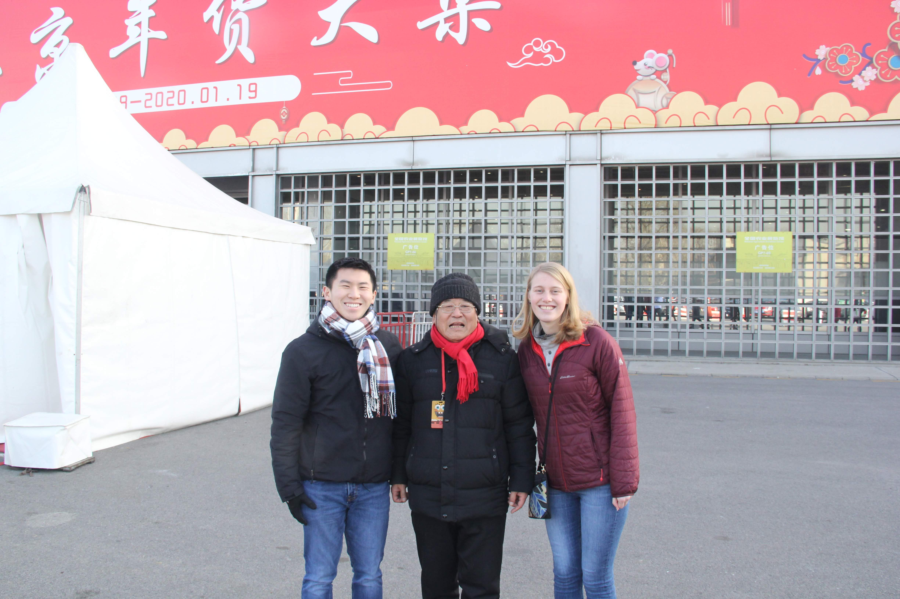
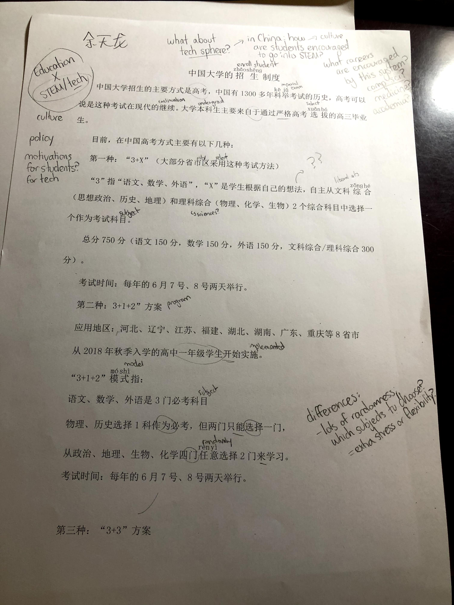
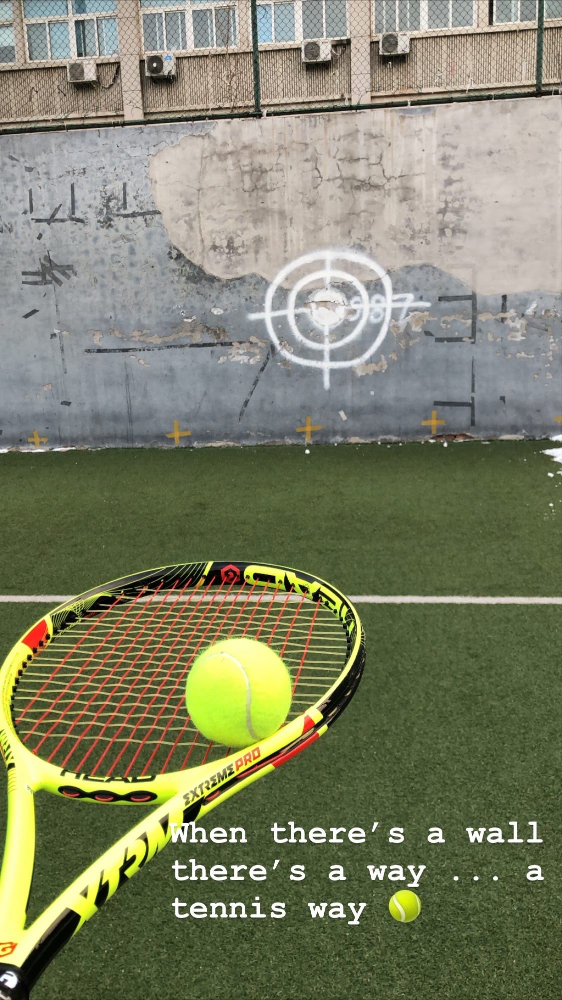
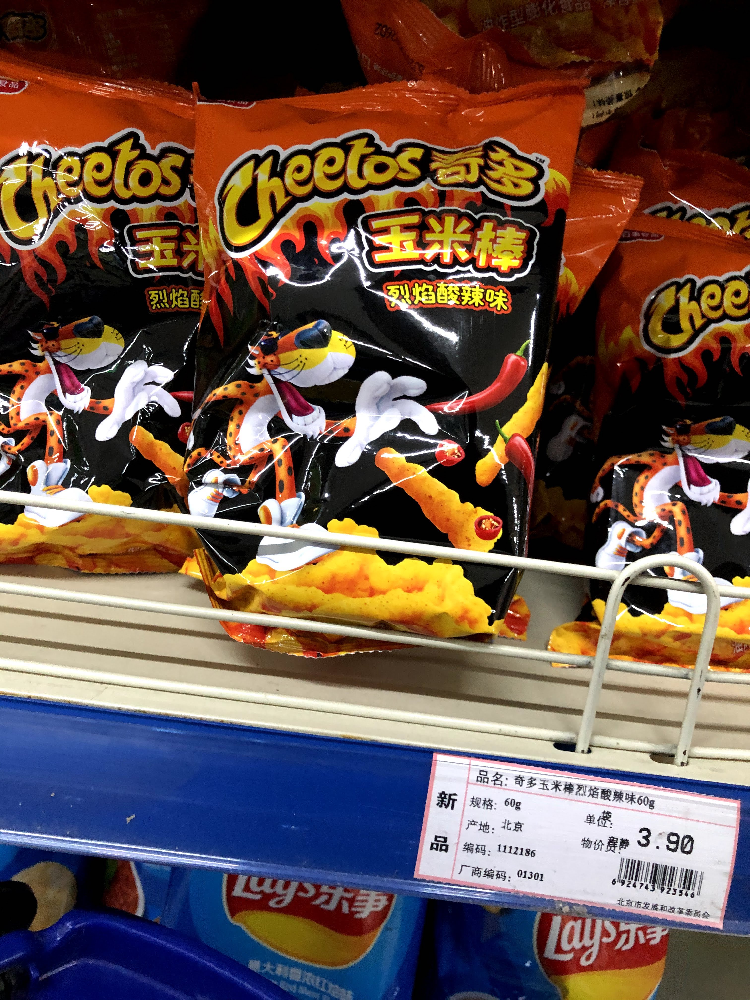
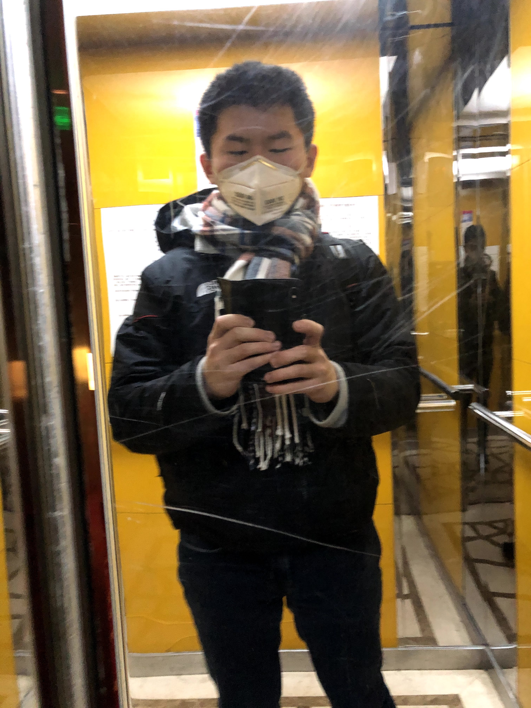
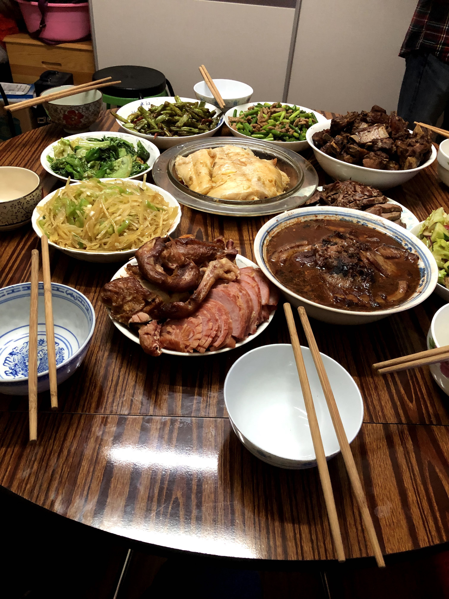
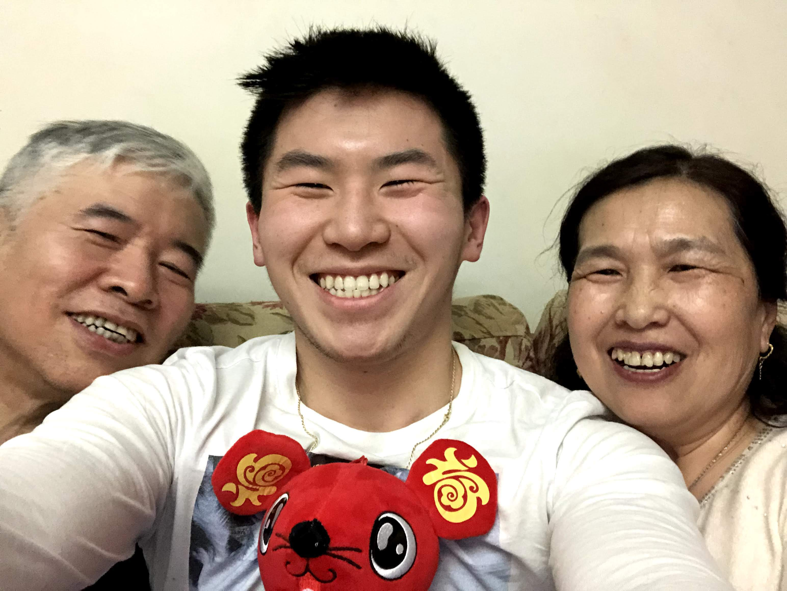
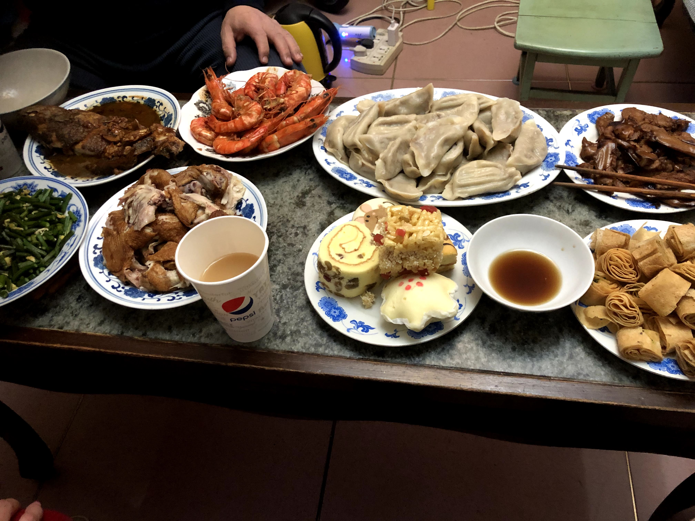

While that first week and weekend was overloaded with characters, I at least had a respite to look forward to: the Chinese New Year holiday, or 春节. I didn't know it at the time, but it would also become a turning point in what had been a difficult study abroad experience so far.

After seven days straight of Mandarin, I couldn't wait to have a break. I was ready to sleep and relax, but at the same time, I was ready to go out and explore. Unfortunately, the difficulty of my first week of classes had caused a problem: I hadn't made any friends to explore with. Sure, I had made the active effort of asking people to lunch or a meal, but I didn't feel ready just yet to get a group together and, you know, explore Beijing. In fact, during those first few days of the spring holiday, everyone just kind of shut themselves off in their rooms. I was ready for a break too, but I also wanted to go out and 玩儿一玩儿 with someone.

Thankfully, ACC had come up with a solution. For the spring holiday, we were to celebrate with our host families. In retrospect, I'm really glad we were forced to do this, because it would turn out to be one of the only times I would get an insight into life as a Beijing local.

Even though the other students and I had a hard time understanding our Chinese host family dad, we were able to get an insight into one of the beautiful parts of Chinese culture: the kindness and generosity. In spite of their coarseness, my *zhong guo baba* (Chinese dad) turned out to be super, super sweet. Not only did he treat us and cover the bill at the food restaurant covered above, but he brought us to some cool places that I definitely would not have went to otherwise!

In spite of all the rambling, in spite of the coarseness, I really do think that while Beijingers might seem a little bit cold to approach at first, once you really get to know them, you realize that they really are great people to meet and be around. For the first time in Beijing, I started to feel like I was starting to get adjusted to the environment at ACC.

Of course, things weren't all rosy all of a sudden. There were still lots of homework assignments and cultural misunderstandings that kept things from relaxing entirely.

That being said, these minor challenges, or pebbles, slowly disappeared over time, and I started being able to get by. It was near the end of my first week of classes that I finally began to learn how to study more efficiency. After adopting Pleco and an efficient learning system (review flashcards, self-graded flashcards, and fill-in-the-character flashcards), I had finally managed to increase my learning pace to a word per minute, cutting down my study time to two to four hours instead of four to six.

Furthermore, I began to find time to get out of the intensive language study to do other things. I found time to exercise. I found time to go to the campus supermarket and try out some new snacks. I even found time to visit my actual Chinese dad, my *bobo* and *erdama*, and restore some work-life balance back to my life.

It was far from perfect, but my study abroad experience at ACC gradually started to approach what I had expected it to be at the very beginning: an intensive period of Mandarin study balanced with cultural exploration. I knew ACC would give me the first half, but I knew that it would ultimately be the memories of traveling out into the city and experiencing true Beijing life that I really wished I had experienced more of.

When I look back at my two and half weeks in Beijing, it's the latter that I really regret not doing more. Sure, there was no way I could have predicted what was coming, but it's something that's really stuck with me as I make the most of my time abroad in the future. I can study characters anyday and anywhere, but the advice that the Light Fellowship office told me before I left Yale that I've really taken to heart.

> *Aim for the B.* 

When it comes to learning about the culture and the country, it really comes down to more than just learning the language. You'll never always have the chance to travel to a new place, and sometimes you just need to re-evaulate your priorities. I wasn't able to give Beijing the chance it deserved and fully explore any other place. I know that in the future, I'll learn to set my perfectionist tendencies aside and accept imperfection in the classroom, so that I can live with less regrets while abroad and make the most of my time there. 

But before I get too fatalistic about the demise of my study abroad experience, let me explain the events that led up to it ... in the next post.