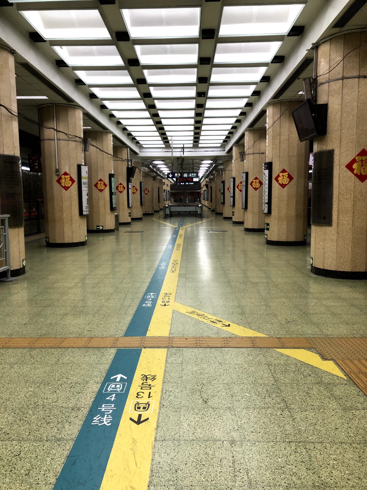
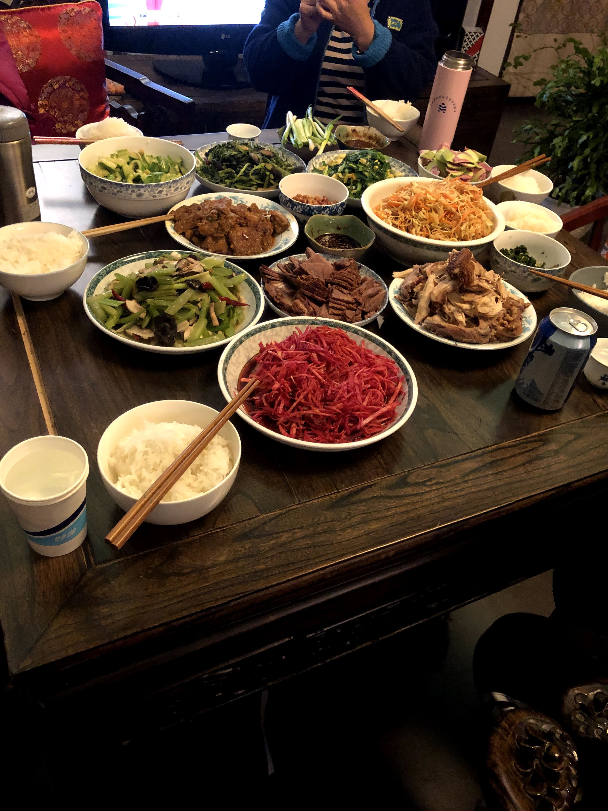
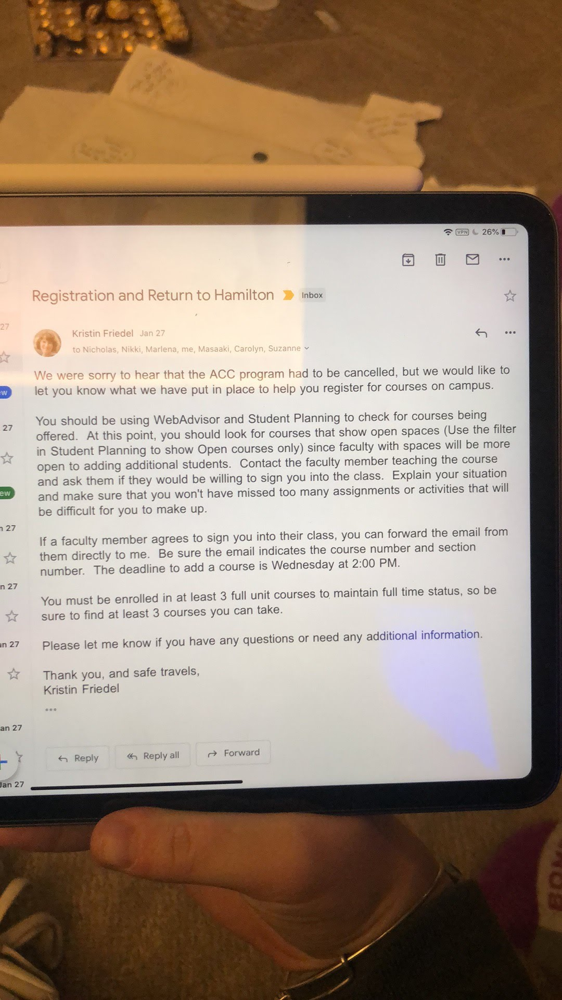
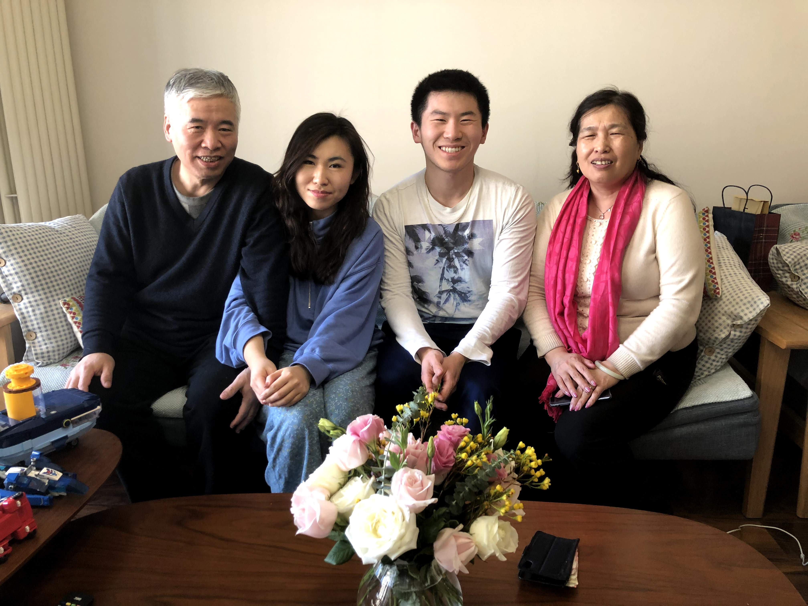

Even though we were some of the first to be alerted of COVID-19, the warning bells never really flashed in my mind until I got the final notice. Sure, I was following the latest updates on the virus and trying to stay updated, but deep down in my heart I never considered the possibility that something drastic would come out of it. The Chinese media claimed that the government had it under control, the WHO didn't consider it a major threat ... why worry?

But as the days unfolded little red flags began appearing in the surroundings around me. Alerts of schools in Wuhan and Beijing being closed indefinitely. Temperature checks at checkpoints throughout the public transportation system. Advice to stay inside and limit outdoor travel. It was clear that the government was downplaying the virus, but I couldn't have imagined it would grow to the scale it has become.

It was even present in the countryside. While visiting my *erdama*'s brother and his wife with my *bobo* and *erdama*, who live in a province about an hour and half drive north of Beijing, the first thing we encountered was a shuttered gate. I was confused because it was in the middle of the day, but a brief conversation with the guards with my *bobo*, and we were able to drive through. It was only after driving past the gates that I realized that the guards had orders to not let any nonresidents in as a precaution against the virus, and they had made an exception for us.

Yet, life continued on. I met more of my extended family, talked to them about life in America, and ate even more traditional Chinese food. To an extent, my situation continued on its upward trend, and I was able to still get that cultural exploration that I had wanted. 

It was only until the next morning around 9:00 am when I realized just how serious the situation was getting. It was a voicemail from Patrick, one of the other students in the program. The odd thing was that it was sent at 1 am in the morning, a weird time to send a message to check, and almost a minute long, when most of our intra-program communication had been via text.

It was after opening it that I heard Patrick speak in English, the final red flag. ACC has an extremely strict language pledge, punishable by expulsion from the program. It's such a serious matter that all of us at ACC text in Mandarin, even though there's no way the teachers could see our messages. I knew by the fact that he was using English, and that it was a long voice message, that something was seriously wrong.

After listening to the message, I realized why he had broken one of the biggest taboos in the program. Beijing had just banned all travel into the city, effective by 5 pm that evening. If I didn't get back immediately, I would be stuck. Forever.

# An Escalating Situation

Thankfully, the ban only applied to inter-city travel, and since the northern province I was staying in was still considered a suburb of Beijing, we wouldn't have any trouble getting back in. But it was at this point that things started to only go downhill.

After driving back into the city that evening and arriving back at the Minzu University, something happened that hadn't happened before. Despite having entered and exited the university a dozen times, I was stopped by the guards at the gate. After a brief discussion in Mandarin, they made me fill out a form, signing my name and writing down my phone number and student ID number. I didn't understand the sudden formality, but I attributed it to enhanced precautions rather than an actual threat. After asking a fellow student about it later that night, I realized the truth: the campus was on lockdown. No one could get in or out without special permission.

About a day later, the second bombshell hit.

Beijing had just cancelled all schools, from kindergarten to colleges, indefinitely. The weird thing was we hadn't heard a single peep from ACC about this, and as a program hosted at Minzu University rather than by Minzu University, we had no idea how this would affect us.

After a few days of uncertainty following the alert, where *Wang laoshi,* who was supposed to be on vacation during CNY (Chinese New Year), came in to update us on the situation with ACC, my own personal worries were assuaged. Hamilton, the American host university of the program, would make a decision that night, putting an end to all of the rumors that were circulating among us about the program being cancelled. I personally didn't think anyone in their right mind would cancel the program – why do it now, when the situation was contained in Wuhan, and the cases in Beijing were relatively low? If we all stayed at Minzu University while it was on lockdown, we would be fine. It seemed like a huge overreaction.

But the other students didn't think the same thing. I learned that already, almost a third of the students in our program (10 out of thirty) had already booked flights back to the US. And we hadn't even heard a decision from Hamilton yet! Their reasoning was that there was no way that Hamilton would continue the program, and it wouldn't be worth spending the next few months in Beijing stranded on campus. I thought they were crazy, but hey, it was their decision.

# The Final Blow

That night, I was relaxing in my room, calmly waiting for the final decision from Hamilton that night, when I got an odd text from another student in the program: Nikki. Apparently, they were holding a party with all the students, and that I should come! I couldn't understand why in the world they were celebrating like it was our last day together – Hamilton was going to continue the program and we would be just fine!

After getting to the room though, it was clear that no one else thought the same way. People were speaking in English and trying to pretend like the fate of the program wasn't about to be decided in a couple of hours. As soon as I brought up the topic, I was immediately shushed, and people turned off from me. The other students really thought that this was a serious decision that would affect us, and that we actually might have to leave the program. 

As for me, I was happy to prove the others wrong and just enjoy the party. After a couple of hours, we were playing party games and trying to laugh the whole situation away. We played Ninja together, watched sketchy Netflix shows together, and just talked about random stuff. It seemed like the whole impending decision was miles away. ACC hadn't sent us any communication, so we assumed that it would still being discussed.

Then, out of the blue, one of the Hamilton students gasps and shows us this email.

At first, it didn't make any sense. *We were sorry to hear that the ACC program had to be cancelled?* Since when? We hadn't heard a single thing about ACC about this, and we assumed that such an important decision would be relayed directly to us, not in an indirect email only to Hamilton students about re-enrolling in classes at Hamilton.

After multiple calls that failed to get through to any of the ACC teachers to explain the situation, Nikki finally managed to get on the phone with Nitsa Weld, the director of ACC. We were confused because we hadn't heard any news about the cancellation prior, so we wanted to know what had happened. It was then that we received the news.

ACC was cancelled.

# Sorting out the chaos

I couldn't believe it. The program was actually to be cancelled? I would no longer be studying abroad? Obviously Hamilton had made a mistake and didn't understand how we at ACC were fine on the ground. But after the phone call, it was clear that Hamilton would not be reversing their decision, and we would have to get out of the country, immediately.

The next few hours were a blur.

Regarding the lack of prior notice and miscommunication, we discovered that Hamilton had drafted a comprehensive email that was supposed to be sent out an hour earlier to all the students. However, due to an error on their end, they had forgotten to send that email, causing this entire dilemma and confusion. I must admit, I was more than frustrated. How could they have messed up communicating a decision as important as this?

The room erupted into chaos. The party game we had been playing minutes before on a cardboard box was suddenly abandoned, and everyone started freaking out and trying to understand what the do. Students were in the hallways, pacing and making international phone calls. Other students were crying and just in despair, unable to process the entire ordeal. It was surreal.

I still remember walking out of the hallway, going up a floor, and walking into my room to make my phone calls, just to get away from the chaos below. I wasn't even wearing shoes. I called Tim, the Light Fellowship Director. I called my Mom. I even called *yingying,* my *bobo's* daughter who I was supposed to meet tomorrow to celebrate. A million questions raced through my head, but ones about my health were in the back of my mind. At the forefront were the logistics. *What would happen to my academic credit? Could I return to Yale? Did I have to leave China?* 

I think in the back of my head, I still wasn't able to fully process the threat of the virus at hand. I knew personally that as a young 19-year-old, I was under no threat of being seriously harmed by this virus. That much was correct. But what I didn't comprehend at the time was the capability of this virus to shut down Chinese society and paralyze the entire world. In the following few days, I would see enacted travel bans, plunging stock markets, massive event cancellations. It was chaos. It was surreal. It was my first ever pandemic.

But none of that would hit me until later, and my first order of priority was figuring out what to do next. Per ACC recommendation, I was to fly back to the US immediately. I didn't know why I had to get out of the country so urgently, but I knew that I had a reason no longer to stay in China. My mom booked a flight for two days later, and I would leaving my study abroad program, three months earlier than expected.

# An Abrupt Farewell

It would take a month to fully figure out the logistics of my study abroad situation, and there was tons of unanswered questions floating around, but all I had to focus on in the present was two things: packing, and getting the heck out of China.

![Packing my lightly used tennis rackets in my new room. I forgot to mention that to compound on the confusion, Minzu University had us evicted from our previous rooms the day of Hamilton's decision, because they would be moving all students into the hotel. I was frustrated but I complied and moved into the quadruple that I would be sharing with three other students. Ironically enough, the other three students would be leaving immediately, so I would have the quadruple all to myself. I had been promoted from a dingle to a quadringle.](../uploads/012720_acc_packing_tennis_rackets.jpg "Packing up Jeff's tennis rackets")

After a day of packing and settling last minute things, I left Minzu University's campus gates for the last time on the morning of January 29. I had alerted my *bobo* and family almost immediately after I had learned of the decision, and they had agreed to drive me to the airport that day. 

I had been planning to spend a full day (in fact, multiple days) with more of my family. *Yingying* had been super kind to me and planned a whole list of events to do together while I was in Beijing, but the only time I would get to spend with her and the rest of my family would be a couple of hours before I left for the airport.

After giving them my four-month supply of gifts and eating lunch, my *bobo* and *erdama* drove me to the airport. That night, I flew back to my hometown in the USA, and just like that, my study abroad experience in Beijing was over. A million questions remained unanswered, but what I did know was that I was not going to give up my study abroad experience that easily. 

It wasn't the end. No, it was just the beginning.