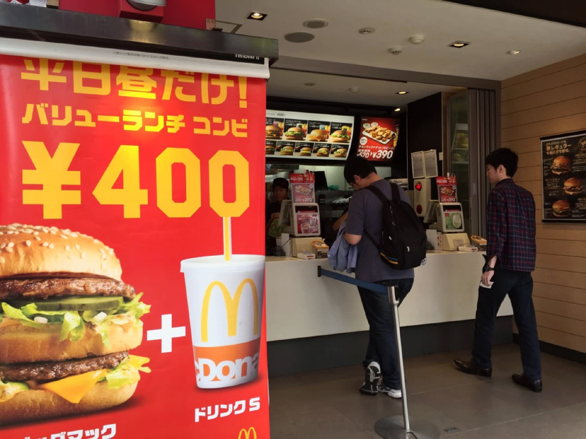
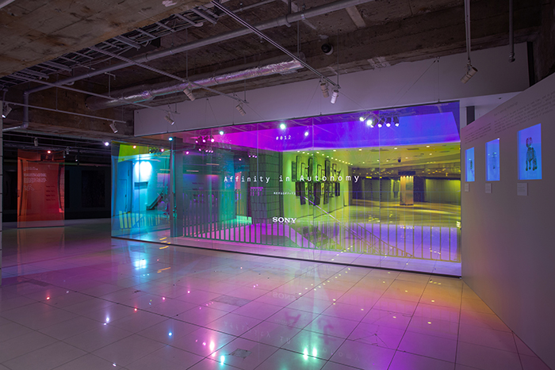
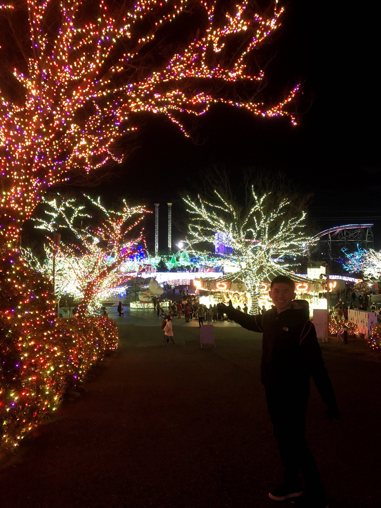
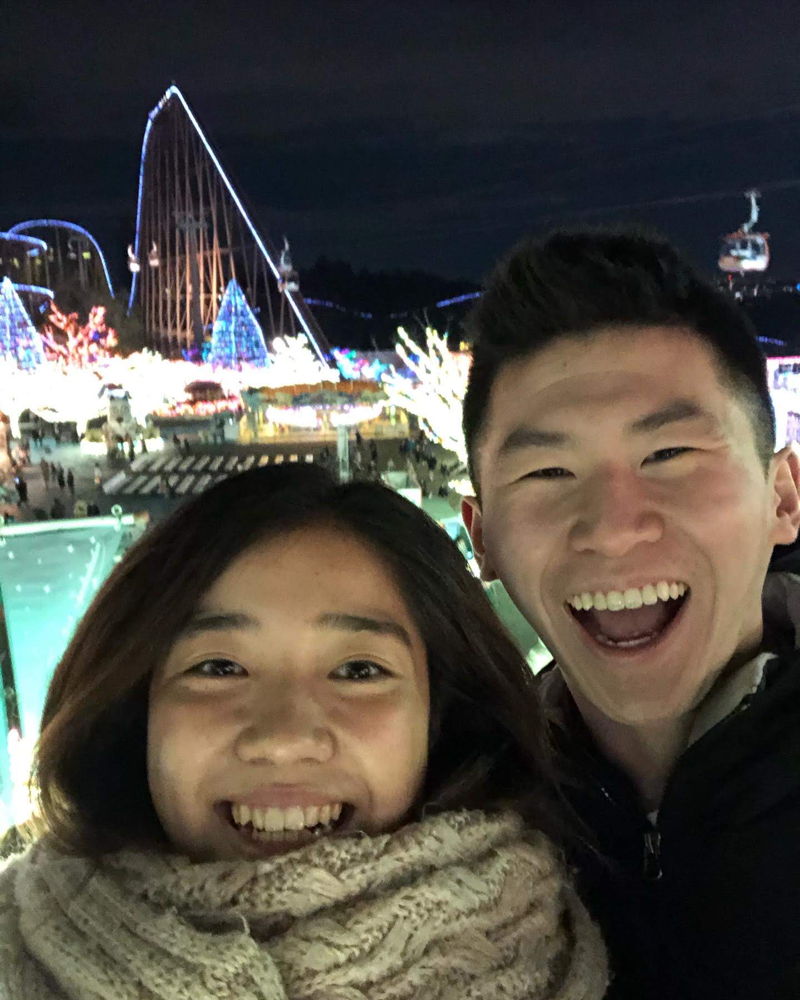
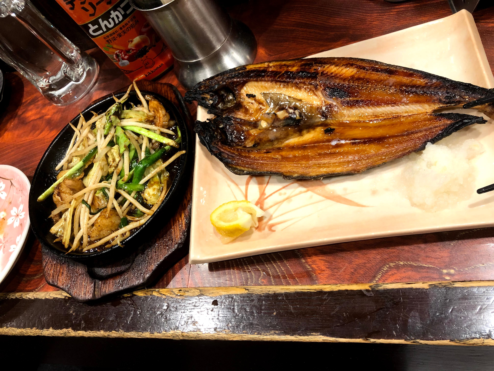
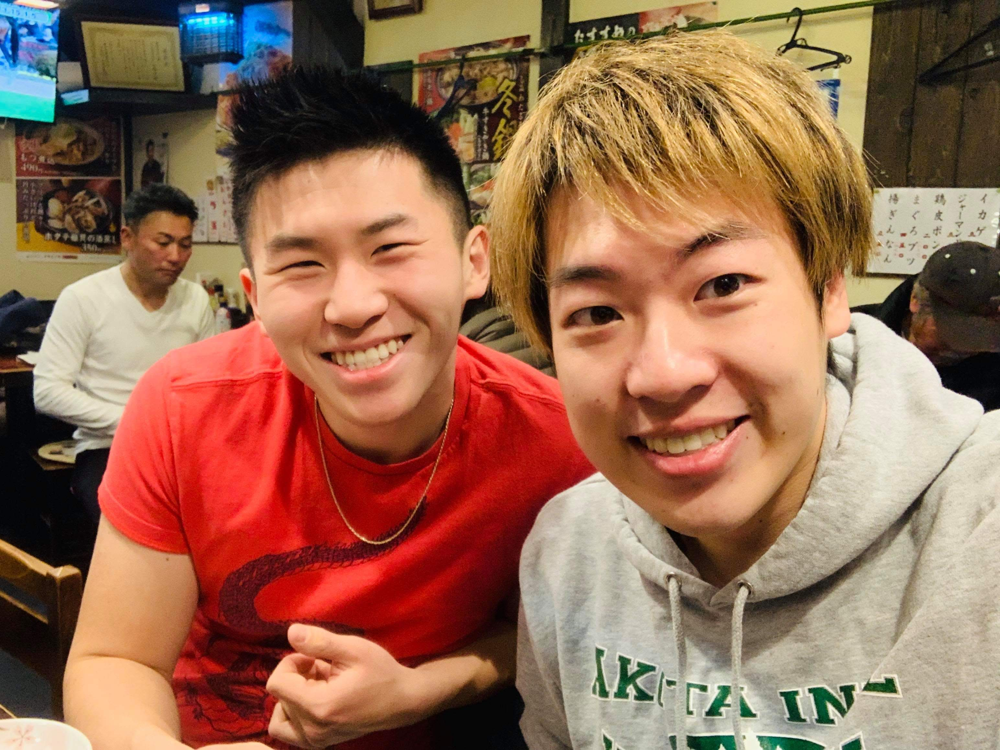
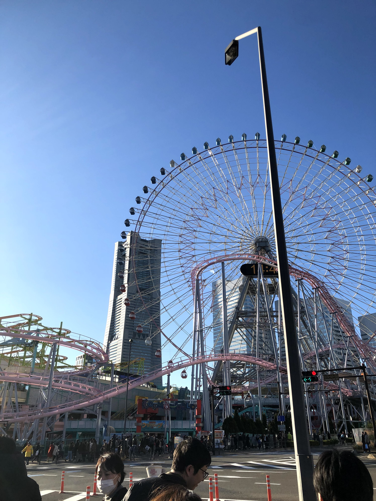
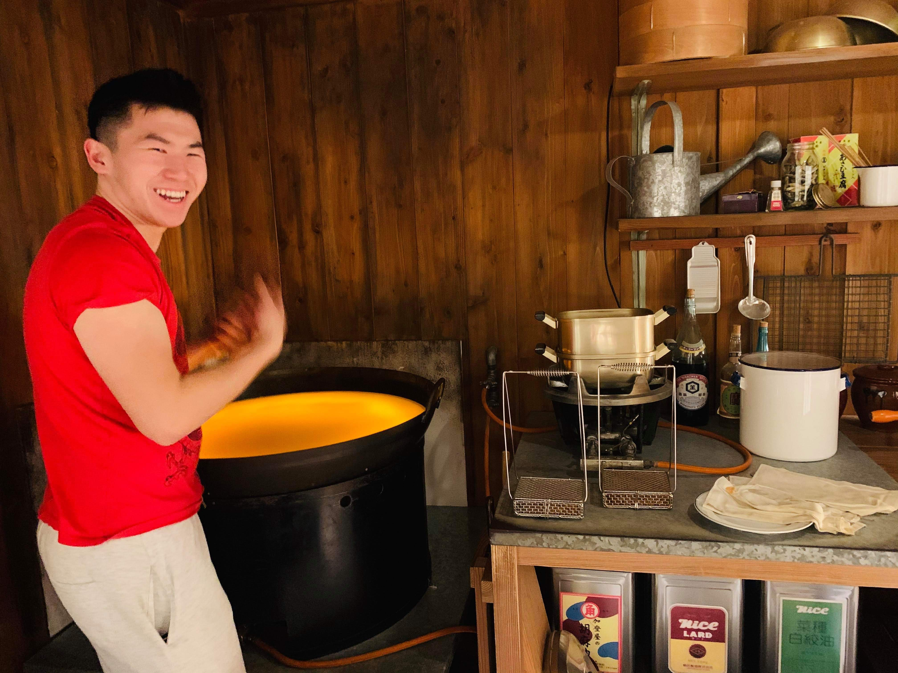

With the time before HUT rapidly coming to a close, I was ready to end my last two days before teaching with a bang: hanging out with three of my good friends from HLAB last summer. There's something special about traveling when you're not only 1) spending it with people that you knew before rather than new strangers, but also 2) spending it with locals who know the area in and out. 

## Finding Affinity in Autonomy with Jueri

The first person I hung out with after my solo travel hiatus was Jueri, another SA from the Tokushima-Mugi region. We deliberated for a long time on what to do. I personally am really interested in the unique things that you can only experience inside a host country. I can't understand, for example, why some people would travel thousands of miles to go to a place they already host in their home country. For instance, I think that Americans who fly over the ocean to Japan just to eat at McDonalds every other day are foolhardy. Why get a Big Mac in Tokyo when you can just one at home, instead of, say, a kaiseki meal set? 

Yes, I understand that some travelers get homesick and crave something they're familiar with. Yes, I understand that the food at McDonalds in Japan isn't necessarily the same as the food at McDonalds in the US. Even still, I personally could not entertain the idea of doing something like that, so I had asked Jueri if there was anything I could do in Japan that I couldn't do in the US. Luckily, she had a place in mind.

After meeting her at the Ginza Sony Park subway station, we went to the **Affinity in Autonomy** free tech exhibits, located underground right next to the subway lines.

You can find information about the exhibits on their [webpage](https://www.ginzasonypark.jp/e/program/020/), but they're essentially interactive commentaries on the future role of robots in human society. Each exhibit has its own unique robot that does its own thing. For example, there was a robot on tracked your hand's location, spherical robots that rolled away or to you depending on your movements, and one that imitated the mannerisms of a dog. It was pretty cool and gave me some new insights into how Japan views their relationship with autonomous machines in the future.

After going to the exhibits, Jueri and I spontaneously headed off to a Tokushima-Mugi high schoolers reunion which happened to be taking place at that exact time. It was kind of cute! It was entirely organized by the high schoolers, and I was able to see a couple of the other SAs and Japanese college students from my region. I even saw some of the high schoolers from my House! Unfortunately, after discovering that I was the only CM there (which made sense, since it was never really advertised to the CMs), I realized that it really wasn't the type of place I should have been at. Mostly everyone was speaking in Japanese (which made sense), and despite the efforts of the SAs to make me feel involved, it was a little isolating, so I left early. I needed to pack anyway and move to the AirBnB that HUT had assigned to me.

## Embracing my Inner Thrill Junkie with Risa

After packing up all my stuff and moving from the House by HLAB to my new AirBnB, I was for a change of pace. In fact, I was ready for a really **fast** change of pace.

That's because that evening, I had something exciting planned that I hadn't done in a really long time. I was going to Tokyo's premier amusement park: **Yomiuri Land.**

And I wouldn't be going alone. This time, my friend Risa, who was an EC (member of the Executive Committee on HLAB – basically, the Japanese student board that organized the summer school), was there to guide me around. Man, it was fun. Despite the surprisingly long lines, I was in awe as I gazed at all of the beautiful lights that were definitely racking up millions of dollars in energy costs.

It was really fun hanging out with her, catching up on everything that had happened since the summer school, and riding on a rollercoaster again. I definitely missed the thrill of going on rollercoasters and definitely plan on going on more in the future.

## Yeeting my way into Yokohama with Roy

Last but not least, it was time for some quality time with someone who I had spent the most time with in the summer school: my **actual** SA, Roy. This time, I would be brought to Yokohama, a small, major city located to the south of downtown Tokyo.

As Roy brought me around the city, I was surprised to learn how highly he thought of it. He lauded adulation on the food, the lack of congestion, the cleanliness, the cheaper prices. 

After showing me his apartment and grabbing lunch from one of the nearby restaurants, we walked, talked, and explored around. Even though Roy had been to Yokohama longer than I had, he still only had been there for a couple of days, so everything I saw was also relatively new to him.

It was a nice way to wrap up my week of self-travel around Tokyo. While it was nice to solo travel and hit all of the spots in Tokyo that I wanted to visit, there's something really memorable about the moments you spend with old friends. Even though I've forgotten a lot of the small details from the places I visited alone, I still remember random nuances of my interactions with friends: Jueri and I moving up and down escalators in a Ginza shopping me, Risa and I rocking the ferris wheel booth accidentally and me almost crapping my pants, Roy and I strolling along a bridge overlooking Yokohama Bay. My first trip solo traveling was an interesting experience, but I think it's really highlighted for me the importance of spending time with people. I wouldn't have appreciated my time with my friends from HLAB as much if I hadn't had some space to myself. Life really is all about balance, something I'm really glad to have learned from my time abroad.