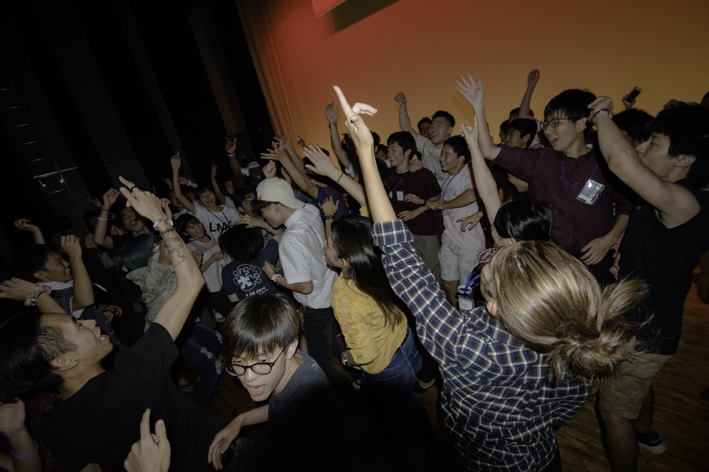
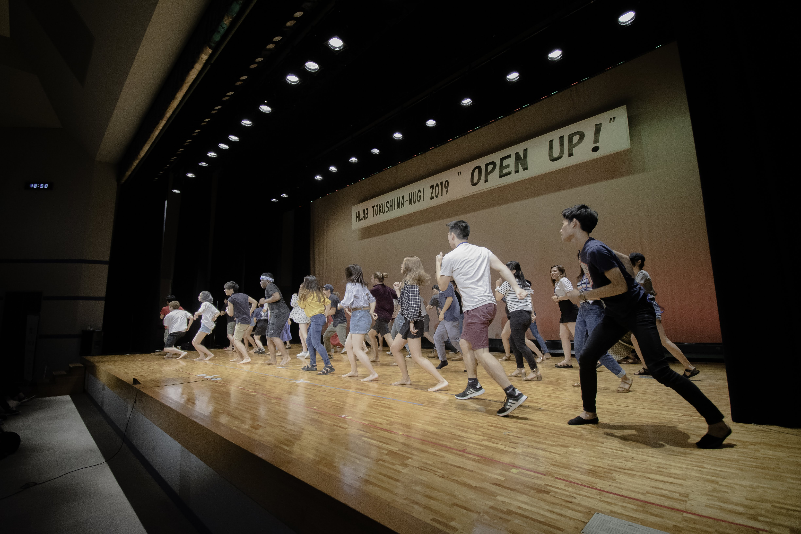
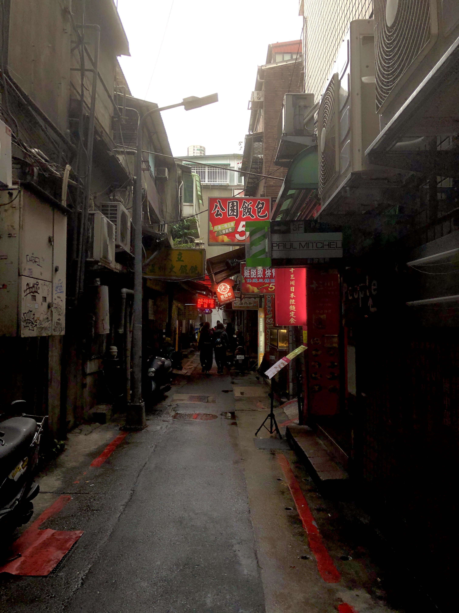
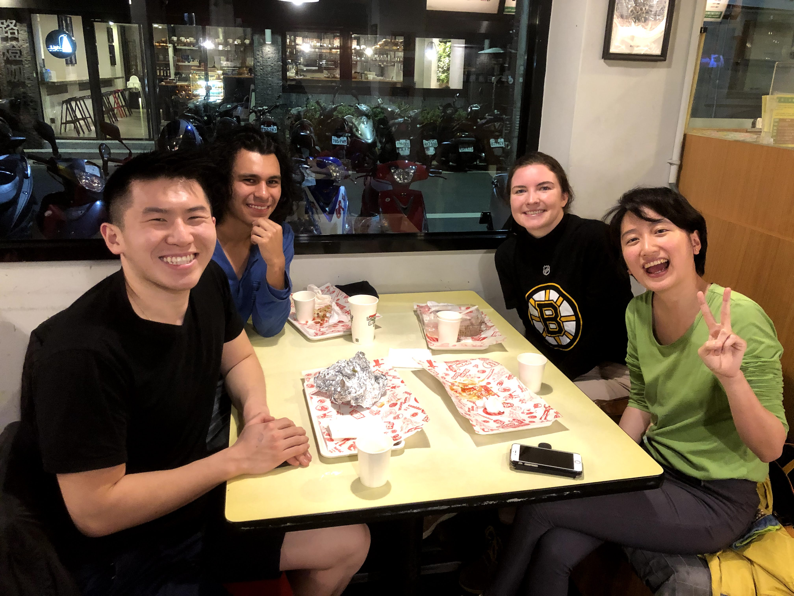
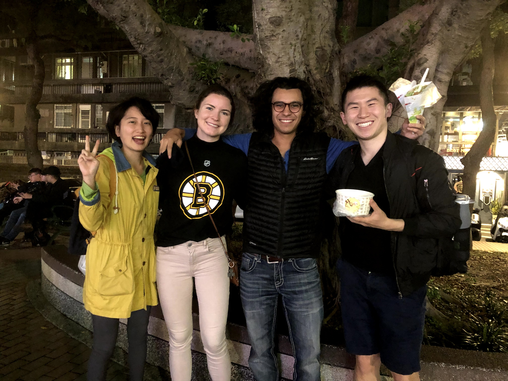
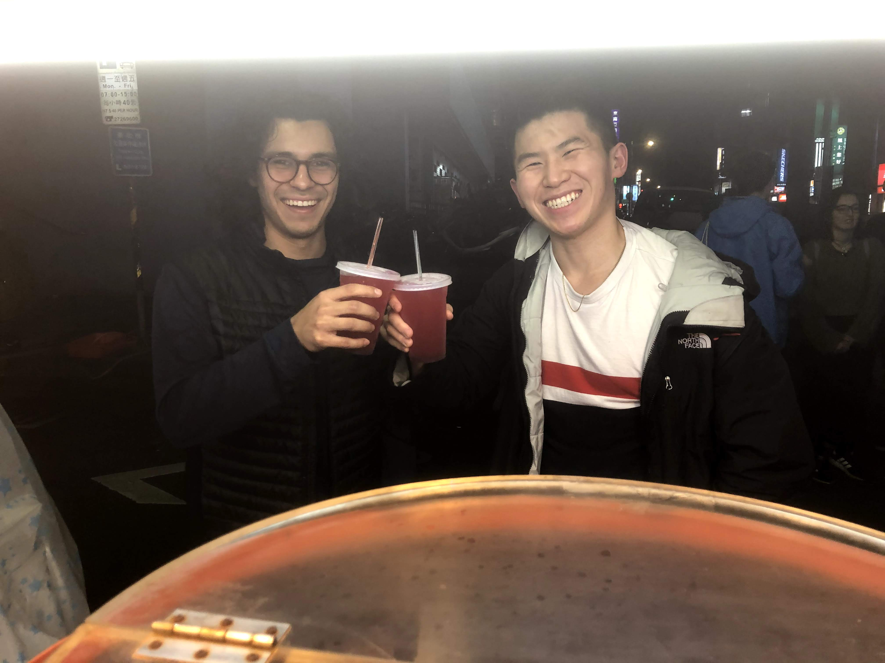

As I've gotten older and received more freedom to find my own place in society, I've come to consider a question many ponder at some point in their lives. No, it's not the quintessential question this time – this is a different (albeit also important) one.

> Am I an introvert or an extrovert?

Before, I would say I was an introvert without hesitation. It was easy for me to mind my own business in high school, killing time playing video games or watching YouTube, and just finding peace in being by myself. However, ever since going to HLAB Summer School 2019, a social melting pot of people from all over the world, and being forced to be around people 24/7 for two weeks straight, I discovered that my attitudes had changed.

**I actually enjoyed being around people.**

I'm sure some people will think, duh, everyone does. But for me, this was a marked departure from how I had felt months prior, where, while I was happy to experience social contact once in a while, I had never thought I would enjoy being in a social environment 100% of the time. 

It was bizarre, because while others in the program loathed not having free time and space for themselves, I reveled in the packed scheduling. I disliked it when we had free time to ourselves, where we weren't forced to be together and everyone left to do their own thing. It was a drastic change from what I had expected from myself at the beginning of the summer school: enjoying being around people more than being by myself.

As a result, while my answer to my original question was originally "introvert," I've changed it since then. I now consider myself an ambivert, someone who gets energized with social interactions *sometimes.* While I find how my tendencies have changed interesting, I find the trend behind how I've changed even more interesting. I think I've gone from being introverted to becoming someone who realizes the value in being around other people. It took the insanely social environment of the two week summer school to realize this, but I'm glad I did. I think humans fundamentally crave being around other people, and the reason why is not only to have someone else understand you, but also to have someone to have fun and enjoy life with. I've realized that I can derive just as much joy from sharing moments with other people as with being by myself, if not more. This has been my life-changing realization.

# finding time to be social

There's only one problem: rare is a program like HLAB that forces you to be around other people 24/7. College and study abroad programs are never like this, since most people have at least some free time each day to themselves. Work and real life is also never like this – most of the time, you'll be by your lonesome. 

For me, it was too easy to stay at home while abroad and bathe in time by myself. In fact, I fell into this pit trap while in Beijing at ACC. I got into the habit of depending on the program to make friends and organize events. Sure, I invited people to get lunch after classes each day, but the majority of my time was spent alone in my dorm, studying. I hadn't made an active enough effort to expand my social bubble and meet people that I could have fun with. I got by, sure, and was able to survive. *But it was a far stretch to say that I was happy socially.*

The thing about being introverted is that everyone needs human contact at some point. Anytime I spend a few days by myself, I develop an "itch." It's an itch to *be* with someone else. This much is what I had known; what was new after the summer school, however, was that this itch wasn't something that just needed to be scratched and satiated. No, this itch could be something to be enjoyed. I could go beyond just spending time with someone and actually go out and *have fun and make good memories* with someone.

As a result, it became my top priority at ICLP to expand my social circle and avoid the mistakes I had made at ACC. I would make time outside of classes and studying to meet new people in non-academic environments. I would attend club meetings and events once a day on weekdays. I would proactively organize social gatherings and be the one to **bring people together.** Organizing meals, hikes, trips. These were the things I regretted missing out on in Beijing and would not miss out on in Taipei.

This was the social goal I had for myself in Taiwan, and one that I would take with me for the rest of my life. No longer would I be subject to external forces and efforts outside of my control. No, I would be the one who brought people together, the one who created the social circle I wanted. It was time to adopt these lifelong habits I didn't have in college and take back control of my social life.

# being okay with being alone

Of course, in my idealist state, I knew I wouldn't be able to simulate something socially on the scale of HLAB. People are busy in real life, and it would be impossible to get work done (even in HLAB we weren't really working) if you were constantly hanging out with other people.

What has changed since HLAB is that I've realized that it's okay to be alone. You don't always have to be out with other people partying and having a great time like you see on social media. In fact, sometimes being with other people comes with consequences.

I remember going to the Raohe night market in Taiwan one night and realizing that I wouldn't have the chance to explore the night market to the extent I wanted, simply because I was too busy talking and dealing with others in the group.

, a Taiwanese local in our group, and me at the Raohe night market")

I remember being so preoccupied with trying to follow everyone around and keeping up the conversations that I wasn't able to look at more than one or two of the night market stands, despite being interested in dozens of them. Being social in this case made my night really bizarre – I felt a distance between our social group and the environment surrounding us, when I really wanted to be at the intersection of the two.

That's not to say there haven't been times where I've explored an area and wished to be doing it with someone. Trust me, that's happened a lot. However, there are situations where being in a group is a direct obstacle to engaging with the environment. In these types of conditions, it's sometimes better just to be alone.

# unexpected joy in being together

Since HLAB Summer School, I've been able to find unexpected joy in the moments I do spend with other people. Why? Because now I believe that it can happen.

Take an innocuous dinner with some fellow Yalies I met in Taipei. I was expecting just a quick meetup, but it turned into a multi-hour long hangout session with genuine laughs, meaningful connections, and good times.

It's kind of new to me, having a good time with people I've never met before on a first interaction. It's something I always associated with long time friends. I didn't realize that extroverts literally live on this type of positive energy.

It's important to learn how to bring this optimism to others yourself. I remember another night when I went to the Second Student Activity Center to join some clubs, and all I could think about was how excited I was to have another opportunity to meet some potential lifelong friends. In the past, I would hold back and restrain that energy to not appear too childish, but I've changed since then to instead embrace my giddy optimism whenever it surfaces.

Zach is an awesome person to be around and is a positive influence by himself, but I think when you're also a ball of energy yourself, it's easier for other people to reflect your mood. It really does wonders when you try to make others laugh and change the mood in a room. That night, I was reminded of that same feeling of unlimited opportunity I had when I was joining clubs at Yale for the first time – a feeling of optimism and hope. Little by little, I've come to realize that there's nothing stopping me from trying to feel that way each and every day. It's this simple paradigm switch that has allowed me to achieve something I've never had before: a balance between friendships and alone time.