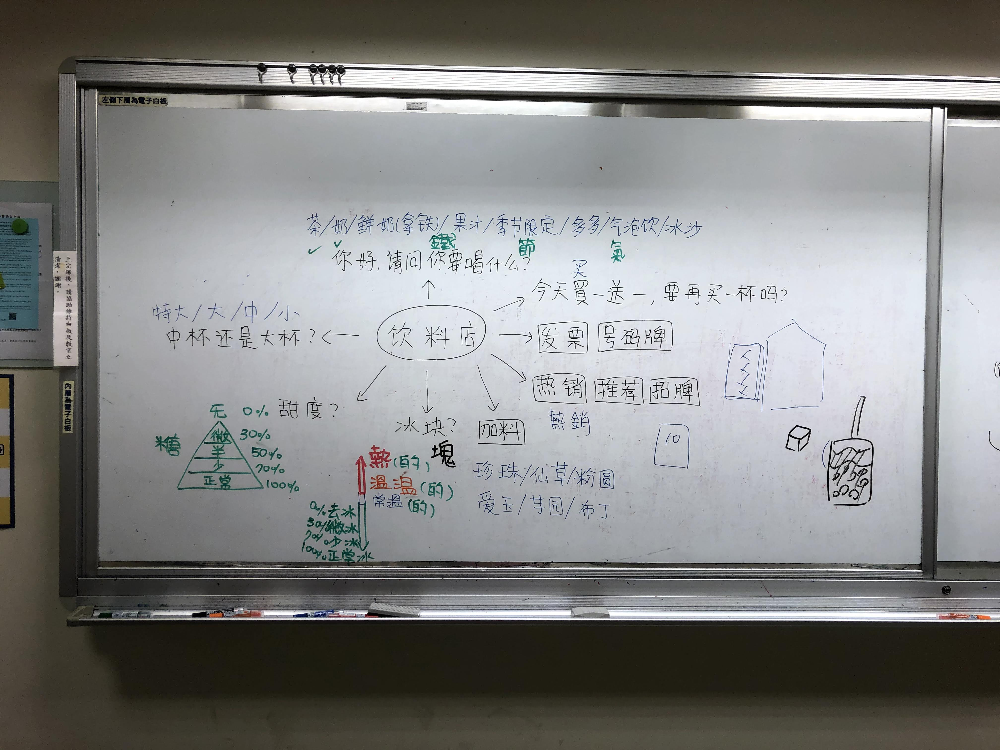

It's the core reason I came to Taiwan on the Light Fellowship: to learn Mandarin and break down the invisible language barrier. 

I knew it was going to be difficult, but I didn't realize just how difficult it would be in Taiwan compared to China. You see, at ACC, I was in a relatively contained environment. I went to the same classrooms to talk to the same people (who knew my language level), I went to the same cafeterias to order the same food. While I expected to be challenged each day in Beijing, say, by talking to locals, I realize now, after the experience, that I had subconsciously arranged my schedule to avoid these kinds of interactions.

Sure, it's easy to say that Beijing was designed to be like that: structured. But it's the mini failures when talking to locals where growth really occurs; if you never place yourself in a position where you are vulnerable and insecure, you will never grow. As a result, I resolved to spend my time in Taiwan pushing the boundaries and placing myself in unfamiliar situations.

Making a goal from such a high-level didn't make it any easier to implement on the ground. I failed many times and experienced several lows where I couldn't complete basic tasks in Chinese without the other person resorting to using English. For example, yesterday I tried to check out some milk, bananas, and peanut butter at my local PXMart (supermarket), but the person at the counter asked me a question in superfast Mandarin that I hadn't prepared for. *youhuiyuanma?*After staring at him blankly and hearing it repeated several times, he finally let out the key word: *\[do you have a] **membership**?*

It's moments like these that I realize that I really am far from speaking like a native, or even fluently. How can I consider interacting with Chinese or Taiwanese people if I can't even go through a supermarket without using English? 

The easy thing to do would be to break the language pledge and speak English right off the bat, or try to not say  anything at all, or precede my speech with *buhaoyisi, woshiyigeliuxuesheng, suoyiwodezhongywenyouyidianercha.* ("sorry, I'm a study abroad student, so my Chinese is a little poor") However, I know that these kinds of safety nets are just protecting my ego, so I've tried to actively avoid this type of subconscious defense mechanism. I keep reminding myself, *speak up confidently and use my Mandarin!* But putting yourself in positions where you know you'll likely fail or get misunderstood does get disheartening.

# a ray of hope

At the same time, I know that it's putting myself in positions like this that I'll grow as a person. I believe in the idea of "baby steps to giant strides," and I've seen glimmers of hope that I soon will be able to handle basic day-to-day interactions without any English.

One of my best memories so far was learning essential restaurant vocabulary with a private tutor from NTUE. (National Taipei University of Education) Since I got to Taiwan a few weeks before classes started, I wanted to get a head start on learning vocabulary so I wouldn't be thrusted into suddenly learning 80+ characters a day when ICLP classes began. As a result, with the help of some other Yalies, I set up a week of customized classes where I covered topics like academics and sports. My favorite topic, however, was the one on Thursday: restaurants.

First, I must say the following: **my teacher was awesome.** I wasn't expecting much from this week of lessons – after all, each day's lessons were only two hours long, and I only wanted to prepare 60 daily characters. Furthermore, I wanted to focus on *taolun,* (discussion), which didn't really warrant intensive preparation in advance. While I used these lessons to prepare for the speed of ICLP, I also used them to kill time.

However, time and time again, my teacher went above and beyond to make my lessons as engaging as possible. As an example, for Thursday's lesson, I was just expecting a discussion on restaurant terms and life in Taipei. Instead, imagine my surprise when I saw what *qiulaoshi* had prepared for me.

She had went out to the local community and gathered **eight** menus from **eight** different food and drink restaurants.   How awesome is that? Not only that, but she had drafted notes and an ordered list of topics to tackle during the lesson.

We covered how to answer questions that I had actually struggled with in Taiwan, such as how to indicate that I'm dining in and how to specify my desired ice and sugar concentrations. No longer would I be so scared or hesitant of trying foods because I didn't know what they meant. It was amazing because it was all so immediately relevant and would change my relationship with the food scene in Taipei. 

In fact, it would become so immediately relevant that we would actually go to restaurants after the lesson to use our new vocabulary. Now, I've done field trips before, but usually they usually weren't as personally relevant to me or interesting. However, this one dealt with an issue I had struggled with long after arriving in Taipei, so it turned out to one of the best field trips I've ever had.

I still remember walking up to the bubble tea stand we had found in front of NTUE and looking at the all-Chinese menu. I stared at it for a solid ten seconds, rehearsing how I would order my tea in my mind. Finally, after the person in front of us had ordered and the server began looking at me quizzically, I stepped up and said what I had mentally practiced. *woyaomaizhezhongnaicha.*

In response, he said rapidly: *tianduwendu?*

It was slightly different from what I had prepared, but I understand what he had said. In what felt like a long and awkward five seconds, I haltingly uttered out a reply. *weitang ... wei ... bing.*

He was quiet for a moment, thinking. Then he nodded and began making my beverage.

I turned to *qiu laoshi* excitedly. It was exactly as we had practiced, and I had managed to do it without any extra help! On top of that, he had understood what I had said on my first try! 

Following my successful boba endeavor, I went ahead with my laoshi and purchased the other things we had practiced ordering that day: an entree and a dessert.

It might seem silly now, but for me, this was the first real step where I felt like I had made some concrete progress assimilating into Taiwanese life. So many times beforehand I had looked at a restaurant only to not go inside because I didn't understand the menu. I'm still far from completely understanding it, but at least now I know the basic type of food I'm ordering (dry noodles, soup noodles, fruit juice, etc.) so I have some control over what I can eat. It was liberating.

It's after taking these little baby steps that I feel like I'm slowly starting to make progress. This week it might be ordering food from a restaurant, but in a few months it just might become doing complicated tasks like setting up a bank account. Through slow and steady work, I'm starting to believe that I can finally chip away at the language barrier that had been erected in my life for so long.

# a surprise in store

Days later, I went to the second student activity center with my friend, Zach. We had been popping into clubs to ask what they were like and were about to leave when I found one last one that interested me. I bopped in and confidently repeated what I had said ten times that evening to the closest Taiwanese student next to me: 

> *buhaoyisi, zheshinayigeshetuan?*

She then proceeded to list off lines of fast Putonghua that I didn't understand at all, but I nodded. After saying thanks and heading out the door, I heard her say something to a friend that I didn't catch fully.

> .... *dalu ...*

Zach had, though, and he turned to me with a wide grin and said, *"Dude! She just gave you the highest compliment she could give you!"* Confused, I asked him what she had said.

With a big smile, he said, "*she said she thought you must have been from the mainland. \[China]"*

It took me a second to process, but I was shocked. Me, with my three semesters of Mandarin, and I was already fooling people into thinking I was a native speaker?

Maybe my goals weren't so far off after all.