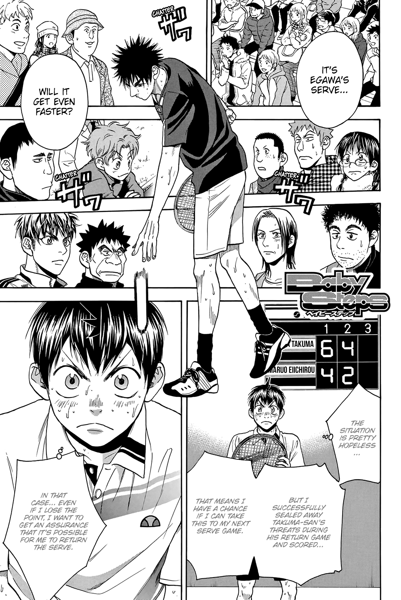
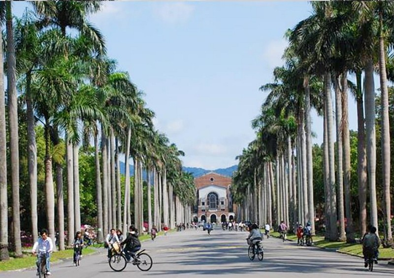
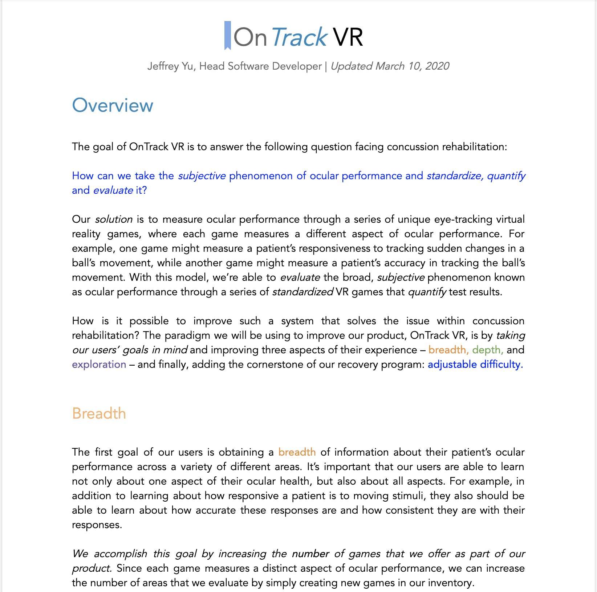
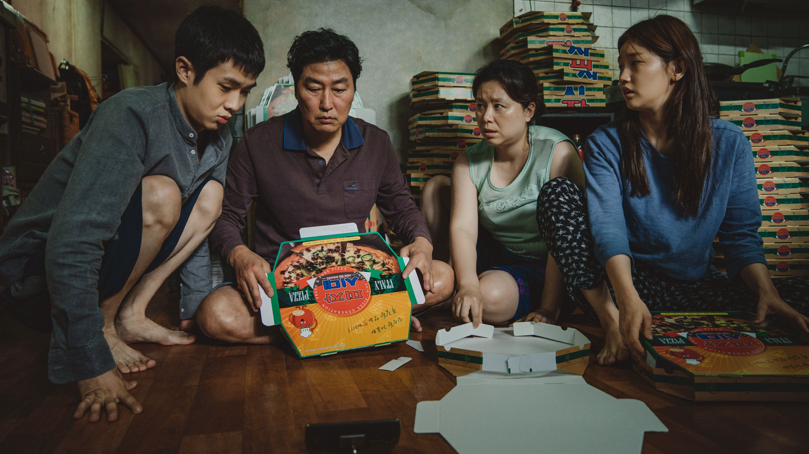
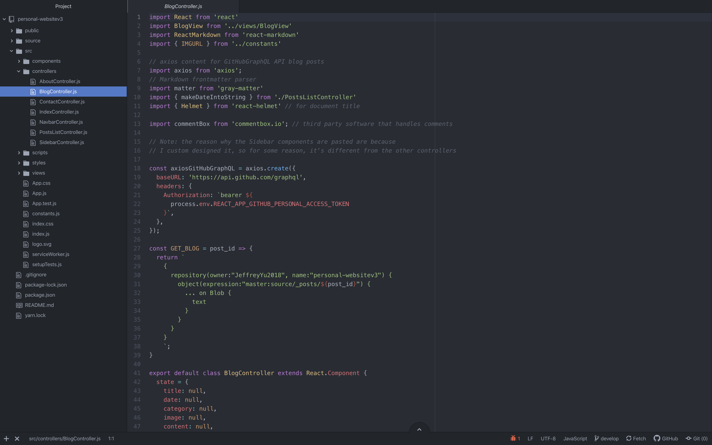
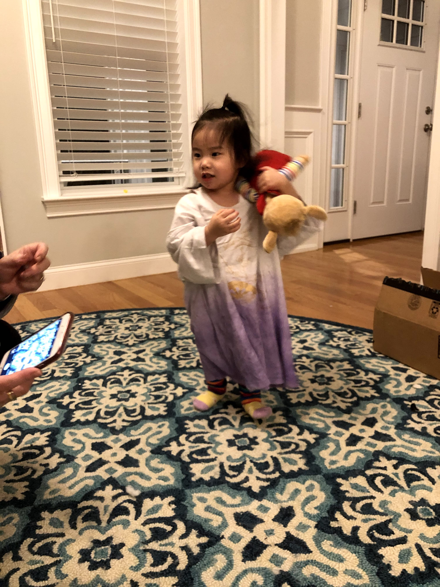
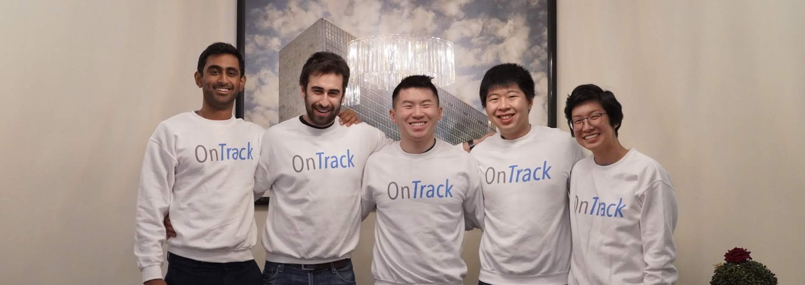
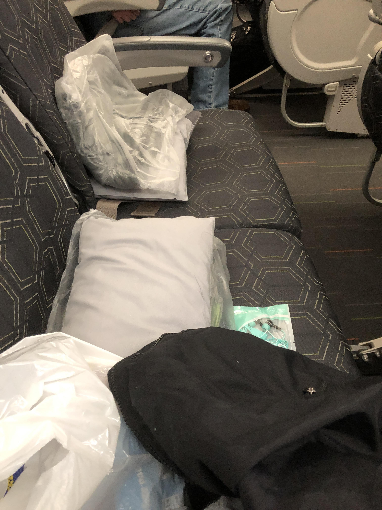

Since I returned to the US before Trump's travel ban took effect, and since I was a US citizen, I was never under the threat of being stuck in China or doing a mandatory two-week self-quarantine. Furthermore, I was coming from Beijing, a city with very few cases, so it was even less likely I had contracted COVID-19. Still, I didn't want to risk endangering anyone else in case I did turn out to have the virus, so to be **extra** safe, I made the voluntary decision to stay at home. 

## Passing the time

The weeks following my abrupt return to the United States passed by in a slow, agonizing crawl. However, in an ironic twist of events, the lack of stuff to do in my hometown actually made staying at home more bearable. All my friends were at university, and I didn't have car insurance so I couldn't drive. As a result, I didn't feel as much FOMO as if I had, say, been staying in New York. 

That being said, it still **was** really boring, as I had predicted, so I had to find a bunch of work-related and entertainment-related activities I could do to not lose my mind.

### Spending some Time with Thiem

Thankfully, I had arrived back home at an opportune time for tennis – the Australian Open was just about to start. The ATP Tour hadn't experienced a lot of cases, so the yearly schedule hadn't been affected yet. I couldn't have been more glad, because I was able to watch *"the Thieminator"* (Dominic Thiem) blast his way into his first hardcourt final. He lost as I expected, in 5 sets, but the fact he's progressed so far in the past two years is incredible. He's even at a career-high ranking of World No. 3 at the time of this post!

### Baby Steps, Miyazaki, and Netflix VPNs

Maybe I was inspired by returning from Tokyo, but I wanted to use my time to catch up on some of the mangas and animes that I had been missing. Thanks to rocking out to some anime movie soundtrack music in DPops, I was introduced to the genre and the incredible stories behind movies like *Your Name* and animes like *Baby Steps.*

I spent some of my time finishing all 435 chapters of Baby Steps, using [English translations by a person on Reddit](https://www.reddit.com/r/BabySteps/comments/cq86op/guide_so_you_want_to_read_the_rest_of_the_manga/). I also found another use for the VPN I had purchased for my time in China: streaming quintessential Miyazaki works available on Netflix only in other countries! I can't say I've watched all the classics, but I can say that I've knocked some major works off my watchlist, including *My Neighbor Totoro*, *Castle in the Sky*, and *Kiki's Delivery Service*.

### Planning for the future

Of course, while I was trying to pass the time, there was no way I was going to give up my study abroad experience that easily. After a bunch of research on study abroad programs that could still possibly accept me this late into the semester, I stumbled upon the perfect fit: ICLP, the International Chinese Language Program. Not only were they still accepting applications, but they were also Light-sponsored. Furthermore, after consultation with the Study Abroad office, I would be able to still receive 3 academic credits for completing the program! After convincing my parents that studying abroad would be a better option than waiting it out in the US (oh, boy, was that an important correct decision), I prepared my application materials in the four days before the February 3 deadline, and was accepted a few weeks later. It looks like that best luck fortune I got in Tokyo a few weeks back was coming true.

### Getting back on track with OnTrack

Another reason I was able to cope with being stuck at home for those two weeks was having responsibility placed on me. In addition to the ICLP admissions materials, I also had to prepare stuff for OnTrack: specifically, onboarding resources for the interns that we had just hired. I spent a lot of time writing extensive documentation to acclimate our interns to OnTrack and going through line-by-line code reviews with them.

### Finding some new interests

I don't know how or why, but in my quest to find something to capture my attention, I latched upon one of the most important topics in recent American news: the Democratic primary. Now, I've never been interested in politics – in fact, I would have so recently considered myself one of the most apolitical people I knew. It's crazy, considering how I go to one of the most politically-charged campuses in the United States, but it just never stuck with me.

Not so much anymore. In my boredom, I started reading some of the leading New York Times articles, and the DNC primary just happened to be on the front page. I started understanding what the appeal of "horse-race journalism" really was – seeing the Democratic candidates battle it out on the debate stage to get a chance to run for President was the perfect way to take my mind off my quarantine. 

### Staying healthy ... or not so much

Health wasn't the top priority on my mind (that honor went to ICLP) but it was definitely up there. Since I was stuck at home, I didn't have access to a gym, so I played with some home exercises for a while in my room. That eventually didn't work out, so I swapped to something more fun: playing ping pong with my mom in the afternoons. Obviously it wasn't the most intensive form of exercise, but it was better than doing nothing.

### Other random events

In addition to everything above that managed to fill up my days, I found interest in some things I hadn't watched before. I watched the Super Bowl and saw the 49ers spoil a huge lead in the second half. I was proud to watch *Parasite* set a precedent for Asian representation in film and win the Oscars Best Picture award. It was a nice time to be stuck watching television.

### Racked with uncertainty

In the midst of all of these things trying to distract my mind, however, underlaid an crucial unanswered question: **what was going to happen with my study abroad situation?** There were still so many questions that hadn't been answered yet: *would I be able to get credit for ICLP? would Taiwan ban travel to and from the US? would people in the US or Taiwan get the disease? what time should I fly out to Taiwan?* All of these things nagged at the back of my mind, and I did my best to try and ignore them.

### Reflections

I can't say that my two week quarantine passed by as quickly as I wanted, but I can say that it didn't go as horribly as I expected. Confronted with hours of free time, I managed to find things to do that kept my mind off the chaos transpiring in my study abroad situation. I hope that any people reading this while in quarantine will know that it really isn't as bad as it might seem, if you take active steps to make it better.

# Waiting for Taiwan

Finally, after two incredibly long weeks, my quarantine was over, and I was freed. I was relieved to not have had a single cough, sniff, or fever that indicated I had contracted the virus, confirming my predictions. I could see the finish line: my flight to Taipei on March 1st at midnight, only two weeks away. It was primetime, and I only had to wait a little longer before it was finally over.

### Going overboard with my blog ... by building it from scratch

As a software developer, it's an unspoken tradition that you have your own personal website. Not just one hosted on Wordpress, but one that you build yourself. I don't know why, considering not everyone is a frontend software engineer, but I knew that it was a personal challenge that was appropriate for me to complete. I had always wanted to create one, and, now having experience from my summer internship at OnTrack, I was ready to tackle it head on.

To give myself extra motivation, I told myself that I would use the blog I had built for something that was actually important: my blog as a Light Fellow. You see, all Light Fellows are required to document their travels in one of two forms: a blog or a final report. While most people choose to do the final report, I wanted to have an opportunity to self-reflect during my time in Taiwan. I knew from Beijing that I would have appreciated some time to realize that I had gotten into a vicious, monotonous routine, and creating a blog would be my way of avoiding that pit trap again. Plus, I knew that my weekly blog would be something I could look back on fondly in future years, as it would be way more detailed than a final report.

With the help of some new software called Appfairy, I assembled a basic, functioning website using React, Netlify, and the Denali template on Webflow. At the time of this post, the article you're reading is on my website that was built by hand. While I plan to upgrade my website in the future to a more visually-appealing design, I'm happy with what I've created so far and plan to use it for my travels. It has its bugs, but it's definitely functional enough to pass as an interface to host my blogs. 

### A brief ballad in Boston

The weekend after I was freed from my quarantine, I headed to Boston with my family to celebrate my adorable niece's birthday. I guess that was another good thing that came out of this whole ordeal – I got to spend some time with Ellie and see how much she had grown since the last time I had seen her.

It was also at this time that I avoided a major problem: applying for an official Taiwanese visa. You see, US visitors are normally allowed visa-free entry to Taiwan, since their international relations are very good, but I wasn't sure if studying abroad as a student would affect my situation. Furthermore, Taiwan had just enacted a bunch of stress-inducing travel bans preventing people who had just come from China into the nation, so I needed to sit face-to-face with someone and learn if I could still leave in a couple of weeks.

Thankfully, I had all the documents I needed, and after stopping by the Boston MOCA office, I was able to get my new visitors visa a few days later, putting some of my coronavirus fears to rest.

### A historic moment in OnTrack history: OnTrack NYC Summit 2020

The day before my flight, I headed to NYC via bus to meet up with the rest of the OnTrack team. It was a timely moment as it enabled me to fly out from JFK the night after. It was also special because we would be meeting, not only with the new interns, but with a special visitor: Holly, the one member on the original team who is not on the East Coast. 

This would be the first time since winning the Rothberg Grant that the original OnTrack team would be altogether, and there was no way I would be missing it. Not only would I get a chance to see Pong and the others and do some things in New York that had been on my bucket list (e.g. visiting the Yale Club), but it would be a nice sendoff with some awesome people before I left for my next study abroad stop.

We were able to eat a great team lunch, see some presentations from our amazing hardware intern Sinem and our branding designer Sida, and celebrate the achievements we had accomplished so far. It was a wholesome way to spend my last hours in the US.

## The long-awaited flight to Taiwan

Finally, mask on, and after a nervous trek through customs, I boarded my flight, BR31, direct service from New York to Taipei.

Maybe it was the ample legroom I was suddenly afforded by the virus, but I was able to sleep for almost the entirety of the flight there. I knew from flying back to the US that I did **not** want to experience insane jet lag again, so I made timing my sleep patterns to Taipei's local time a priority. It was otherwise pretty uneventful – besides a few new announcements about reporting coronavirus cases to the authorities upon landing, no one started coughing significantly or signaling anything about having contracted the disease. I deplaned, got through customs, and before I knew it, I was at my next destination: Taipei, Taiwan.