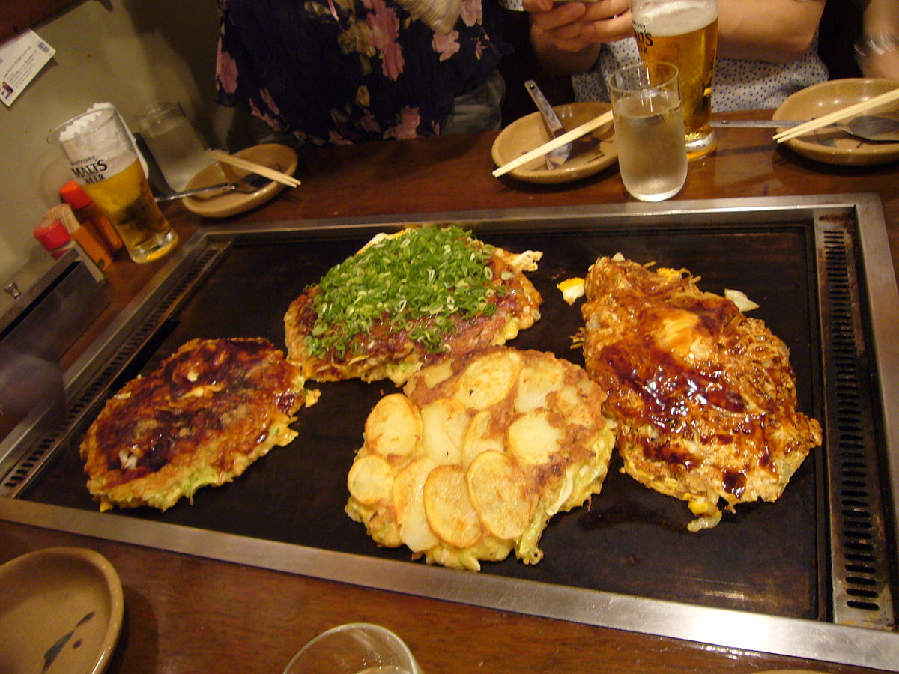
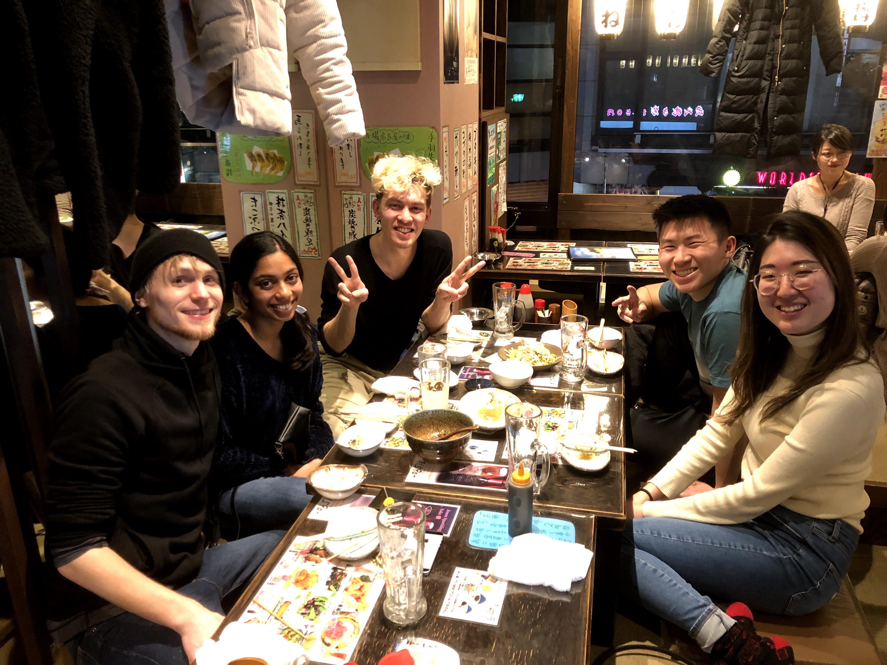
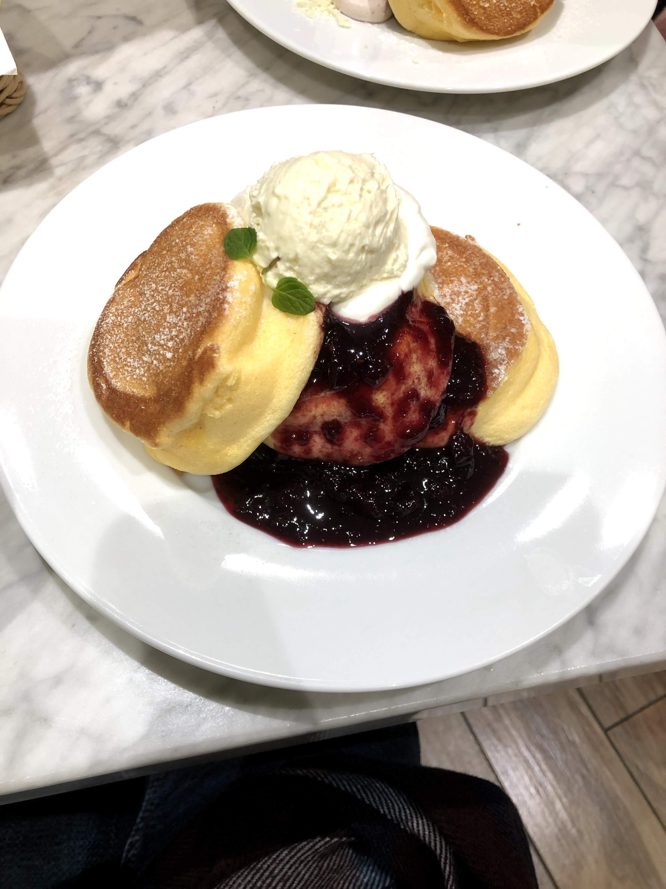
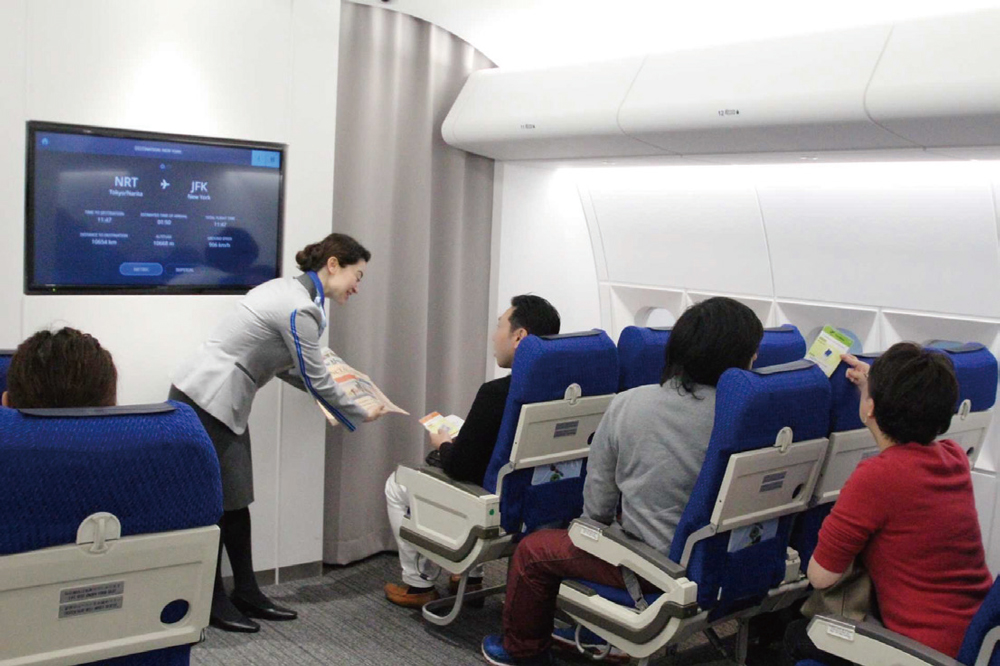
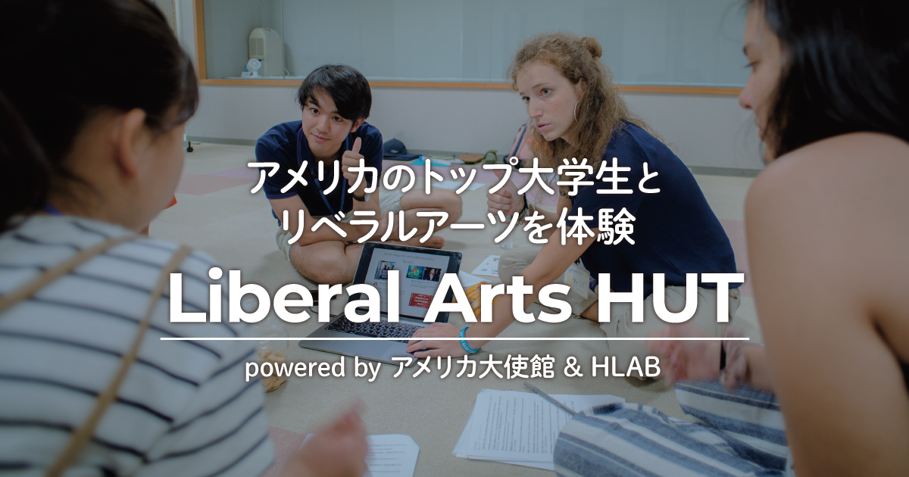
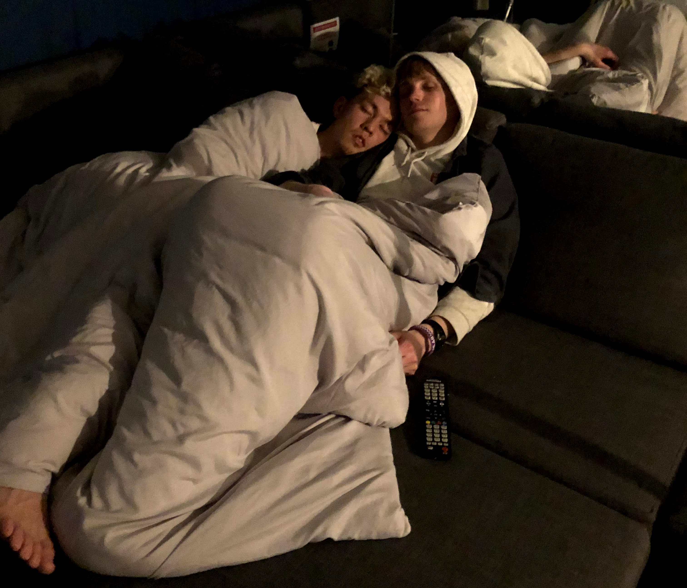
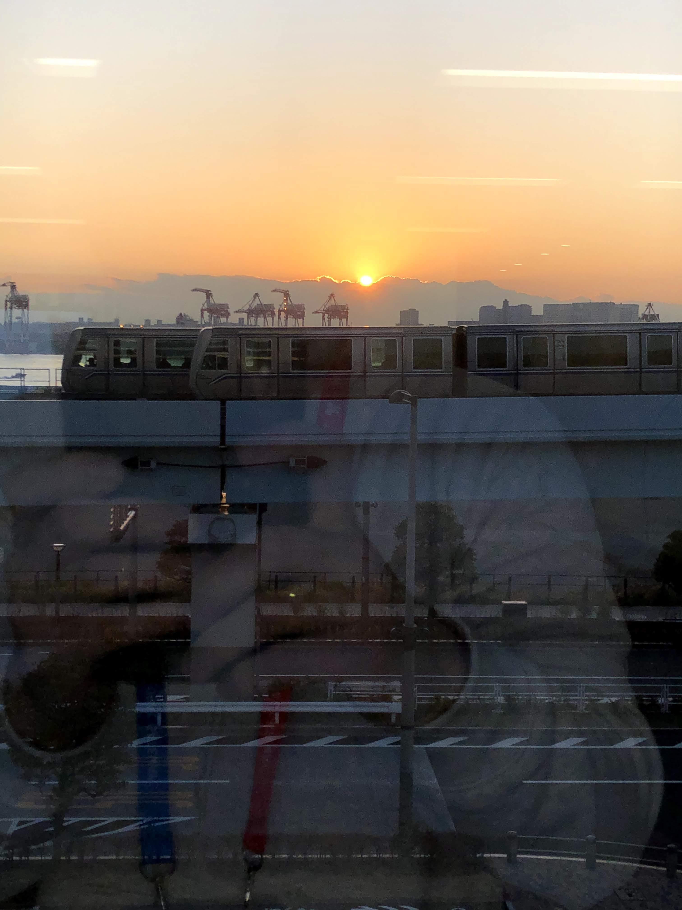
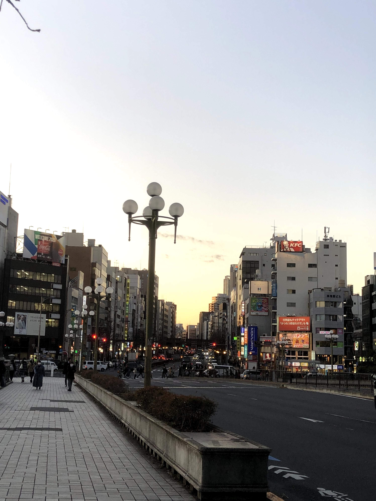
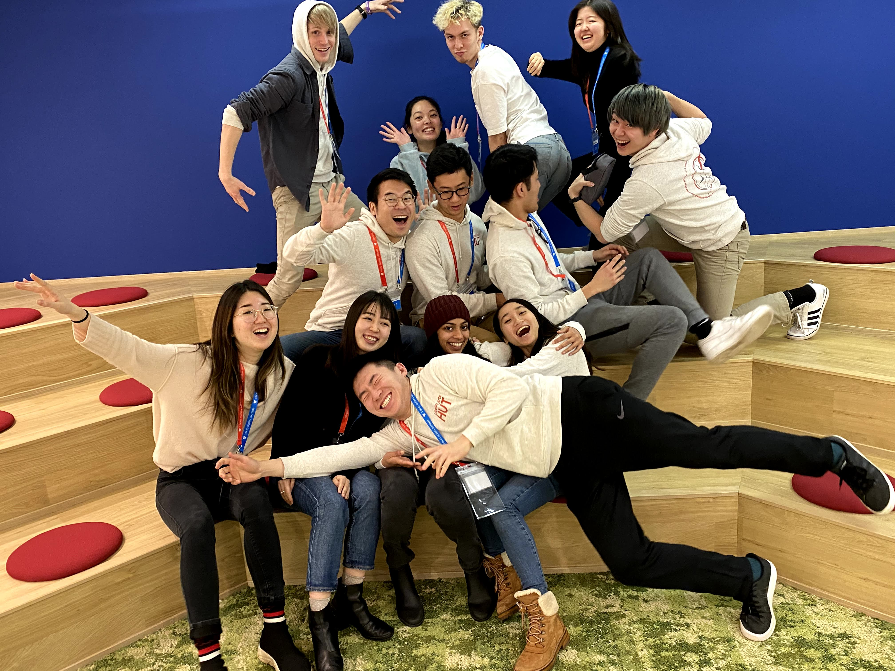

It's the quintessential question that everyone asks themselves at one point or another:

> What is the meaning of life?

Philosophers, scientists, leaders, missionaries – they all have different answers. I think it's a question that people increasingly grapple with as they age and realize the scarcity of their time left on Earth. As a college student, I'm in no position to lecture others on what's important in life, nor am I in a position to be cram some neo-Aristotle teachings down your throat. No, I can't do any of those things, but what I can do is share my own struggles with finding my identity in college.

I think it's tricky, the transition from the ordered structure of youth to the limitless nature of the real world. Navigating that turbulent period is what university is all about – finding your place in a world where anything is possible. I'm currently in this period, and I have a saying that I like to tell to myself whenever I feel lost and overwhelmed.

> You're defined not by the things people tell you do, but rather, by the things no one told you to do.

It's a cute play on words, but I think it really does reveal a fundamental truth about growing up. As you get older, no one tells you what to do. Sure, your boss tells you to complete an annoying assignment, sure, the IRS comes after you to seize your coveted taxes. But in reality, as a member of society, you're gifted and cursed with something staggering: freedom. I don't mean freedom in a traditional sense, like freedom of speech or the press. No, I mean freedom in the sense of **autonomy.**

When you enter university, you realize quite quickly that life is different. **No one is telling you what to do.** Sure, there are graduation requirements, and major requirements, and parental pressure. However, the truth is that when you first get to university, bouncing up and down on your bunk bed, you're confronted with something terrifying: a lack of direction.

It's a very different change of pace from primary and secondary education, where everything is ferociously rammed down your threat. Classes you're forced to take to graduate, after-school activities that your parents signed you up in, yada yada yada. This structure gives you some peace of mind because it gives you an entity to obey. By having a direction to take, you're never confronted with the quintessential question and are content to just go along, listening to whoever it is tell you what to do.

But, gradually, these requirements that veiled the need to answer the quintessential question disappear as you grow up, until finally, you're faced with the ugly truth: *what are you going to do?*

I can't help but think the limits are endless. Tomorrow, I could go to American Samoa, pick up a pack of handyman's tools and live on an island for the rest of my life. Or, I could head to a cafe somewhere within a seven miles radius to eat an egg and salad bagel. With all of these micro-decisions also come macro-decisions as well. What impact do you want to make on the world? Do you want to become a doctor and save lives? Or do you want to become an engineer who creates the next big thing? Or do you want to become a social entrepreneur, a journalist, an academic? **What do you want to do?**

I think surfeit choice sometimes is just as bad as a lack of it, because it can get overwhelming. Trying to find your direction in a world where anything is possible is vaunting when there are an infinite number of paths to create. I still don't know what I can do in my own life to "make the most of it." I don't know what I can do that is meaningful both to others and to the beholder. I'm lost.

I'm not gonna get cheesy here and say the cliché in the room:

> Oh, being lost is okay!

Quite frankly, it's not okay, because **it's hard.** It's difficult finding a sense of identity when there's no one to tell you the penultimate solution. There are thousands of different answers, but finding the one that is the most meaningful to you is life's great challenge. Some never find it.

### **Finding your path**

I still remember the stresses of high school, where one of my top priorities was getting into a good university. I lived in that structure for 18 years only for it to be extinguished the second I stepped foot on Old Campus. Weeks into university I was left with an inexplicable sense of dread and emptiness: *what was I doing? was I going down the right path?* I knew I was facing a struggle, but I didn't know what I was struggling with.

Everyone copes with this dilemma in different ways. Some surround themselves with airtight artificial constructs to give themselves a semblance of order. I have one friend who is so caught up in following his predetermined plan for getting a good job in finance and PhD that he's become depressed in his outlooks post-graduation. Others try to escape from the world and try to avoid answering the quintessential question. I have one friend who plays video games all the time, diverting all his attention to these mini imaginary tasks just so he can have some concrete goal that he can work towards. 

We all cope in different ways, but I think that the healthiest way is to face this reality head on. *You're defined not by the things you do, but rather, by the things that no one told you to do.* Every choice you make fundamentally becomes a part of your identity, and shying away from that fact by deflecting blame on others ("oh, my parents told me to do it!" or "oh, it was a requirement") is only putting more hurt on yourself.

This is why people who have a sense of direction are so charismatic, because they aren't afraid to shy away from this question and provide their own take, flawed or not. They've set their own goals and are unapologetic about it, so other people gravitate towards them and the path they've paved. They're leading others down to the prize millions have been unable to acquire: an answer to the quintessential question.

This is the dilemma I struggled with (and still struggle) with when adjusting to college life and paving myself a path in the world. I truly think, deep down, everyone experiences the same thing at some point. That's why it was so important to me to have an outlet to talk about this important topic and walk through it with someone who was encountering it for the first time.

### **A golden opportunity: Liberal Arts (pizza)HUT**

This philosophical early-life-crisis was happening simultaneously with the concerns in my Part I post flying through my head. *What in the world am I going to do during my school breaks?* Luckily, a golden answer came to me on a silver platter (wordplay intended). HUT, a liberal arts pilot program offered by HLAB giving past CMs an opportunity to teach Japanese high schoolers about topics important to them. I couldn't have asked for a better opportunity.

After applying and being accepted, I had to confront the next order of business: *what would I be teaching?* Fortunately, I didn't have to provide an answer, as the directors had decided that I would use the seminar I had taught last summer. As you can see from my earlier philosophical musings, you now know the importance of my seminar to me. 

### **Motivation, Passion, and Leadership: a three step path to success**

After reviewing everything I had learned in university so far, along with everything I had learned via the public school system, I decided that there was no way that I could teach any of it. None of it really **spoke** to me, and I couldn't find any motivation or reason to teach about traditional topics like biology or economics, when students could take a class on it anywhere online or at university.

**No, I wanted to be teaching the things that no one taught.** Upon further thought, then, I decided to compile all of the musings that had personal import to me – thoughts about types of motivation, quotes about discovering one's passion, lessons about different types of leadership – and integrate them into a three day seminar embodying my life philosophy. I wanted my course to share my answer to the quintessential question and give high schoolers a framework that would help them work through their toils in college.

Yes, I realize that I sound like a cult leader to some. But I think that unlike religion, which offers a solution to the quintessential question via dedication to some higher deity, my seminar was more focused on offering a framework from which to *start* tackling this question. In other words, rather than providing an outright solution, I would be giving my students the tools needed to forge their own paths.

My course content, like I mentioned, came from the fringes of where I had picked up knowledge. YouTube videos, leadership summer camps, subreddits like[/r/GetMotivated](https://www.reddit.com/r/GetMotivated/). Driving my motivation for it all, the importance of confronting the quintessential question. I was really excited to teach my nontraditional seminar, because it was the type of thing that I myself would have appreciated growing up.

## **Pre-work shenanigans at HUT**

### **Karaoke, pancakes, and nonagenarians**

*More pictures and fun travel descriptions up ahead!*

After arriving at my AirBnB on the evening of January 4th, I actually didn't begin hanging out with the other camp mentors in earnest until the official HUT kickoff *okonomiyaki* dinner the evening of the 5th.

The first one or two days were mainly just slogging through logistics and preparing for our seminars. Thankfully, though, this program was a pilot, so there wasn't a lot of bureaucratic nonsense that we had to cover. In fact, I think our HUT leaders did a fantastic job with balancing structure and flexibility. to where HUT didn't feel haphazardly unstructured nor stringently inflexible.

As a result of their work, the other mentors and I had a lot of free time. Thank goodness that the others knew what was fun to do in Tokyo, because I was content to just follow their lead. *(you can't forge your own path all the time!)* Unlike during the summer school, during this program we were given ample time to explore Tokyo and have fun before beginning our packed week of teaching.

We went to karaoke (see us rocking out to *zenzenzse* from "Your Name" in my Instagram story – **wow** that was the highlight of my trip and even my year), checked out some delicious restaurants (fluffy pancakes 11/10), and even got randomly courted by a 90+ year old artist setting up an exhibition! (he incorrectly assumed that Alex and Julie, two of the mentors, were dating, even though they had just met each other)

It was a nice way to spend time exploring Tokyo and bonding. But, all things ultimately come to a close, and the morning of January 6th, we headed to Odaiba to begin what would be the sole focus of the rest of the week: teaching.

## **A logistical headache: the downsides of collaboration**

### **An English island on the island of Japan**

The venue where we would be teaching classes during the winter differed from the one we taught on during the summer. For the purposes of HUT, we would be collaborating with one of the largest English-teaching organizations in Tokyo: Tokyo Global Gateway, or TGG.

It's a really cool, modern facility that clearly has been making an impact. When I arrived, I saw hundreds of students attending activities to enhance their English language development. I was told groups had come from all over Japan, some enduring multi-hour bus trips, just to have the opportunity to come to the "English island." The building had its own gym, kitchen, dancing studio, mock university campus store – it even had its own gift shop and mascot!

### **The triumvirate and the trials of teamwork**

Before I continue, I should explain the parties participating in HUT. HUT came together as an experimental pilot program, named after the three constituent organizations from which it was founded: **HLAB** (H), **the US Embassy in Japan** (U), and **TGG** (T). HLAB (us) was responsible for the mentors and seminars to be taught, TGG was responsible for the venue and outreach efforts, and the US Embassy was responsible for financial support and more.

![Our partnership with the US Embassy expanded beyond financial support. They had two of their diplomats, Noyuri-san (not pictured) and Grace-san (bottom row, fourth person from the left), help out at our teaching sessions, and they also hosted a roundtable discussion with us and the leaders of EducationUSA, a U.S. Department of State organization in charge of expanding American educational initiatives in foreign nations like Japan. In this discussion we talked about differences between American and Japanese educational systems, our personal experiences at our respetive universities, and ideas from us college students on increasing interest from Japanese students to study abroad in America. Pictured is the HUT team with these leaders post-discussion at the US Embassy in Tokyo!**](../uploads/011120_us_embassy_hut.png "The HUT team at the US Embassy with EducationUSA")

While it was amazing to see so many powerful entities working together, any partnership is bound to come with differing interests. It was clear that each group had a different stake for what they hoped to achieve with the program.

* **HLAB** wanted to promote their mission statement and the things they did during the summer school, namely, the idea of "diversity in learning." *We wanted to teach the Japanese high schoolers nontraditional seminars that challenged their thinking and exposed them to areas that they had never encountered before.* While the classes were to be taught in English, the most important thing was having the student experience the cornerstone of a liberal arts education: diversity in thought.
* **The US Embassy** wanted to promote American liberal arts universities to Japanese students. In recent years there has been decreasing interest from Japanese students to study abroad in America, and the US Embassy's job is to host programs, like HUT, to encourage more students to go abroad. *As a result, they wanted to us to share what American college life is like in the hopes that it would get more students interested.*
* **Tokyo Global Gateway** wanted to promote English-language learning in Japan and the global opportunities that it could open up. The activities that they normally host are designed to help Japanese residents practice and get excited about English, so their stake in HUT were very similar. *They wanted to focus on providing a safe and nurturing environment that would enhance English-language development.*

As you can see, each participant had very different goals, and it was up to HUT to execute all of those different visions with one program. That great responsibility fell on Hiro and Justin, our awesome HUT directors (and HLAB interns) who were in charge of organizing the program from the ground up. Like I mentioned, they did an amazing job making sure that each party's desires were addressed by:

* Hiring CMs to teach self-created seminars on nontraditional topics **\[HLAB]**
* * *Seminars included:* Ukiyo and the Image of Women, Papercraft to Spacecraft, Speaking with Confidence, !Werk it! The biochemistry and physiology of exercise, and A Three Step Path to Success: Motivation, Passion, and Leadership.
* Adding a 25 minute section at the end of each session to talk about American college life at each of our respective universities **\[US Embassy]**
* * *Topics included:* What are the liberal arts? What is it like being an American college student? How is it different from Japanese post-secondary education?
* Using various measures to enhance the English-learning environment for the students **\[TGG]**
* * *Measures included:* English-based discussion within the seminars and interactive activities to get the students excited about the content and the program

The culmination of all of this hard work? [Liberal Arts HUT.](https://h-lab.co/hut/)

### **Far from a rosy image: the challenges**

While I've heaped praise upon the organization of the pilot program so far, that's not to say that there weren't issues. As we all know, plans rarely work exactly as expected, and a couple of issues came up. It's a pilot for a reason.

First of all, while HLAB did a great job recruiting all the mentors, handling the finances, and creating program materials and documentation, the other organizations didn't completely hold up their end of the deal. It wasn't the Embassy – they actually did a great job, not only being generous and flexible on the spending of the grant (paying for all of the mentors to come to Japan) but also deploying two of their people on the ground (Noyuri-san and Grace) to help us. **The main problem, namely, came with TGG.**

While it was one thing to admire TGG's facilities as a visitor, it was another thing to work with them as partners. With any large organization inevitably comes bureaucracy, and TGG was no exception. While they were very helpful in providing us with a venue to host our classes and English agents to help the kids participate in our seminars, they didn't do a great job with filling in all of the sessions. We, the CMs were hired to teach for six days, two sessions a day, and TGG was responsible for using their connections to fill those spots.

Well, they succeeded. Partially. While they were able to fill in the sessions for Monday and Tuesday with local high school students, along with Saturday and Sunday (although these were opened up for individual use) they weren't able to do the same for Wednesday through Friday. Oh, they managed to recruit students, all right, to participate in the TGG events throughout the day. In fact, every single spot was almost taken by someone, so we were supposed to be working at full capacity.

What was the problem then?

**All of the students were in elementary school.**

I don't know if the small "seminars being taught in English" feature got lost in the emails within TGG's recruitment department, but this logistical mishap meant that we wouldn't be teaching for half of the time we were expecting. There was no way elementary school kids would have the English proficiency to understand us, so we had to scrap half of our planned sessions at TGG. While this might not be considered a bad problem to have for some people, this would be a very bad look for the the grant the Embassy had given us.

Luckily, the Embassy was aware of this deficiency in our partnership after being alerted by Justin and Hiro, so they allowed HLAB to step in and fill this gap with our own scheduled activities. Unlike at TGG, where we were bound by a strict English-only pledge (despite occasional Japanese being an important facet of HLAB's seminar environment), at our new venue, WeWork Yotsuya, we would be allowed to treat these seminars much more like our summer school versions. The SAs (Seminar Assistants) we were given could use Japanese, and we could be more flexible on timing and class content.

Overall, the sessions ended up working out fine in both locations, with the kids in later sessions becoming easier and easier to teach. While our experiences with the first few batches of kids we had were a little rough, namely because they all had been forced to come to TGG and weren't super motivated, subsequent groups came by choice and were subsequently higher in English-proficiency and engagement.

Speaking of sessions, you might be wondering: *what was it actually like teaching?*

### **Teaching and staying motivated**

If there's one thing that teaching with HLAB has given me, it is respect for the millions of school teachers who teach the same content for 30 years in a row.

While I was excited at the prospect of having another chance to teach the seminar I had created last summer, I wasn't fully prepared to teach it 7 times in rapid succession. Despite my efforts to focus on the exciting aspect of teaching, it was hard at times to stay energetic enough to deliver the same 80 minute seminar every single day, sometimes more than once. Teaching takes a **lot** of energy, I've come to realize, especially when you put your heart and soul into it. My seminar personally had a lot of gesticulations, activities, movement, and content, plus I really cared about making it as engaging as possible for each group of kids, so I had to put my full concentration into each session.

![Whiteboard post-seminar at TGG. I led an icebreaker where each of the students wrote down their name and an adjective starting with the first letter of their name. I also had each student write down a list of things that they always wanted to do in preparation for the 20% Project simulation, where I had students do whatever they wanted for 20% of the time in the seminar. Finally, I gave presentations on motivation and the four different types of leadership, and had my SA follow along and write down key vocabulary as I talked.**](../uploads/011220_hut_seminar_board_tgg.jpg "Whiteboard post-seminar at TGG")

While it was incredibly taxing to teach for six consecutive days (during the summer school we only had to teach for three days in a row) I always managed to find some third gear during my classes that I haven't been able to find anywhere else. I don't know why, but I think teaching about a seminar that I care about significantly gives me another reserve of energy that I can't get from, say, studying for a required class or participating in some mandatory activity.

The experience itself of going around Tokyo to teach was also incredibly rewarding, as I was able to see parts of the city that I would have never imagined seeing before.

## **HLAB: more than just a summer school**

Finally, I don't know how, but the people that I've met through HLAB continue to amaze me with their humility, humor, and kindness. In addition to the four CMs, I met a number of new Japanese college students who were a part of HUT and added something new to the experience. All of my SAs – Shu, Airi, Meg, Manami – and even the ones who didn't help my seminar in particular were just a blast to be around. Even Justin and Hiro, the leaders and holders of huge responsibilities, had a hilarious dynamic with each other (we likened Hiro to a eucalyptus tree and Justin to a koala) and the team; they couldn't have been better fits. Overall, we cared for each other, we listened to each other, and most importantly, we laughed with each other.

I think this is what brings me back to HLAB every opportunity I get. Above the teaching, above visiting Japan, is the **people**. The diverse social environment that HLAB fosters in uniting people from all over the world across language-divides is nothing short of amazing. Life is all about surrounding yourself with good people, and going to Japan to teach has been one of the best decisions of my life.

Hopefully in the future, the success of HUT will convince the US Embassy to provide more funding, and we'll see more HLAB x US Embassy collaborations that'll allow me to come back during other parts of the year. While HLAB is by no means a small organization, I'm really excited at the prospect of being part of an official partnership with the US Embassy and seeing its effects on HLAB's efforts. This will take some time though, and it might be a couple of years before we see any changes on that scale. Until that moment, then, I'll be elsewhere in the world, either studying abroad in Taiwan or doing an internship in San Francisco, but I know where I'll be back in the future.

HLAB Summer School, August 2020.

