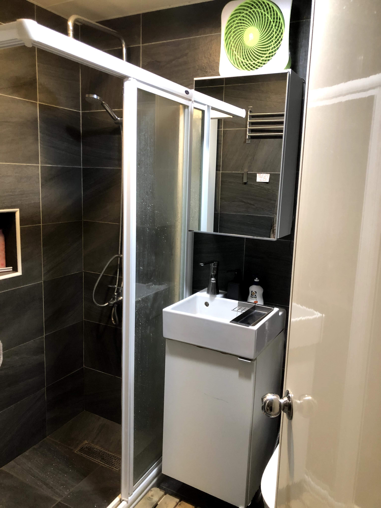
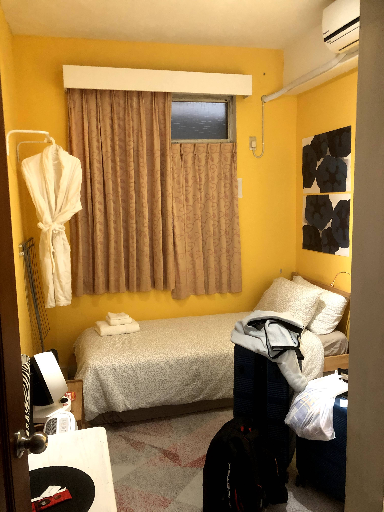
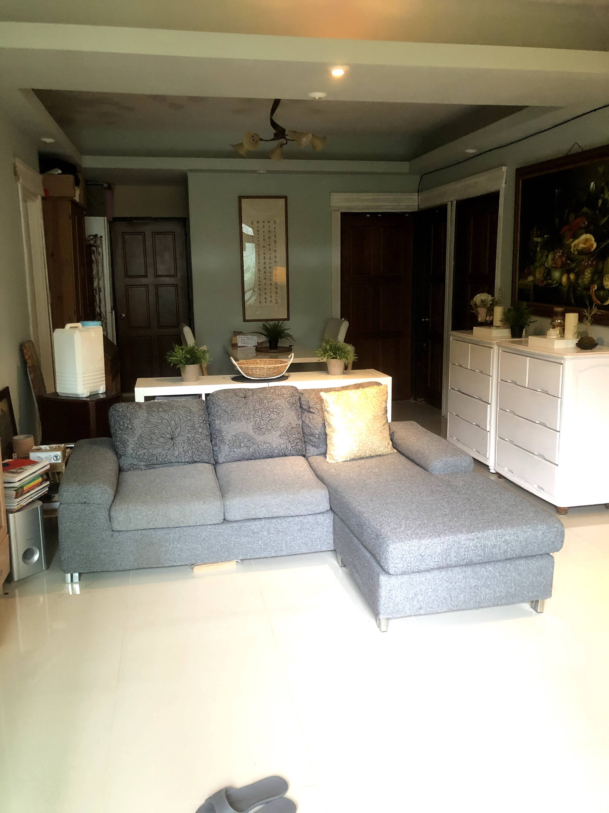
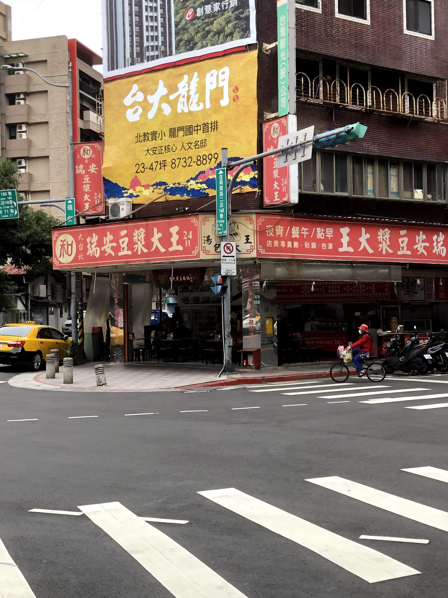
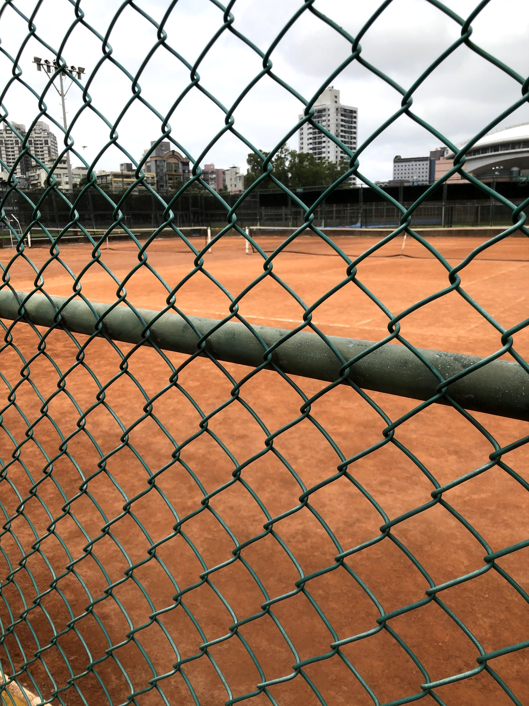
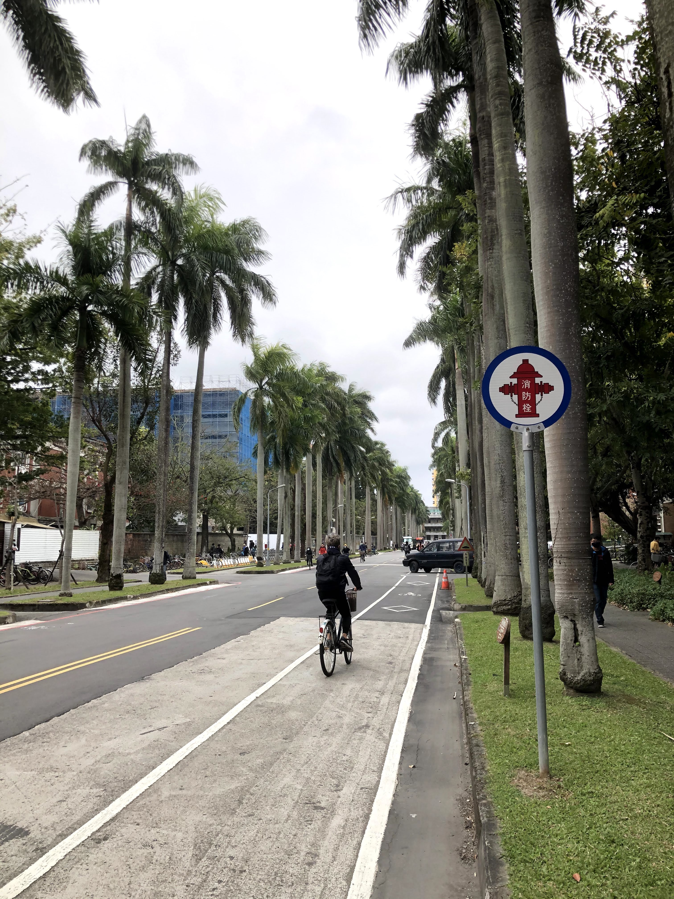
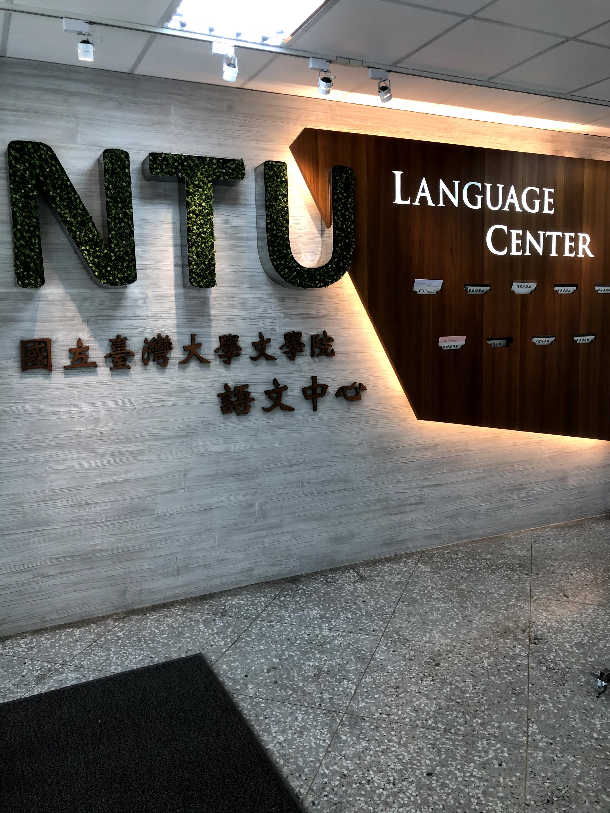
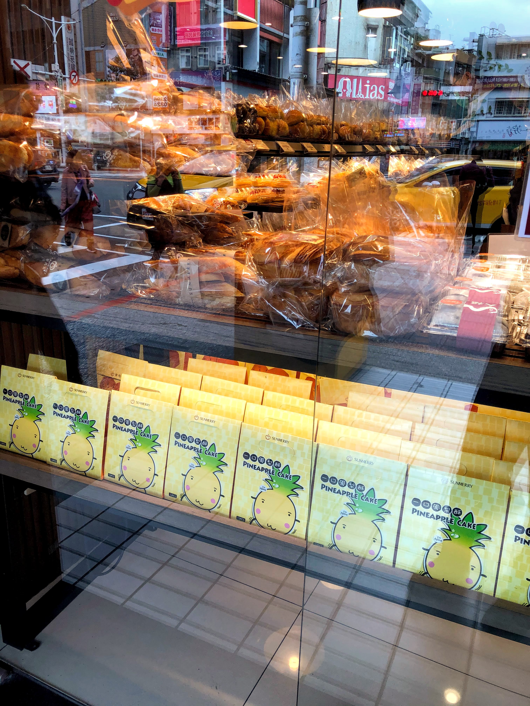
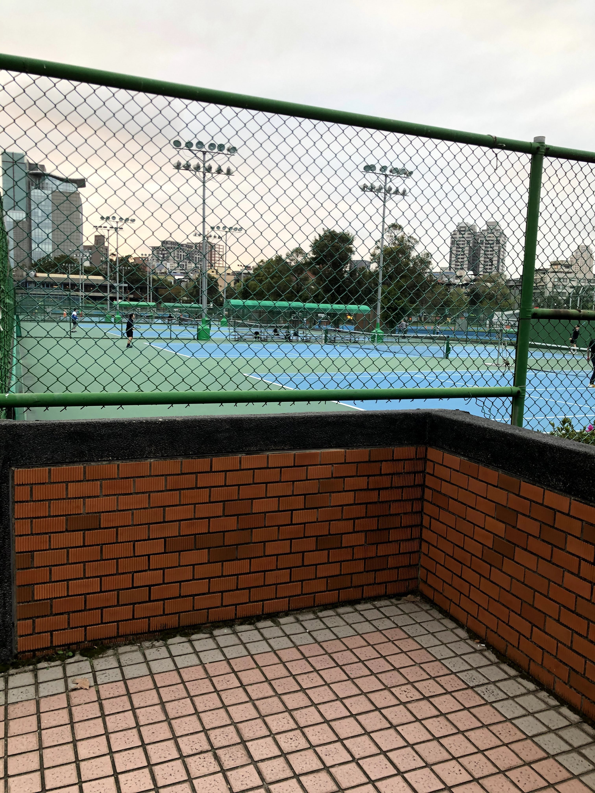
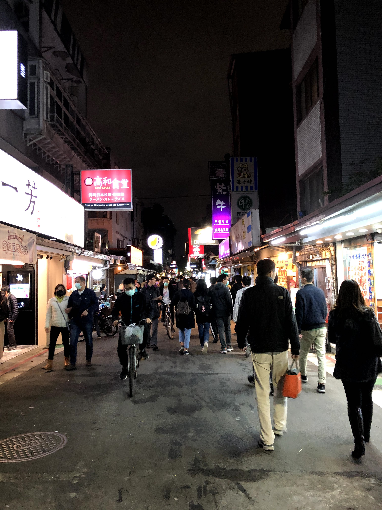

On the bus ride from Taoyuan Airport to downtown, I got my first glimpse of Taipei. All I could think was: 1) *wow it is a lot colder than I expected,* 2) *is it always going to be this cloudy,* 3) *there's so much greenery* and 4) *crap, everything is written in traditional, so I have no idea what things are saying.*

I mean, I couldn't really complain. It was almost 30 degrees warmer than in Beijing and in New York, so it felt like spring. Also, having done some research on Taiwan's response to the coronavirus before my flight, I knew it was one of the safest places to be during the pandemic. I was lucky to be in Taiwan in the first place, and I knew that beggars can't be choosers. ¯\\_(ツ)\_/ Nonetheless, I had my concerns, but luckily, a lot of them would turn out to be unfounded in the following days.

After getting off at Taipei Main Station, I got to my apartment, where I was greeted warmly by my amazing landlord, Anna. She was super nice and gave me a tour of my very, very awesome apartment. You see, I'm a stickler for living quarters, and I knew that my biggest priority during my time abroad would be the quality of the bathroom. After all,

> You can tell the quality of an apartment by the quality of the bathroom.

It seems quite silly, but it saved me from picking a lot of inferior apartments. Not only was mine only a 10 minute walk from the language center, but it was almost $200 USD/mo. under my Light budget, and the bathroom was absolutely ridiculous. It was recently remodeled and it looked like something you'd see at a five star hotel.

Others might think I was silly for scouring five sites for two weeks to find housing, but I couldn't be happier. I found this place on Facebook through a group called "Looking for Roommates and Apartments in Taipei" minutes after the listing was posted. As soon as I saw it, I jumped on it and booked it. I knew it was my dream apartment.

It looked exactly as pictured, which was a relief. I didn't expect anything less, since my landlord(s) Anna and Joseph were also superhosts on AirBnB. While there were some questionable rules I learned about for the first time later that night, including a no-visitor policy and no-party policy, I respected their decision to keep the apartment as clean and well-kept as possible.

# Finding breakfast, NTU, and my first night market

*Since there's just so much content to cover for my first day, I thought that I would experiment with a different form of blog post here. Instead of my normal, reflective type of post, I'll post a few highlight photos from today to give you a sense of what I did. (after all, a picture is worth a thousand words, so this is practically a dissertation!)*

It was only 9:00 am by this point, and I was starving, so my immediate priority was simple: breakfast.

After breakfast I decided to walk around and explore Taipei a little. Specifically, where I would be going for the next few months: NTU.

By this point I kind of just started wandering all over the place: to the Gongguan night market, NTU, and random alleyways.

After writing this post about my first day in Taipei, it's made me realize that it's impossible for me to post all of the pictures I took from each day. Instead, in the next few posts, I'll write some thoughts down about general themes I experienced during my first two weeks in Taipei as a whole, with selected photos throughout those days. Stay tuned!