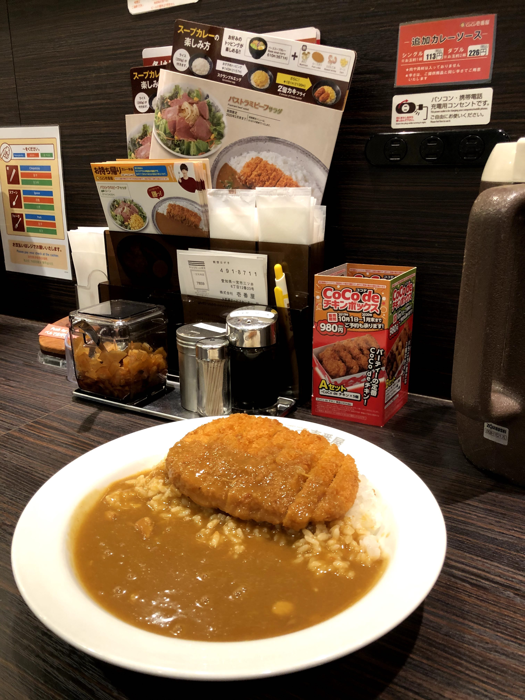
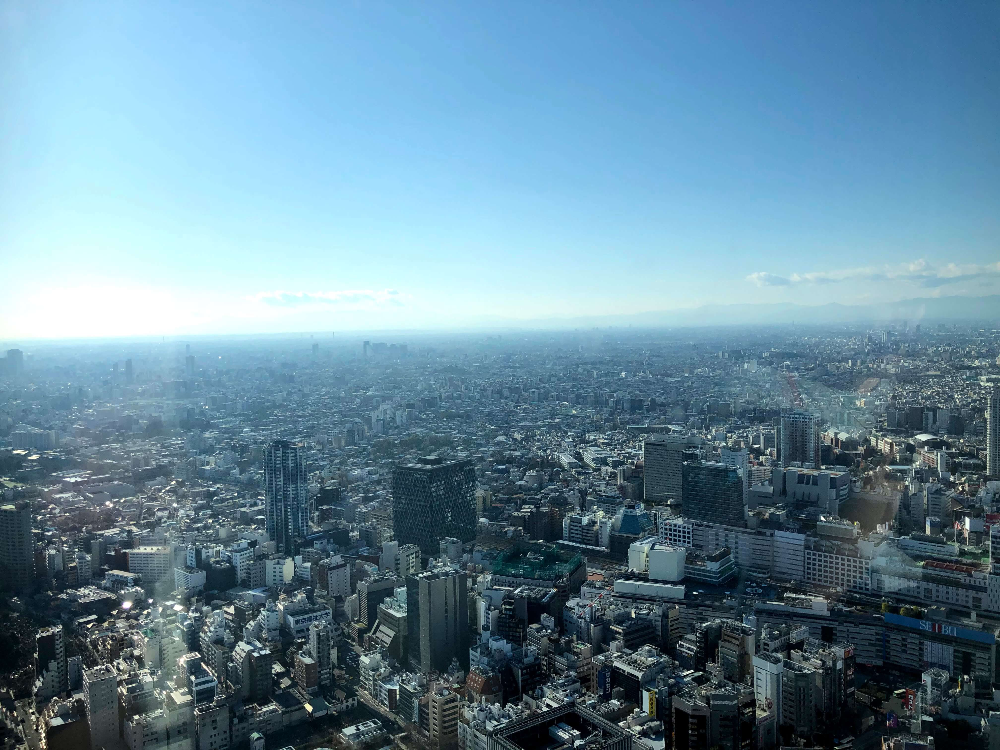

After a full day exploring Asakusa until 3:00 am, the only thing on my mind was getting into my bed and sleeping in. I guess that's one of the perks of not planning ahead – you're totally free to take a day off to rest!

I think something that gets overlooked while traveling is taking time to just stop and recover. When you look at social media you only see the highlights of people's trips – the beautiful views, the stunning historical sites. What you don't see are the miles of walking and travel to get those pictures. In the first three days I had been in Tokyo, I had walked over 11 miles – **each day.** My feet weren't even sore at that point – putting a little pressure on any part of my heel felt like someone was scraping it with a slab of concrete. Needless to say, the largest thing I wanted at that moment was just some time to myself, in my room, to give my battered feet a much deserved break.

Since most stores were closed on New Years Day, I didn't really have an opportunity to go out and shop, so it was the perfect time to take a slow day and catch up on some work I had been neglecting. I slept in (a rare luxury while traveling), I bought souvenirs for my friends and family, and I worked on my HUT seminar.

Overall, it was a restful and relaxing day, of which I have no regrets.

## Odaiba: a sparkling gem in Tokyo

*P.S. It was at this point that I realized that I should archive all of the things I did in an Instagram story. If you want another perspective of my trip to Tokyo, check out my Instagram linked in the sidebar!*

The next thing to do on my agenda was to check out Odaiba, the hipster, entertainment-filled island in Tokyo Bay. I had drafted a list of things to do in the neighborhood beforehand, but the day of, I decided just to walk around and explore what looked neat. Little did I know that Odaiba would turn out to be the coolest place I would visit during my entire trip.

Odaiba was easily one of my favorite places to visit throughout the entire trip. There's surprisingly so much to do on the tiny island that I wasn't able to cover everything (like Venus Fort and Palette Town) despite having a full day. The things that I missed will definitely be the first things to do on my list when I come back!\
\
In summary: if you're going to Tokyo, move Odaiba to the top of your itinerary.

## Sunshine at Ikebukuro's Sunshine City

It was the last day of my week self-traveling around Tokyo, and I had just two stops left on my schedule: Ikebukuro/the Sunshine City, and Shinjuku's infamous Red Light District. I decided that I would split my day into two parts: the first half would be in Ikebukuro by myself, and the second half would be in Shinjuku's Red Light district with another free walking tour. For added sketchiness, I decided to do the walking tour at night. But before immersing myself in the sins and darkness of human nature, I would explore something more innocent: the consumerist naivieté of the Sunshine City!

## The Dark Nature of the Red Light District ... and a surprise ramen tour???

Shinjuku is a big place. Known for having the busiest subway station in the world, it's a major economic and cultural center of Tokyo. There's tons of lights, alleyways, and people, and it's basically a navigator and planner's nightmare. As a result, it would only be natural that I wouldn't be able to find my walking tour rendezvous location and thus miss my walking tour at 5:30 pm. 

I firmly believe that everything happens for a reason though, because as I was looking for anyone holding up the iconic Tokyo Localized sign, I mistook someone else as the walking tour guide. In reality, he was a tour guide for an entirely different company, AirBnB, with an entirely different focus: ramen! I was intrigued, and in the light of the walking tour guide who I'm pretty sure didn't show up, I was able to spontaneously hop onto his tour. I suppose that when life gives you lemons, make ... ramen?

During the tour I innocuously happened to talk to a lovely family of three who were traveling in Tokyo as a vacation. The father was nice, and as we were talking, we somehow stumbled upon our mutual interest in computer science. Upon further discussion, it turns out that the guy was a Stanford Masters of Computer Science student who was the CTO of Afterpay Touch, a multi-billionaire dollar company in Australia! **What????** Not only that, but he was once asked to be one of the founding employees of Google! Needless to say, I was **shook.** (but I played it off as cool)

*P.S. Yes, I totally tried to find him on LinkedIn, and yes, he totally ghosted me.* ¯\\_(ツ)\_/¯

I had to leave the ramen tour early since I had signed up for another free walking tour of Shinjuku's Red Light district  at 8:30 pm, so I bid the group farewell and trekked off again by myself to the rendezvous point. To my surprise, I found the guide this time, and we went on a really insightful tour of one of Shinjuku's most infamous neighborhoods: the Red Light district.

It was a really insightful tour of one of the most thriving industries in Japan. My tour guide was hilarious, and it easily became a major highlight of my trip.

I think it's really important that us foreigners learn to not judge these cultural phenomenons, like hosting, out of context, but rather, learn to be nonjudgemental of cultural differences between the West and the East. After asking a lot of my Japanese friends for their thoughts about the host and hostess industry, I got the impression that, like for many controversial topics, opinions were mixed. While some viewed the industry as veiled prostitution, others viewed it as a legitimate business with mutual voluntary consent. It's a fascinating topic that I'm curious to learn more about in the future, as it really pointed out some of the natural biases I and others have as people from the West. 

With that comes the end of my week of solo travel. I hope you're enjoying my posts so far! Tomorrow, I'll have a drastic change of pace and begin talking about my experiences on the last two days before HUT: my hangouts with Jueri, Risa, and Roy. Stay tuned!