I was walking next to the Drunken Moon Lake at National Taiwan University, when I thought, *wow, what a scenic location to blog at.* I mean, just look at this:

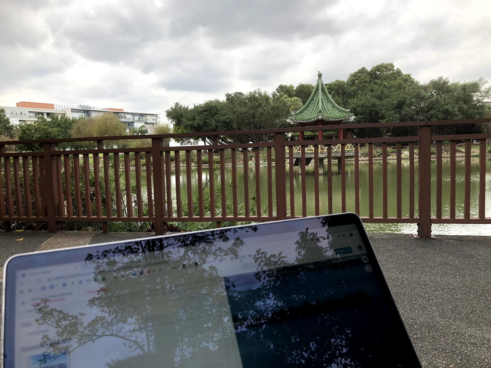

It's also a nice time to reflect on my time here in Taiwan here so far. It's only been a day, and I feel like I've seen and experienced so much. Already I can feel my language-related insecurities popping up again. *Is my Mandarin good enough? Do I sound like an idiot?* It seems silly considering I've already been to a Chinese program before, but these thoughts still came up in my encounters throughout the day, whether it be when I talked to the store clerk to buy stuff from 7-Eleven, or even when I asked the person on the bench if I could sit next to her (*"wo ke yi zuo zai zhe bian ma?"*) Trust me, these are good experiences to have, as it means that I'm getting out of my comfort zone. After all, if you get out of your comfort zone enough, then you'll expand it. 

That's enough reflection for now. Let's get back to the actual point of this blog: talking about my trip to Tokyo. 

## The Plan: Tokyo edition

One of my favorite things to do while traveling is to explore the area with local friends, and my trip to Tokyo would be different. Even though I'd been good friends with these people before, I was still nervous. It's that nervousness you get before asking someone to hang out. I still remember spam-texting everyone from the summer school with the same questions racing through my head: *would they want to hang out? had our friendships died out? did I come across as creepy?* It seems ridiculous when I write it down on paper, but in the moment they definitely didn't feel that far-fetched.

Anyway, my fears were unfounded, and my cheery *"guess who's coming to Tokyo????"* opener seems to have averted any social disasters. I managed to set up times to hangout with four of my friends from HLAB – Airi, Risa, Jueri, and Roy. Everyone else was on vacation with their family, not in Tokyo during the time I was there, or possessive of some other excuse to avoid me. I would meet up with them during my week in the city self-exploring.

Now, let me set something straight. After buying into this whole "travel changes your life" mindset from HLAB last summer, I really started buying into this related idea of "self travel." You know, the whole "self-exploration" mindset and dogma where you *discover* yourself. After subscribing to the subreddit "/r/solotravel" to learn how to do it correctly, I spent *a lot* of time planning out things to do, making my experience so much better than walking in blind.

## teamLab Planets: an out-of-this-world experience?

For those of you who don't know, teamLab is a **very famous** interactive art museum brand in Japan. It prides itself on being the only museum like it in the world, and rightfully so. There are similar types of places in the US, but Japan definitely takes the genre to the extreme (in a good way).

The first person I decided to meet up with was Airi, who was an SA (Seminar Assistant) in my summer school region. SAs are responsible for supporting Camp Mentors (CMs) like me who created and taught seminars to the Japanese high schoolers. Even though she wasn't my SA in particular, (that punishment belonged to Roy, who I also visited) we had hung out during the program and become good friends, so I was thrilled to find out she had an evening to go to this legendary "teamLab" museum.

The place itself is really cool. There's a bunch of different exhibits, each with its own theme and unique factor. There were foamy trampoline-esque walkways, cascading waterfalls, floating blown-up bubbles ... the type of crazy stuff you'd expect from a world-renowned museum.

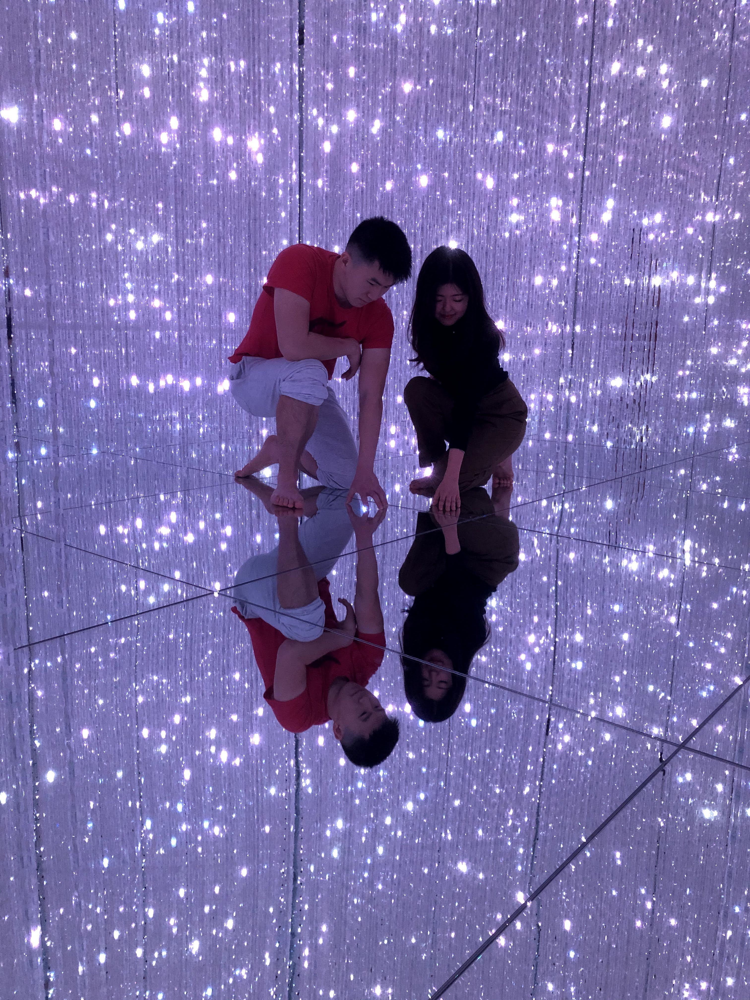

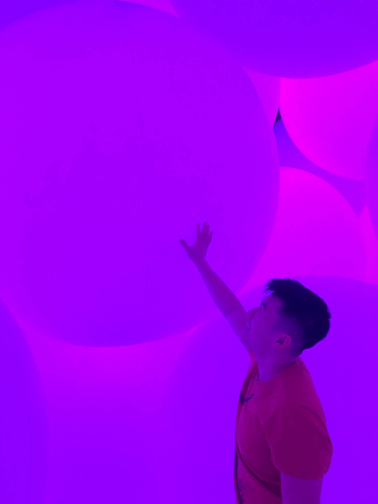

It was pretty late by the time we left the museum, but I wanted to get something to eat, so Airi brought us to a "yuzu" ramen shop close to where I was staying. "Yuzu" stands for lemon, and apparently it's the newest ramen trend to hit Japan. I'm more of a traditionalist ramen fan myself, but I definitely appreciated the experience.

 ramen.")

## Self-Exploration

The next few days I spent in Tokyo, December 30 to January 3, were considered peak New Year times. As a result, since most of my friends were out of the capital and spending time with their families, I took the time to get in most of the solo travel I had initially planned. 

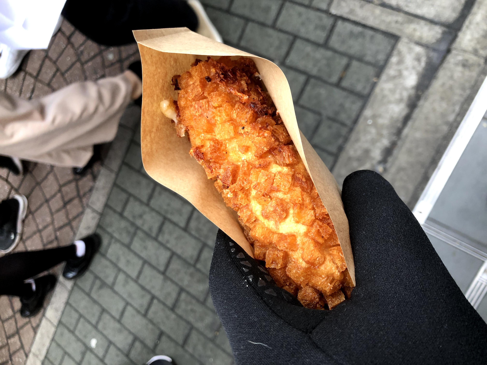

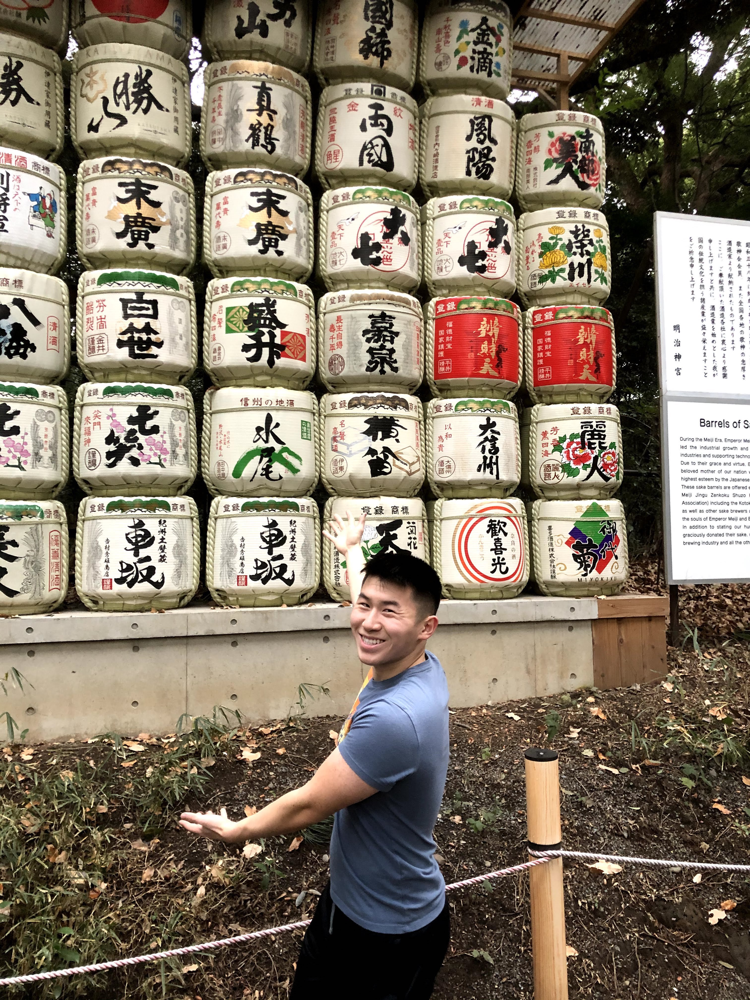

![My second "breakfast" of sushi at Tsukiji fish market around 8 am. The media isn't kidding when they say that the fish at the market is some of the freshest in the world ... even if it requires a 30-40 minute wait. To be honest, I was actually panicking halfway through the meal because I couldn't finish it and was too full, and I didn't want to send the wrong message to the sushi chef working in front of me. It was absolutely delicious, and I've never regretted eating breakfast beforehand as much as I did in that meal.](../uploads/123119_tsukiji_fish_market_breakfast.jpg "Sushi breakfast at Tsukiji Fish Market")

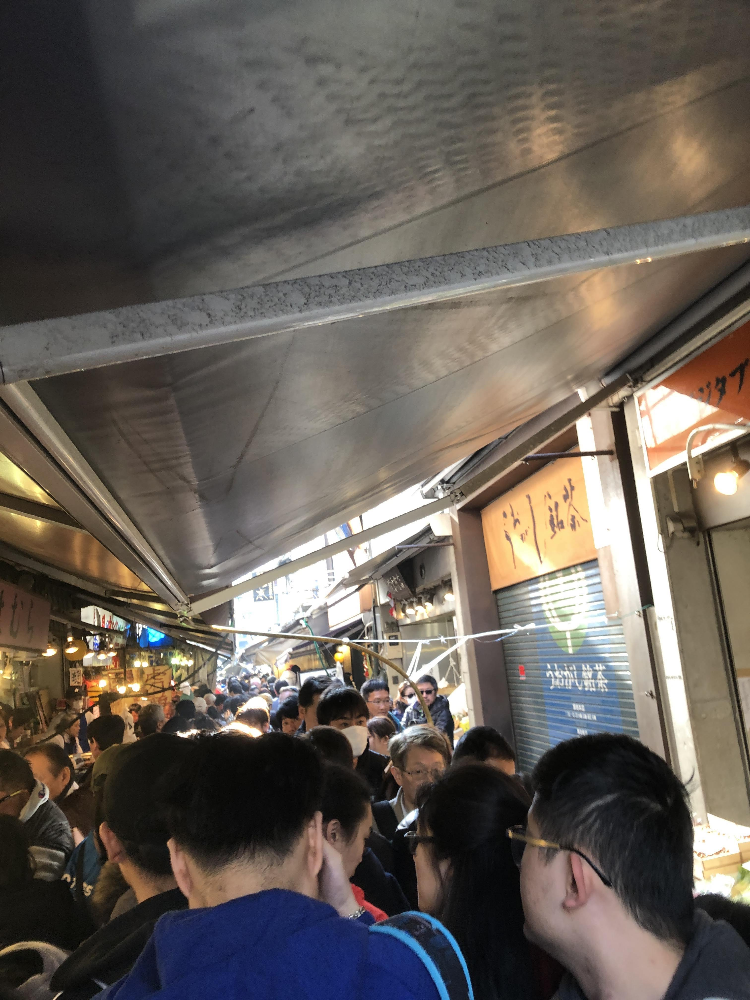

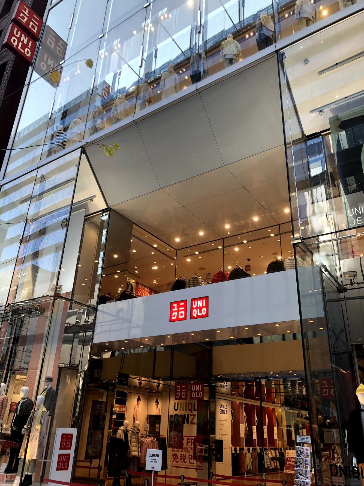

## Ringing in the New Year, 6000 miles from home

I came to realize that after a few days of self-exploration, I would start to feel lonely. It's only natural for humans to seek the comfort of other travelers to enjoy their experiences with. Even with my natural introversion, I could start feeling this itch to speak to someone, an itch to share the thoughts that I'd been keeping to myself. At the same time, I didn't want to spend all of my time talking with them, and I wanted to use as much time as possible to explore the city. Upon further research, I discovered a solution that allowed me to get the best of both worlds: *Tokyo Localized's free walking tours.* 

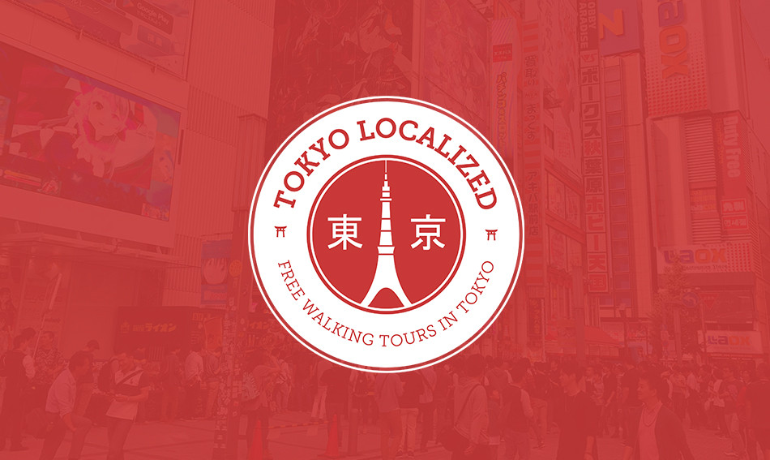

Now, these walking tours were not actually "free" upon further research. Their price structure is based on tips for the tour guides, allowing customers to technically have "free" walking tours. However, most people aren't a\*\*holes, so the reality was that almost everyone tipped, some way more than the base rate that a tour guide would normally get. II did the math, and it turns out that if everyone in my tour group of 12 tipped the minimum recommended amount ($20 USD for two hours), my guide would have earned $240, which amounts to $120/hr! Not shabby at all.

My first walking tour took me to Asakusa, one of the busiest tourist spots in the city. Asakusa is famous not only because of its massive temple, but also because of the Nakamise shopping street that paves the way towards the shrine. I'm really glad that I had a local guide discuss the nuance and meaning behind the cultural artifacts in the area, because they would have otherwise slipped by my head.

Asakusa was relatively far away from the hostel I was staying at (the House by HLAB, which was free as an HLAB alum!). Therefore, even though my tour ended in the mid-afternoon, I decided to stay and explore the area for the next couple of hours. There were tons of festivities already being set up in Asakusa so it was the perfect time to visit. 

You see, it's a tradition in Japan for people to visit temples to ring in the New Year. It's kind of similar to how Americans go to Times Square to watch the ball drop, except in Japan, this trip has a much deeper and spiritual purpose. In Japan, people go to the shrines, waiting in long lines, so that they can make their New Year prayers. I wanted to experience this for myself in Asakusa, which hosts one of the largest shrines in the city, so I committed myself to exploring the area for a couple of hours.

Now, at this point I still had that "itch" from earlier to explore with *someone*. Luckily, my decision to do a walking tour paid off, as I really hit it off with two travelers from Switzerland, a medical school student named Sinthuri and a flight attendant named Mathangi. They were traveling as a pair, and we somehow got into a discussion about our backgrounds and cultural differences. Our conversations got so enrapturing to the point where we literally were talking over the tour guide, and she told us to shut up in the most polite way possible. Sorry m'am!

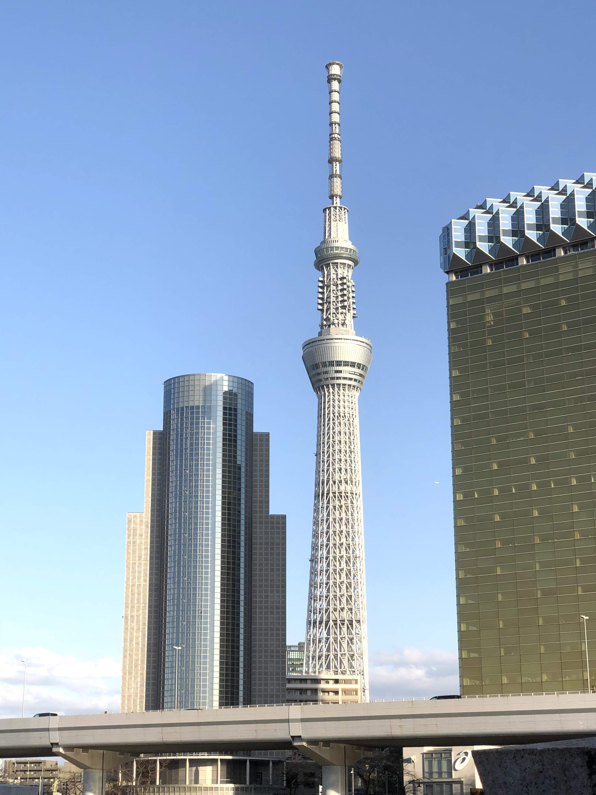

Also, apparently I'm really, *really* young to be traveling alone. I'm really lucky to have been able to travel at an early age, going to France and Britain by myself when I was 12 through a program called People to People, attending various summer camps in Ithaca, Maine, Pennsylvania, etc etc. Even still, when I tell people my age, I have yet to find someone who isn't surprised that I'm 19. I guess it's because I'm naturally bulkier and thus look older than my age, and also because people tend to associate 19 years olds with people who are 10-19 years old rather than with people who are 20-25 years old. Luckily it didn't really come up as an issue for Sinthuri and Mathangi, since they were still relatively young (early twenties). That being said, being surrounded by people my age my entire life in school has made me realize the adventitious nature of the bubble I live in. There are a **lot** of people in the world who are ten, twenty years my senior and still relatively "young" to be traveling the world. It's made me appreciate more the artificial environment that Yale fosters in surrounding me with those with similar ages and interests. This is probably the only time in my life where I'll have this type of environment handed to me on a silver platter. So, thanks college.

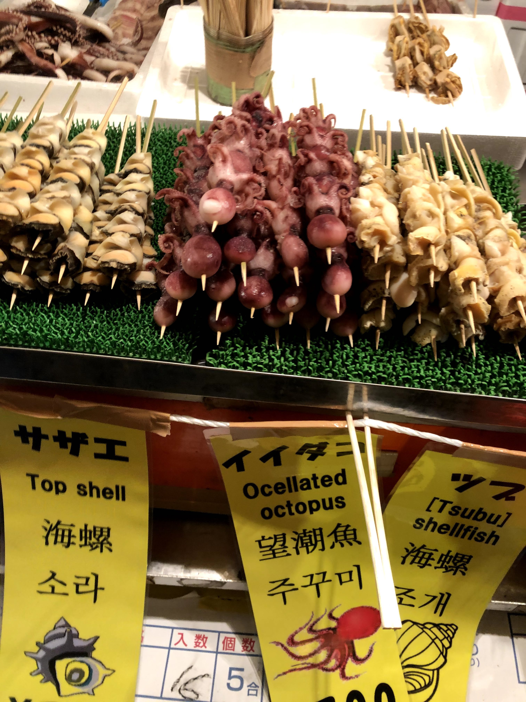

After visiting Tokyo Skytree, walking around Asakusa, and eating dinner somewhere after two hours of wandering (*shoutout to the waiter who understood my "mizzu kudasi" ("water please") in the restaurant),* I surprisingly felt tired. Not from walking, as that was obvious, but from being around other people. It made me realize that being on either extreme – never being around people or being around people all the time – isn't healthy for anyone. Even though I initially considered myself more on the introverted end of the spectrum, I feel like I've come to become more and more of an "ambivert," someone who does appreciate human contact once in a while. That being said, after 7 or so hours of talking to someone, I was ready for a break. 

Sinthuri and Mathangi had to go back to their AirBnB to check in, plus I was feeling a bit tired and wanted to see the area by myself, so we decided to split up around 7:30 pm. While it's awesome to have a companion to explore with you while traveling, it really does distract your attention from absorbing and appreciating the sights around you. I got really caught up talking with them in place of listening to the tour guide, learning more about the local area, and really, really looking closer at the things around me. As a result, I was ready to make the most of my time left in Asakusa.

Unfortunately, by that point, most of the stores had already closed, so there wasn't much left to explore. As a result, I decided to hunker down and wait in what I was expected to become a huge line to join the temple. (I actually didn't even realize there was going to be a line until about 30 or 40 people had already lined up)

I have to be completely honest. The wait was *far*from enjoyable. When you watch events like the ball drop in Times Square, you see the bright lights, the interviews, the overall festive nature. What you don't experience is the biting cold (it was 30 or 40 degrees Fahrenheit), the aching of your feet from standing for three and a half hours, the drowsiness from over 13 hours of walking around. It got to the point where I was falling asleep for five seconds at a time and squatting down to ease the soreness from my heels. I can understand now why I never wanted to go to Times Square to see the ball drop and never will – the hours leading up to it is pure torture.

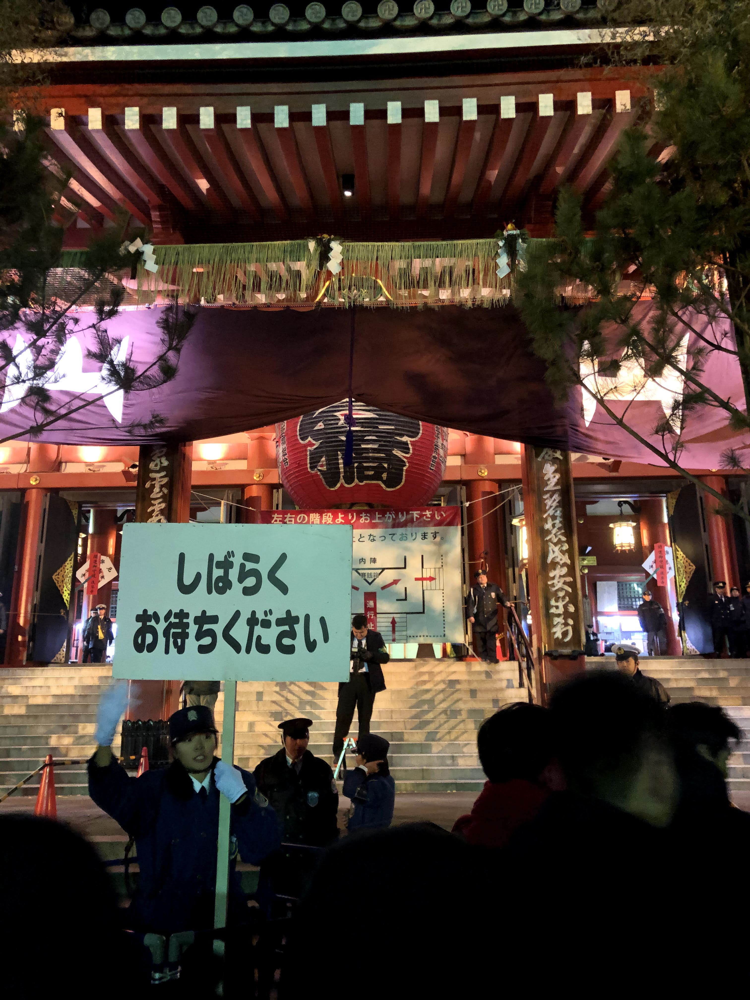

That being said, I wanted to persevere and experience a Japanese New Year, so after four hours of grueling agony, the time finally arrived. There wasn't a countdown nor a blaring horn counting down the seconds to the new decade. No, the only indicator I had that the new year had arrived was the sudden rush of the people in front of me into the gates. I checked my phone, and sure enough, it was January 1, 2020, 12:00 am. I guess I'm so used to over-the-top American celebrations that I wasn't prepared for what came next.

After shuffling up the stairs I came to the platform with the shrine. What I saw was far from what I expected. Rather than a boisterous trumpeting of screams and jubilations, I saw people flicking in five yen coins into the shrine, bowing their heads in silent prayer, and then exiting in peaceful silence to the left or right. Most of the noise actually came from the shuffling of people up the stairs rather than from the people themselves. I was amazed – it felt more like a silent procession than a raucous bacchanal. 

Anyway, after tossing in my coins and making my own personal prayer, I headed out. All-in-all, my four hours of tortuous waiting turned out to about one minute spent at the actual shrine. It definitely wasn't something that I would do again, but it was something that I appreciated doing. It really gave me insight into the importance of prayer and fortune for people in Japan and a newfound respect for their conviction. If people were willing to wait in hour-long lines just to have the opportunity to do this, it speaks volumes about how much it means to them.

These were the thoughts that passed through my head as I walked down the stairs from the shrine. But it was at that point that a more pressing, critical thought came into my mind: getting home so I could pass out.