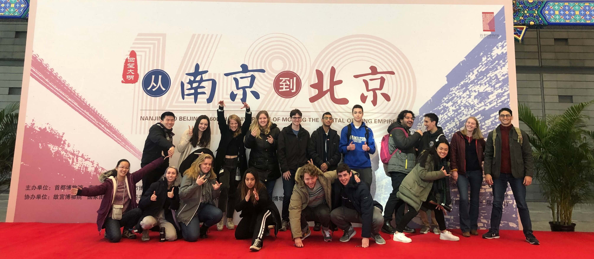

After a warm HUT farewell meal in a Brazilian steakhouse, it was time for me to lift my roots from Tokyo and plant them at my next stop: Beijing. 

Immediately following the lunch, I departed for Haneda airport and took my 5:15 pm flight to Beijing. Thank goodness I had planned ahead, because my flight only took 3 or so hours. Intra-Asia travel is so much easier than Inter-Asia travel! After arriving in the airport, I was picked up by my Dad's brother and wife, also known as *bo bo* and *er da ma.* One of the nicest things to experience as a travel is being picked up as a local. I don't know why, but just having someone who knows the lay of the land once you get there is just a huge relief. I didn't have to worry about the subway, about delays, about navigating Beijing's subway. It was also a huge relief because after getting there, I couldn't have done any of those things, since AT&T had forgotten to activate my international coverage! 

Unfortunately, things are rarely ever perfect, and my first ever experience in Beijing came to be dominated by one of the city's infamous things: the thick, Beijing accent. You see, even though my Dad comes from southern China, my Dad's brother had moved to Beijing a long time ago. Furthermore, his wife had lived in Beijing her entire life, so I got to experience the full brunt of the Beijing **er.** 

Luckily, *bo bo* had a sense of my Chinese level from before, and Yale Chinese had prepared me well, so I was able to get by. It was my first ever experience talking to someone who didn't know any English, and I'm happy to say I was able to get by sparingly. I'm glad it was with my family though, because they were generally kind and patient with me as I tried to communicate my thoughts.

If there's one thing I've noticed about Beijingers, it's that they are coarse. Beijingers and New Yorkers are more similar than I thought, as they have this tendency about them to just speak up their mind. It was no more apparent than with my *erdama,* who would be very vocal about her concerns *(did you eat enough food? was the flight exhaustive?).* 

It also translates to the driving. While I love my *bo bo,* I literally thought I was going to die in that car ride from the airport. If you draw up any of those stereotypes of older Chinese men, a lot of them applied to my *bo bo*. I'm sure it wasn't as bad as in places like India, which my friend tells me about, but my *bo bo* was swerving like the lines didn't exist. I didn't want to say anything to be rude, but I'm glad I got into the dorm alive that night.

# Settling in: the rocky road begins

## Setting up the essentials

The next few days that passed by were spent working out logistics. Since I had gotten special permission from the directors to arrive a week and a half late so that I could do HUT, I had a lot of catching up to do.

Despite a lot of language barriers and logistical issues off the bat, I was able to do a lot of essential things that I would need to survive, with almost no English: apply for a SIM card, set up a bank account (WOW was that difficult), deposit money in my meal card (after walking around for almost an hour with a Minzu University 1st year helping me out - if you're reading this, thank you!). While most of the time I was able to get by using my basic Mandarin, gesturing and Google Translate turned out to be equally valuable tools.

Those first few days adjusting to the climate in Beijing have given me a lot of respect for immigrants who move to a country without any knowledge of the language. Even in China, so many of the signs in places had English, and I've become so grateful to be born in a country that speaks the most widespread language in the world. Even though I was there 

## Falling apart

Sooner or later, I realized that my transition was to ACC (and more generally, Beijing) was not going to be as smooth as I thought it would. Not only did I realize that I would experience a whole slew of social issues, coming almost a week and an half late into campus after everyone had gotten to know each other, but I would also experience a bunch of physical and academic ones as well.

 It was definitely just the fact that I was had just settled in and was getting used to the demands, as the first few weeks of any study abroad program are the most difficult, but I was not able to get as much cultural exploration as I wanted. Each day I had to spend almost five to six hours, on top of four hours of classes, focusing on one and one thing only: Mandarin. Even though I generally consider myself to be one of the more hard-working types, and my classes weren't affecting my GPA back home, it was really difficult to stay motivated at times. 

It was clear that the other students felt it too. There were only 30 or 40 so students at ACC during the semester, but I rarely had a chance to see them outside of classes. Everyone was studying all the time and trying to cope with the load placed on them. I really tried at first to hang out with them more often, but after a while I realized it just wasn't possible during the weekdays. That first weekend was also difficult, because I had to spend my Saturday and Sunday catching up on Monday and Tuesday's characters. There wasn't any time to rest. At this point, I had one goal and one goal only: to survive.

*Disclaimer:* I'm mentioning this here, not to bash on ACC, but rather, illuminate some of the struggles that I experienced. I don't want to paint an inaccurate picture of my first week at ACC – it was **hard.** It's also worth mentioning that (spoiler) I would only end up being in Beijing for two weeks, during what usually is the most difficult part of any study abroad program.

I didn't know it at the time, but I was in the most difficult week of any study abroad program: the first one. The road ahead would be rocky, but thankfully, it would get easier. More on that ... in the next post!