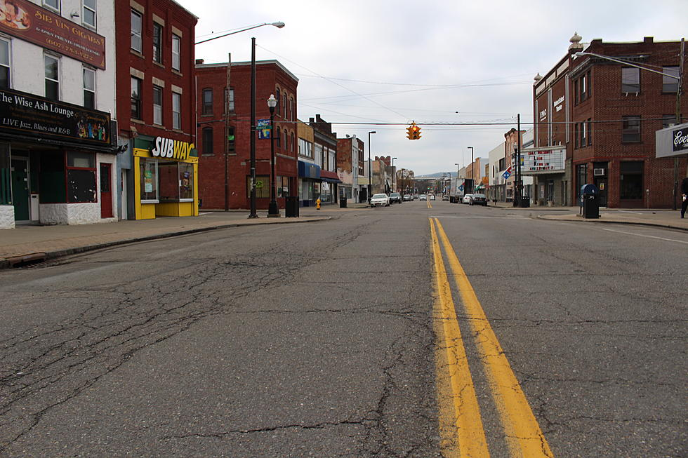
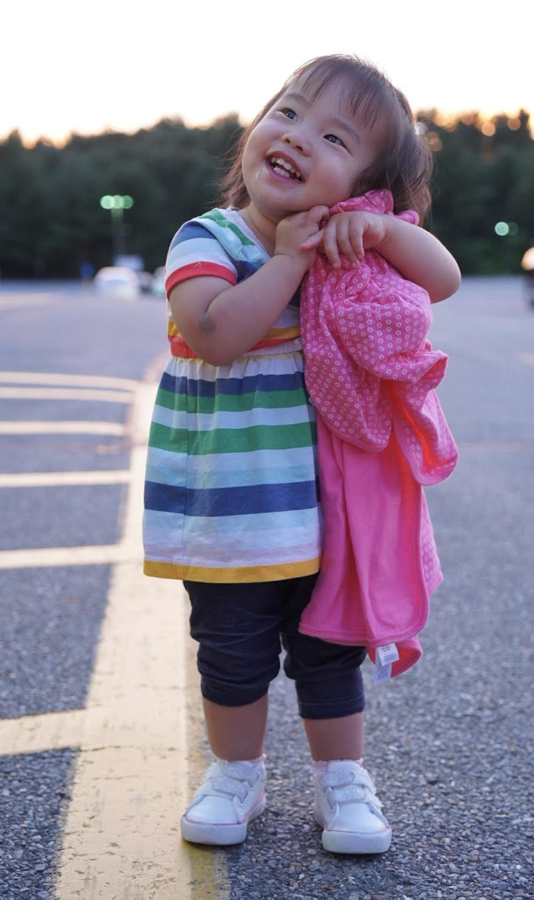
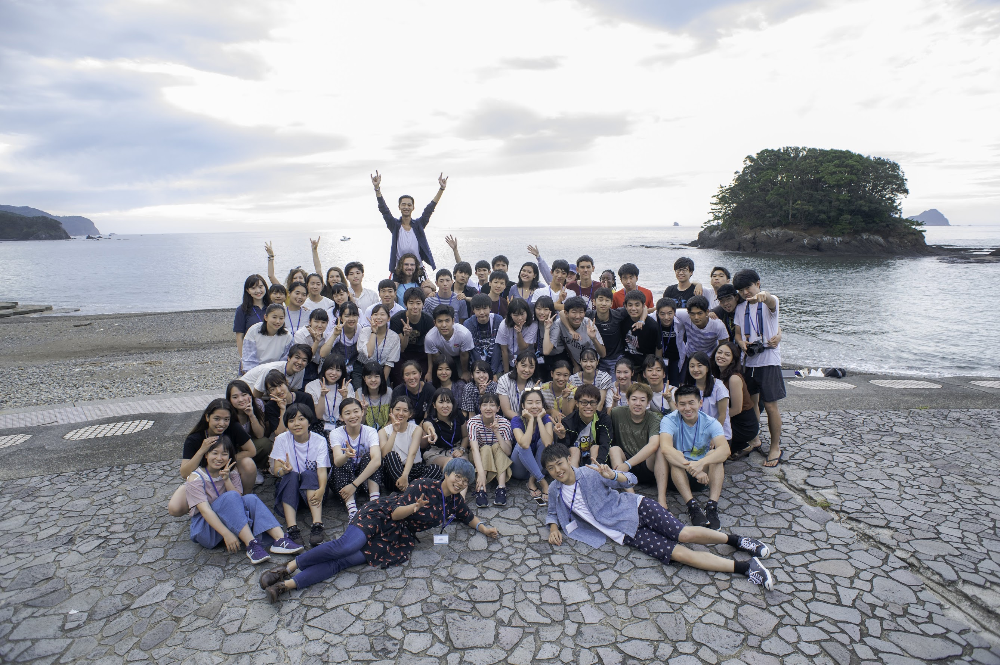
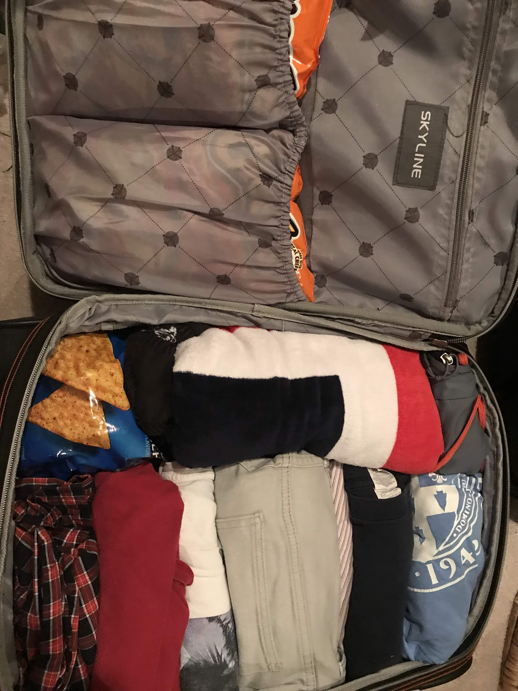

The fall of my sophomore year, I was confronted with a question that every college student faces at some point – **what in the world am I going to do during my school breaks?** Being the type of person to plan everything down to the nitty-gritty, I’ve been working on embracing spontaneity. Still, old habits die hard, and this problem had nagged at the back of my mind all semester. I've always wanted to make the best use of my time in college because I know that it's limited.

My last resort? Going back home to upstate NY. Yes, really. It baffles me sometimes why other students love going back home. Now, don’t get me wrong. I love my parents, I think my Dad’s *pai gu* (Chinese-style pork short ribs) knocks the socks off of any Chinese food at Yale, etc etc. The *real* problem is that my hometown lacks things to do, and even more importantly, *people* to do things with.

## **The Once-Proud Hometown of IBM**

I come from a small town in upstate New York called Endicott. While my parents were born and raised in Zhejiang Province, mainland China, I was born and raised in rural America. Endicott (and the Binghamton metropolitan area in general) actually has a really interesting history – it was the birthplace of IBM, the birthplace of the carousel, *and* the birthplace of the chicken spiedie sandwich. It was once a thriving center of commerce, with 10,000 IBMers showering their skills, business, and talents upon the city. This was the Endicott that existed when my parents arrived.

However, like many other towns along the Rust Belt, history was not too kind to Endicott. With the relocation of IBM's headquarters decades ago to Armonk, New York, manufacturing and jobs have gradually left and continued to leave the town. The departure of thousands of IBMers sent the local economy into a slow but ever-lasting decline, causing Endicott to just another decaying city along the Rust Belt.

With the departure of jobs came another effect – the departure of young, talented people from the area to reinvigorate the economy. This brain drain reverberated throughout the public school system as I grew up. People couldn’t wait to get out of *Empty*cott and be anywhere else. There were no concerts, no activities, no cool things to do for young people. There was and is nothing to do in my hometown for people like me.

*Disclaimer:* my town government is *very well* aware of this problem and thankfully, they’ve taken steps to combat it, like a “Broome (my) county ... a good life” ad campaign. That being said, I’m sad to say that I can’t see Endicott ever getting back to the heyday my parents experienced.

## **What to Do Then?**

History aside, back to my original question: *What am I going to do for winter break?* I already had fall break (5 days to catch up on work) and Thanksgiving break (a trip to Boston to celebrate the holiday with my brother, his wife, and my *kawaii* niece) planned. 

However, winter break wouldn’t be something I could just organize in a couple minutes. Not only was it longer than fall break and Thanksgiving break combined, but I had already exhausted some of my options – going to Boston, coming back home, etc. Luckily, I discovered a pilot program that was exactly the type of activity I was looking for: Liberal Arts HUT, hosted by HLAB.

## **The Magic of HLAB**

[HLAB ](https://teach.h-lab.co/why-hlab.html)is an educational nonprofit dedicated to promoting the liberal arts in Japan. They host events throughout the year but are best known for their two-week summer school, where they recruit university students from all over the world to teach self-created seminars to Japanese high school students. The most impressive thing? **It's run almost entirely by college students, for college students.**

**Doing HLAB last summer was a life-changing experience.** I literally could not recommend doing it enough. As a result, when I heard that they had a new pilot program planned for over winter break, I jumped on the opportunity immediately. Not only was this program another chance to go back to Japan and teach, but it was also **completely financially covered.** Flight, housing, meals, even wifi! One application and acceptance later, I was off for Japan!

## **The Plan**

HUT was only one a single week long and took place at the very end of winter break (January 6 to January 13), so I didn’t have any other option but to come home for the first part of the break. Since HUT was covering the flight to Japan, I thought, hm, I may as well leave a week early and have some time to self-explore Tokyo. It would be way better than just sitting at home and doing nothing. As a result, after spending Christmas with my family in Boston, I departed from Boston Logan for the next spot in my journey: Tokyo.

