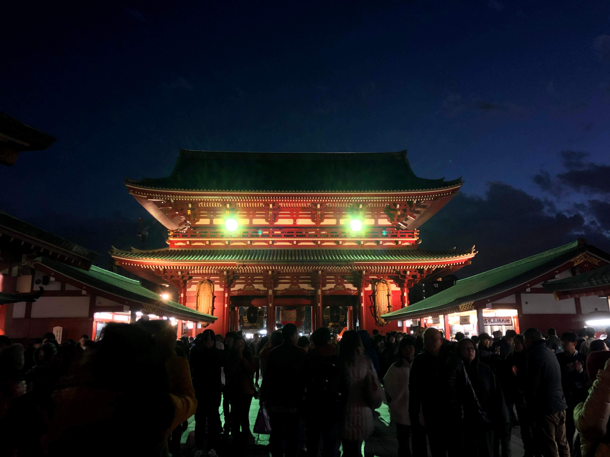
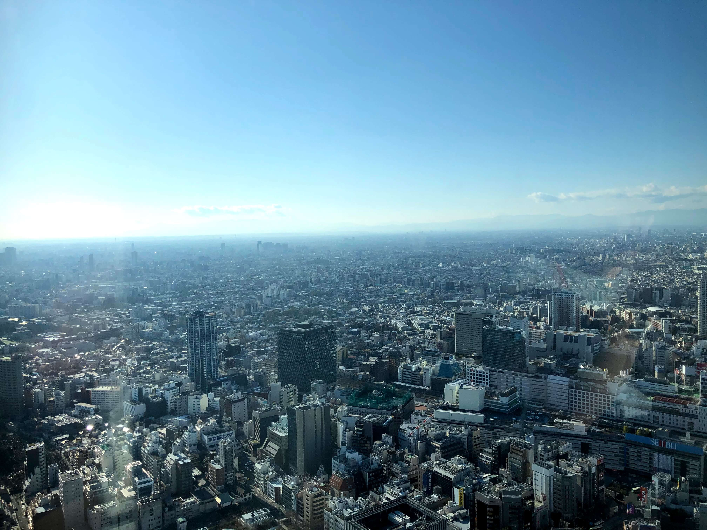

Hello – and welcome to my travel blog! My name is Jeffrey, and at the time of this post, I'm currently a sophomore at Yale University studying computer science, but I'm taking a semester off to travel. In this blog I'll share and reflect upon my travel experiences abroad, giving you a brief insight into my life. I've journalled before, but this is my first time blogging, so this is a new activity for me and I'm really excited!

### Japan, China, Taiwan ... oh my!

I've been lucky to travel to multiple countries already, most recently Japan and China. I was **also** really lucky this fall to have been selected as a Light Fellow for the 2020 spring semester, so my first set of travel blogs will chronicle my trip to Eastern Asia to study Mandarin. My initial plans were to complete my studies at Associated Colleges in China located in Beijing. However, the outbreak of the coronavirus (COVID-19) during my time away from Yale has caused a **huge** change in plans, so now I'll (hopefully) be studying at the International Chinese Language Program in Taipei. In case you're wondering what happened abroad, it's a long story, which I'll get to in the next few blog posts.

Speaking of blog posts, I realize I'm now 19 years behind on my travels ... haha. I'm going to spend the next few blog posts not catching up on what I've been doing my entire life, but rather, my travel plans for 2020. I've already got some posts on my two week trip to Tokyo coming up next (spoiler photos in this post), along with some other posts on my incredibl(y short-lived) 2-week "study abroad" program in China. 

Whew. Now that I've gotten all the technicalities out of the way ... let's get blogging!

*Note:* I created this website by myself as a side project using some cool software*, so there might be a few bugs here and there on the site. However, I'll eventually be transitioning my blogs to a new website that I'm also creating. Until then, I'll temporarily post everything on this site.

\*for you techie readers out there, I used Appfairy, React, and Netlify CMS to create this web app. Check out the GitHub repo [here](https://github.com/JeffreyYu2018/personal-websitev3) ;)