At the beginning of the week, the effects of clubs being cancelled was starting to settle in. 

## gaining a new perspective

There were some pros, of course. Not having extracurricular engagements left me with more time to hang out with other international students. Being with people older than me was something I was initially apprehensive of but turned out to be something I really enjoyed. 

Two of the people I hang out with frequently, Megan (22) and Will (25), are years older than me, but it's surprisingly nice to hear about their experiences and how much they've changed over time. They keep telling me I'm young, and that I have so much time to develop and grow. As someone who has insecurities like everyone else, that's reassuring to hear.

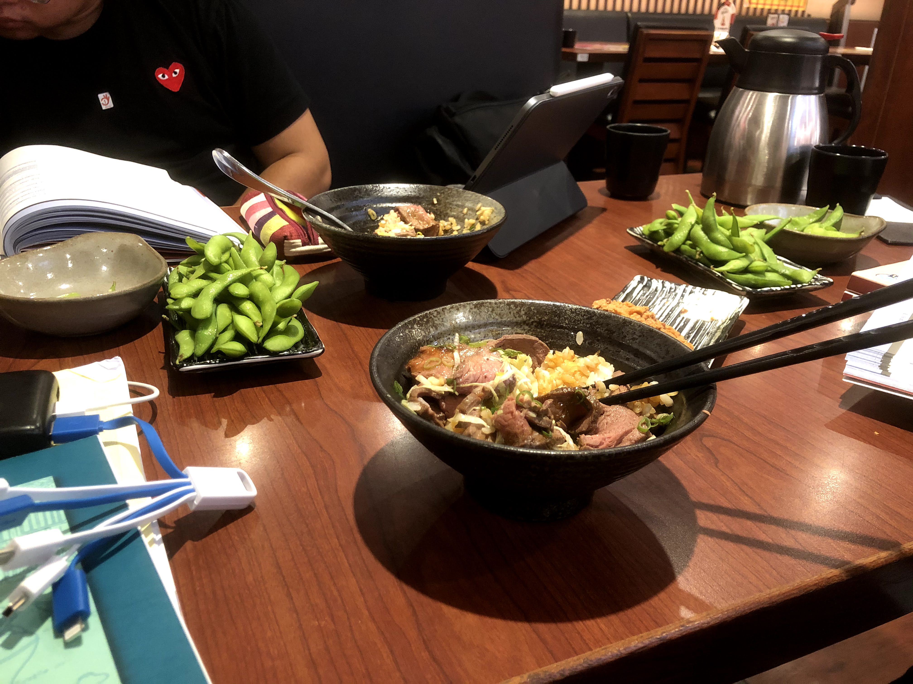

## finding alternative paths

At the same time, the language barrier between me and some of the other international students poses an issue. Since Will and Meaghan are just beginners, it's virtually impossible to communicate without using English. Since ICLP only has a limited language pledge, such that it's only enforced within the building, it's not active at all outside of the classroom. As a result, I feel like despite my reframing, my language development has been slightly stunted.

While I've really enjoyed deepening friendships by hanging out with a single group of people at ICLP, I also really want to reach out and not feel constricted to people at my program. This has become especially noticeable since all ICLP events have been cancelled, making it even more difficult to forge cross-student friendships. 

As a result, I've sought to supplement my language learning and study abroad experience by hanging out with Taiwanese people at school clubs. However, since clubs were cancelled for two weeks, this has no longer been possible, so I've been looking for alternative opportunities to practice Mandarin.

However, just as these challenges started appearing, things began to pivot.

# peaking

It was near the middle of the week that I started to find professional, social, academic, and personal meaning in my daily life.

## mulling over my professional future

I haven't really addressed this before in my previous blog posts, but finding myself professionally has been an important goal I've set for myself while abroad. Specifically, clarifying what exactly I what to do in the future and what I can do for myself in the present to get myself there.

The biggest topic I've been grappling with has been my interest in consulting. Initially, prior to coming to Light, I had already set my plans in stone: I would go into tech immediately after graduation, and I would scrap any ideas of going into business. However, after going abroad, I've realized that I ultimately want to be working in a place where I can be in front of people, in contrast to being a code monkey. Event after event has increased my interest in consulting, which I'm starting to see as an avenue towards that goal.

It started with a dinner with my suitemate Dennis earlier in the semester, who told me about how consulting would open doors into any industry I chose to go into afterwards. It would be infinitely easier to go from consulting into tech than tech into consulting, which subverted one of my original expectations. He also touched upon some social benefits from consulting, not only with learning how to interact with others in a professional setting, but also constantly being surrounded by driven, inspiring people and reimagining what is possible in the world.

Following my dinner with Dennis came a Yale-only event with the CEO of NBA China, Derek Chang. It was awesome to learn about how NBA China was reacting in response to the scandal earlier in the year regarding the Hong Kong protests, but one of the main points I got from it professionally was the training benefits of consulting. Derek talked extensively about how his two years in business gave him the means to deal with intense pressure, which has helped him with his current job. As someone who sees himself in a similar position as Derek down the line, I think this would be very valuable.

The final event that started to tip the stones was a consulting dinner with Davis, the leader of myconsultingoffer, an organization I hosted an event with as the events manager of the Yale Undergraduate Consulting Group. Davis happened to just be in Taipei, and we grabbed dinner at a Korean BBQ place (my first one, in fact!) He told me how it was totally possible to make a career path change even with the current situation caused by the virus. *Consulting firms will still be hiring,* he reassured me. *Tech and consulting is actually a very common combination,* he said. I'm still not 100% set, but I'm very interested in taking the next step and applying to a consulting internship my junior summer. I'll make a final decision in the coming months as my study abroad experience ends.

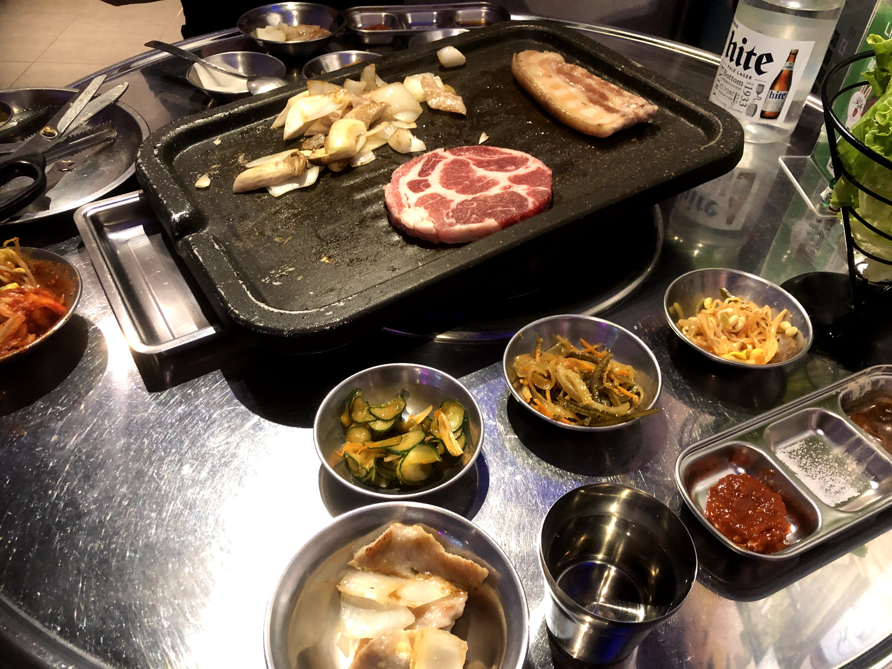

Overall, after studying abroad, I've come to realize how awesome Asia is and have become more interested in doing business here in the future. Whether it be for my startup OnTrack or for the future company I work for, I know I want to be overseas again in the future. In preparation for this, I've actually chosen to make my final speech about pitching my current startup, OnTrack, so that I'll be prepared to do business in Asia in the future.

## clubs are back! ... sort of

In another piece of good news, NTU announced on Tuesday night that most clubs could start up again! Being without clubs has made me realize the importance of having a space outside of classes for cultural exploration and socialization. 

That being said, the only club that resumed meetings for this week was my teaching club. Since the club was filling service requirements for a lot of the students, they were able to get permission to run the first few meetings. 

Things were a little shaky for the first meeting on Thursday, though, especially given the language barrier between me and the Taiwanese students after a two-week social hiatus. However, I was able to make some jokes and start warming up to them. 

As for the club situation itself, it's pretty chill, and I really like how it promotes socializing and team bonding. I also REALLY love the presidents and the culture they've created. In fact, I love it so much that I'll be drawing on this experience for making clubs at Yale more interactive and family-like when I come back.

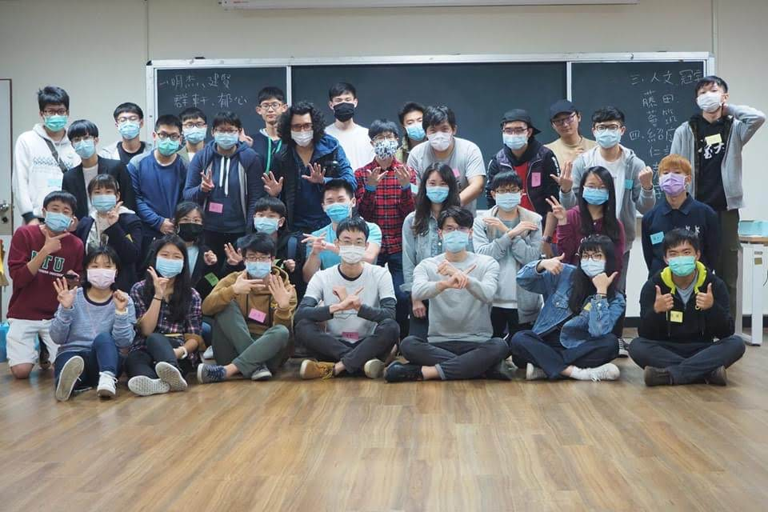

Only time will tell if the club continues and I'll be able to make some more meaningful connections from it, but I'll adjust no matter what!

My experience with clubs so far has made me even more committed to joining more clubs back at Yale when I get the chance. I talked with Davis about this, who was president of 3-5 clubs during his junior year, and I've realized that the most meaningful times I've had abroad have been when I've been the most busy. Proving that I can fit a lot more into my schedule while abroad than I expected, I'm excited to come back in the spring and revolutionize my social and extracurricular life.

## improving my Mandarin

### getting good at grammar

Just like with last week, my vocabulary is continuing to grow, and I'm understanding more and more words in the world around me.

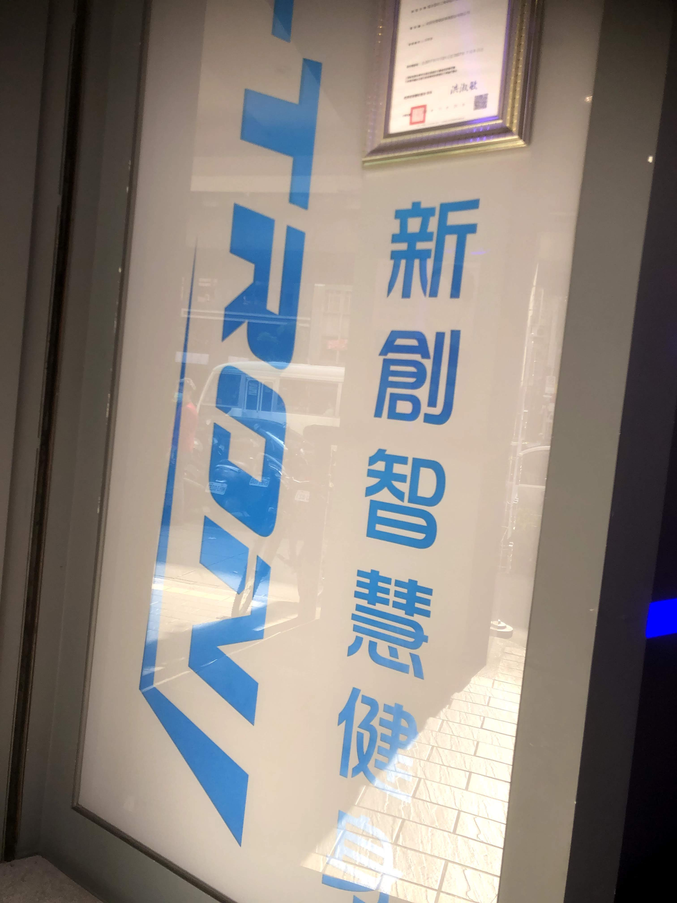

However, while I've continued to be really satisfied with my study method and its efficiency, I've also realized that it has a major shortcoming. It doesn't allow me to practice grammar.

Grammar is something you need to practice with someone in person. It's not just enough to review it like with vocabulary flashcards, but rather, its something that I need to proactively practice.

As a result, after this reflection, I've decided to make a change: to actively review grammar structures and incorporate them into daily conversation. I'm going to try to focus on repeatedly using certain grammar structures in the coming week until they become subconscious. I did this with one structure this week as a trial (非。。。不可) and it worked!

### laying out my grammar with my language partner

Luckily, I've found someone to practice this habit with: my language partner assigned by ICLP. This week, I got dinner with her at a famous Taiwanese Gongguan restaurant called Lan Jia that she suggested.

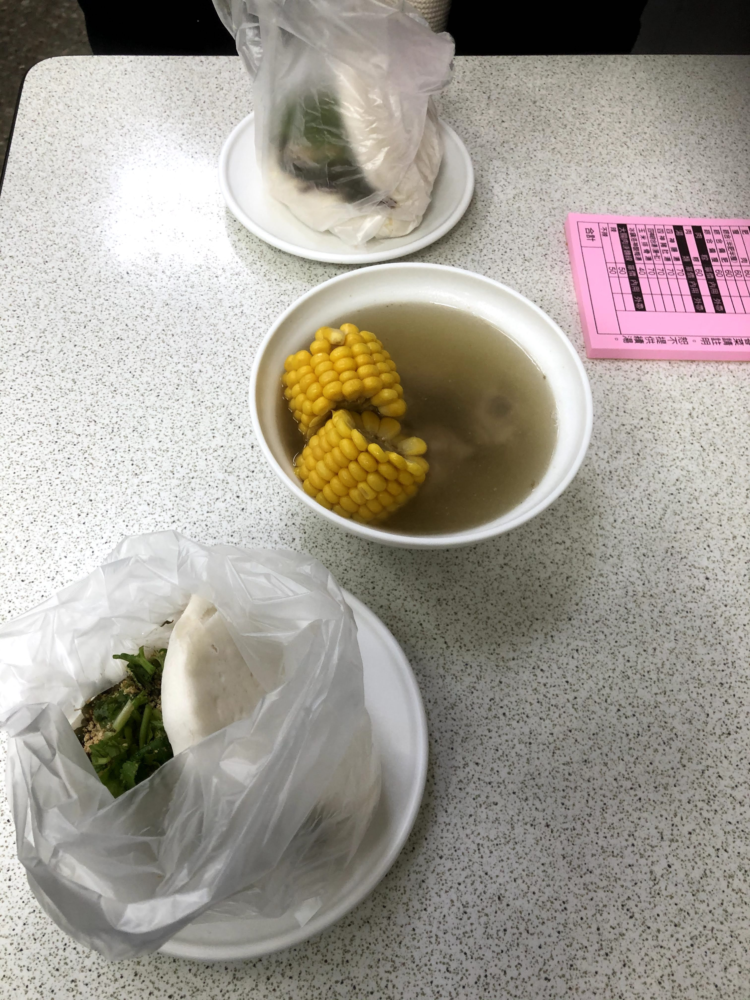

The food was great, and I was able to get to know my language partner for our first meeting. In the coming weeks, we plan on organizing more trips around the city!

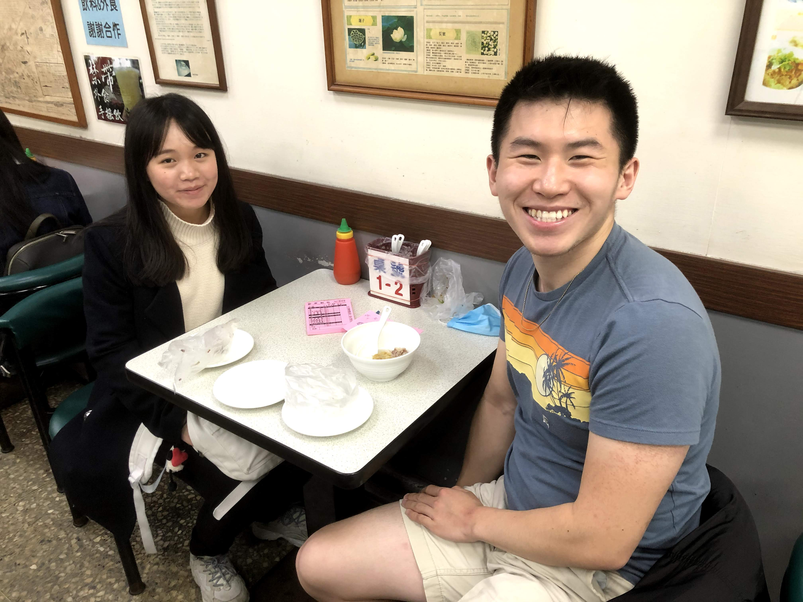

I think its great, meeting with language partners, because they help me achieve some of the original goals I set for myself. That is, meeting more people and staying connected with others in this uncertain time.

### hanging out with Sandy, my unofficial, now official, language partner

Once again, this week, after having fun last week, I hung out again with Sandy this week, grabbing breakfast on Saturday morning before her cooking class. Sandy is awesome, and it's these types of interactions that I wish I could have more of.

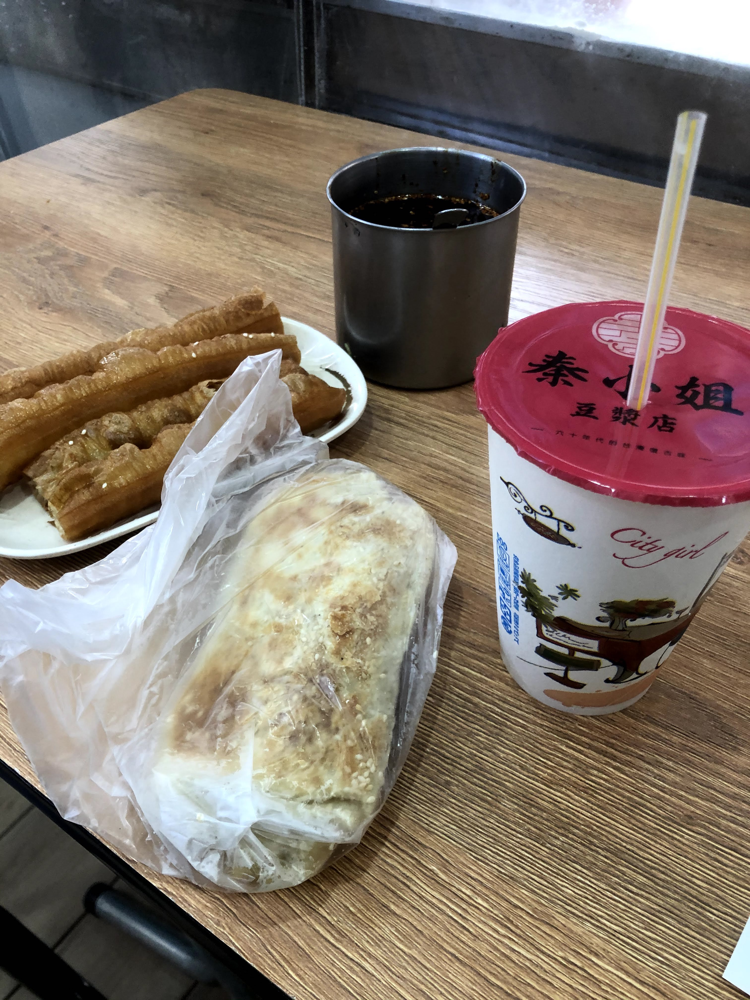

We talked about our two different languages and had an awesome exchange. I taught her English slang and she taught me some Taiwanese slang. 

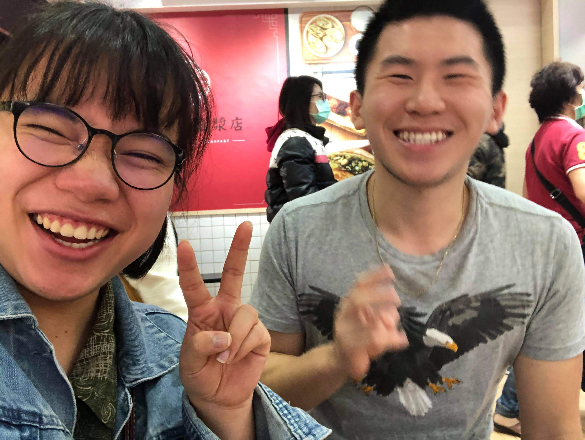

After having a good time, we agreed to officially make this a weekly language exchange. It feels more organic than just an exchange though, since it's genuinely fun to hang out with her (and Zach, when he's here.)

## making personal memories

After almost two straight weeks of rain, we were blessed this Thursday with some GORGEOUS, sunny weather. Beautiful weather almost universally lifts people's moods, and I was no exception.

The weather also had some other nice benefits as well. For the first time in my entire life, I was able to complete something that I've had on my bucket list, something that has become one of the most memorable and best things I've done in Taiwan. 

**I played on red clay tennis courts.**

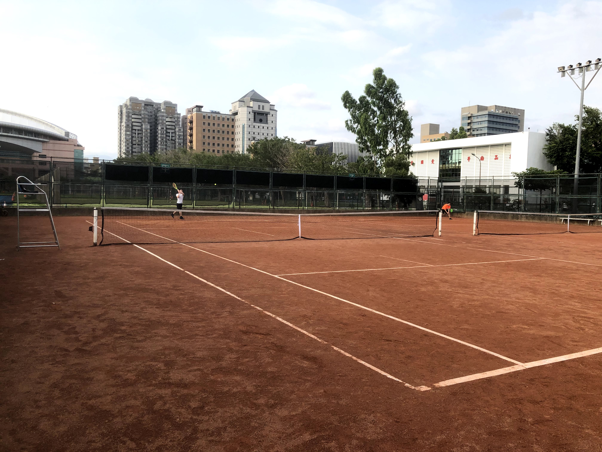

It was exactly as how I had dreamt it. The top spin and high-kicking balls ...

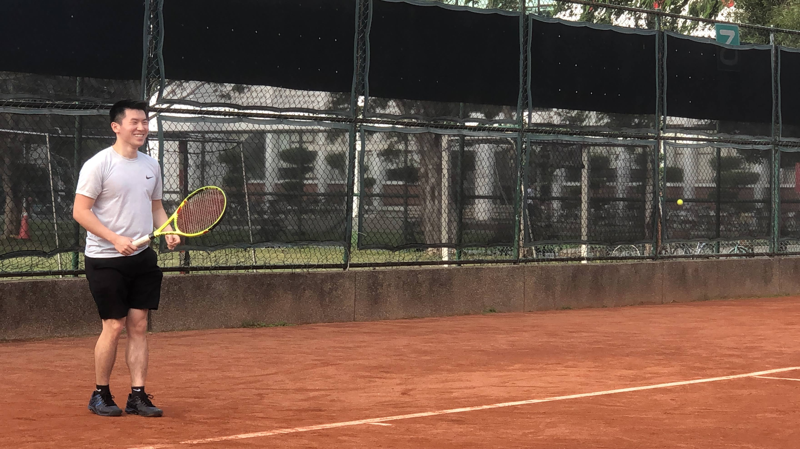

The slower pace and baseline-favoring game...

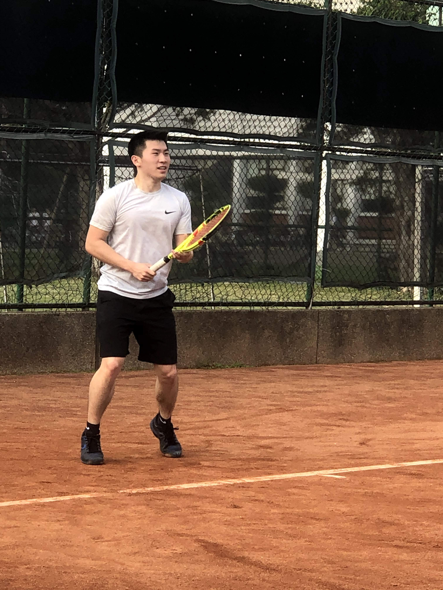

And best of all, the SLIDING!

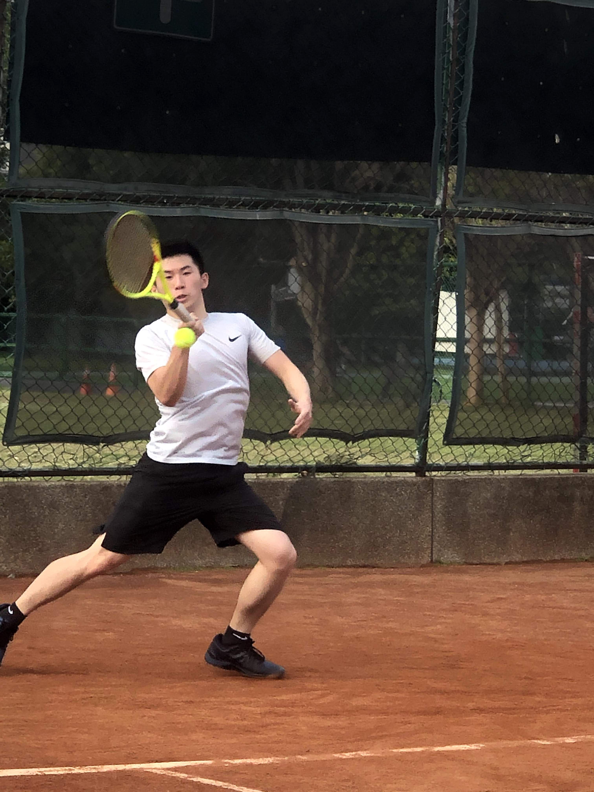

Sure, I came out of it with a couple of cuts and bruises, but it was totally worth it. I'm endlessly grateful to have had this opportunity in Taiwan to knock this off my tennis bucket list, as it was one of the most fun moments I've had during my entire time abroad.

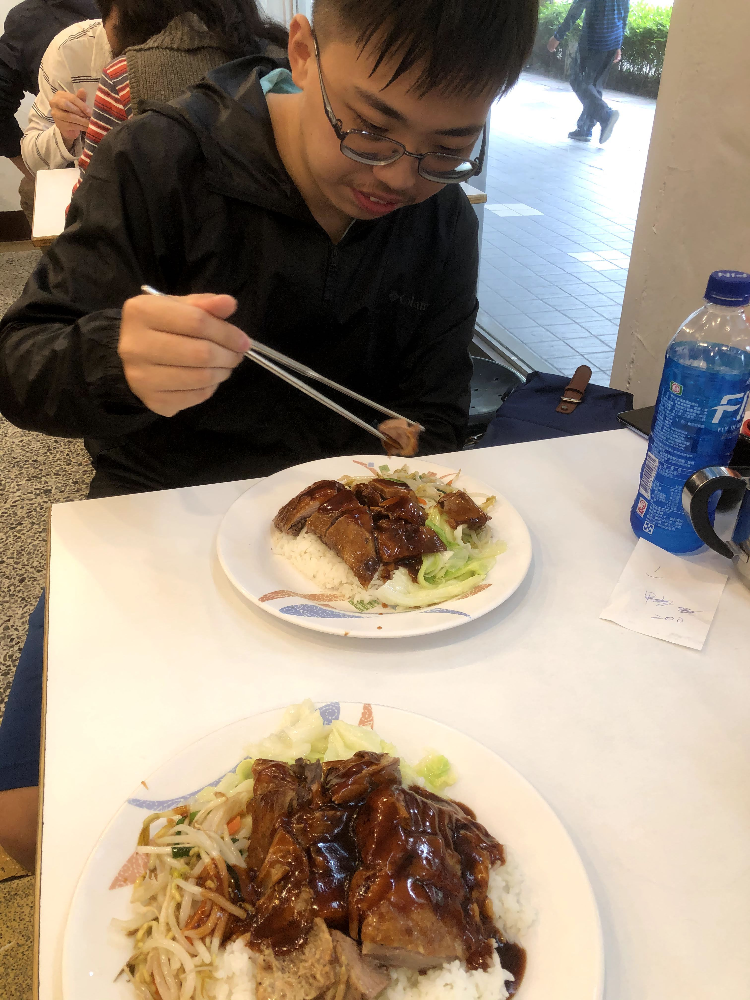

It might seem like just a game to some, but to me, tennis has some serious importance in my life. It's given me so many incredible experiences and I'm so glad it's continued to positively influence my life into the present.

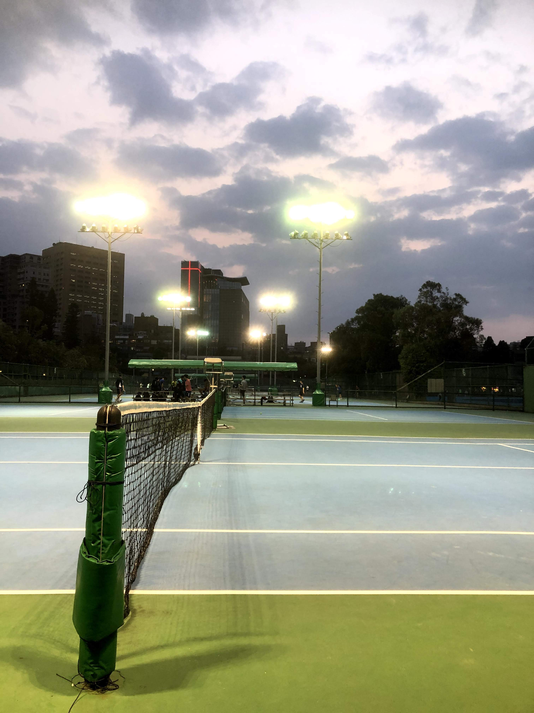

# taking a downturn

After a few days of this newfound high, however, I found out that things wouldn't be so rose-colored going forward after all.

The main reason? Clubs would, for the most part, be cancelled. Despite NTU allowing clubs to continue, they had included an important stipulation in their decision: only essential clubs should continue. For example, the teaching club, because students were receiving service requirements from it. 

Cooking and tennis didn't really fit this clause, so after a few days of discussion, the club's leaders decided to cooperate with the university and cancel all events for the semester. I completely understand their reasoning for this decision, but at the same time, it sucks. Clubs were going to be one of my main outlets for meeting Taiwanese people, and having that taken away really put a damper on the end of my week.

That being said, I truly believe everything happens for a reason, so I plan on taking this newfound free time to explore different opportunities and find other ways to engage with locals. 

## combatting the invisible obstacle

I've already starting thinking about ways to get around this setback, and I've come up with the following solution in the  meantime: signing up for and organizing more language partners. 

I'm thinking of paying for subscriptions to sites like mylanguageexchange.com and getting an additional two to four language partners that I can hang out with on Monday, Tuesday, and Wednesday. This way, I can explore different parts of Taipei with them and I can make some more meaningful interactions.

The most important thing is that here, in Taipei, and unlike at ACC, I plan on being as proactive as possible using the gift I've been given: freedom.