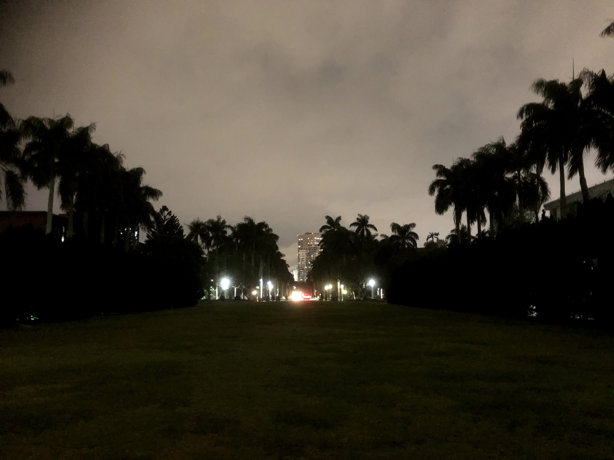
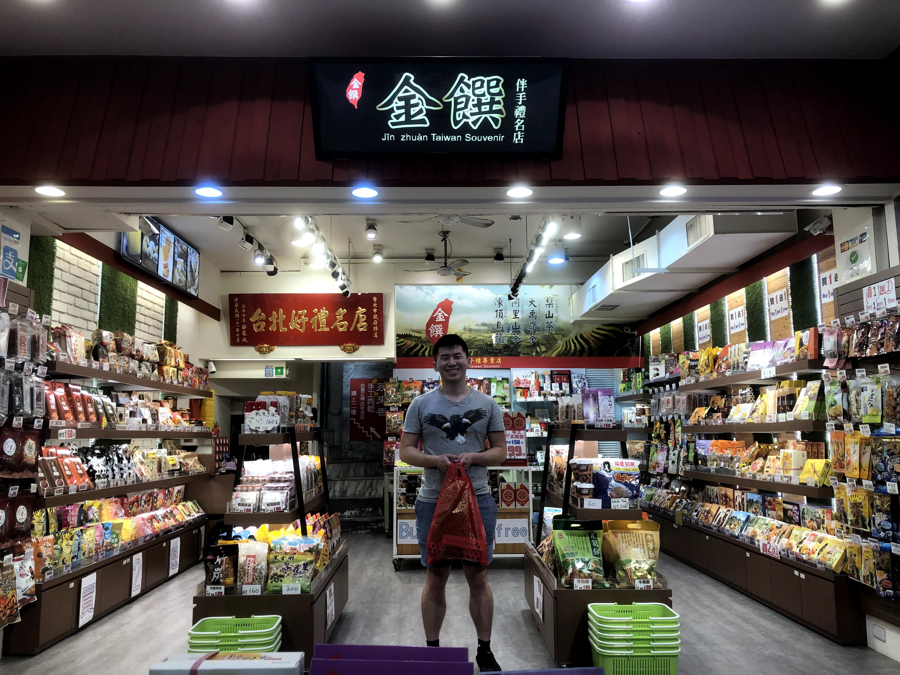
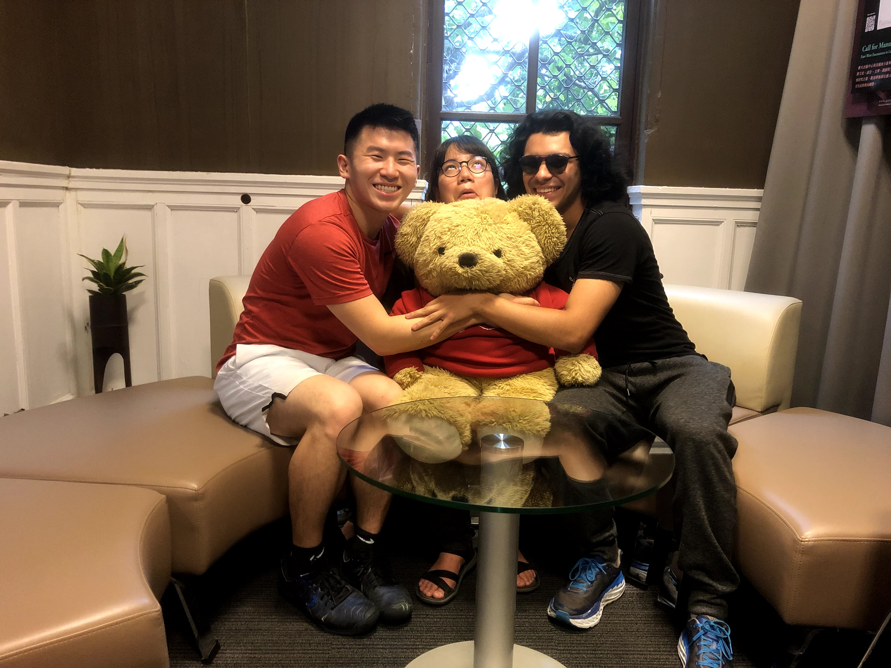
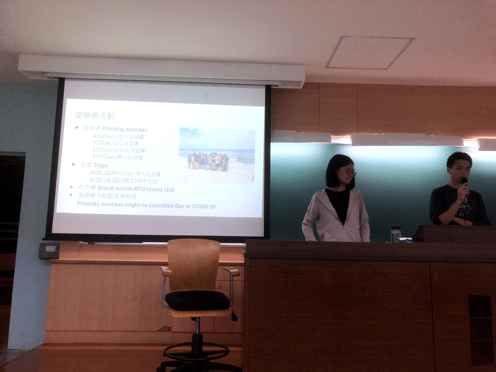
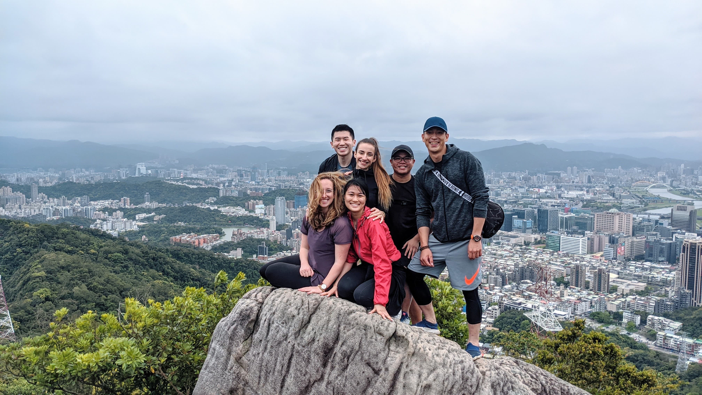
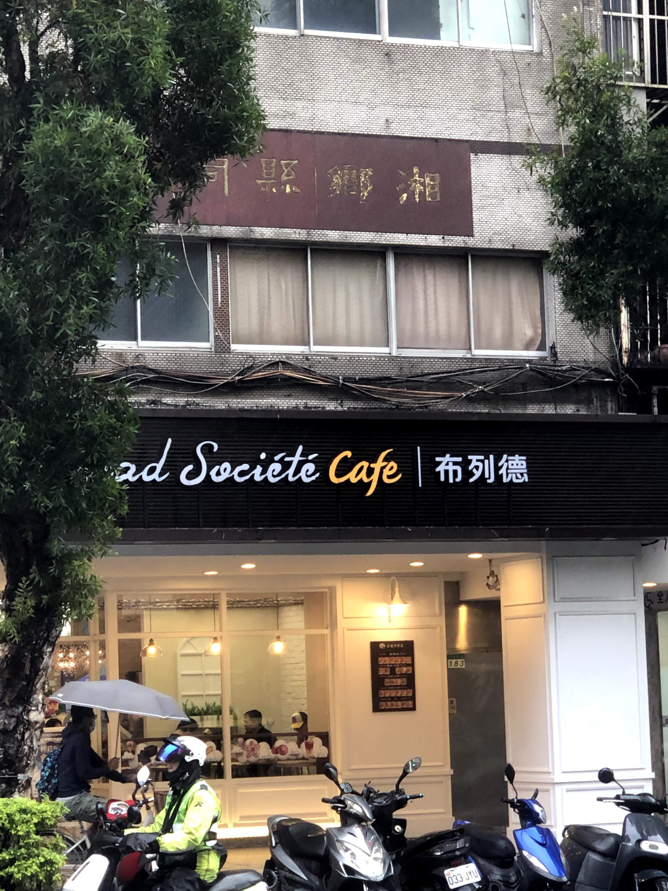
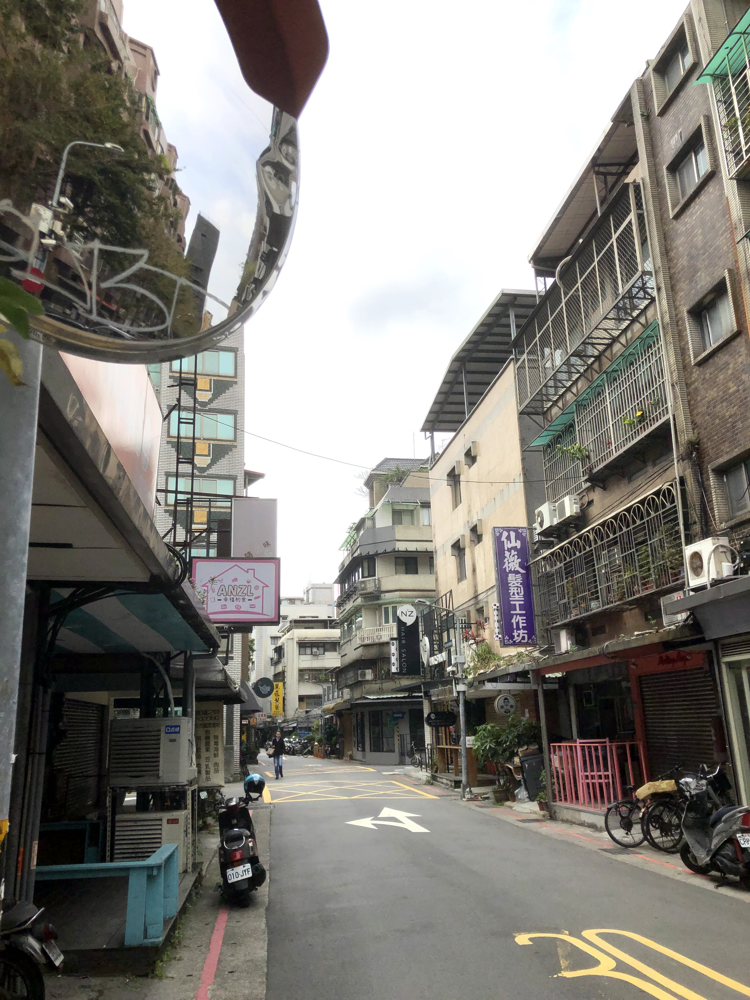
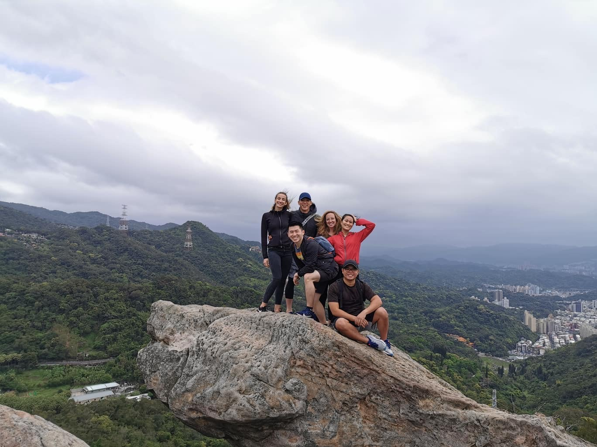

Taiwan has remained a relatively untouched island in a world ravaged by COVID-19, and hopefully it remains like that in the future. I've been unbelievably lucky to have chosen to study abroad in one of the few countries that has kept the virus under control. While I'm optimistic that Taiwan will continue to be able to contain it, it's already started to have some effects.

## Business goes on as normal ... except with tourism

After Taiwan banned all foreign nationals to keep out the coronavirus, I was ecstatic. Yes, good for the Taiwanese government for controlling the virus! As the days passed, though, while I was still grateful for that decision, I started to see its side effects on Taiwanese life; specifically, on the tourism industry.

One day, I decided to make good on my promise from last week to take a random bus to somewhere in Taipei. I went to Ximending, which has a lively night market and cafe scene. After arriving there, plopping down in a ramen shop and doing some homework, and leaving, something caught my eye. It was a boba candy advertisement. Immediately, I realized that I would eventually need to buy and bring some gifts for people back home, so why not get them now?

I walked in and almost immediately, upon seeing her first customer in forever, the shopkeeper began offering me free samples. I was amazed – how was Ximending, one of the commercial centers of Taipei City, not packed at all? After talking with the shopkeeper, however, I understood what had happened. The travel ban had killed the influx of tourists that normally frequented the shop.

The ban was taking its toll. The "buy 2, get 1 free" deal for limited items from before had changed to "buy 1, get 1 free" for everything in the store. The boxes she was handing out free samples from were almost completely full, evidence that no one had stopped in the store to try them. I felt really bad, so I decided to buy multiple gifts to help the struggling business out.

Even though Taiwan is a relatively safe haven from the virus, if this was how it was affecting small businesses here, I can't imagine the extent to which it is affecting small businesses in other parts of the world. 

## NTU clubs no longer ... for the next two weeks, anyway

I was in for a piece of bad news. In response to a cluster of cases popping up in Academia Sinica in Nankang (southern Taiwan), a closely-affiliated institution, NTU decided to implement a number of new measures to prevent the spread of the virus. Restricting campus access to NTU students and faculty only, cancelling all NTU public events ... and banning club activities for the next two weeks.

To be blunt, this sucked. Clubs were going to be one of my main outlets for meeting local Taiwanese people, and not being able to do so for the next two weeks would put a huge damper on cultural exploration. That being said, I totally understood where the university was coming from, and I'm optimistic that things will eventually return to normal after these two weeks.

# Staying proactive

My second week of classes are over, but I managed to get through it. Even though ICLP classes are relatively small (capped at 4 people), in any type of group instruction, it's difficult to stay engaged 100% throughout. After all, your teacher can only call on you a quarter of the time, and when the others are simply repeating grammar structures, it's tricky to remember why you're there listening.

That being said, I pride myself on my relatively long attention span, and I'm usually able to remain engaged throughout the lessons. It's easier in some classes (e.g. Radio Plays) than others (e.g. TOCC group class), but I think overall I'm getting the most I can out of in-person instruction.

## Zoom shenanigans

Just because we're here to learn Mandarin, doesn't mean we can't some fun while we're doing it. I thought with everything going on, with the online class instructions, the rising severity of COVID-19 in other parts of the world, etc. that everyone could use a little harmless laughter. 

That's why when I found out about the Zoom virtual background feature, I knew I had to take advantage of it.

After testing the waters, I started to make it a habit of mine to change my background each day. First it was a nice mansion, then a burning house. Following that, I discovered an even **more** powerful feature: video backgrounds. I moved on to penguin documentaries excerpts, and capped off my week with a puppy eating corn on a cob.

It's silly and harmless, but I think it's valuable. Not only did these zoom backgrounds keep classes interesting, but they created something in short supply: laughter. My teachers and fellow students really appreciated it, and I'm glad I was able to bring some smiles to their faces.

## Taking the initiative

Despite NTU (and also ICLP) events being cancelled, I've been able to keep up a positive attitude and take active measures to preserve my social life and cultural exploration.

### Hitting up the locals

I've continued trying to build relations with local NTU students that I was able to meet so far. Last Wednesday, I went to NTU gift shops with Zach and Sandy, one of the leaders from the NTU Cooking Club. Sandy helped show us around and introduce us to a few other gift shops around the university.

Furthermore, I've met a bunch of tennis players through NTU's tennis club, so I'm planning to hit with them on some afternoons throughout the upcoming week. While club events have been cancelled, the courts have still been left open. (it makes sense since tennis players are so spread out normally anyways)

### Preserving an international community

In addition to the events with NTU students, I've also tried preserving a sense of togetherness with the international students at ICLP. After all, all of our classes have been online for the past two weeks, and it's too easy to feel isolated from one other. Therefore, I decided to take it upon myself to organize some events that we could all go to during the weekends. This Saturday, I set up a trip to go to Jinmianshan, a hiking trail on the north part of Taipei.

It was really fun, and I'm glad to be continuing to live according to the goal I set myself at the beginning of the program: bring people together and explore the city to the fullest!

# Efforts paying off

It's not just social efforts that have started to work out in my favor. After two weeks of intensive character study, I can happily say that while I'm still nowhere near fluent, I can already start to see my hard work studying also paying off. It's small things, like realizing that I could now read the three Mandarin characters on the sign of a bread shop next to my house and understand the meaning.

It's also things like my habit of going to new cafes and restaurants to study. I've been able to visit some cool places that I wouldn't have before and try some new foods while still getting work done. Having a space and time to explore  has kept me balanced and motivated to continue learning characters each day.

 with my chinese textbook")

## Learning some life-changing lessons

From all of what's been happening so far, I've learned some important life lessons, the most important one being the following: **being proactive.** A lot of events that were cancelled this semester were out of my control, whether it be the Azalea NTU club festival or the ICLP field trips. As a result, I couldn't rely on them to make new friends or discover opportunities. Instead, I had to learn how to take it upon myself to make opportunities happen and fill up my schedule the way I wanted it to be. I realized that sometimes I had to go to events alone, and that was okay! I realized that I didn't have to rely on other people and could bring them along, forging my own path. I realized that instead of tagging onto events, I could also be the one who hosted them. 

This is the life-changing ability from within that I've discovered: the power to create my own agenda and bring people together. 

# Falling in love ... with Taiwan

I think what's allowed me to have all of these great experiences so far is the supportive environment that's nurtured them. Maybe it's because the government has done an awesome job controlling the coronavirus, maybe it's because the nation is generally more American-friendly and pro-freedom of speech, but I'm **loving** Taiwan.

From the food culture and the night markets ...

to the Japanese-inspired, modern and clean roads ...

to the beautiful scenery ...

how can one not like Taiwan? I had my doubts at first, since Taipei was relatively small and I had no previous interest in going, but now I'm so happy that I moved here to study Mandarin. If I get the chance to come back here in the future, either by studying Mandarin abroad again or traveling for fun around the world, I'll definitely take it.

# Finding a new normal

Flashing back to the present, we'll be returning to normal in-person classes at ICLP starting Monday, and I'm very excited to be able to meet some of the other ICLPers. There's been a few changes since we started – only NTU students and faculty will be allowed on campus, my old preferred schedule has been changed to a new one, and we'll start being held accountable for not having the textbooks next to us in class.

That being said, I'm excited to have things returning to some semblance of normal. While I don't know how in-person classes will go, I'll be ready for whatever gets thrown my way.