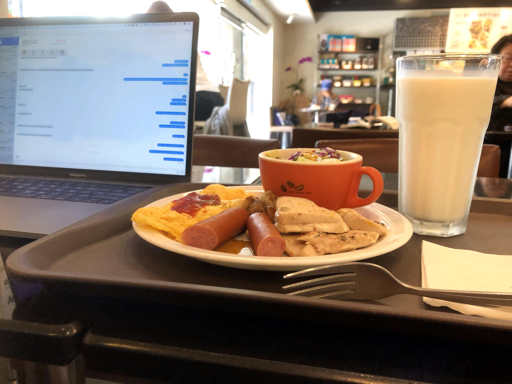
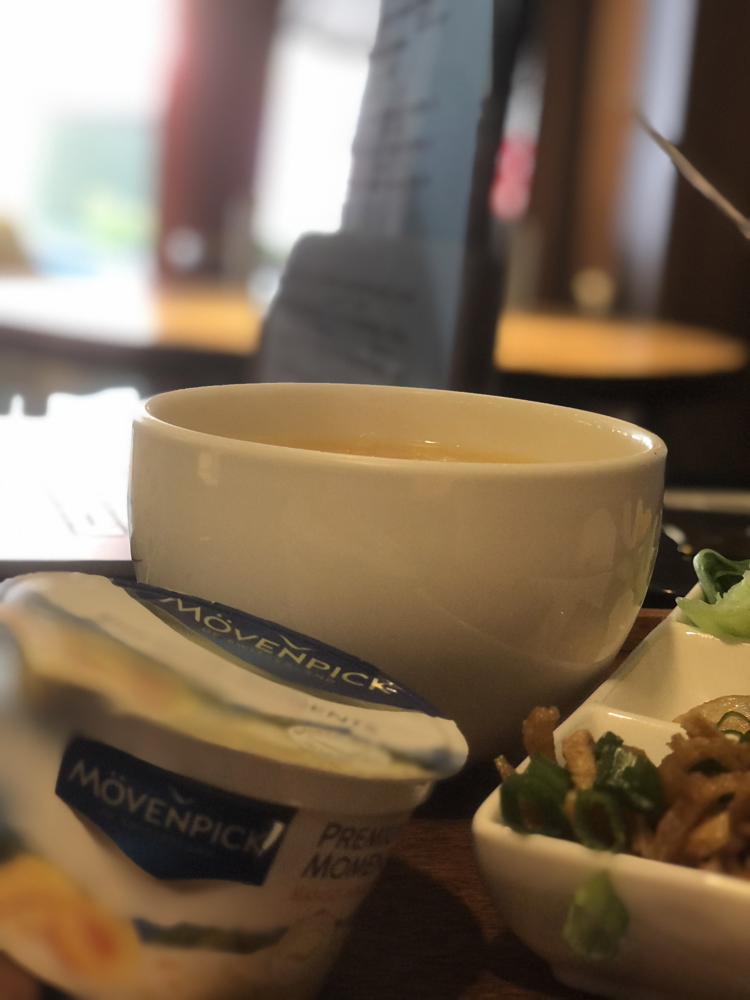
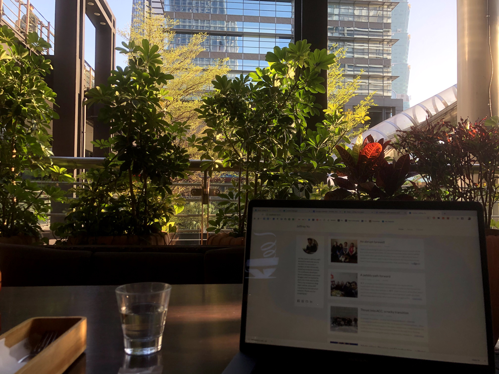
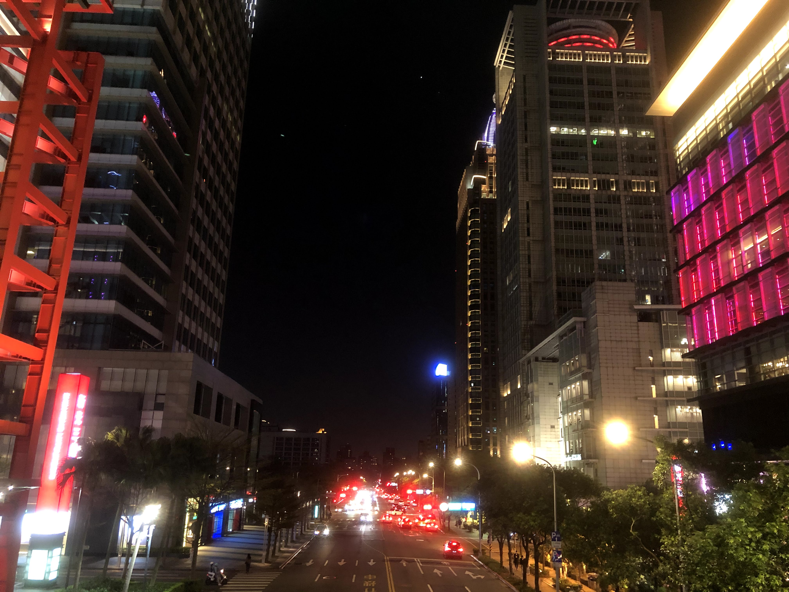
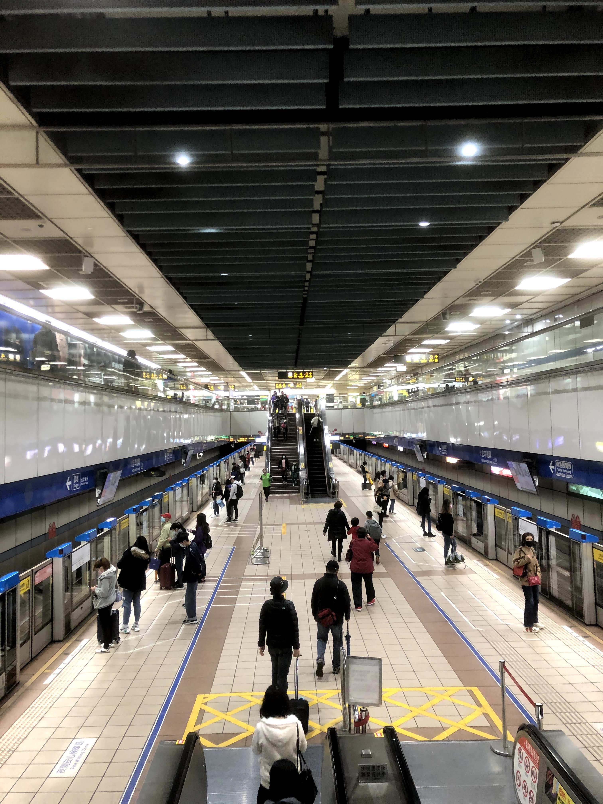
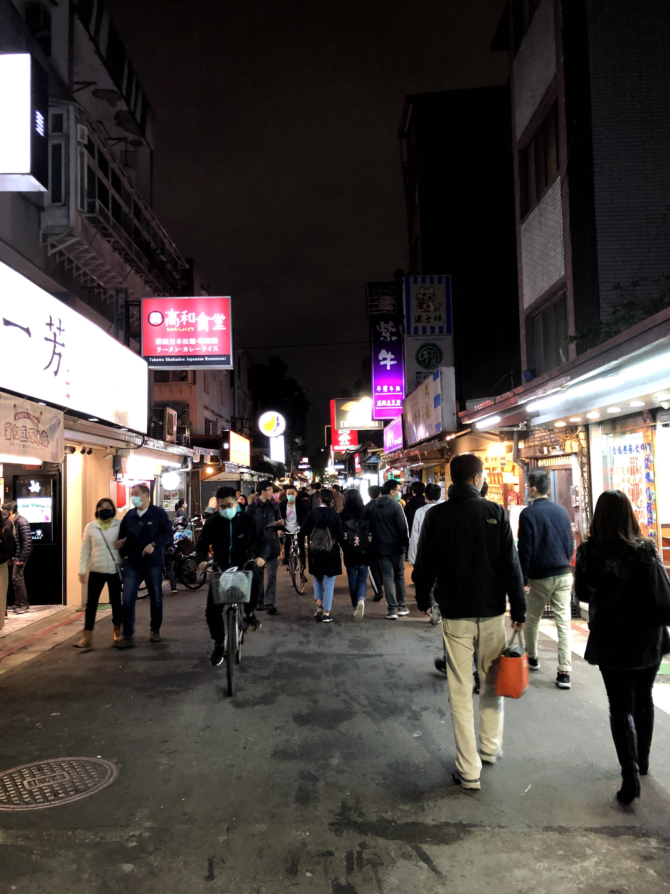

I'm the neurotic type. There's no getting around it. I love order, structure, predictability, and when I can make things line up nice and neat on a shelf.

I take comfort in the known and in routine. I like to understand what's going to happen and indulge in what I know will taste good. In this sense I'm just like my mom – an adherent to the known.

At the same time, I've come to realize that sometimes there's joy in the unknown and excitement in uncertainty. After being in a vicious cycle at ACC of studying in the same places, eating at the same places, and doing the same things at the same places, I've come to discover the other consequence of routine: dullness.

I hadn't even realized I was in a cycle until it was over. I studied in my room, ate the same *cumian* in University Cafeteria No. 2, and stayed in the same defined space for almost the entirety of my time at ACC. Sure, my visits to my family helped break up this monotony, but in hindsight I realize I wasn't making my experience what I wanted it to be.

Upon further reflection, I realize why this was the case. I loved the fact I could get a full feast in the school cafeteria for under $3 USD, I loved not pushing myself and indulging in inactivity. But now I know that there's a difference between being reasonable versus stingy, flexible versus passive.

# making time for the unknown

My routine in Beijing is one of my biggest regrets from my two weeks there – not just because I wasn't able to switch to a more spontaneous lifestyle, but because I know things likely wouldn't have changed. Had I not been forced to leave, I would have kept the same habits. Why? Because I didn't realize I was in a cycle to begin with. Sure, I had my journal, but I never really set aside time to truly reflect on what I had experienced and determine whether or not it matched with my expectations. It took being uprooted from Beijing due to COVID-19 for me to realize that I was in a hole. Due to these regrets, I knew something had to change. 

Thus, at ICLP, I've adopted new habits. I've went to cafes and restaurants instead of isolating myself in my room. I've tried going to one new place in Taipei each weekend. I've tried to avoid falling back onto old habits and I have instead made active efforts to explore and get out of my comfort zone.

By blocking out specific chunks of time in my schedule and treating this spontaneity as just as important as classes, I feel like I've been able to achieve what I wanted from my study abroad experience: a balance of language study and cultural exploration.

Sure, it's way more expensive to study at a business instead of my room. Even though I know it's not a rule, I always buy something from the cafe (brunch, a drink, a dessert) as a nod of thanks for using their space. At the same time, I know that my time abroad is limited, and maybe even shorter than I think. I'm only going to be in Taiwan for so long, maybe even not that long at all because of this coronavirus epidemic, so I'm going to do what I should have done in Beijing: live with no regrets.

# putting goals into practice

As for visiting a new place each week, I've been able to keep up with that goal so far. Sure, it's been easier because we haven't officially started classes yet, but I'm glad I've been able to get out of my room (which has started to feel claustrophobic) and keep up with the standards I set for myself. Blogging has brought me to some amazing places I wouldn't have went to before.

The very action of trying to locate a cafe in a new place and do work comes with time to sightsee the area.

It's not like this new habit conflicts with all the other scheduled activities I wanted to do. By blocking out a specific time in the day to go to someplace new, I'm still able to find time each day to workout, study, attend classes, go to club meetings, and sleep. Organized chaos is powerful. It's the first time while studying abroad that I've felt I'm living closer to what I want my experience to ideally be like. 

While this newfound habit has brought me a lot of awesome experiences, it hasn't always been easy. It's difficult to always resist my innate tendencies to stay in my comfort zone and seek order. Sometimes I just don't have the energy in me and just cave in and do what feels comfortable.

It's really tempting to just indulge in the known, to eat the same foods at the same cafes in the same places each day. After all, it saves time and energy, two commodities in short supply.

I have to actively remind myself to not fall into this habit because I know it'll hurt myself in the long run. Even if getting out of my comfort zone isn't fun, I know the best memories that I make from this trip will come from the experiences where I ventured into the unknown.

# breaking the cycle with blogs

At ACC I got into an endless cycle by getting into a routine, and it's been one of my biggest regrets. To avoid this from happening again while in Taiwan, I knew I had to make a change. I had been given a second chance in Taiwan, and I wasn't going to spoil it. So what was I going to do to ensure that if I did start relying on old habits, I could snap back immediately?

The answer turned out to be less glamorous than expected. I would switch from the final report option that Light Fellows needed to complete at the end of the program to the more intensive, difficult option: a weekly blog.

It might not seem obvious at first, but this change had a lot of implications for my experience, notably giving me time each week to self-reflect. I knew in addition to being a better chronicle for my study abroad experience, my blog would afford me the following responsibilities: 

* **Accountability:** am I living according to my outlined values and goals?
* **Documentation:** am I chronicling my experiences with pictures and depth so I can remember them fondly enough years later?
* **Self-reflection:** am I living to the best of my ability, and if not, what can I change tomorrow to better reach this goal?

With these goals in mind, I know that I'll have done everything in my power to set myself up for an amazing study abroad experience. Now, then, it comes down to staying true to these values and living each day in Taiwan as if it were my last, because it very well may be. This is my plan for the future, and I'm excited for you to follow me on my journey.