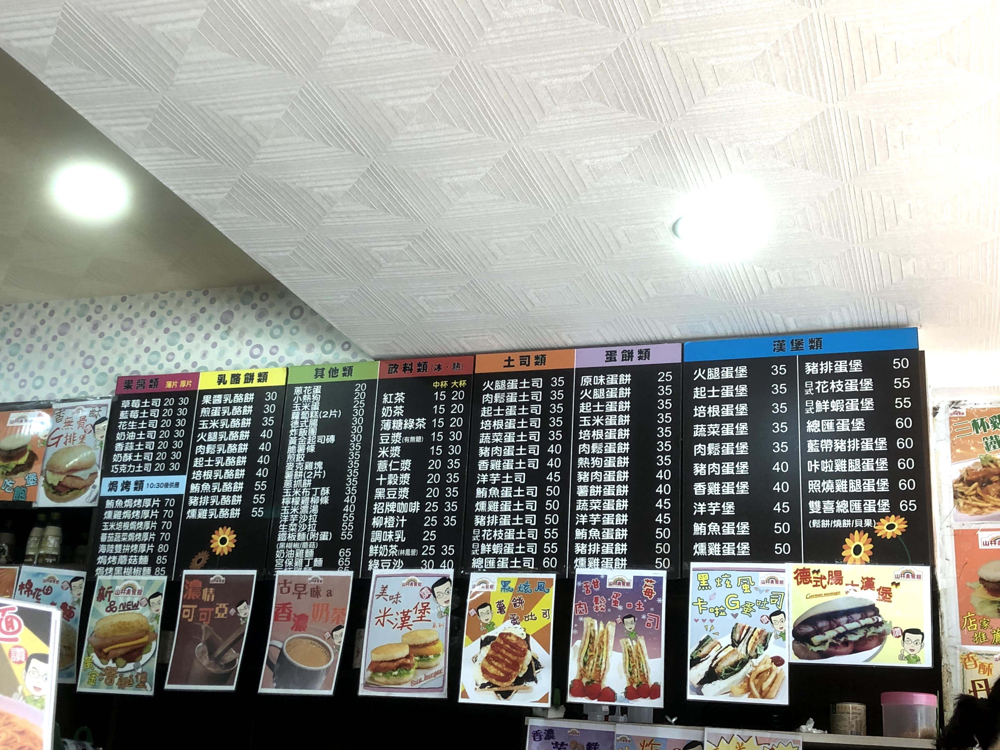

After my first week of classes, I've come to the realization that ICLP's methodology suits me. I feel like each class drills grammar structures in a much more natural way (discussion) compared to ACC (rote repetition). Furthermore, while I was skeptical of the lack of writing and reading practice, it makes sense now and complements my learning. I know that I'm learning characters successfully with my personal study method and don't have to waste time writing characters for homework or reading long articles.

That being said, contrary to what I had heard, ICLP is just as intensive as ACC. With four lessons a day, each lesson possessing 30-40 vocabulary words a day, I'm charged with learning around 100 to 120 characters in total per day. Thankfully, I've acclimated to this learning pace very well, so much so that I average learning *a character a minute*. This means I only need to study for two to four hours a day, which is **very** manageable compared to the four to six I had to do in Beijing.

While the first week of voluntary character learning in Taiwan helped somewhat, I think the skills and mindset I gained from ACC was more beneficial. I was able to optimize my learning strategies and handle anything ICLP threw at me. My handle on academics is what has allowed me to fit in all of the other cultural exploration I've been doing.

# Crazy with clubs

Some of the other students at ICLP might think I'm crazy for doing one club a day and only giving myself one free day a week to truly rest. That's six clubs in total, way more than anything I had done at Yale. 

It makes sense. Each club meeting is two or more hours long, and putting that on top of classes, homework, workouts, and sleep, it's a pretty tall order. However, for me, joining clubs has been just as important as intensive Mandarin study.

As I've mentioned in previous posts, cultural exploration is what I felt like I was severely missing out on in Beijing, so I made it a priority in Taiwan. Given how much uncertainty is in the air with the coronavirus epidemic, I don't know if I'll have chances in the future to go outside and explore. As a result, I've been trying to live like there's no tomorrow. 

With my effective time management, I've packed my schedule full of activities down to the minute. It's a little neurotic, but it's been very effective in giving me room for doing everything I want to do. I've achieved a balance in spontaneity and routine.

## A typical week in Taiwan

### Weekdays

* **7:30 AM:** Wake up
* **7:50 AM:** Get up
* **7:50 AM to 8:20 AM:** Shower and get ready for the day
* **8:20 AM to 9:00 AM:** Breakfast

With my protein quotas in mind, I set out one day in search for Taiwan's famous *danbing*. Within a few minutes, I stumbled upon a place on the way to ICLP's language center 5 minutes away. 

I ended up really liking their danbing, so I decided to make it my de-facto breakfast joint. Even though I had online classes for the next two weeks, I wanted to get into a habit of going there so that the transition to in-person classes in the future would be smooth.

Taiwan food tends to be lauded with sugar, so to avoid wrecking my health, I consciously tried to pick healthier options. After a few days of experimentation, I settled on two orders of *sucaidanbing* (vegetable egg crepes), one order of *techang* (sausages for protein – yay!) and one cup of *xiannai* (fresh milk). 

It's gotten to the point where I'm such a frequent patron that there's one lady there that knows exactly what I want to order each time. The best part is that I don't have to say any Mandarin to order anymore!

* **9:10 AM to 10:00 AM: TOCC (Talks on Chinese Culture) one-on-one class**

Cui laoshi is nice, although I'm not too much of a fan of the teaching methods. You see, I consider myself to have a great long term memory. I know how to drill characters and remember things from days or weeks ago.

However, as some of my friends know, I am **very** absentminded sometimes and my short term memory is garbage. The class structure doesn't help this fact. You see, the first part of every class is repeating **super long** sentences from the text with the teacher. It's hard and I fumble a lot of the time. Thankfully, the repetition is only temporary, as the second part of the class deals with general grammar drills and review, which I infinitely prefer.

* **10:10 AM to 11:00 AM: New Radio Plays class**

I absolutely **love** my teacher, Mu laoshi. She is pithy and has an edge that keeps you constantly engaged. While she sometimes uses words that I don't understand, she's really good at keeping the conversation going. I really like the different tone of this class in particular and how it focuses on colloquial language that Taiwanese people say. I also really like how our conversations move in one continuous direction instead of feeling like a bunch of random grammar structure drills pieced together. While the readings are really hard compared to those in other classes, this is still easily my favorite class.

* **11:10 AM to 12:00 PM: Practical Business Chinese Reader class**

The greatest strength of my teacher, Chen laoshi, is that she speaks a standard accent using simple vocabulary. She manages to convey thoughts using vocabulary that I almost always know such that there's never any miscommunications.

To be honest, though, since this class is easier, has more students (all four), and is structured around drilling grammar structures, it's not hard to get disengaged. However, the practicality of the content in the text and simplicity of the characters make it an essential course I'm glad to be taking.

* **12:00 PM to 1:10 PM: Lunch break**

While I have an hour between classes to grab lunch, my normal breakfast is **huge** so I'm usually not hungry by this point. Instead, I just go to my local 7-Eleven and buy a sweet potato to get me to my next meal. 

In the beginning, I was planning to use this time to just chill, but after realizing that I didn't need that much time to chill, I decided to use this time to drill old vocab. To elaborate, I dedicate time each day to review old characters so that I don't forget everything I learn. I abide by Pleco's spaced-repetition method and allow the app's algorithm to select characters for me. My strategy of mentally drawing characters instead of physically writing them saves a lot of time, letting me burn through a hundred characters or more in a half hour or less.

* **1:10 PM to 2:00 PM: TOCC group class**

I'll be direct. This class is kind of boring.

I don't know why; maybe it's because I've already done three classes for the day, maybe it's because of the energies of the other students in the group, maybe it's the teacher's style. All I know is that by this point in the day, it's really hard to stay engaged. When I get to this class, I just try to get through it and look forward to finishing classes for the day.

* **2:30 PM to 3:15 PM: Workout (MWThF)**

After a brief break to change and relax after classes, I head to the gym. I picked a private one called XTron because while it's more expensive, it's significantly closer (7m vs 17m walk) and less crowded than the NTU gym. (The NTU gym also closed recently because of the coronavirus, so I dodged a bullet there)

I'm doing the 5-3-1 workout during my time in Taiwan which has been the perfect fit. It's 1) super fast, allowing me to get in and out of the gym in 45 minutes or less and 2) simple, not forcing me to learn too many new lifts. I expected working out 4 times a week to be exhausting, but it's been surprisingly manageable. I think all of the other measures I have in place have kept my life balanced, preventing me from burning out.

* **3:30 PM to 4:00 PM: Shower, drink protein shake, and relax**

After walking back from the gym, I make my *delicious* protein shake, tossing peanut butter, bananas, milk, and protein powder into a blender. 

It's not a lot of time to chill, and sometimes I go over what I allot myself, but usually I finish on time around 4 pm and move on to the next part of my day.

* **4:00 PM to 5:30 PM or 6:30 PM: Study in a cafe**

This is the newest measure that differed from my schedule in Beijing. Immediately following my rest time, I leave the apartment to look for a cafe (new if possible) where I can hunker down and study. It's a little expensive to buy something each time, and a little more difficult now that my schedule is less flexible, but overall this lifestyle change has brought more benefits than consequences:

1. It gets me out of the house and prevents that "trapped-in" feeling I had at ACC.
2. It gives me a chance to explore new places in Taipei every day.

Furthermore, I've managed to reduce the issues of cost and time by making this time my dinner. Most places I've encountered so far are willing to let me order an hour and a half into my studies. I do this because I'm usually not hungry when I arrive from drinking a shake, but I'm more likely to get the rumblies later into the afternoon. 

I was a little conservative my first week with visiting new, faraway places, but now that I have a better sense of my schedule, my plan is to take a random bus from the stop in front of my house and explore different parts of Taipei a few days a week! Doing work this way is really exciting and helps clear my mind.

* **\~6:00 PM to \~10:00 PM: Club meetings**

This is probably the lifestyle change which has brought me the most joy to my study abroad experience. Through clubs, I've been able to meet a ton of NTU Taiwanese students and break from my studying cycle. I've joined the following clubs so far:

**NTU Cook and Taste Club**

It's a very festive time each time I go. Even though I'm useless when it comes to reading recipe instructions, I've learned a couple of new cooking vocabulary words and met some awesome people. 

**NTU Tennis Club**

Thanks to being outgoing during my practices, I've gathered three or four hitting partners that I can hit with on the weekends.

**NTU Tsuyo Teaching Club**

Wow, this club is awesome! The presidents are super kind and even hosted an initiation ceremony for all the new members on Thursday.

I've never been more terrified of playing ice breakers in my life. Not only did I not understand the instructions, but I was deathly afraid of being singled out. There was a sea of Mandarin names of all the new members on the whiteboard, and "Zach" and "Jeff" were the only English ones. So much for not sticking out.

The games were stressful but fun, and once they were over, I felt a wave of relief flood over me. The last part of the meeting wasn't as nerve-wracking and was instead pretty cute. It was a ceremony where each person introduced themselves and shared their reasons for joining the club.

It was very wholesome, and while I had to leave early, I'm sure I'll make a ton of friends from this club in the future.

**NTU Cycling Club**

The first meeting I attended was a lecture hosted by the club leaders, and I had absolutely no idea what they were saying. All I know is that as they were flipping through slides filled with traditional characters, they came across one in English and asked us if any of us spoke it. I was the only who raised his hand, and they nodded at me in approval. If only they knew I was the only one who couldn't read every other single slide!

After the lecture, I figured out that while I wouldn't be able to participate in that weekend's biking trip, I would be able to participate in future ones. They added me to the private FB group and set me up for the future. I'm super excited for this club in the future because it'll take me to other parts of Taipei during the weekends. I can't wait to visit more rural areas and see a different part of the city!

* **9:30 PM to 11:00 PM: Study characters** 

Usually by this time I still have 40 or 80 characters left, but with my studying efficiency I'm able to get them done within an hour and a half.

* **11:00 PM: Sleep**

I know from my previous trips that sleep should be one of my highest priorities, especially because I have such a packed schedule. I **need** to get at least 7.5 hours of sleep (5 REM cycles) a night or I know I'll feel super tired. Even though I want to just surf the web and procrastinate at this point, I force myself to get off my phone and get to bed as planned, before 11:30 PM.

### Weekends

In the past I always hated weekends because they would be filled with what I hated most: nothing. However, this time, I made an active effort to fill up my weekend schedule and make the most of my free time.

#### Saturday

**Morning**

I like to reserve my Saturdays as a fun day for exploring and exercise. This week, in the morning, I got breakfast with Zach and an NTU student called Sandy I met through my cooking club. We went to a cool, famous Taiwanese breakfast place and had an awesome discussion about life in Taiwan and the US. 

**Afternoon**

After breakfast, I organized a trip with William, Zach, and Meaghan, where we hiked Xiangshan. It was beautiful, sunny, and **exhausting.** I haven't walked up that many stairs in a long while, but it was totally worth it.

**Evening**

My evenings were originally reserved for one and one thing only: tennis practice with my tennis club. However, after hiking, I invited the others to some of the club activities I was going to, including my tennis practice later that day and the biking trips on the weekends, and to my surprise, they were interested!

In fact, William, who was a total beginner, was super excited to tag along for practice that night. We went together and we were both able to have a good time and make some new friends.

**Night**

Post-practice, I hit with some of the other players on a dark tennis court, since we were too cheap to pay for lights. Afterwards, they invited me to get food together, and I was happy to tag along. We ended up going to a Taiwanese place well-frequented by students and I was able to eat some good food and learn even more about Taiwan.

#### Sundays

Sundays have been officially designated as my "stay-at-home" day. It's important for me to take some time each week to not go out and just chill at home. I took this Sunday to do errands like do laundry, buy the week's groceries, and get a haircut. I also took this time to study characters and complete my blog.

That was my week, and I feel like I was able to get the most out of it. I have no idea what life has in store for me, but I know it'll depend on how the coronavirus situation develops. Speaking of the coronavirus, it's already had its effects on ICLP.

# Dropping like flies

At first, I didn't understand it. Why, after all the effort they took to get here, were students dropping from ICLP like flies to go home? Taiwan's situation still hadn't escalated to the severity of that of other nations, and the government was taking active measures to prevent it from doing so. 

In fact, I could not be more confident in saying that there is not a safer place in the world right now besides Taiwan, Hong Kong, and Singapore. Even if the situation here got worse, the measures the government has already put in place has shown that the curve generated by the virus would be flatter here than anywhere else.

After talking with a few fellow Yalies that were considering leaving, I started to understand their plight. It wasn't about their own personal safety in Taiwan. Yes, that was a factor, but it wasn't the main reason. No, it was two other factors: finances and family.

## Forced out of funding

Many of the students at ICLP, myself included, were on scholarships in order to study abroad in Taiwan. However, given the worsening situation in other parts of the world, some of these students' home institutions had begun to pull back funding. 

Why? From my understanding (correct me if I'm mistaken), it's because of liability. These programs didn't want to be responsible for ICLP students in case the epidemic became really bad in Taiwan, so they decided to jump ship before it was too late. 

Personally, I think that this wasn't a fair choice. I believe that students should be given a choice when making a decision with such import as this. After all, they're being forced to leave from a relative place of safety to one that is being thrown into chaos. Institutions should allow fellows to stay in Taiwan on their own volition. After all, the nation hasn't shown any signs of worsening so far – what's to say it will follow down the path of other parts of the world? Universities should have waited to see how Taiwan's situation played out in the next few weeks before making a decision. 

It's too late now, of course, and to those who were forced to leave against their will, I'm deeply sorry.

## Forgetting about family

The second main reason I discovered was concern for the well-being of not oneself, but rather, families back home. A lot of students had grandparents or older relatives in affected regions, and they were worried that they would catch the virus. 

The concern, then, wasn't being able to stop them from getting the virus. No, it was *not being there* if their grandparents or relatives died. That kind of guilt would live with them forever.

In my personal opinion, I'm not sure how much going back home would do in changing a situation like that from occurring, but I can totally understand wanting to create some semblance of control in an uncontrollable world.

# The future?

As I've watched the coronavirus situation develop, I've been surprised to discover that I'm one of the more optimistic of the bunch. After seeing all of the successful measures Taiwan has taken to limit the spread of the virus, they've become one of the handful of nations in the world without community spread. If they could control it so far, I'm confident they could do it again in the future.

Overall, I'm really happy and grateful with how things are going. I think I'm living according to the values I had set for myself before arriving in Taiwan. [The next 14 days are critical](https://focustaiwan.tw/society/202003190021), specifically, the number of local infections. If Taiwan's health workers can effectively enforce quarantines and limit the spread from the surge of new imported cases, then we'll be able to get through it.

I'm not usually superstitious, but seeing how lucky I've been able to study abroad in one of the few countries not severely affected by the virus, while also being able to have a great time, I'm attributing my luck to that best luck fortune I got in Tokyo. Here's to hoping that it continues.

