I could have easily renamed this post to "busy af," but I was listening to Midsummer Madness by 88rising and was inspired to change the title to "Midspring Madness." There's no other way to describe the week(s) I've been having.

It's been an interesting experiment, being busier abroad than I was at Yale and really pushing the limits of my time management. I was consciously forcing myself to not rest and to squeeze the most out of my time left here in Taiwan. I didn't have any time to waste watching YouTube videos or Netflix series like in college. It really tested my endurance, but I was able to get through it and be happy to have gotten the most out of the week.

# ARC status

Before I jump into the fun stuff that happened this week, I wanted to follow up on the point I made on ARCs last week. After talking with the teachers at ICLP and a representative at MOFA (Taiwan's custom and visa division) on Monday, I learned that I unfortunately wouldn't be able to get an ARC for the fall. 

I was ineligible for the student visa because it required studying in Taiwan for at least four consecutive months before applying. In contrast, by the time I leave on June 1, I would have only been in Taiwan for 3 months. I was also ineligible for the work visa, because you need a bachelor's degree in order to work domestically.

While I'm disappointed, I know that like my brother said, I'll have plenty of opportunities to travel in the future, namely next next year during my (planned) gap year! I've gotten so much out of my study abroad experience already, and I'm going to make the most of what's left. 

# language exchange after language exchange

This week, I had an **absolutely** packed week. I don't think I've ever been this busy in my life, but I'm glad to have experienced it. 

I was really exhausted from socializing the past week, so I really, really wanted to climb onto my couch and binge YouTube videos for an afternoon. However, I knew that this went against my values, so I forced myself to go out. I'm lucky I did, because the amount of positive stuff to reflect on this week is overwhelming. 

## pier 5 with bello

On Monday, I went to Pier 5 on Bello's suggestion. I was originally only going to go for an hour and a half, but I ended up having so much fun that I went for three and a half hours. After having a little bit dry of a conversation about American versus Taiwanese education systems, I switched to a more fun, light topic (slang), and the effect was almost instantaneous. We started cracking up and had a fun conversation that lasted for over two hours.

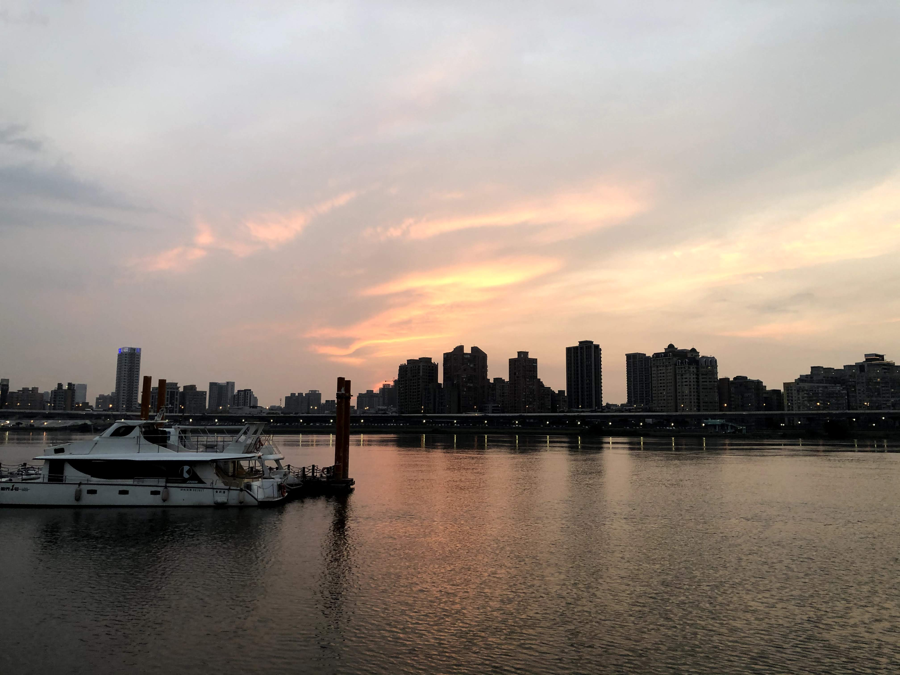

Sure, a couple of unfortunate things happened. We didn't bike to the pier fast enough to see the sunset, Bello lost her student ID (later recovered), and we took the subway in the wrong direction on the way back. That being said, we used the lost time to explore the area, biking through a busy marketplace and soaking in the gorgeous sky. We agreed that it was the perfect way to break the monotony of studying and get an excuse to go out and explore the city.

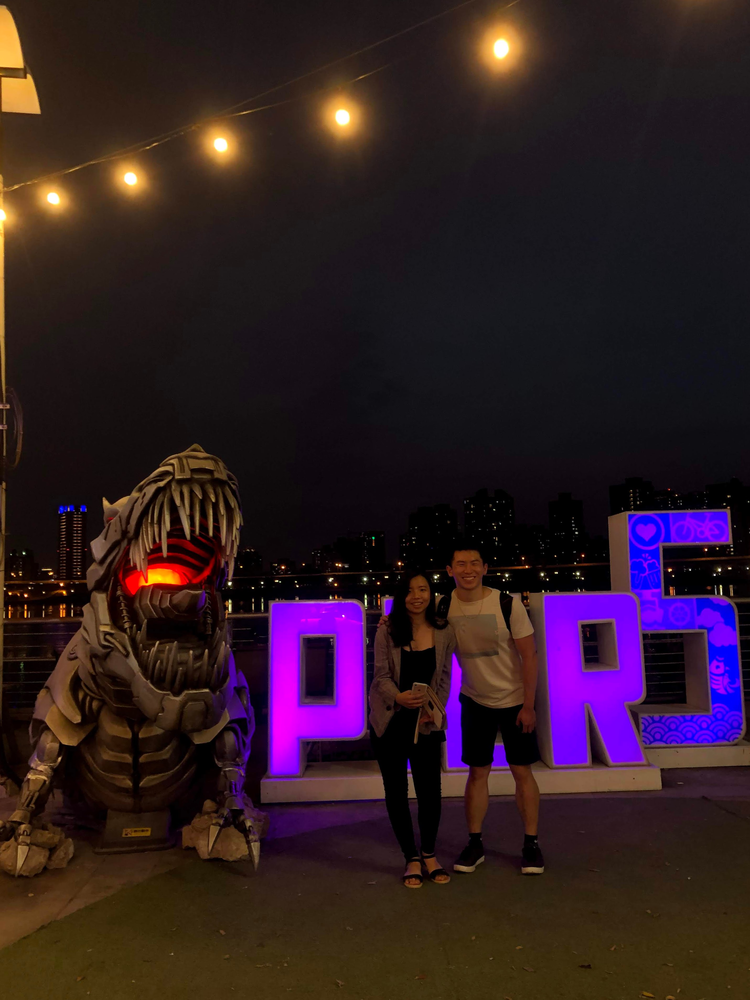

## yoshinoya with Yvonne

Pun not intended. On Tuesday, I went to Yoshinoya for the first time in my entire life with Yvonne. I'm so glad I went, because it's been on my bucket list to finally go inside one. (To be honest, the food was meh, but I'm glad that I now know that Yoshinoya is not just like any other ramen place. In fact, it's not a ramen place at all!)

Yvonne had her university interviews later that night, so we spent the majority of the exchange talking about American interviews. I helped her practice and gave her feedback, keeping it serious and streamlined. (It seems that it worked though, because she told me she got accepted to UAlbany later that night! Woo!)

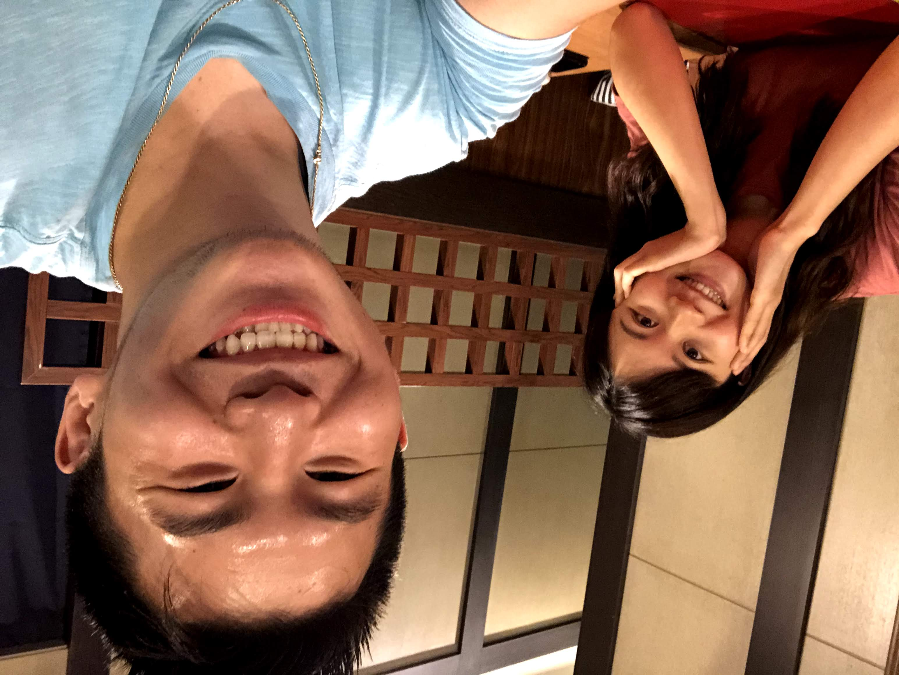

Next time, I'll change our exchange topic to a lighter topic like with my other partners.

P.S. One major disappointment happened today. I've always wanted to go to a bar in Taiwan before I left, so I asked Yvonne if she wanted to go. She was super willing, but unfortunately our schedules didn't work out such that we could meet up before I left. It sucked, but little did I know that it would work out later in the week.

## tennis (and some rare time to myself)

Wednesday was unexpectedly one of the best days I've had in a while. My original language partner had something come up, so after rescheduling the meetup for the following Wednesday, I had a surprisingly open afternoon for the first time in a while.

As a result, I used the added time to do something I love: play tennis. I met up with Eduard again, and also met some of his friends from the tennis club! We were super lucky, because despite the clouds, the rain didn't start until after we hit.

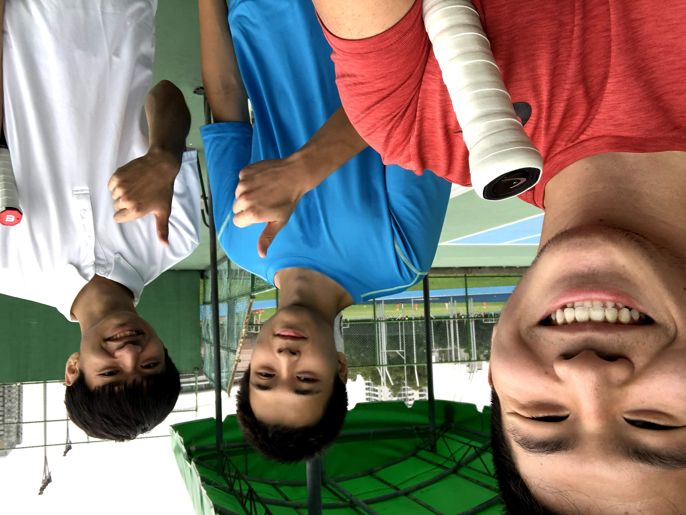

We played some doubles and then some singles afterwards. I was pooped but I was glad, because it meant I had gotten a great workout and had a great time.

Afterwards, on Eduard's suggestion, I went to a Taiwanese-style steak restaurant, picking up some bubble tea on the way, and then just chilled for an hour, reflecting again on how lucky I was to be in Taiwan.

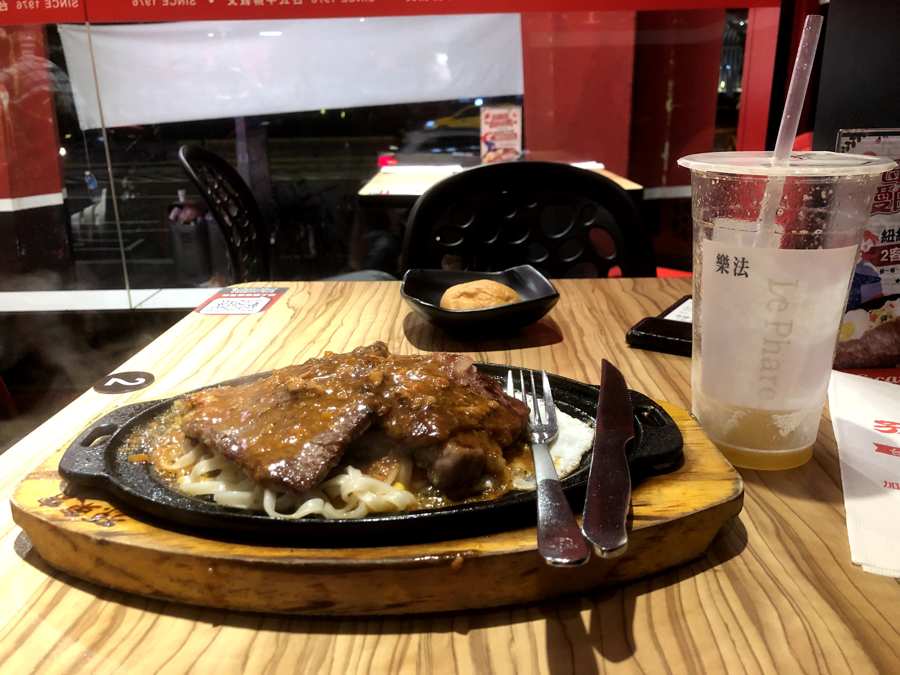

It was a relaxing and fulfilling day.

## exchanges, charades, and more

### a new partner

On Thursday, I met up with a new language partner, Doris. (not the same Doris from last week) I had talked to her before in my teaching club, and she had wanted to learn more about America and Yale, so I decided to schedule an exchange right before our NTUKK teaching club meeting.

It was today that I experimented with a new language partner grammar plan: preparing a grammar structure ahead of time. Putting the full sheet in front of me was clunky, and I realized that the simplest, most effective method going forward would be just to memorize one or two structures before the conversation. It worked out really well today, as I managed to practice the 与其。。。不如 structure today, along with a few others, without significantly breaking the flow of the conversation.

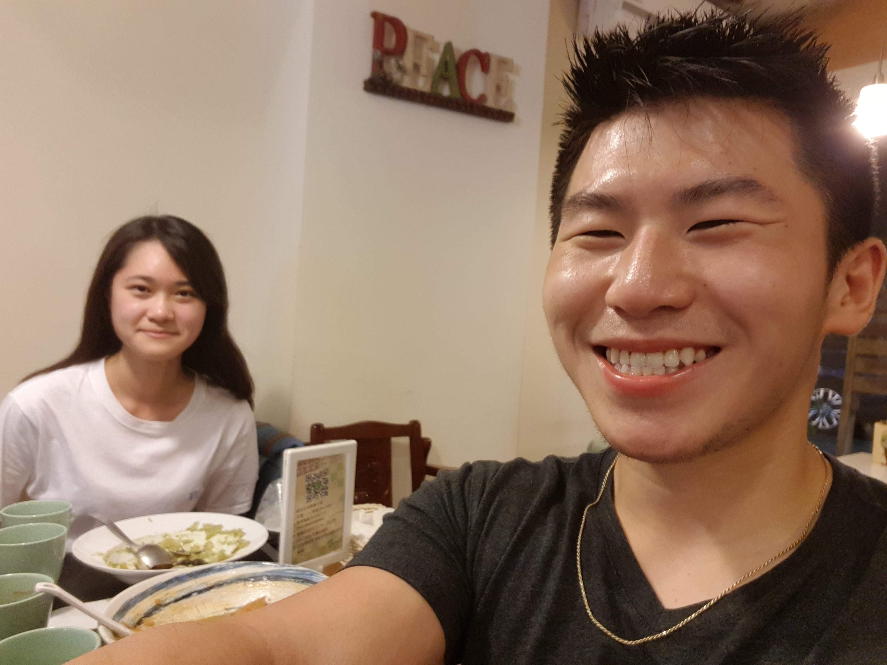

After chatting a bit about the differences between American and Taiwanese college application processes, we ran out of time and biked to the teaching club meeting.

### teaching and ... plays?

Today's lecture was mostly about some more tips for teaching students. Nothing too surprising in that respect. What **was** surprising were the fun events sprinkled throughout the meeting: charades and plays.

Charades was straightforward (everyone got my word, voting), but planning for the play was not. 

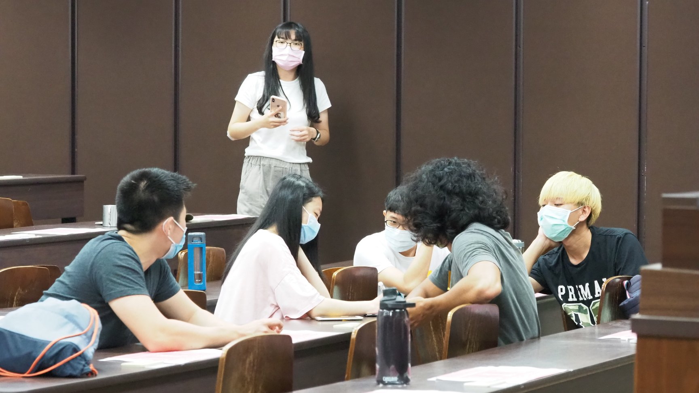

At first, I didn't understand why we had to play the Chinese version of charades, and later, create a play. Only later did I get it and understand why it was relevant. The club presidents were combining fun with acting, developing two skills very useful for teaching.

There were other reasons too. As one NTU student put it (or more accurately, gestured by making a sniffing motion along his arm), the purpose of the club was just like that of drugs. NTU students treat club events as a break from studying, whereas at Yale, extracurriculars take a much larger presence on campus. The presidents were awesome and super energetic, but their mood was in stark contrast to the rest of the room, who seemed totally lacking in energy. It was an interesting cultural insight.

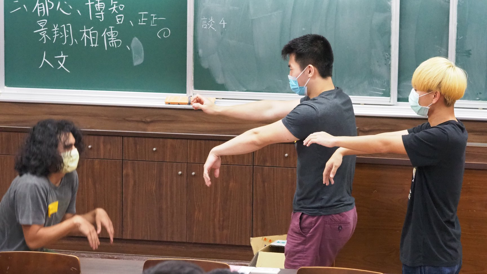

## overloading

Finally, Friday had arrived, and it was time to peak in terms of busy-ness.

### making the most of my tennis membership

I started the afternoon by spontaneously playing tennis with Patrick, one of my tennis hitting partners.

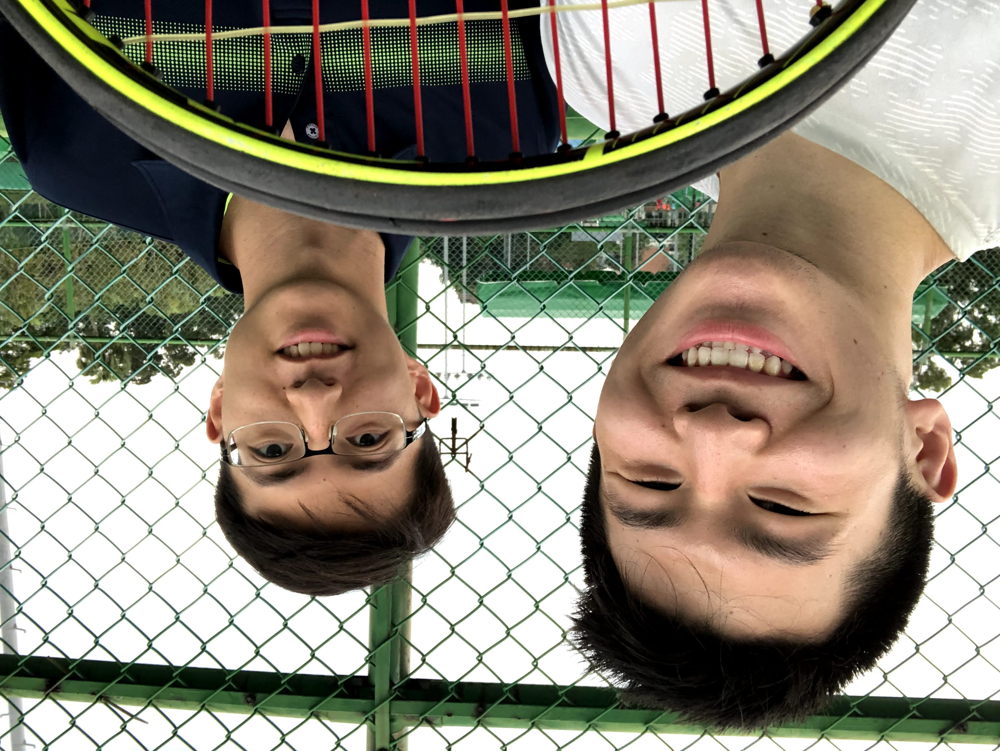

I used to hit with him more frequently earlier in the semester, when I wasn't as busy, but we've had trouble organizing times to meet lately due to conflicts in scheduling. Hitting on Friday was pretty spontaneous, as I didn't allocate time then to play tennis, but I'm glad I managed to fit in more session together.

### a night out at Shilin

Following tennis, my language partner 玉慈 and I headed to the last remaining night market on my "things to do" list: Shilin. She's naturally very, very quiet, but Friday's hangout was probably the smoothest language exchange I've had. Getting used to talking to Taiwanese people (and Asian people in general), who tend to be less open and more shy than Americans, has been great practice at breaking the ice and carrying on a conversation. 

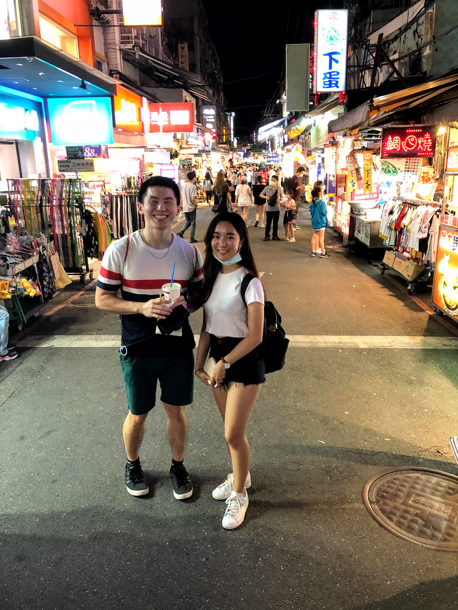

We chatted about the juicy topics: slang, relationships, openness, and flirting in Taiwan. While for the most part, socializing is pretty similar, I learned about some subtle differences. 

I've realized that while I can always talk about slang and socialization, two very interesting topics, I want to prepare future exchanges with topics from online. You can only stuff so much slang in your mind and talk about the same topic for so long, so I'm going to do some research on topics to keep things fresh and not run out of conversation starters.

That being said, sometimes sticking to what works though pays dividends. Later at night, after we got into the topic of nightlife for young people, 玉慈 brought up the popularity of bars as a place for Taiwanese college students to escape from the pressure of studying. After asking if she could show me around a local bar (unlike the foreigner-filled ones I've seen) she surprisingly agreed! We're planning to go in a couple weeks or so, and I'm hoping it works out time-wise.

### hitting the club

Following Shilin, in other very spontaneous move, I decided to experience another aspects of Taipei life before I left: clubbing. 

After hanging out in TPP with some friends, I left for the place my friends had chosen, called Chess. It was pretty similar to the clubs in America, except almost all of the songs were English ones. We were definitely in a more foreign-friendly one - or was this the norm? I'll never know. It really did confirm the popularity of American media in Taiwan, though.

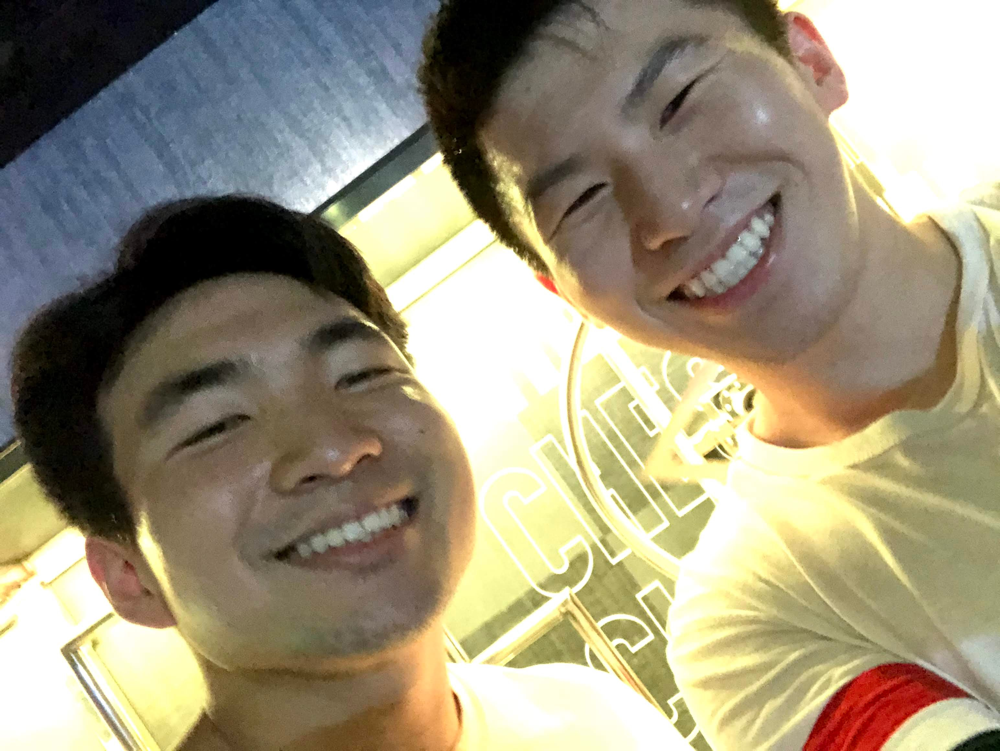

It was a fun night of dancing with friends, and like many other choices I've made so far, I have no regrets.

# breaking the waves

On Saturday, after getting a mere 4 hours of sleep, I managed to get out of bed at 7 am and head on the train to my next weekend stop: Yilan. Our specific destination? Waiao beach. Purpose? To break the waves and surf.

I was pretty tired, so getting on an unstable board for the first time in a tumultuous ocean was not the most conservative way to spend my Saturday. It definitely was the most fun one though, especially as I woke up later in the day.

It took me some time to get acclimated to surfing, even with Nina coaching us all. In fact, it took me two or so hours before I got the balance down while laying down, and another two or so hours just to figure out how to stand up. This was the product of dozens of slips in the water and facefulls of water.

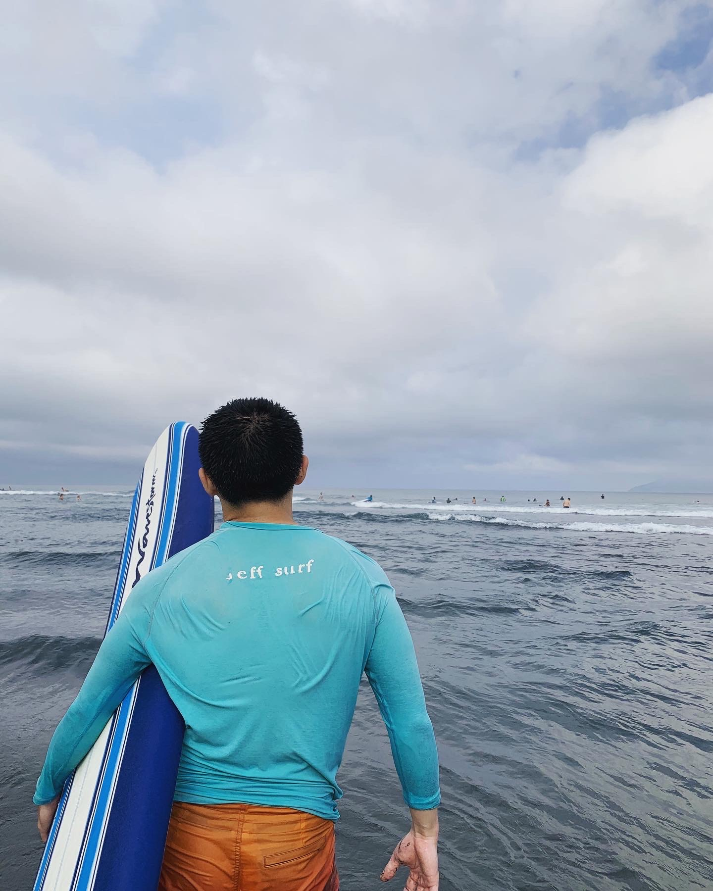

I sucked it up though and persevered, and while I can't say it paid off fully, I can say my minor successes got me way more excited about surfing than I have in the past. I still remember that there was one wave where I miraculously managed to get up and ride a wave on my knees. It wasn't my feet, sure, but I was happy to have finally made some progress. Will and Meaghan, the other two noobies in the group, also had failed multiple times, but managed to make some progress forward.

Failure or not, we ended the day on a sweet note by celebrating Will's birthday – first, with some Michelin-recommended beef noodle soup, and then with some classic Haagen-Daaz ice cream. 

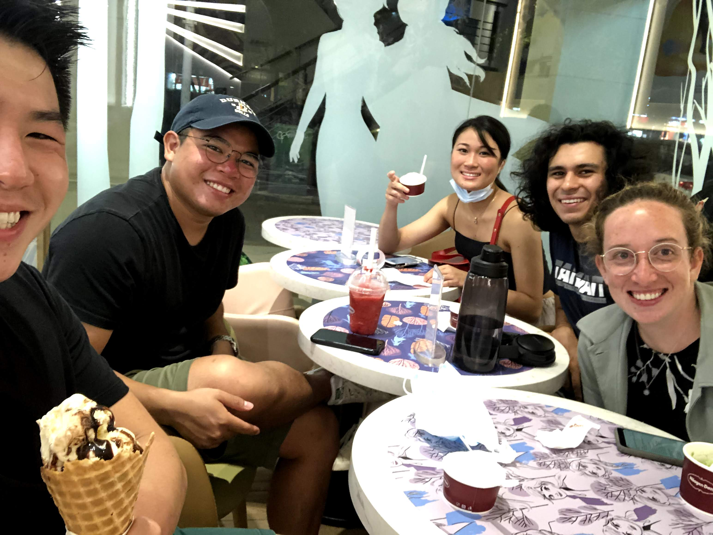

# final thoughts

I spent some time earlier today to reflect upon my original goals, like I promised in an earlier post, and I'm pleased to see that I'm living according to my values, like I had wanted. There are a couple of things I want to do still, but overall, I'm happy to finally have the study abroad experience I wanted.