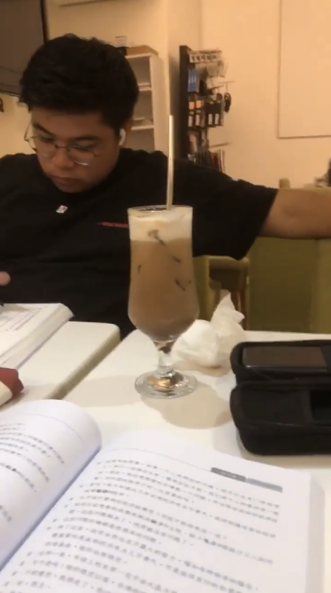
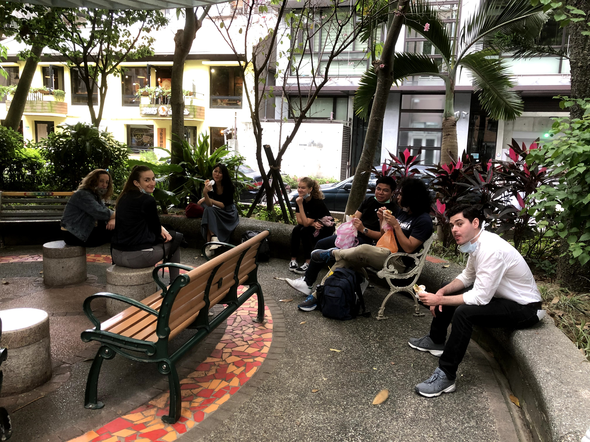
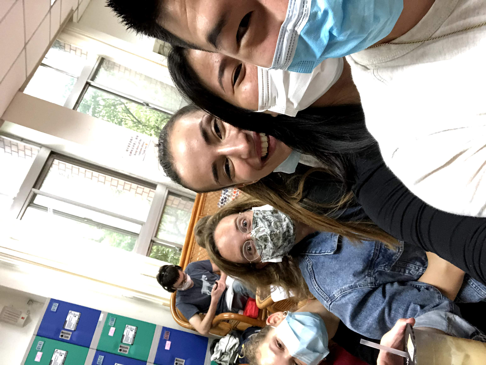
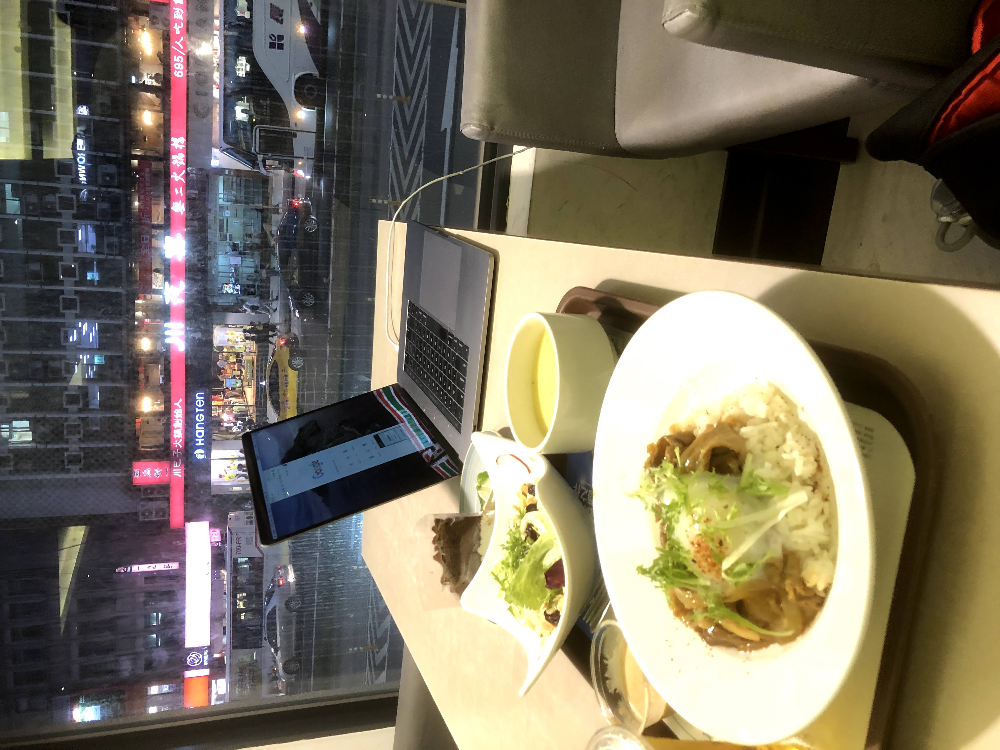
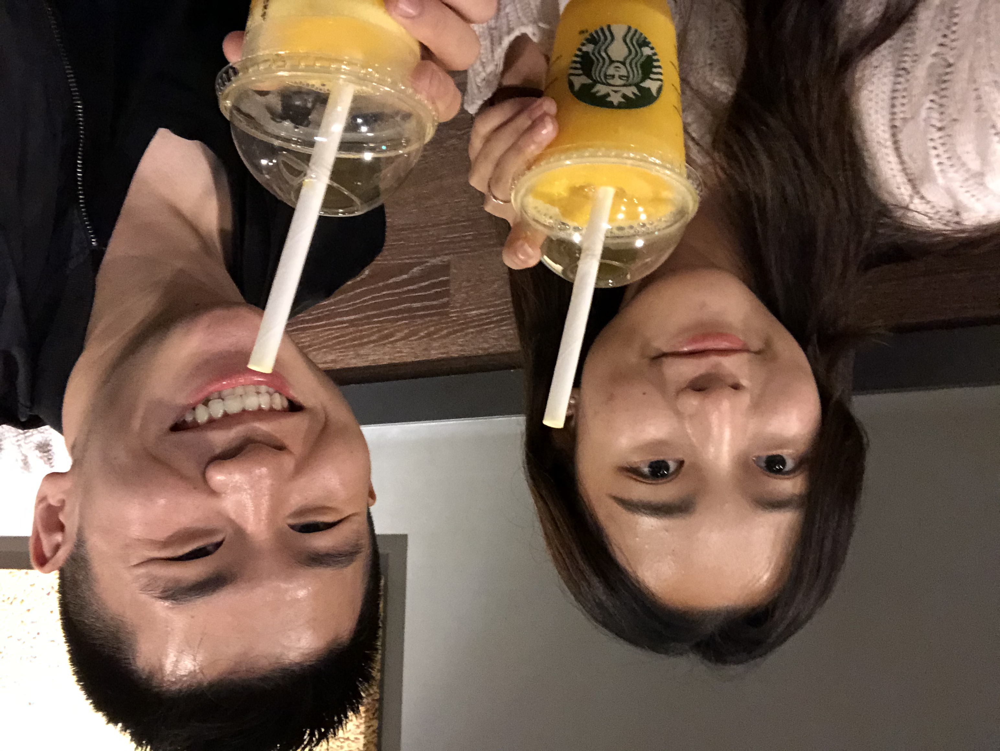
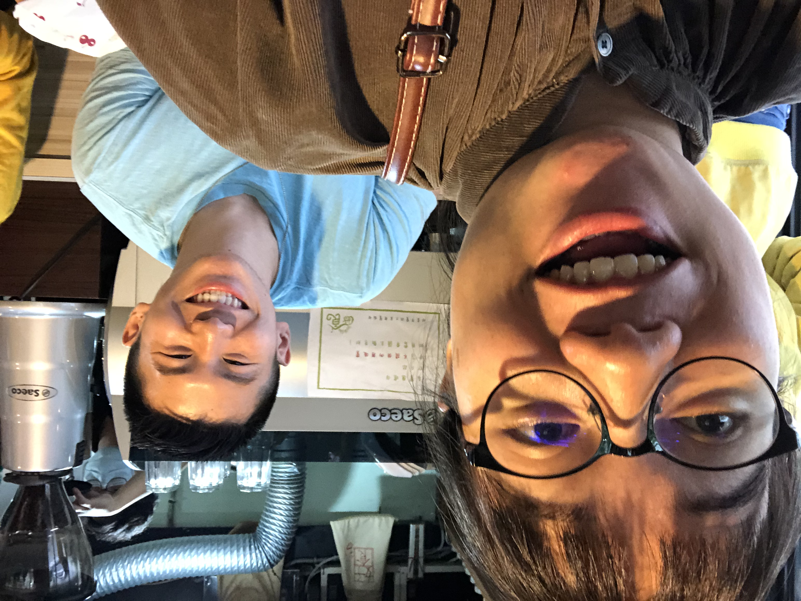
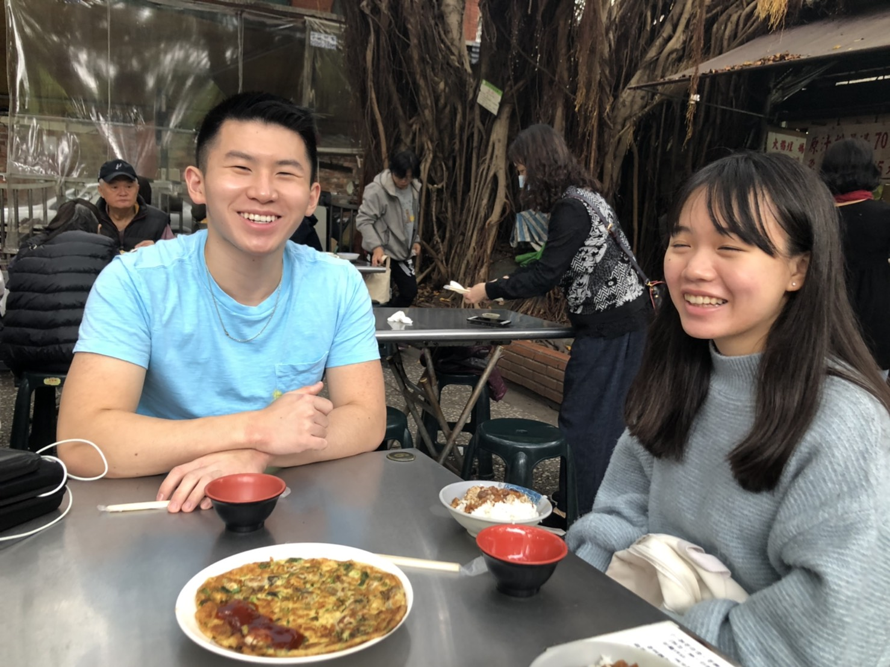

It's been a slow week, so this post is going to be relatively short. Since NTU students had midterms this week, I couldn't hang out with a lot of them, so I ended up having some huge blocks of free time in my schedule. It drove me a little crazy, but it also gave me some time to relax and get ready for next week.

# a solid international friend group

Just like in past weeks, I continued to hang out and keep in touch with the other ICLPers.

In cafes ... 

In parks ...

And at ICLP!

Of course, not every interaction was a blast. There were many days when I was just super tired and didn't have the energy to crack jokes or have a mind-blowing time. Going to a trivia night on Friday night was the perfect example of this. I felt a little bit out of place since I couldn't help at all with the trivia, didn't want to go clubbing afterwards, and just didn't have the right mindset. As a result, I walked home around midnight, knowing full well that I would have to get up the next day at 6:00 am for a language exchange. It was kind of a downer. That being said, I felt pretty at peace, knowing I'd have plenty of opportunities next week to make some great memories and have some great experiences.

Overall, things are pretty good in Taiwan, and I'm glad to have a solidified international friend group. We're booking some trips for the future that I'm really excited to blog about, so stay tuned!

# staying engaged across the sea

Extracurricular activities took on an important role this week. I continued to keep in touch with OnTrack, and I put in four or five hours on a Slack task manager I've been working on for HLAB.

The main time extracurricular crunch this week, however, was assuming my first week as the Co-President of DPops. I spent Tuesday afternoon planning my first meeting (also our board turnover meeting) with my co-president Audrey.

Our work paid off, because our turnover meeting went better than expected.

We were planning for it to take less than 3 hours, but we actually managed to finish in an hour and a half. We were pretty efficient, which was largely due to a good planning session.

There were a few hitches, of course. It wasn't completely smooth, and I stuttered a few times while leading the meeting. I'm still not used to leading from the front for such a large group, and it was a little unnatural to take the lead. That being said, I'll acclimate to the role soon enough.

# getting a taste of next week

Some of my language partners were free near the end of the week, so I actually got a change to get a taste of next week and have some back-to-back language exchanges.

On Friday evening, I went to dinner and tea with one of my newest language partners, 曾玉慈!

Since the dinner place we went to closed early, we decided to go to Starbucks afterward.

While she was a little shy at first, we managed to warm up to each other a little bit more at the end. Humor goes a long way, and I think talking about more light-hearted topics like Taiwanese slang (she laughed when I used the slang I learned from Sandy earlier in the week) in addition to the more serious ones (my background, my interests, yada yada) helped open up the conversation. While 曾玉慈 was a little bit more on the shy end, I was able to learn some new slang that I use to impress my other Taiwanese friends, hehe!

On Saturday morning, after a meh trivia night, I was ready to rebound and have a good time with my language partners.

I grabbed breakfast with Sandy at an American restaurant, where I learned some more slang (buh buh = bye bye) and helped Sandy learn some more cool English words and grammar. Waking up early sucks (this was at 7:30 am), but it was the only regular time I could fit in a meeting with her during the week, and I really want to continue exchanging.

Following that came an afternoon of exploring a less-travelled historical district of Taipei, Twatutia, with my language partner 宇涵. Another ICLPer named Li also tagged along!

The best part of the day, though, came at the end. On a completely spontaneous note, we stopped in a tea store (largely because Li loved tea) to browse, and were treated to an authentic tea ceremony!

The laoban (shop owner) smiled a lot and talked to us about everything from the origins and significance of the teas to his family and how proud he was of his kids. A lot of the discussion went over my head since it was all in Mandarin, but Li seemed to be having the time of her life, and surprisingly, I was enjoying it too. I'm not even that interested in tea, but I came away afterwards with a greater appreciation of them. After buying some teas, I left for home, exhausted from a long day of traveling.

# in a clear headspace

I did a few other things on Saturday following my language exchanges, including playing some tennis with my friend Kevin (I was **ripping** the ball which felt awesome) and grabbing dinner with Will, Meg, and Nancy. I haven't been that tired in a long time, but I felt like I really did make the most of my week.

Next week is only going to be more busy, but I think I've gotten a good sense of what to expect from this week. Like I promised before, I'm gonna prepare my grammar structures and get the most I can get out them. With that, then, let's dive in.