I'm going to break this post into two sections: part one being my picture-filled weekly recap, and part two being my deep reflection on smile routine.

# weekly recap

## a trip off the beaten path: Taiwanese Costco's

When you think of touristy spots to visit in Taipei, Costco is definitely not one on top of most people's lists. However, it was raining on Monday, so any normal outdoorsy stuff was off the list, and Bello had gotten me curious about Costco in Taiwan.

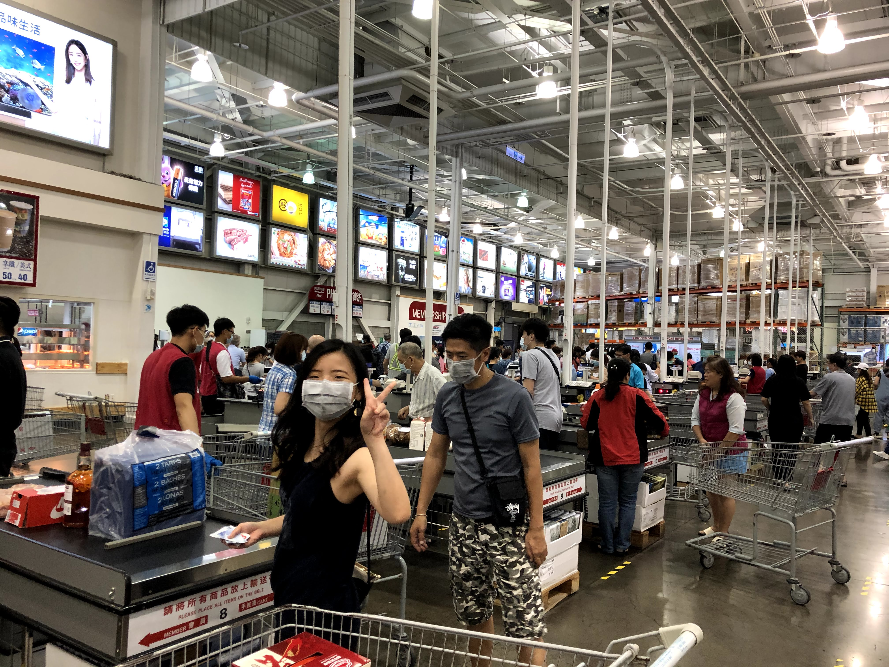

It turned out to be a great language exchange, propelled by my positive energy from my smile routine (more on that at the end of this post). We talked about what Yale was like and discussed more Taiwanese and English slang.

There was a lot of gift-related stuff that went on. Not only did I buy gifts for my ICLP teachers, but Bello surprisingly gifted me some Taiwanese snacks and ... a re-usable utensils set!

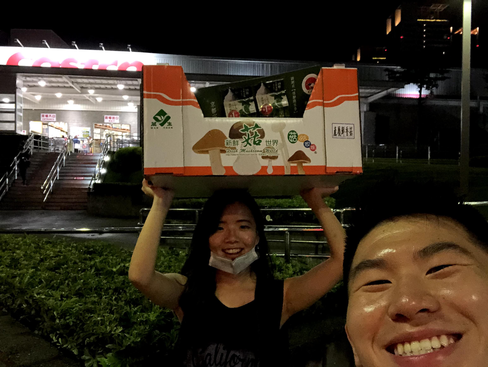

It feels like there's always more I can learn about Taiwanese culture. Bello explained to me that Taiwanese people are incredibly passionate about protecting the environment, so much so, that they'll even bring around their own personal utensils set to restaurants so that they don't have to use disposable ones. I had never heard of this habit before and was awed at the Taiwanese people's dedication. It's one thing to support protecting the environment in principle and another thing to support it through one's actions. Thanks to Bello, I'm going to try to become part of the latter, rather than the former.

## baking mangos

I loved mangos, and wanted to get out of just eating dinners for language exchanges, so Yvonne had a great idea: why not combine the two, and bake?

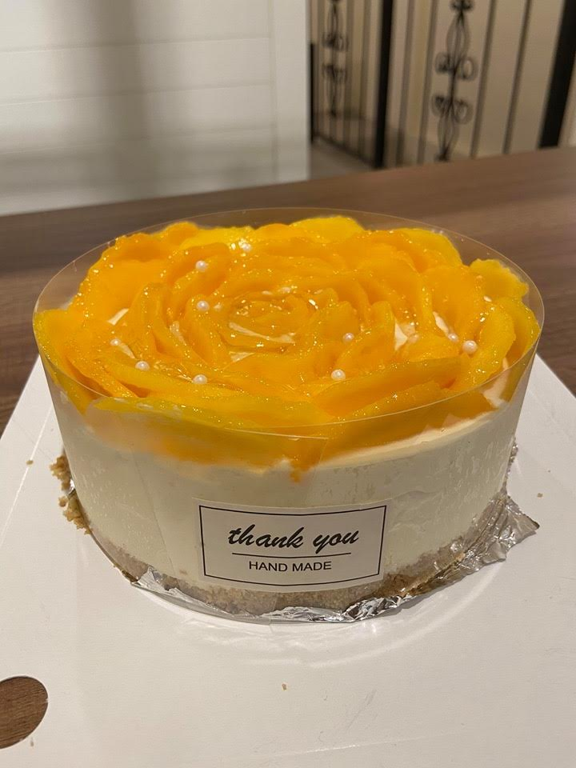

So on Tuesday, Yvonne and I baked a mango cake. It was yummy. 

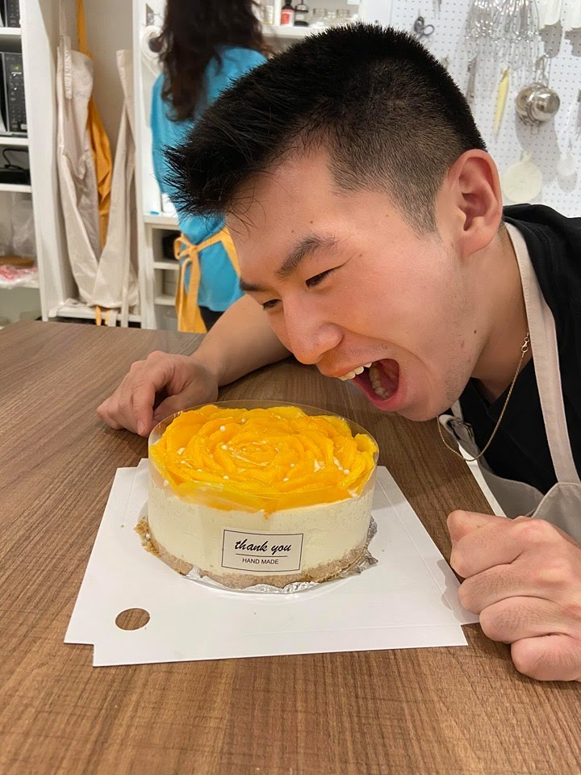

We didn't talk about much, focusing on cooking the cake, so it was kind of a low-key end to my language exchanges with Yvonne. Still, at least it ended on a sweet note!

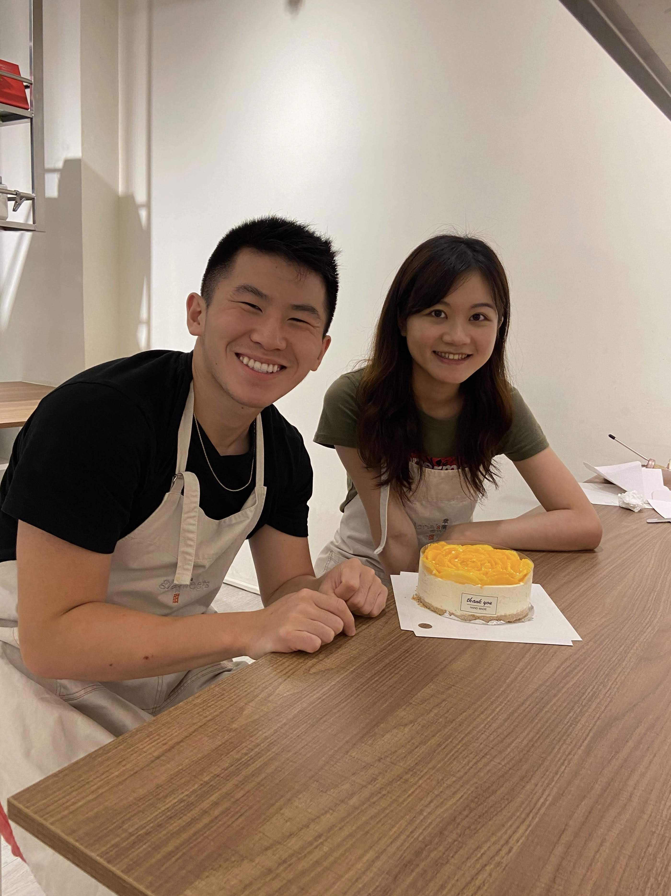

## rain and chill

Wednesday was another full day of rain, so I decided to take it slow and use it to relax. In addition to getting a lot of work done, I headed to a burger place which I had been meaning to try out.

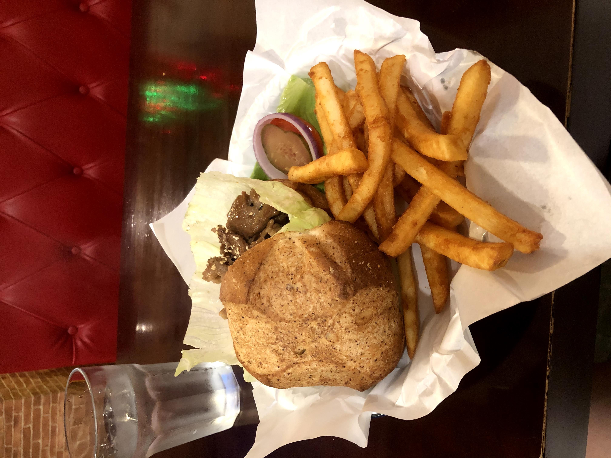

At night, I walked to TPP (Taipei Paradise, where most ICLPers were staying) to plan next week's trip with Will and Meaghan.

## new beginnings and inevitable endings

### an unexpected encounter

As I was walking back from my workout on Thursday, I ran into someone wearing jeans, a white shirt, and a blue leather jacket. I didn't think much of it, until after, when I realized that not thinking much of it was important.

Why? It's because that type of clothing was the very type I was aiming to wear after coming back to Yale, and it was just average in my point of view. That was not the impression I was going for, so I realized I needed to up my clothing game even further.

Luckily, I had found another Instagrammer whose fashion I vibed with a lot more, called Julian Piket, compared to the one whose style matched the random dude's clothing, Nico He. I'll plan to follow Julian more, and use the advice I've gotten from my friends to get a wardrobe I'm more satisfied with. Clothing really does make a huge first impression.

### first pangs of sadness

Thursday was also the last day I could participate in my teaching club meetings, so I headed to Freshman Classroom Building room 505 to say my goodbyes to Doris (last week's language partner, who couldn't meet for dinner that day) and the presidents of the NTUKK club.

")

It was as I was walking home through the rain that I felt my first pangs of sadness. I was only going to be in Taiwan for another week, and I was going to be leaving Taipei soon. I've been trying to not acknowledge it and live it to the end, but that soggy trip back was the first time that I realized my time was limited.

## celebrations

Friday was marked by a number of celebrations. For one, it was the last day of ICLP, and after I gave my teachers the gifts I had bought from Costco, we celebrated our hard work with a wholesome graduation ceremony at noon. 

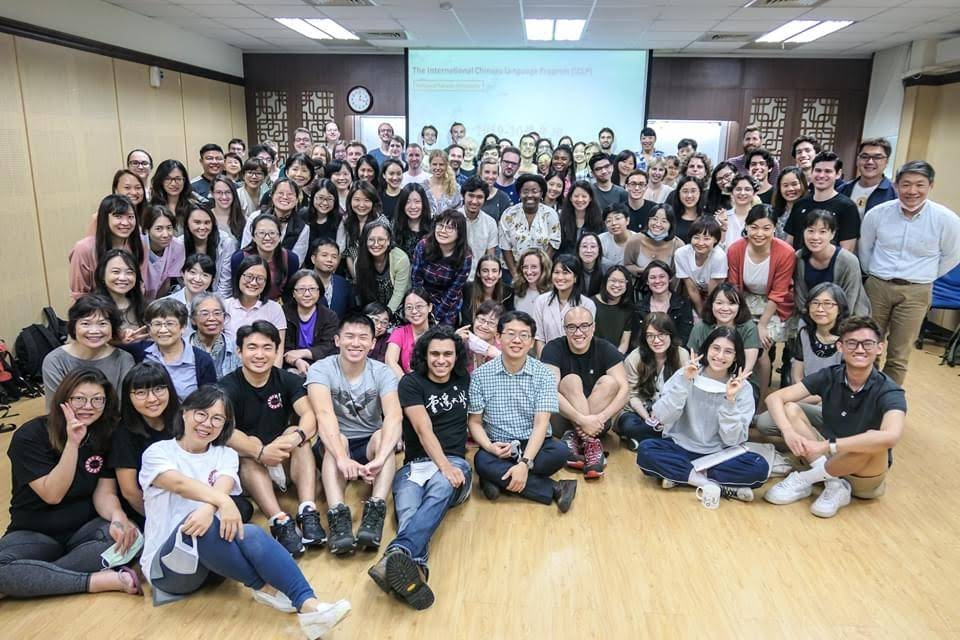

It was also Meaghan's birthday, so Nina, Will, her and I headed to an Italian restaurant of her choosing to celebrate.

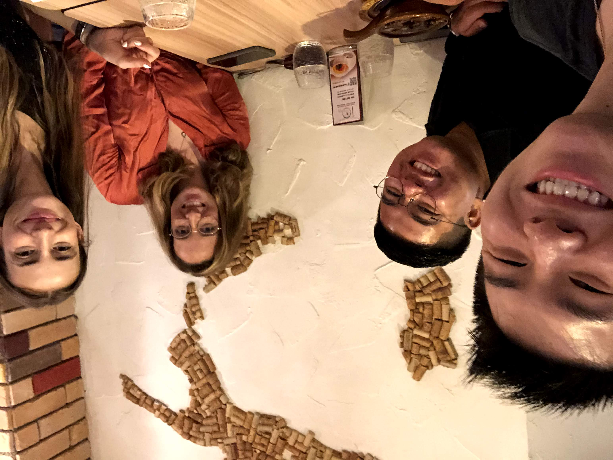

Finally, it was my last language exchange with 玉慈, and as we had planned, we headed to a bar to hangout with some new Taiwanese friends.

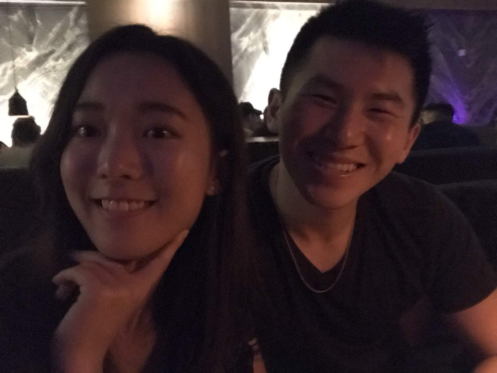

After the bar, I headed out with Meg and the others to a club and danced the night away.

## opening up

Saturday was especially notable. The day, not so much: I just grabbed lunch with Will at a new sushi restaurant and ran a bunch of errands. No, the night, after going to a bar with Meg, Zach, Will, and Nina, is where things began to take an interesting turn. 

After relooking at last week's post, I want to make a modification to what I said about the dark stuff we all go through. When talking about it, it's something that we're all willing to talk about, but it requires the right environment. Maybe it was because it was late, we were just off the end of ICLP and a day of celebrations, and we had bonded, but that night, **we all opened up about our failures, weaknesses, and tough periods in our lives.** I talked about things I'd only kept to myself before. It was the first time I'd opened up recently to friends, and it was cleansing, and helped me realize that good friends were people that really could be trusted.

## errands, tennis, and a special dinner

I had originally planned to just run errands all day, but after discovering that the weather was sunny for the first time all week, I decided to organize a spontaneous tennis meetup with all three of my hitting partners. We totaled 6 people after some of them brought their friends, so I didn't get a chance to hit with Patrick and his hitting partner, but I did get to play some fun doubles with Kevin and Eduard.

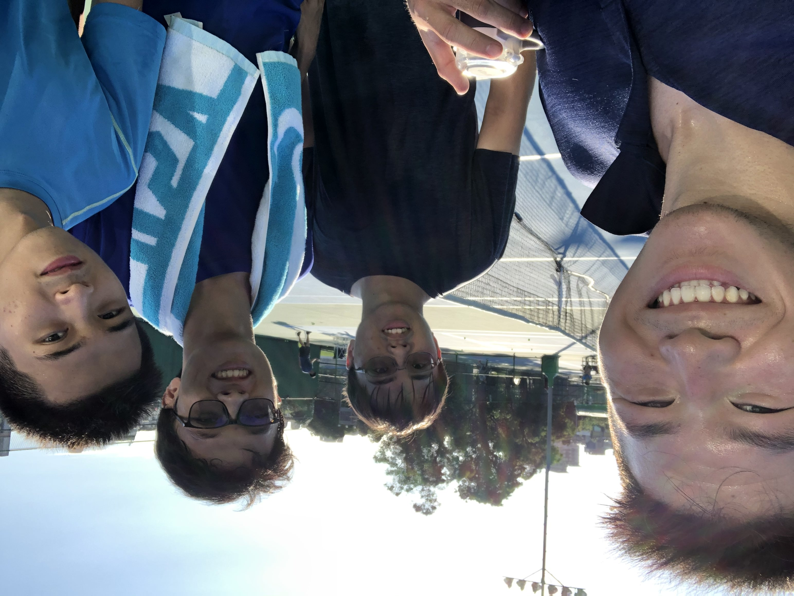

In the evening, I then got a special dinner with some familiar faces from the NTU Traveler club, the group who had organized last weekend's outing to Hualien. The Vietnamese place we went to was pretty good, but it was the shaved ice afterwards that really stole the night.

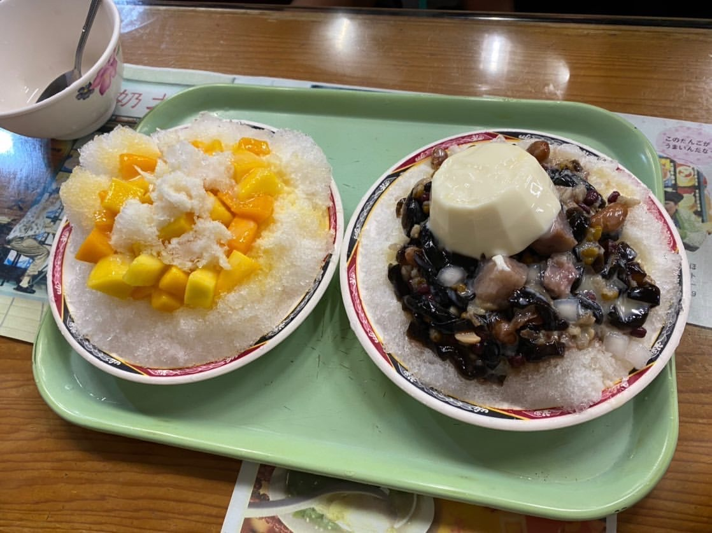

It was a good night with good food and good company.

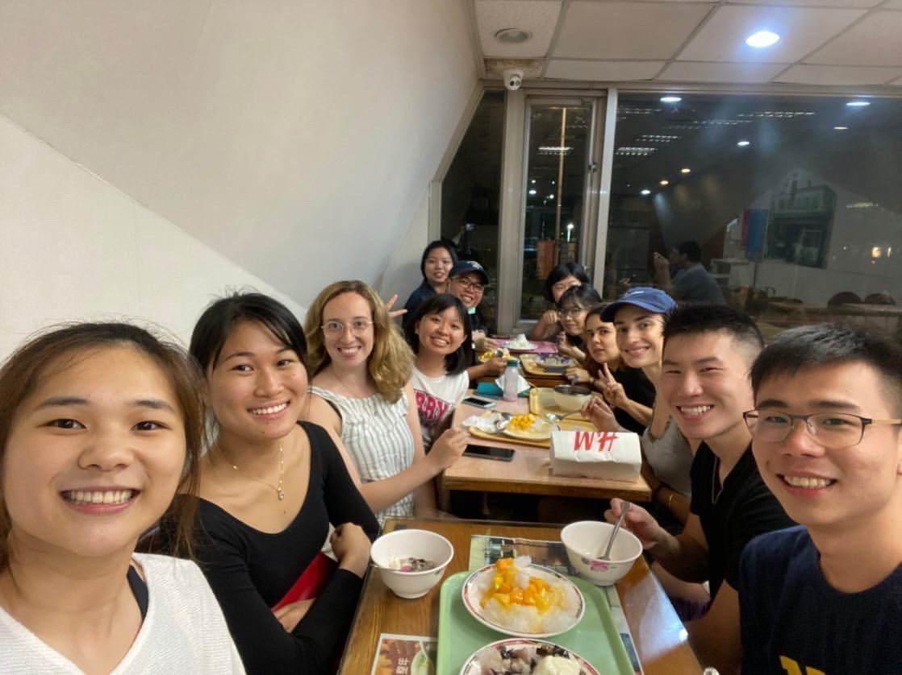

That wraps up my weekly recap, but I can't finish this blog post without talking about one of the best habits to complement everything else I've done in my life so far.

# five days of smile routine

It's been a week of doing smile routine, and I can confidently say that developing this new habit has been one of the best decisions I have ever made.

It wasn't so clear-cut in the beginning. Like with many things, the start is the toughest. I remembered walking out four or five times with the intention of doing my single daily smile routine walkup, only to wuss up multiple times. It was only in the evening, as I walked home from my workout on Monday that I willed myself to approach someone at a bus stop. As my brain continued spamming my mind with "oh my god, I can't believe I'm doing this" signals, I went through my routine, just as I had prepared, and complimented her.

The thing is, I didn't get the reaction I was going for. Rather than smile and say thank you, she just said "oh" and gave me a confused look. I ejected from the situation like I had prepared and felt really awkward later, but after the initial shock wore off I was flooded with relief for having finished my daily requirement. I was happy to have stayed true to myself and not completely wussed out, and relieved to discover the aftermath of approaching strangers wasn't as bad as I thought. After all, she didn't call the police or anything, even though my brain irrationally thought she was going to. 

The following days were better. I complimented one girl on her New York Yankees shirt (coming from New York) and made her laugh. I walked up to another on a bench and made her giggle after I told her hair was nice.

Other ones weren't as smooth. One was really confused and didn't really get it, similar to the one on Monday. Friday was especially memorable, when after the girl smiled and said thanks for my compliment, her face morphed into horror as I was turning around. She stopped me mid-turn, as I looked over and discovered I had almost pummeled someone over with my oversized backpack. *Oops.* 

## optimization and effects

There are some tricks I've picked up that help. Visualization is one, and acting quickly before my overthinking brain can catch up is another. Treating the entire thing like a game, where I'm leveling up my skills, is probably the best paradigm shift, as it's allowed me to not internalize negative experiences so much. 

At the end of the day, though, the best thing I've gotten from these encounters is being glad to have hopefully made each of their days a little bit brighter, and to realize that this whole approach thing isn't as bad as it seems. 

Already, the effect of smile routine has been noticeable in other parts of my life. In addition to always being in a more energetic mood after my routines, I remember one specific example on Thursday. During my workout, I was looking for my normal spotter on the gym staff, but he was busy. I was going to just go without one again, but then I decided, why not, I'm gonna ask a random dude to spot me. So I walked up to someone and asked him to help, and although he wasn't the best spotter, I was surprised by myself for approaching someone on a whim like this, as it was something I wouldn't have done before.

It was at this point that I realized, smile routine gave me something to look forward to that was out of the ordinary each day. It really had the potential to change my life, and was something I had to continue into Yale.

## further room for self-improvement

I've only approached people by themselves so far, but in the future I want to learn how to work a room and walk up to groups. This is a goal for the future, specifically for Yale, and I'm certain it'll have positive effects on my social confidence in informal and formal situations. 

That's for the far future, but in the meantime, I'm ready to make the most of my summer at home, reading my two or three self-improvement books and planning for my revamped wardrobe. It might soon be the end of my time in Taipei, but it's far from the end of this exciting period in my life.