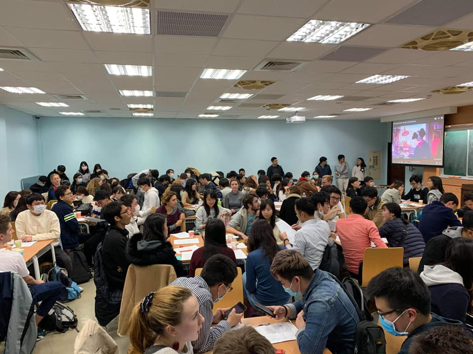
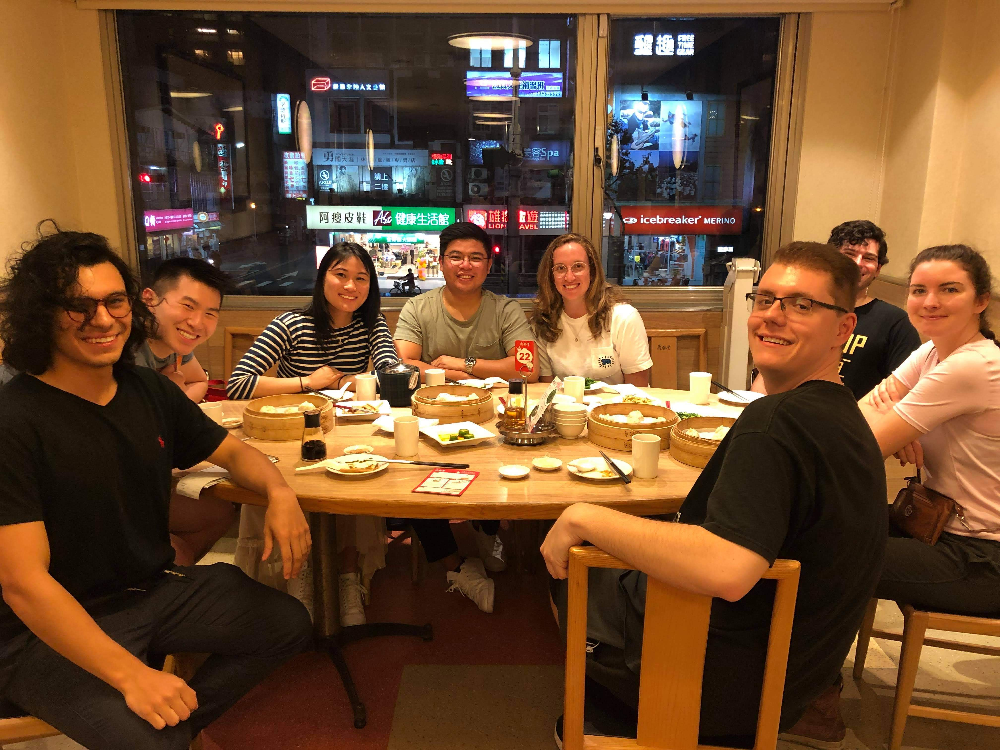

I knew that joining clubs would be a huge priority for me at NTU, so that I would be able to interact with more NTU students, but I wasn't prepared for the question it would force me to consider: how would I weigh my time and my friendships with Taiwanese locals versus foreign internationals?

I never really had to consider this question at ACC. All of the Minzu University students had left campus for the Chinese New Year and winter break and wouldn't return for a couple of months. There was no student life so I was forced to only interact with the other international students in the program at ACC.

My situation in Taiwan wasn't so limited. NTU students had no such long holiday preventing them from being on campus nearly the entire semester, so I had to make an important decision: how would I divide my time between forging relationships between people in the community and people from all over the world?

Maybe it's just a lash back from my time in Beijing, but I've decided to prioritize the former. Making inroads into the community at NTU is an important step for me, not only in opening up my social options for making new friends, but also in gaining a powerful inroad for cultural understanding and awareness. 

Joining clubs to attend each day, while an immensely difficult task in terms of time management, I believe has given me a space to really get a more authentic understanding of life in Taiwan. Furthermore, I believe that it has massively opened up the opportunities available to me, not only in putting NTU events into my schedule, but also in finding a group of people that I can hang out with outside of ICLP.

It's also reassuring that my social life isn't dependent on the pool of people in my language program. While ICLP has significantly more students compared to ACC (100+ compared to 30 or so), if there's anything I've learned while traveling, it's that the more people you meet, the better chance you have to make lifelong connections! Interacting with NTU students opens up an entirely new pool of people that I can potentially become friends with.

All of this isn't to say that I'm planning to shun my relationships with other international students in my program. Far from it – I think participating in clubs will actually give me a lot of opportunities to further connect with them. The main thing is that this is no longer the only friend group that I'm restricted to.

# putting in the effort

Interacting with clubs for the first time, like everything else during my study abroad program, has posed some added challenges. Engaging with Taiwanese students as an international with only an intermediate grasp of the knowledge is difficult. A lot of the time, I can't catch what they say to each other, or I have to drastically simplify my speech in order to convey what I want to say. It's difficult to build deep relationships when all you can say leans toward the superficial.

Another thing that's been on my mind about relationships with Taiwanese people is the transience. Despite what people say about long-distance friendships, they're **hard** to maintain. I have a bunch of friends in Japan from HLAB, for example, and while I was able to reconnect with a lot of them when I went back to Tokyo, it's generally difficult to form anything beyond the superficial when you're not in person. As a result, I know that I'll only be in Taiwan for two and a half months, and I can't help but think: if I'm not going to see these new friends for months at a time, how can I make these friendships as strong as possible?

Speaking in a non-mother tongue all the time is tiring, and it's all too easy to just give up, either by just shutting myself off from people or interacting solely with other international students. After all, we international students come from similar non-Taiwanese backgrounds, have similar imperfect grasps of the language, and have similar motives for studying Mandarin abroad. At the same time, I know that while I can meet travelers from all over the world anytime, I can only meet Taiwanese locals while in Taiwan.

Balancing these two types of friendships is going to be, like all the other things I've been juggling so far, a challenge. Learning how to stay local while as an international is going to take added effort, but I know that like everything else, it'll pay off in the end.