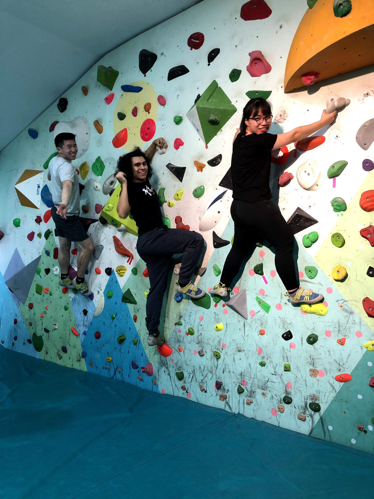
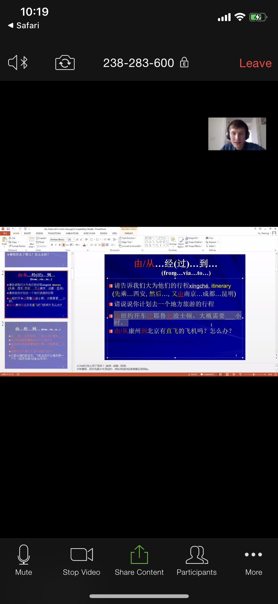

Monday was the first day of in-person classes this semester, and I was surprised to discover that the switch wasn't that tumultuous. The content turned out to be exactly the same, and besides an inability to zone out anymore behind a computer screen, I was able to adjust almost instantly. Small changes, like using the short 10-minute breaks between classes to review material, have helped a lot.

While many things were largely the same, some things had changed. For one, it was nice to eat lunch with people rather than alone in my apartment.

For the three days of classes this week, I would ask other students to grab lunch together, so that none of us had to eat alone. One day, we even had the entire crew come together!

It's a small luxury, but it sure is a huge improvement over the previous week.

# Happy (deadly?) holidays

This week, we only had three days of classes, since Taiwan was celebrating the Tomb Sweeping holiday from Thursday to Sunday. As a result, with this on top of a lack of clubs, I had a **ton** of free time on my hands.

Unlike at ACC, though, where I felt disconnected from the city and from the other students, at ICLP I wanted to make sure to have as much fun and cultural exploration as possible. I'm happy to say I was able to make good on that promise.

## Staying connected with NTU

Even though clubs were cancelled, and their status of being resumed was up in the air, I still wanted to be able to keep in touch with the local students. It was tough to organize, but I hung out with a couple people I had met before.

I really wanted to hang out again with Sandy, who has been one of the nicest and most outgoing students I've met so far. Luckily enough, on Monday, she was kind enough to invite us to go rock climbing! Both of her foreigner friends had bailed on her last minute, but Zach and I were free, so we went together.

To say it was exhausting would be an understatement. My hands were raw and cuffed from holding onto the rocks, and I was sweating all over. My respect for rock climbing has quadrupled, and I now understand why it is an official Olympic sport. It is **HARD.** I wasn't even able to fully get across the children's wall – and trust me, I tried. Multiple times. I couldn't imagine doing a more difficult course.

That being said, it was a fun challenge, and I'm now really interested in picking it up as a hobby. Not only is it a great way to get out of the house, but its also amazing exercise for my grip strength, which will help me with lifting heavier weights in the gym in the future. Huge props to Sandy for helping organize this! She's been so awesome that I gifted her a small bag of Trader Joes foods from America. She has helped introduce us to so many cool things about Taiwan – had COVID-19 not happened, she was even going to invite us to her house to celebrate the holiday! I'm really glad to have met her and I can't wait to do more stuff over the semester.

In addition to rock climbing, I was also able to play tennis with some of the people I had met before. In addition to hitting with William, another ICLPer, I was able to find two new hitting partners, Eduard and Patrick, closer to my skill level! Hitting is always fun, no matter where you're at, and Taiwan was no exception. Hitting with locals has also had other unexpected benefits: according to Eduard and contrary to what I had learned from the sports center, NTU students were allowed to hit on the red clay tennis courts, as long as we hit during the day. While they were closed during the break, they'll be open again next week. You sure can bet to see me on them – I'm so, so excited to try them out! It's been a dream to play on red clay my entire life, and as soon as it stops raining, I'm gonna go on them.

While the situation is not ideal, and I would love to hang out with more people, I feel like I'm doing the best with what I have at the moment. Hopefully clubs resume in the future so that I can meet even more locals!

## In touch with home

While in Taiwan, I've been following the news updates for other parts of the world. The situation in the US and Europe isn't showing any signs of getting better, so a lot of people have been stuck at home trying to find things to do. Without planning it, I spent some time this week keeping in touch with some of my friends around the world as they try to make the most of what they have. Even though I had undergone a quarantine myself, hearing from them in real time has made me even more grateful for everything I've been able to do in Taiwan.

While I'm confident Taiwan's situation will remain okay for the next few months, I'm afraid I can't say the same for back home and for other countries in the world.

In each call, I could feel the lack of energy and dismal moods from being stuck at home and experiencing the full brunt of the epidemic - it reminded me of my time back at home and of being utterly powerless to do anything, even something as simple as going outside.

That being said, this pandemic won't last forever, and I'm confident that we'll all be able to get through it. I'm lucky that my family is safe at home, and I'm sure we'll be able to come out this stronger than before.

## An international community

In addition to hanging out with local friends and with people back home, I was able to organize some trips together and work towards the goal I had set for myself during the beginning of my trip to Taiwan: cultural exploration and visiting the different parts of the island.

### Ningxia night market

This trip was kind of spontaneous. Since all ICLP events were cancelled, it was hard for the students to meet and interact. However, little events like lunches with classmates were able to help us introduce new people to each other. For example, after getting lunch with some new ICLPers that were classmates of Nina's one day, we got dinner at a Japanese restaurant the following night. Unfortunately, the izakaya that we went too was horribly overpriced, and had a minimum cover charge of 800 NT$ ($26 USD) that we didn't see as part of the holiday season.

The sample sizes were also tiny, so I was starving afterwards. If there was one good thing that came from the restaurant, it was that we decided to go to the closest night market in Ningxia afterwards to fill our empty bellies. It was too far to walk, plus I had set up YouBike earlier that week, so we all decided to just bike the distance. (p.s. biking is so much fun in Taipei!!)

Not only were there a ton of stands, but there was a ton of variety. I got papaya milk, lamb skewers, barbecued chicken, and peanut ice cream rolls. It totally made up for the underwhelming dinner.

### Beitou hot springs

This trip was on the list that I had compiled prior to heading to Taiwan. After checking for interest with a few others, I organized a trip on Friday to head to the Beitou region in northern Taipei, famous for its hotsprings. After some trouble finding a reasonably spacious and well-priced spot, we eventually settled on the Beitou Hot Springs Resort, which turned out to be absolutely amazing.

It was only around $20 USD without a time limit, and the place itself was incredibly clean and modern. Maybe it was the holidays, maybe it was due to the virus, but there was almost no one there.

After soaking in the springs, I relaxed like I haven't in a long while. It's hard to describe, but there's a rare state of relaxation where it feels like the tension in your mind just kind of turns off, but you remain awake. I haven't achieved that state since I meditated back in high school, but after going into the hot springs, alternating between burning hot water and ice cold water, and then lukewarm water, I felt my muscles relax to the point where I entered this subconscious state, almost like daydreaming. It was awesome. Plus, as a bonus, my friends told me that my skin was glowing afterwards, a compliment which I've never gotten before. Hah!

Afterwards, we were starving and were looking for food, when Nina told us that her Chinese host dad wanted to treat us all to dinner.

He brought us to a famous beef noodle soup place and treated us to a mini feast. The soup (especially the broth) was delicious, and it was nice way to end the night with some unexpected cultural exploration. Locals always know best!

### Hualien and Taroko Gorge

You can't plan trips all the time, so fortunately, my friend Meaghan stepped in one day and bought a four person private tour via TripAdvisor to two other places on my list: Hualien and Taroko Gorge! It was completely organized by the tour guide, a local named Chico, so all we had to do was sit back and enjoy the ride.

Even though life hasn't been optimal with the coronavirus and the club cancellations, I feel like it's been a week that I've managed to surprisingly pack full of activities. It's something that I'm going to continue to try to do while living according to my values and goals. After all, when life gives you lemons, make the most out of them.