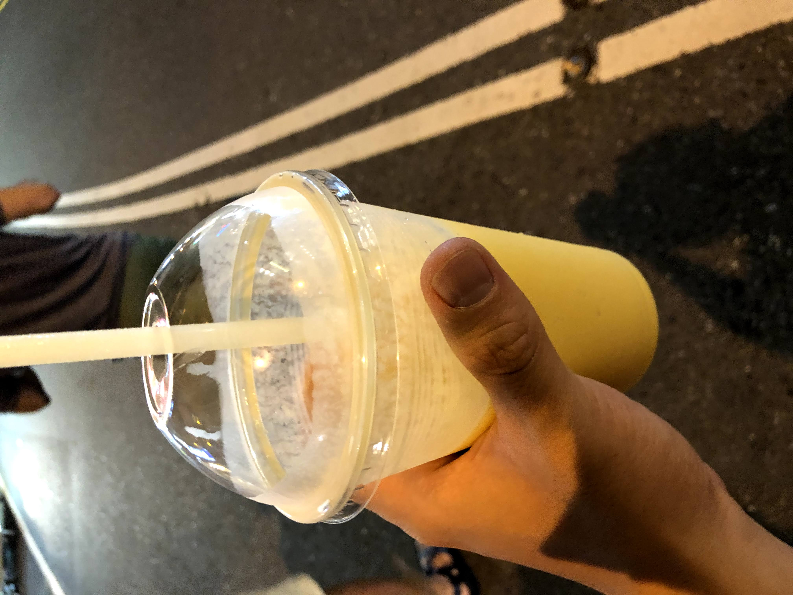
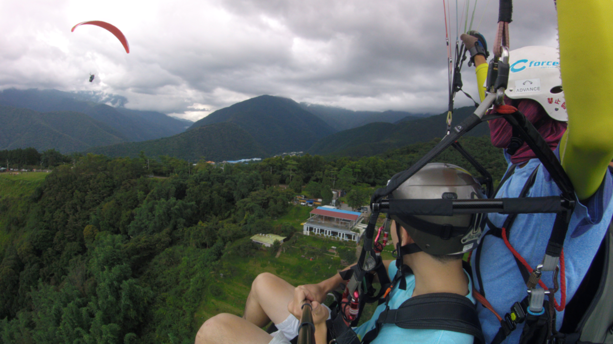

On the first day of our trip, we took the HSR, or High Speed Rail (my first time taking the 高铁!) to get to Kaoshiung, and then we took an express bus to get to Kenting. We got super lucky with the weather, as it was supposed to rain all week, but instead we got a beautiful, sunny day. 

Upon checking into our hostel, we rented some electric motorcycles for the day and sped around the area. After checking out three ATV riding places and finding out that they all weren't suitable, we decided to scrap the activity idea and instead just have a day at the beach.

We stopped at one near our hostel and looked at a couple of entertainment packages, like water sports and surfing. However, they were way too expensive and not good value for what we wanted, and even though I was upset that we weren't doing them, I knew it was the best decision. In lieu of these activities, we jumped into the waves (a free one!) and tried to make the most of the day.

It was actually surprisingly fun running headfirst into the *massive* waves, and we all left the beach exhausted, covered in sand, but satisfied. We rested in the hostel, and then for dinner, explored the *super long* Kenting night market. I was excited because I had heard that mangos in the south were the juiciest and freshest ones you could get in Taiwan, and I wasn't wrong. The mango smoothie I got at the market was the best one I've ever had – it was so good, in fact, that I'm holding all future mangos up to this standard. 

## group and solo exploration

### Tuesday | Kenting, Day 2

Today was much busier than yesterday and was filled with trips to the beaches and other touristy spots.

While all were pretty, some also had notable history. For example, Longpan Beach, the one pictured below, had acted as the scenery for the famous movie "The Life of Pi"!

Once again, we were lucky to get sunny weather, although it did get blazing hot and cause us to wear out. We all had different ideas of what we wanted to do after visiting White Sand Beach, so we split up. Meg went to the beach to relax, Will and Zach went back to the hostel to take a nap, and I continued exploring Kenting, most notably a park called Maobitou.

When I was at Maobitou I also had my first experience haggling! There was a coconut drink that was 50 NTD initially, but I managed to get it down to 40 NTD.

It's a trivial discount, but it was my first time negotiating and I'm proud to have initiated and tried it out!

After I got back to the hostel, we continued to have different ideas of what to do. Zach was still passed out, Will and Meg wanted to eat Italian, and I wanted ramen, so I decided to go off on my own to Hengchun, the next town over, with my scooter.

The ramen I ordered for dinner wasn't the type I was thinking of, and it didn't taste as good as I thought. 

Dessert though – taro balls, condensed milk foam, boba, mango and milk ice – now **that** was worth it.

## wandering in the cultural and gastronomic center of Taiwan

### Wednesday | Tainan

Again, we got super lucky with the weather today. It started raining the moment *after* we got on the bus from Kenting to Tainan, and stopped the moment we got off. 

For lunch, we stopped in a beef noodle restaurant on our hostel owner's recommendation. It was **yum-my.**

Following lunch, in another somewhat-surprising twist of events, Meg and Zach retired for the day, while Will and I forged on to explore. It's made me realize that the intense, packed schedule I had all semester had conditioned me to endure long days of travel, while the others hadn't built up that type of stamina.

Anyway, like I said, Will and I explored the touristy parts in the port of Anping and in downtown. We went to a treehouse to learn more about the local history ... 

the top of a Spanish fort to see a view of the Tainan skyline ...

and after getting stuck for 40 minutes looking for a taxi, the Hayashi department store to visit the unique Shinto shrine at the top.

## misty forests, tea, and disagreements

### Thursday | Alishan

After some headaches with transportation getting from Tainan to Chiayi (where our hostel was), and then from Chiayi up to the peak of Alishan, we ended up just saying *screw it, let's get a taxi for the day.* After all, I didn't want a repeat of what happened in Tainan: getting stuck at the top with no way back.

Our day started off with a pit stop in Fenqihu to grab lunch in the form of their famous lunchboxes.

They were exactly as pictured and are to this day the best bento box food I have ever had.

Following that, our taxi driver was nice and stopped at various points along the streets, acting as our own tour guide. 

While the views were great, the roads were **really** windy and I almost got sick going up. The next stop on our trip wasn't that far though, thankfully, and within a half hour or so we were in the misty mountains of Alishan.

The rain, while initially annoying, actually helped with promoting the "mysterious" ambiance in the forest and lakes.

It didn't help in other aspects though. Alishan was almost 20 degrees cooler than the rest of Taiwan, so I was **freezing.** I pushed through though, and finally got to the last destination within the park: the gigantic, 2300-year old tree.

After we were done, I was so relieved to finally be finished exploring, to be able to get out of the freezing rain, and to finally relax on the taxi ride back. However, I didn't realize I was in for another stomach-lurching ride down the mountain. Luckily, the driver noticed our discomfort, so he took up to a rest stop on the way down at a tea shop.

We had a two hour tea ceremony and got to try Alishan's famous high mountain oolong tea, fresh from the shop owners' tea farms next door. It was a cute way to end our time the national park.

That wasn't the end of it though. It was during dinner that our conversations turned to a deeper note.

We began to debate the following question: *when is it okay to criticize others?* Normally, in these types of situations, I would stay quiet and neutral, but since it's been a goal of mine to stick up for my own values and thoughts, I outspoke my thoughts and got some strong dissent.

The argument got pretty tense, with neither side budging an inch. It got so heated, in fact, that there was one point where Meg even claimed to have a piece of criticism about me that would ruin the night (and possibly our friendship). However, I (and the others) didn't want to hear any of it, so we shut it down, steered clear of the topic, and pretended it didn't happen.

From Thursday I learned a lot about navigating disagreement and criticism. For one, after hearing Zach's thoughts on the matter, I internalized three conditions under which to give criticism and advice: they ask for it, it's one on one, and you speak only to them and not to others about it. Second, I analyzed when it was okay to join a group discussion, distinguishing when you're adding value and when you're butting in. Three, I learned how to defend my values while being tactful. And finally, I practiced swallowing my pride after I lost some of the arguments I had.

I've never stuck up for my values before and thus never experienced a conflict like this before. The tension was probably enhanced by the stresses of traveling. While it was bruising to lose some points and get shut down, it was also insightful in teaching me how to manage disagreements. Overall, I'm glad I stuck up for my values and am learning these lessons.

## raining on our parade

### Friday | Sun and Moon Lake (Day 1)

For convenience, we got another taxi to get from Chaiyi to Sun and Moon Lake, and once again, our driver brought us to some new places to explore, like the temple shopping area pictured below. The taxis are awesome – they practically function as tour guides!

The bathroom in the area was also super fancy too.

After that brief pit stop, we got to the lake and checked into what is the nicest hostel I've ever stayed in, Owl Hostel. You can tell how good a hostel is from the bathrooms, and, I mean, just **look** at these bathrooms! 

A few minutes of gawking at the facilities later, we left to explore the tourist attractions.

Unfortunately, our weather luck had caught up with us, and it started pouring as soon as we reached the first item on our itinerary, the ropeway.

There was nothing we could do about it, so we just went back to the hostel and relaxed. 

A few hours later, though, the sun came out again, and I headed to Wenwu Temple, initially by myself, but later joined by Meg, to catch the sunset. Biking along the lake was an ethereal experience.

However, the views at the temple are what really stole the show.

After some fiddling and experimentation, I even had a mini photoshoot.

On the bike ride back, listening to the sounds of the lake, I reaffirmed my values and thought about how lucky I was to be in Taiwan, in awe of how much I had grown over three months. It was at that point that I realized in line with my personal transformation that personality is mutable, consistent with the whole premise of "discovering yourself." Post-Taiwan Jeff was different from Pre-Taiwan Jeff, and Will came up with a good analogy explaining it. Personality is like a cake with multiple layers, where each time you change, you add a different layer on top of the cake. As a result, I believe that personality is always suspect to change, and you can direct that change the way you want it to occur if you focus enough.

What does it take then to direct that change? Like I've said many times before, **anyone can progress through baby steps to giant strides.** While some things are inborn, like genetics and height, most things are not. I hate the idea of "be natural," "be yourself," etc. because a lot of people are unsatisfied with who they are. That's the whole point of studying abroad, after all – a lot of the people I've met abroad have went abroad not just to have a good time, but to change/discover something about themselves. According to my values and experience, through hard work and perseverance, I can become the person I want to be in any facet, socially, academically, professionally, simply by building **habits.** Everything I've experienced so far has built into this discovery: my seminar on motivation and habits in Japan, my subpar experience in Beijing, and my life-changing experience in Taipei.

I've learned, and I've learned fast from the lessons I've taken. For example, during dinner, Will, Meg and I got into another argument about the recent George Floyd protests regarding when and to what extent someone should be held accountable for their actions. I expressed my values and received dissent from Will and Meg, but I stuck firm and used some of the strategies I had learned the day before to express them tactfully. Surprisingly, they respected my option, and this time, the debate didn't get heated or emotional like before. 

## paragliding and chill

### Saturday | Sun and Moon Lake (Day 2)

Saturday is what I was looking forward to for the entire trip: paragliding. The weather looked okay on the taxi ride there and stayed okay throughout, save for a few bits of rain.

Zach, Meg, Will and I went separately, and each of us had different results. Zach got super lucky, because the sun came out during his run, so he was able to catch some thermals that lifted him over 4500 feet into the sky.

When it was my turn, I was terrified, but I remembered the lessons I had learned about managing anxiety from last week. The three second rule, visualization, and letting my body move first and my brain second, all helped me jump off of that cliff. Even though I didn't run smile routine this week, the lessons I've learned about confronting fear have continued to help in so many situations, including this one.

Anyone, regarding my run, I didn't get too lucky with the thermals and sun, so I wasn't able to go nearly as high as Zach, but I still had fun, especially on the third run. The spin was the best part and felt like a rollercoaster.

Plus, we had some beautiful views.

We all felt woozy and tired afterwards, so we followed paragliding with a relaxed afternoon. Zach and Meg headed back home to Taipei early, while Will and I continued to chill at Sun and Moon Lake, eating dinner and heading to bed.

## views and a few hidden gems

### Sunday | Sun and Moon Lake (Day 3)

It was the end of our trip, and we were blessed with another beautiful day to finish all of the touristy stuff on the lake.

We trekked up hundreds of stairs to mount the Cihen Pagoda ...

Took the ropeway to get a beautiful view of the lake ...

And even visited the aboriginal amusement park, shooting projectiles via blowpipes and bows and riding some line-less thrill rides.

I was **wicked** socially tired by this point though and ready to come home. We were in for a piece of news however: the HSR was totally sold out of regular train tickets until 10pm, so we need to take the business class car instead. It was pretty much the exact same as economy, except you got some free snacks that you couldn't even eat due to coronavirus regulations. Overall, while it satiated my curiosity, I definitely wouldn't get business class again, as it's not much better than regular.

# wrapping it up and reflecting

This week had it all: discovering values in myself, managing conflicts, and thrilling rides and exploration. It was my first ever long trip with friends, and I've learned a lot and experienced a lot. I couldn't have asked for anything more for my last week studying abroad in Taiwan.