I knew I wanted to make the most out of my last two days in Taiwan. As a result, in true Jeff-style, I packed my schedule full of activities and spent way more time hanging out with my friends than I probably should have.

## an American farewell brunch with a dear friend

I kicked off my last two days with my last language exchange with Sandy, one of my very first language partners. We went to an American brunch place called the Diner, partially because I wanted to see how authentic the food was in Taiwan, and partially because I wanted to make sure Sandy got the true experience.

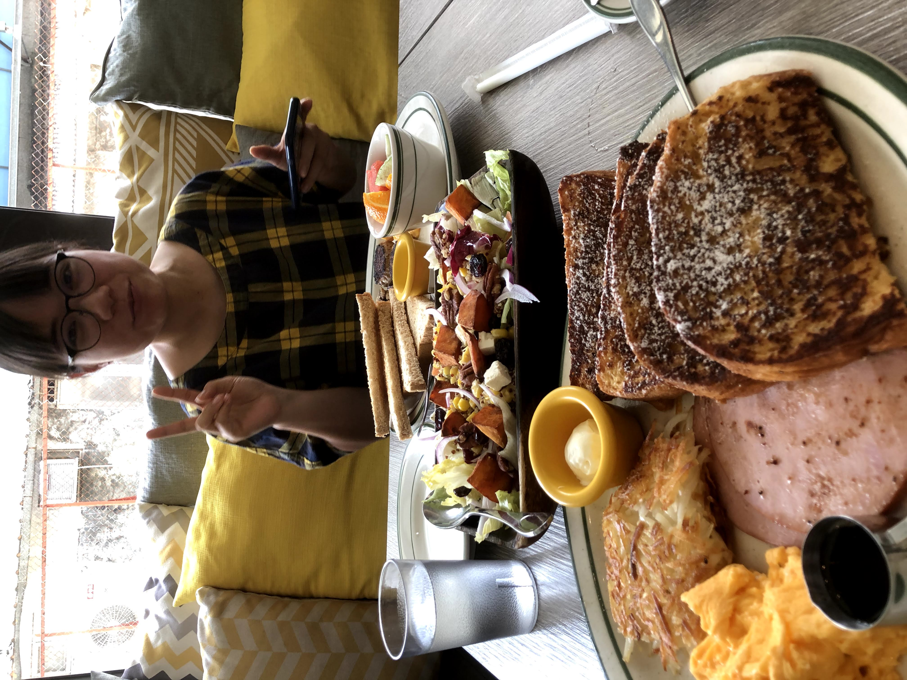

It was pretty dang authentic, though, so I had nothing to worry about. We talked about stuff like American and Taiwanese politics and humor, sharing our favorite comedians (hint: mine is Conan!) and our thoughts on the political climates in our respective countries. I eventually had to go home and pack, though, so after she gave me a super sweet gift, we parted our separate ways.

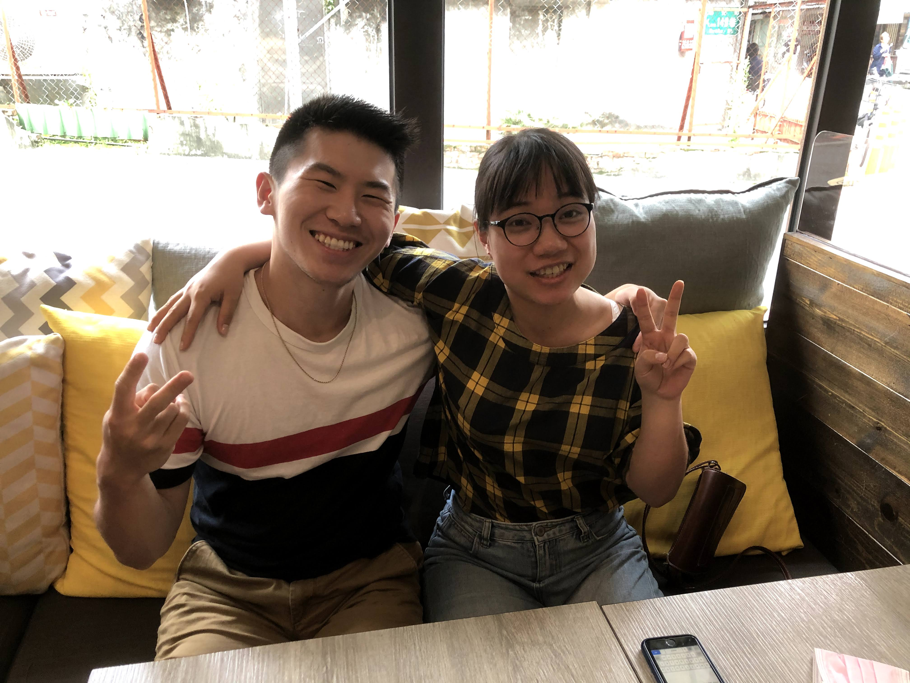

## my last hitting session, with luck from the heavens

I spent the early afternoon running some errands, like buying bubble wrap and making my gift for Bello – all things that **weren't** packing, haha! My time was short though, because I had another activity planned: tennis with Kevin, Eduard, and his friend Jonas.

The weather forecast said there was a 100% chance of rain, so I thought our tennis session would be cancelled, but it ended up not raining at all. In retrospect, I should trust the weather forecast less in Taiwan – I don't know why, but it is **very** unreliable. 

Anyway, the heavens aligned on my side, and I got to spend some of my last time in Taiwan doing something I loved: playing tennis. We were blessed with clear skies starting at 3:30 pm before it suddenly began pouring around 5:30 pm. It was perfect timing though, because two hours was long enough for me to not feel rushed, but quick enough for me to get home and get ready for the rest of the day.

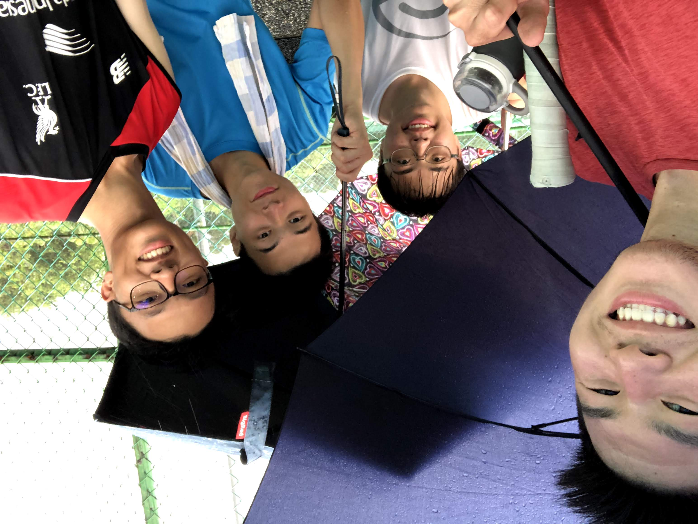

After we retreated downstairs, I began my parting routines. I gave my tennis balls away to them and snapped this last picture of us.

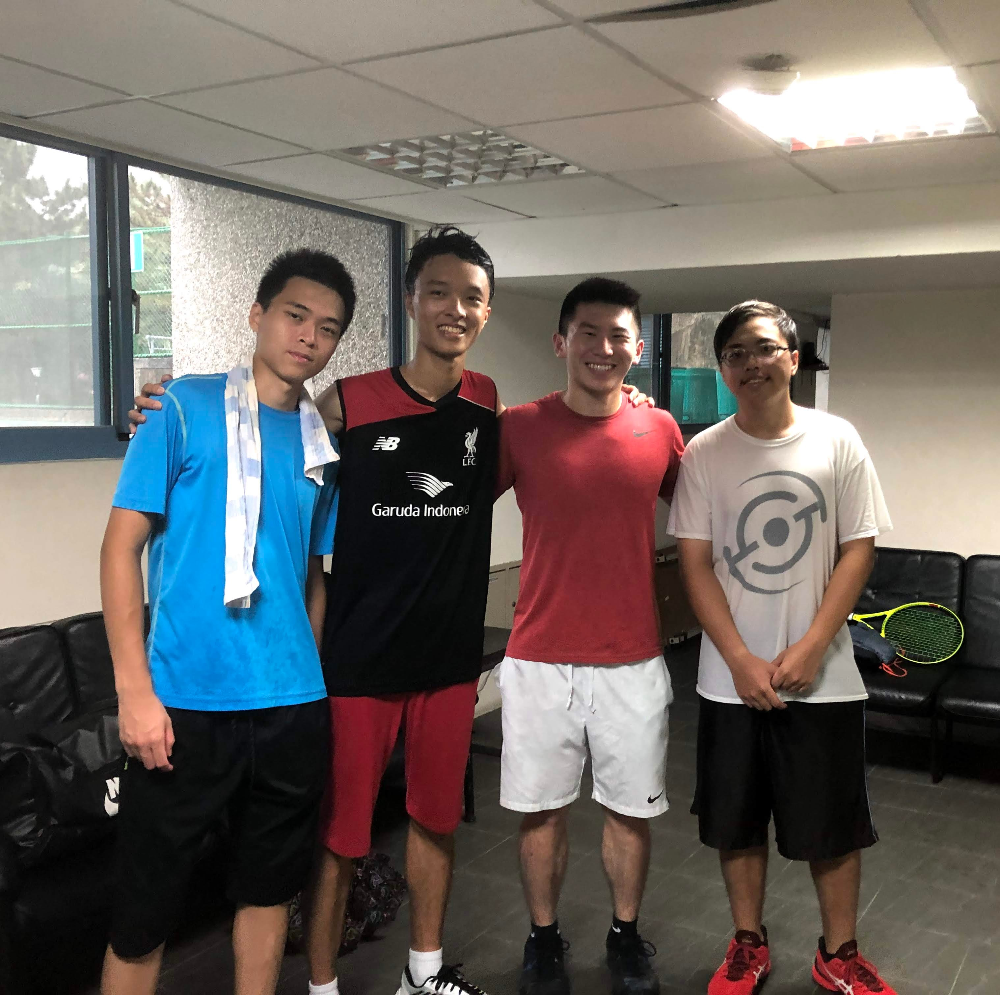

It was at this time that Kevin also gifted me some baked goods. He had gotten his brother, a baker in Taichung, to ship some personally-baked cakes and cookies to me from his shop called [EggsHuang.](https://www.facebook.com/Eggs.Huang)

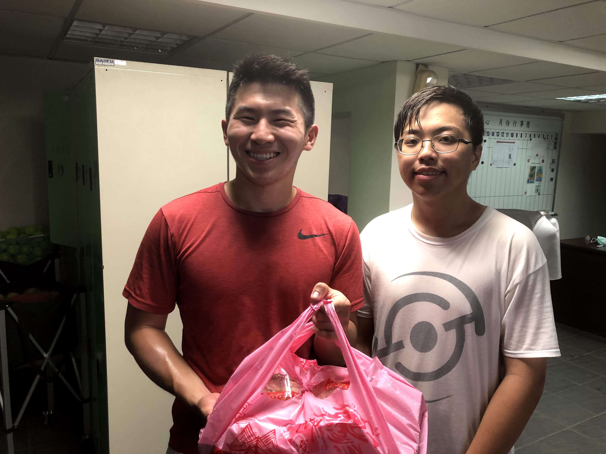

It was such a kind gesture, and even though I haven't tried them yet, I'm sure they'll be delicious!

## rah rah ramen

Before I headed off with some friends to Elysion, a KTV place that Sandy had recommended for its large English song selection, I had to stop and eat something important: ramen.

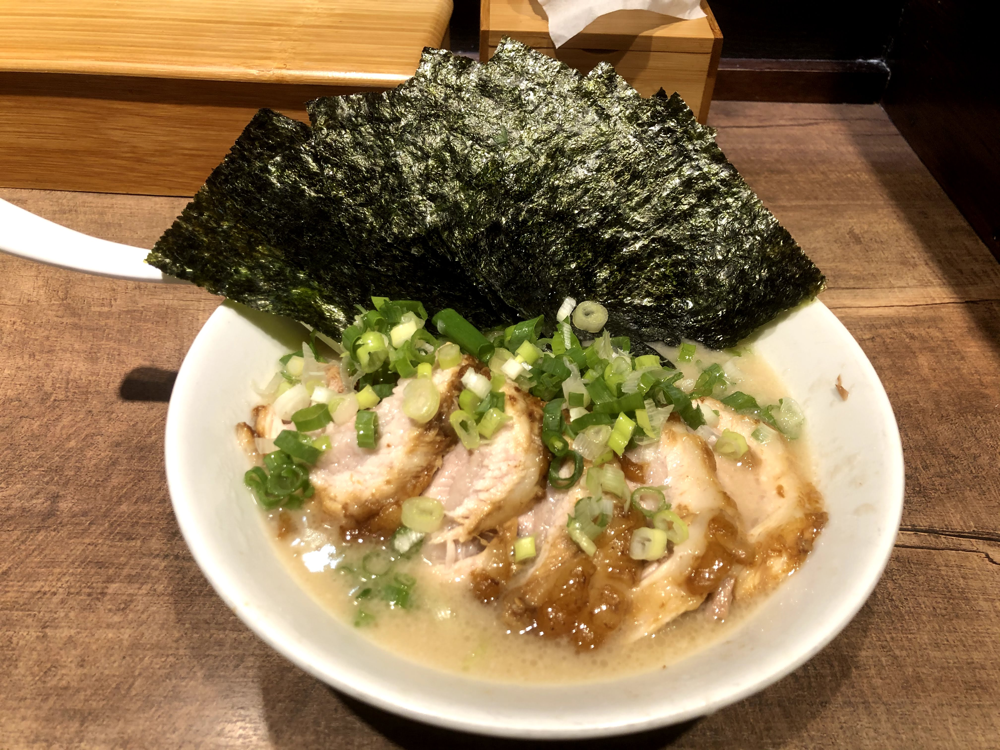

This dish was on my list to eat at again before I left Taiwan, because it was **really** good the last time I had it. I didn't know if I'd have the opportunity to eat something as good as it in America with everything going on there, so I made a special trip to Ramen Ogawa before KTV.

I finished the 5-chasu ramen monstrosity in like 20 minutes, since I was in a rush to get to the singing place not insanely late. It was crazy trying to eat that much that fast, but I did it, largely because it was so good.

## ktv

KTV was on my list of stuff to do ever since I decided to come to Taipei, and I knew I had to check it off my list before I left. The place we chose was actually really good – while it sucked that we couldn't eat food or drink inside, the music selection more than made up for it. I saw a lot of songs I liked, like "Yellow" and "Viva la Vida" by Coldplay, "Circles" and "Sunflower" by Post Malone. Zach and I were even able to try to rap to "Lucky You" by Eminem, getting us all cracking up.

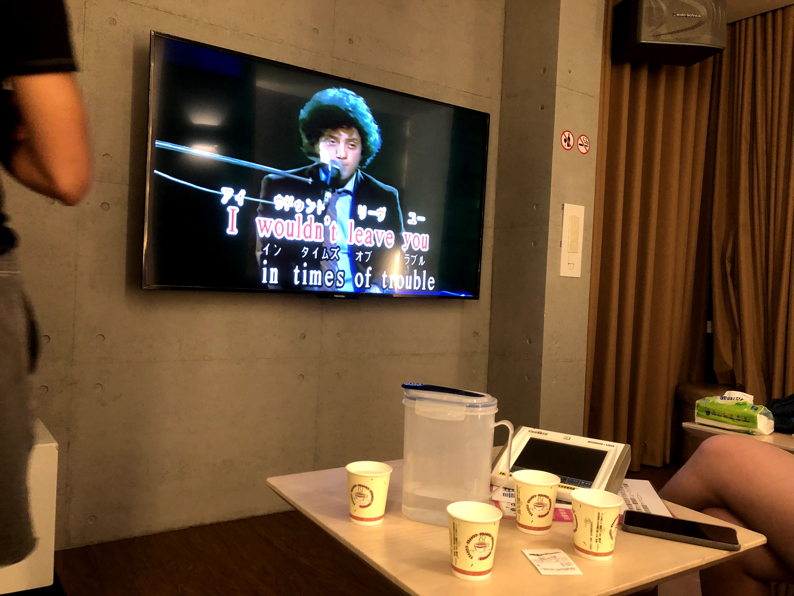

## my final final language exchange

At long last, it was time for my final final language exchange, this one with my language partner Bello. We went to a bar this time to celebrate not only the end of my time in Taiwan, but also her graduation. The one she chose turned out to be a normal one, not a dancing one like she had intended, but that was okay, as we made the most of it.

")

We talked about funny phenomenons ranging from Asian squats to how I learned to separate my fingers Spock-style with an eraser. We also played some games like 2 Truths and a Lie and Truth or Dare. (although we both kept picking and telling the truth haha)

While the fun made the night enjoyable, it was Bello's kindness that made it memorable. She complimented me, saying I was one of the most interesting people she'd ever met, which I was touched by, because it affirmed all of the changes I'd implemented while abroad, like embracing my quirks, had actually made a difference in myself.

I then read her note, which said her first impression of me was: "wow this guy is literally made of confidence not a coding monkey at all and have your own philosophy of life." It was incredibly sweet and aligned exactly with the type of person I was aiming to become. It confirmed that I really had changed for the better.

To top it all off, she gifted me a T-shirt that her friend designed, a parody of NTU that said "national teashop university," in honor of the bubble tea culture on campus.

")

It was a great way to end my series of language exchanges, and a nice way to say farewell to a great friend.

## a farewell lunch in true 'murican style

On Tuesday, I spent my very last few hours in Taiwan with some of the people closest to me during the trip: my foreigner friends. And in true American style, I selected one of my favorite types of foods to eat: good ol' American barbecue. 

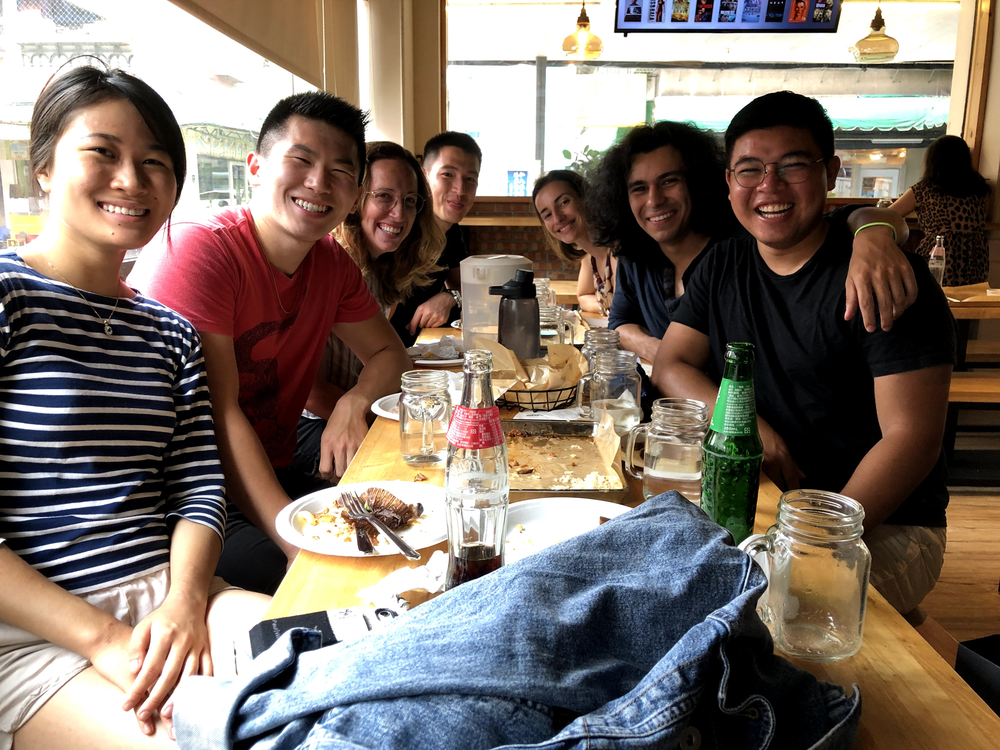

It was a wholesome sendoff with the people who had made my study abroad experience special.

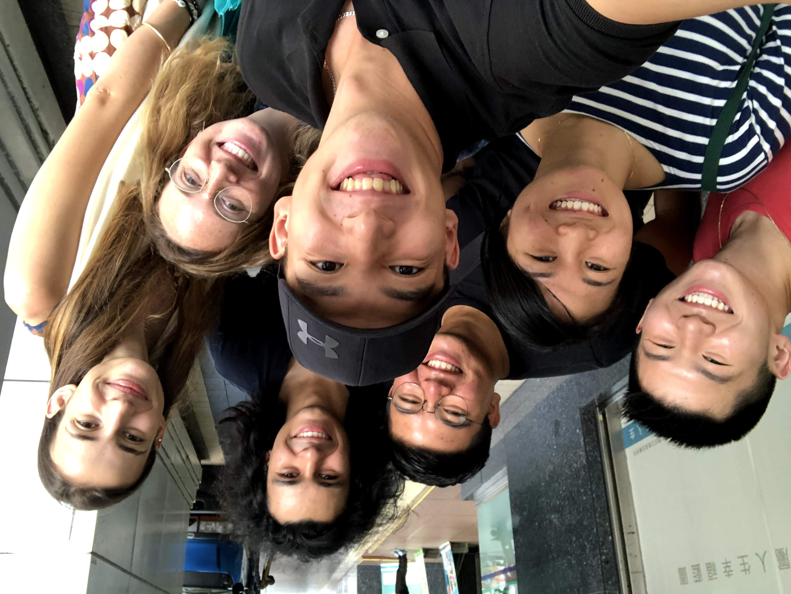

Not before long, it was time to leave, though, and I went home to pack. After about two hours of getting ready, I headed off for the airport via the Taoyuan MRT and got to see my final view of Taiwan.

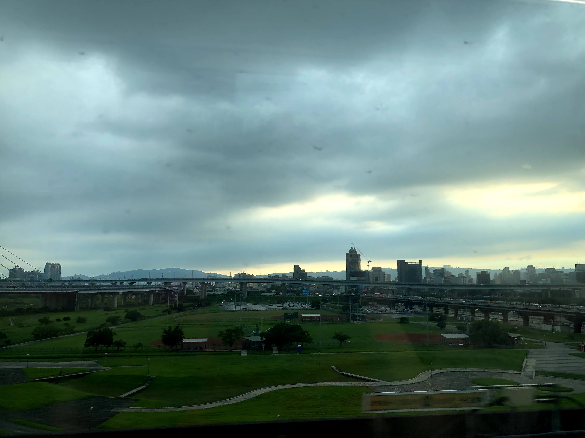

Like I expected, the train and airport were almost completely empty, so checkin and security were a breeze.

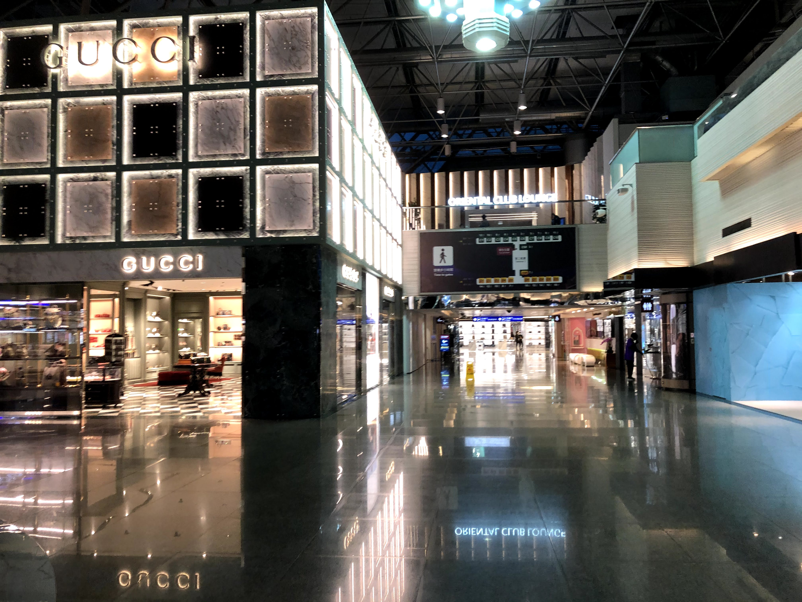

While most of the stores were closed, the restaurants were still open, thankfully, so I got to have a final meal in Taiwan.

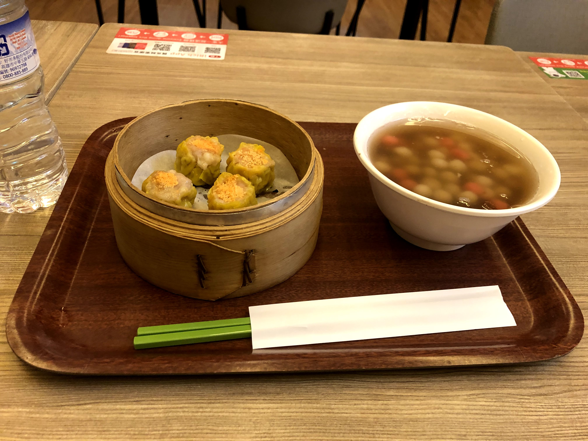

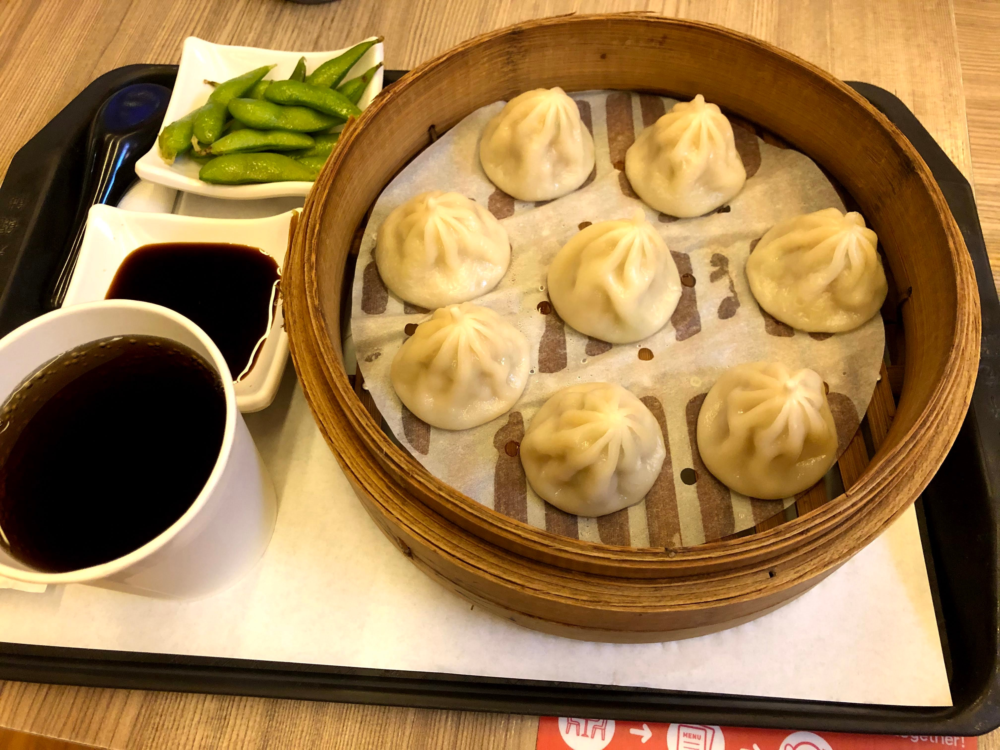

A couple minutes later after eating, it was time to go. I boarded my flight, and then, with a few minutes, I was in the air, heading home and closing the latest chapter in my life.

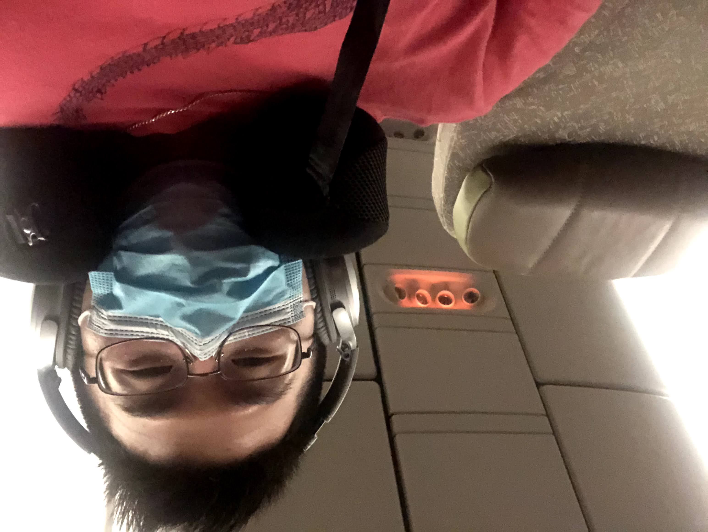