It's been over a year since my escapade to Taiwan, but I couldn't be more excited to be writing on this blog again. It's time for my latest adventure: a summer in the city. New York, NY. After spending an entire YEAR on Zoom University, being anywhere that isn't my home in upstate New York is exotic at this point.

# Whoa! Why are you in NYC?

I was accepted as a tech consulting intern at Ernst and Young this summer, and while the internship will be conducted virtually, EY decided to adopt an "agile" model, which means that there will be some in-person events in the greater metropolitan area. I was tempted to stay at home for another season, but my family convinced me that I needed some time away somewhere to explore and have fun after being cooped up at home for so long. Don't get me wrong, I love my parents, and I had a pretty sweet setup at home. But I wasn't being **challenged** or **stimulated**, and New York would be the perfect intervention to what was been an underwhelming, overly-comfortable year.

While this isn't technically traveling "abroad" in a foreign country, this experience shares a lot of similarities with a normal trip abroad. I've never lived in the city before for an extended period of time, despite living within three hours of it. I speak the local language (as you can see by reading this post lol), but I don't know any of the people here besides a few select acquantices. In essence, it's the ultimate shock to my comfort zone. After spending a year at my small rural home, with just my family and no people my age, doing nothing but studying and tennis, I'm now moving to New York, a sprawling urban metropolis, knowing absolutely no one and having to develop friend networks from scratch, and doing an internship and building a social life. I feel liberated, terrified, excited, and scared all at once. What I don't meet anyone? What if being in New York isn't any better than being at home? All of these doubts run through my mind as I settle in here for this week, but I know that I've gotta keep my head up. 

But this summer won't be the be-all-end-all. In fact, it's just a teaser for the larger entree: my gap year from Yale. Yep, you heard that right. IO decided to take a year off from Yale to study Mandarin with Light, and so, I'm now graduating in two years. While I don't envision that China nor Taiwan will open up by the fall, Light will still provide me with a generous living stipend, which was enough to convince me to deal with another semester of Zoom classes. The nice thing about virtual classes is that I can do them anywhere. NYC again, New Haven, or even China and Taiwan if either of them open up. I'm hoping this summer will be a fun way to settle into non-university life. 

The reason this is important is because I'll hopefully have other chances to go abroad later this year. But this trip to NYC is still important, as it's almost a training grounds to prepare for another potential trip to China or Taiwan, except without the language and culture barriers. I'm eager for a summer of challenges, failure, but also stimulation and opportunity. Who knows, maybe NYC will be my home for the fall as well, if things go well enough here :)

# Moving In

After a full day and morning of packing, I moved into my sick one-bedroom Chelsea apartment this Saturday afternoon. (don't even get me started on how hard it was to find it and place a deposit - the NYC housing market is a competitive can of worms) 

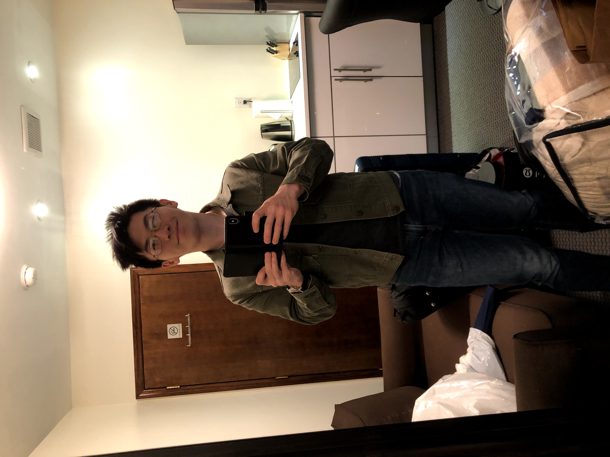

Moving luggage up two flights of stairs was not fun, but my landlady was kind enough to move my luggage. It reminded me of the old days of Yale-old when I had to bring all of my stuff to the Yale dorms (remember when *that* was a thing? HAH) 

Of course, I didn't really want to unpack, as where I wanted to be was OUTSIDE, and in the CITY. One of my favorite parts of moving to a new place is those magical first few hours, where you can just walk around and stare in awe. It's scary not knowing anyone, but also so, so empowering. You're in a new place, you know no one, and the world is your oyster. There's no better opportunity for self-agency. 

After gaping in awe, I realized my hungry was growling and begging my brain to stop admiring and start feeding. So I stopped inside a place I've **always** wanted to check out: Xian's Famous Foods. 

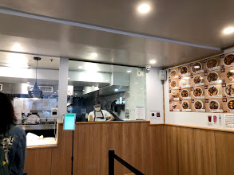

My hometown has a decent number of restaurants, but we would never get anything as diverse as a place like Xian's there. So I was absolutely hyped to try something totally outside my taste bad's comfort zone.

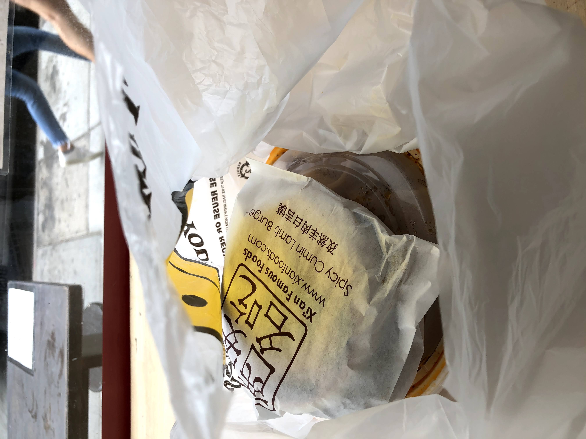

To be completely honest, it was a little too spicy for my taste, after having eaten nothing spicy for the past few months xD but it was still pretty good, and a great change of pace. Not to mention, the activity of just sitting at a window and people-watching? 10/10. Beats the monotony of staring out my hometown window anyday.

Food aside, my wonder hadn't expired yet, so I spent the next few hours continuing to wander the neighborhood. I found a few gems, like a sick gym that gives me a company discount for working at EY (the sales associate also graduated from Vestal and went to Bing which was SUPER cool). Also found a few nifty shops, like a Milk Bar which I am 100% checking out when I'm craving ice cream one night. 

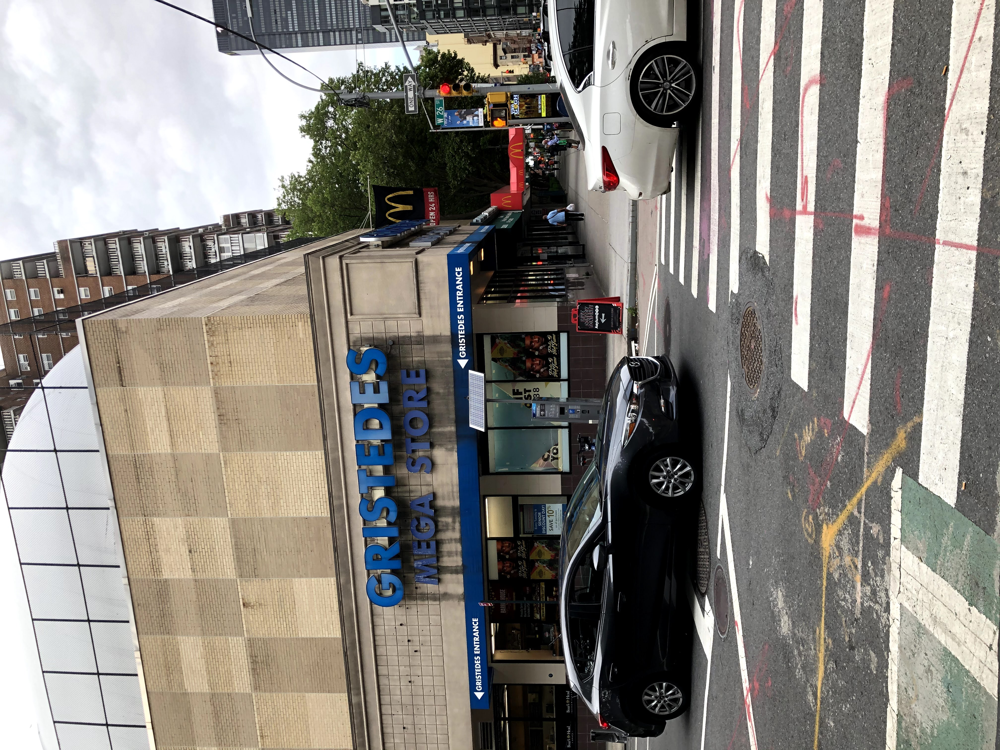

Those excursions, combined with coming home and laboriously unpacking everything, was how I ended up spending the remainder of that evening. By nighttime, I was so exhausted that I just found the cheapest and laziest dinner option you could think of: Chipotle.

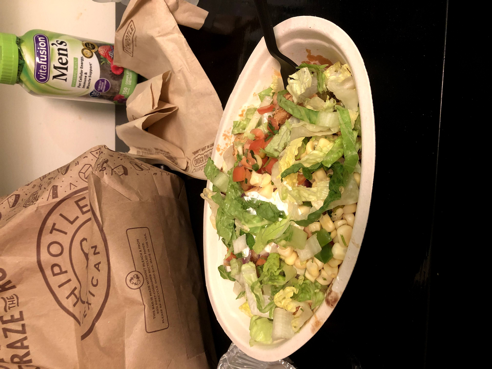

Thankfully my bed comfy, because I passed out on that thing. 

# Settling In

A night of well-rested sleep later, I was ready to tackle the backlog of errands and work that I had procrastinated doing on Saturday. Sunday was my errand and work day anyway, so it worked out perfectly.

My morning and early afternoon was spent obsessively watching a rollercoaster of an French Open between Novak Djokovic and Stefano Tsitsipas, all while munching on some delicious breakfast at a random NYC place nearby.

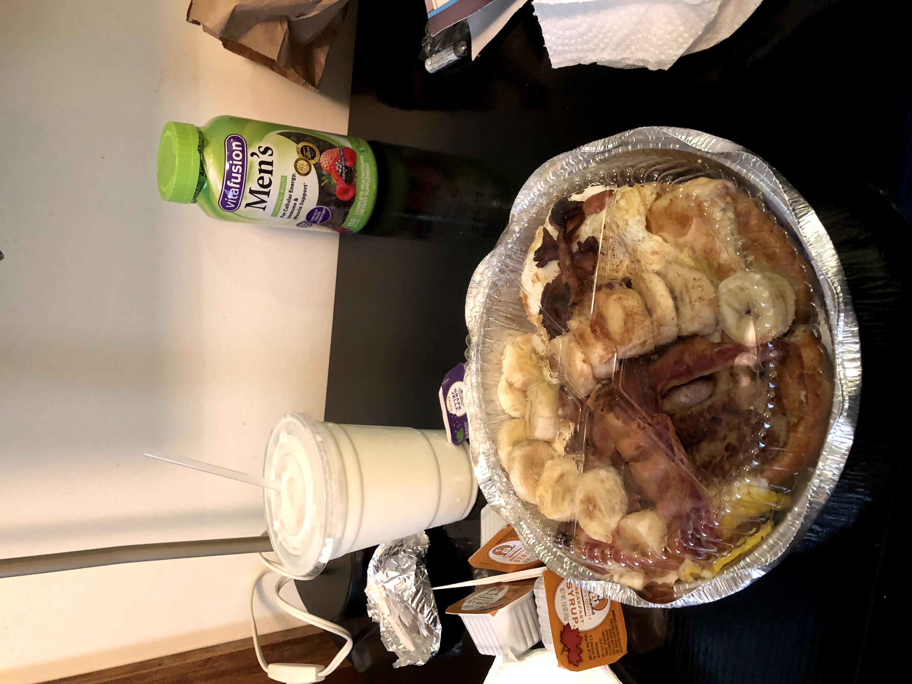

I also explored a little beyond my immediate street and did some errands.

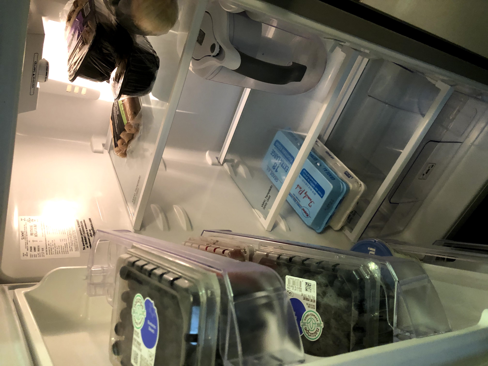

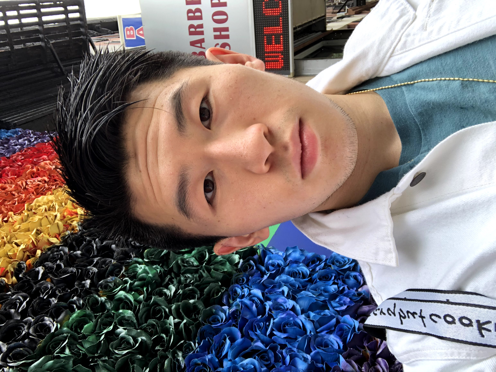

Just being in a new area makes these seemingly mundane tasks so much more interesting and lively.

In the evening, I blogged in a random cafe I found (resuming this beloved habit!), and even got into a nice conversation with a stranger about moving to New York. The New Yorkers I've met so far seem to be so friendly! Even with little gestures, like when I asked a group of girls if they could watch my stuff while I talked to the sales person, they did so enthusiastically and even cracked a small joke afterwards.  

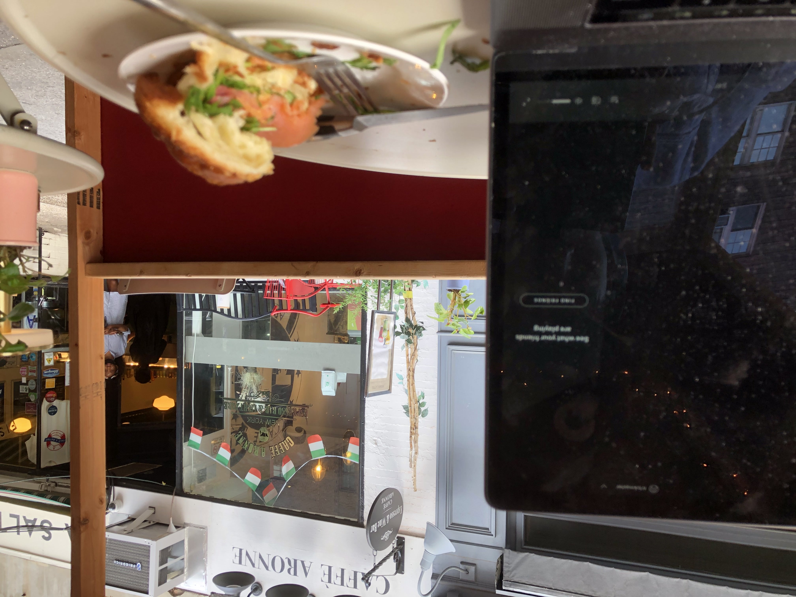

Following that blog I needed a real meal, so I grabbed dinner at this Asian fusion bowl restaurant near my place. It was a nice moment to chill and relax, and start looking into events to do in NYC later this week.

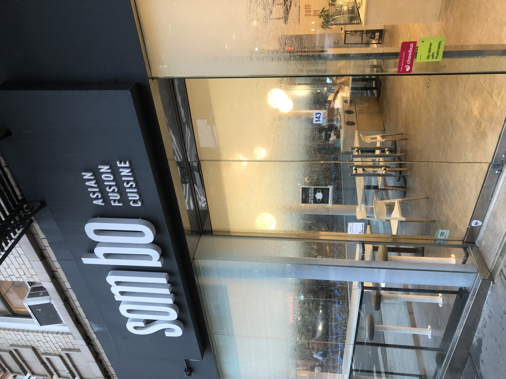

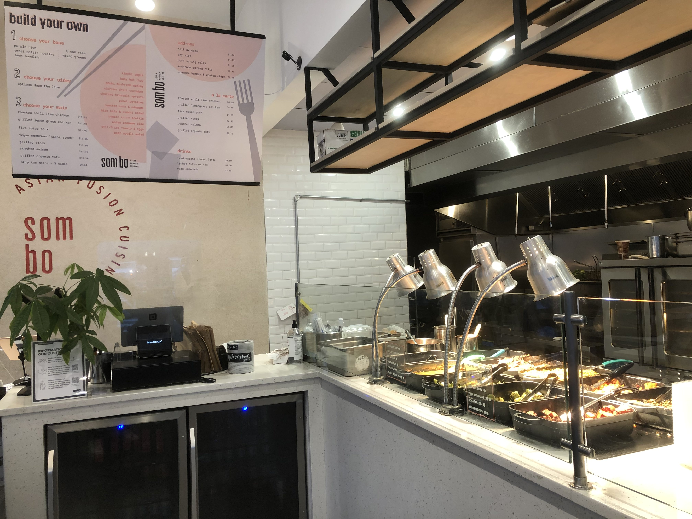

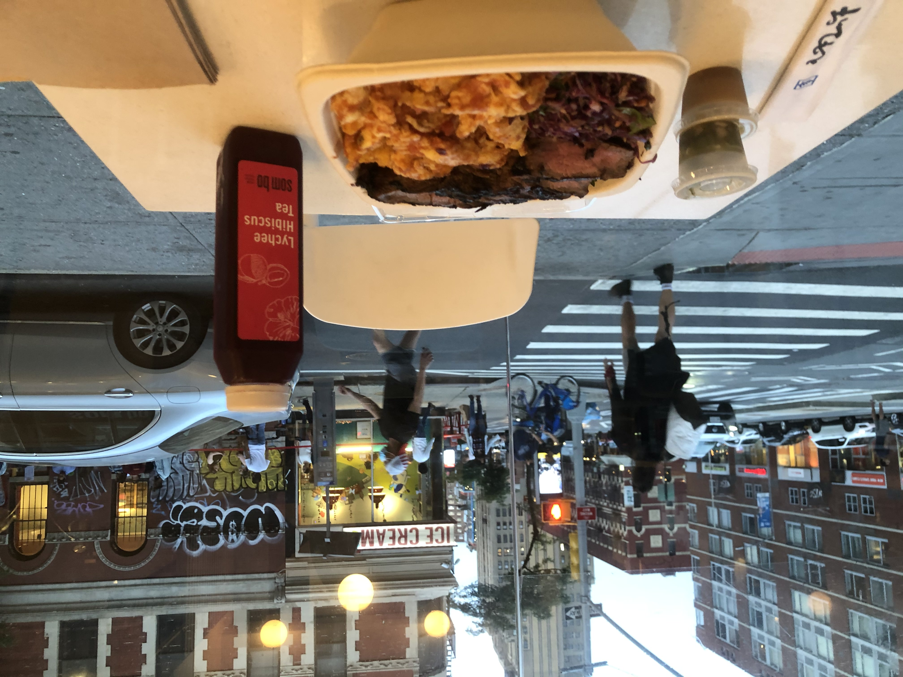

To cap off the day, I got home and cooked my breakfast (from home) for the next few days. It was weird because I had to use my bathroom sink as a kitchen sink, and there wasn't much space on my countertop, but hey, that's just New York for you. I'll get used to it soon enough.

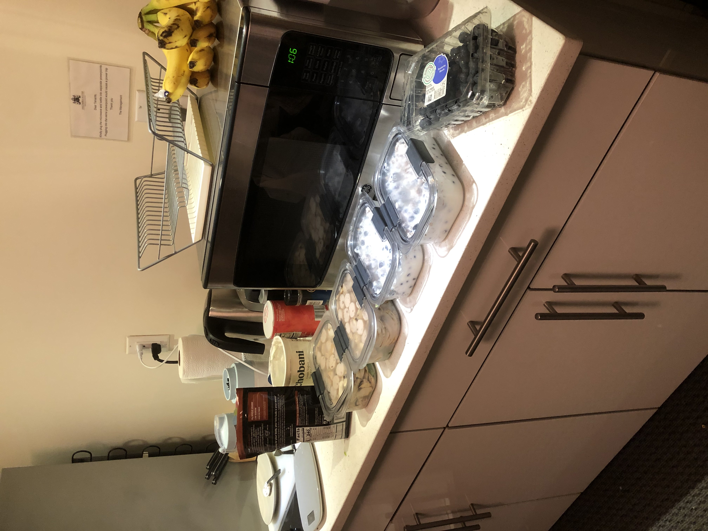

# The Future???

What a move in period. Tomorrow I start my internship for real, along with my new regimented daily routine of meditation, writing, work, exercise, etc. As the past few days have been unstructured, I'm about to enter a new period of ordered productivity. But that's by self-choice, as its the environment in which I flourish best. The challenge this week will be settling into this new schedule and finding regular social events to do (e.g. right now I'm looking at classes at my local gym, or Meetup groups) Here's to what the week holds for me!