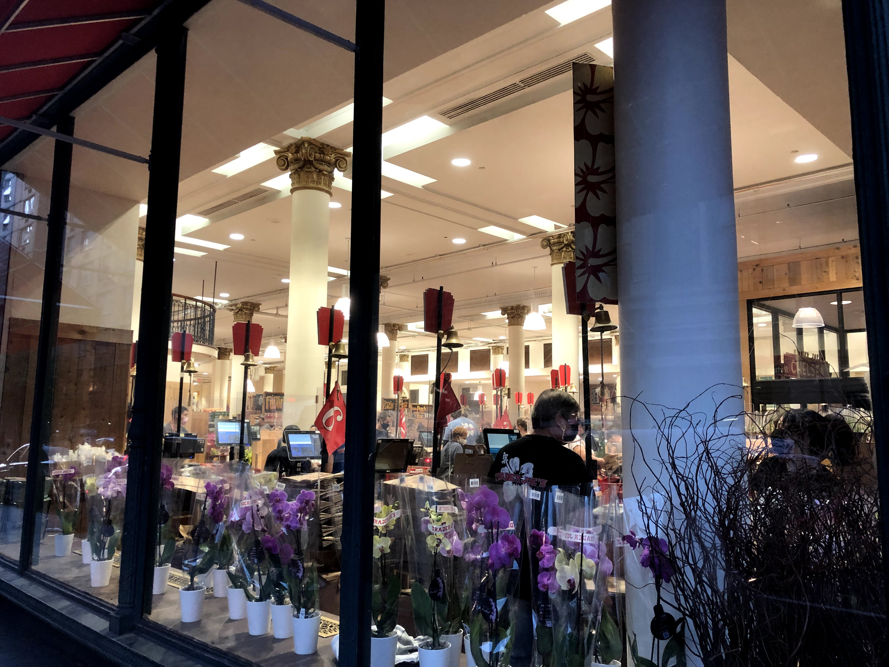

*Apologies for the supah-late blog - my days in the city have been unbelievably packed, and I've barely had time to squeeze in what was a ROLLERCOASTER of an opening week. Anyway, excited to share everything that's transpired in my first full week in the city. It's hilarious how only a week has passed, and yet it feels like a lifetime ago.* 

"New York is intense." 

Those are the words that a friend-of-a-friend said to be on Saturday night at a party, and it resonated with me. New York is the type of place that either breaks you or makes you, fills you with opportunities or loneliness and dread. It's what you make of it, but it's also a place that **amplifies** your experiences. It gives you the lowest lows, but also the highest highs. 

If pandemic life during covid was a stale cracker, then a summer in the city is like a shot of energy drink. It's a punch in the face.

# the city: \[title here]

On one hand, New York provides some amazing opportunities. From the people, the activities, it's all about dense convenience. In many senses, it's a microcosm of how I've found work at EY so far: overwhelming, stimulating, advancement. 

If there's one thing I love most, though, it's the spontaneity. It's the ability to take an impromptu walk down the street next to my house while munching on some snap! mallow! pop! ice cream, and enjoy the day. Or pause and gasp in awe at the gorgeous weather blanketing the city like it was straight from a movie.

Or it's stopping by a random, quaint coffee, getting into a conversation with the bartender about the best haircut spot in town, building a social life in a new city, and chatting with someone from a totally different walk of life.

Anyone who knows me well knows how much I love to constantly be on the move (they called this Zhuangzian style in my Ancient Chinese class). But some of my brightest moments have occurred in the innocuous, like stopping to admire some of my favorite stores on a chance walk.

I legitimately derived so much joy from stopping in Trader Joes and Uniqlo that I felt like I had ascended to some consumerist heaven.

at the same time, sometimes you gotta recharge, and stopping in a small shaved ice dessert cafe to get some work done is a joy you can only get in a city like the Big Apple.

# socially: from the old times

It's liberating to move to a new city where no one knows you. You can reinvent yourself, shed off old baggage. But it's also terrifying and incredibly easy to become lonely, a migrant. But I'm lucky to have a few buddies from my past, who are there to ease me into my new life.

")

having a friend in the city is also great for those late night, 4 am rooftop birthday parties that only they know about ;)

# finding a routine

There are some things which I can never give up wherever I travel, and health is one of them. I had researched gyms extensively before coming to the city, and was originally going to go for the cheapest option. (stingy saving habits die hard) However, I must've gotten too accustomed to having a home gym in my garage all year, because that 10 minute walk felt like a lifetime. Shifting from living at home the entire pandemic to walking everywhere in an urban city still left a lot to be desired.

Imagine my surprise when the gym nearest my apartment, less than a 3 minute walk, happened to have a corporate partnership with EY, and could offer me a discount! It was the most expensive option out of all of the three, about $50 (so nothing as ludicrous as Equinox's $300 membership), but it came with around a 20% discount, and also complimentary access to any of the gyms across the city. Normally I wouldn't think much of that, but since each gym offered different classes (including yoga, pilates, and dance!), and I was looking to get into those things, I couldn't pass up the opportunity.

It's taken a while to adjust and coordinate with Jake (my personal trainer who's a good friend of mine) on what machines are available, what routines work best with my hectic schedule, etc. But it's deload week, which means shorter workouts and more flexibility with figuring things out.  

# genuine spontaneity

but, even the meticulous and structured guy that i am, who wants to live in a world of total predictability? While my schedule is absolutely crammed and unfortunately doesn't leave much room for outings into the city, I committed to getting out into new areas whenever I could. That was my mentality when I chose to take a random stroll Friday night in Greenwich Village, a bustling nearby neighborhood.

As fastidiously as I've been sticking to my diet, I couldn't help but cave and grab some of the famed gelato from this place. I've always been afraid of talking to strangers and making a scene, but I forced myself to overcome this fear by getting into a conversation with the well-dressed Italian man standing in line with his wife. I didn't think initially much of it, but after asking him about the gelato at the place, he went off on a 10 minute passionate tangent on how the gelato was one of the best in the city. He then proceeded to translate all the flavors and recommend his favorite flavors. It was pretty incredible. New Yorkers really are an interesting bunch, when you get to know them.

Oh, and btw, that ice cream was delicious.

when I say New Yorkers are interesting though ... I'm not kidding. I went out Saturday night to wander around, stumbling into the Chinatown and Little Italy area after shopping in SoHo on a whim.

# organized fun

as great as exploring the city is, unprompted, though, it's almost guaranteed that I would never run into some of the people that I actually DID want to run into at some point - my fellow EY interns. As a result, my "one new area a day" challenge came in handy here, as I used a trick that my brother suggested: say I'm going to go do an event, and then say people are welcome to come "with." This makes it way less pressuring for people to come along. And plus, I was planning to explore solo anyway, so it was pretty genuine.

luckily, I didn't have to plan the first outing, as I hopped on some other intern's meetup instead. Taiwan was **really** great practice for learning how to proactively build social networks, as our recruiters didn't really host in-person events the first week. I knew sporadic social events wouldn't be enough for me, so I decided to take it upon myself to start hosting some of the socials. For this one in particular, it was pretty loosely-organized (just meeting in front of the Hoboken EY office), which was cool with me. here were supposed to be like 8 people, but not surprisingly, as I've learned over the year, people are flakes, and only three of us showed up, including me. But it didn't really bother me - that type of noncommital is something I've grown to expect by now, and it only meant that I got more time to soak in the beautiful views ...

enjoy my first genuine NYC burger which absolutely SLAPPED ...

and unlike when shoved in a breakout room with 20 people, genuinely connect with two pretty damn cool interns. 

, Ram (middle), and Pranay (right) in the first social of the summer!")

Funnily enough, they were actually both from the Hoboken area, so I also got a free, impromptu tour of downtown afterwards, getting to see all the cool spots in town.

Also managed to organize something on my own, heading to Smorgasburg, a major food festival in Prospect Park, Brooklyn, and unleash my inner foodie. It was relatively far for me, but it was a great excuse to get out of Manhattan and do some of that city-wide travelling I said I would do earlier on.

")

I got a ton of interest, over 14 people who I added to a group chat, but only one other person showed up, Danielle. Looks like flaking is universal, but to be honest, it didn't really get on my psyche that much. I guess I've been used to it as I've gotten older and become more cynical, and not let it get to me personally. All the better though, as I got to really have some time to get to know another intern, Danielle! Quality over quantity.

If there's one thing I've noticed over the past few study abroad experiences, though, it's that I've got SUPER comfortable with opening up and talking to strangers in new situations. It's crazy how much I've changed since that shy, introverted, closed off boy three years ago. I felt positive, open to talking to strangers, and just so incredibly socially charged that Danielle even misidentified me as extroverted. HAHA.