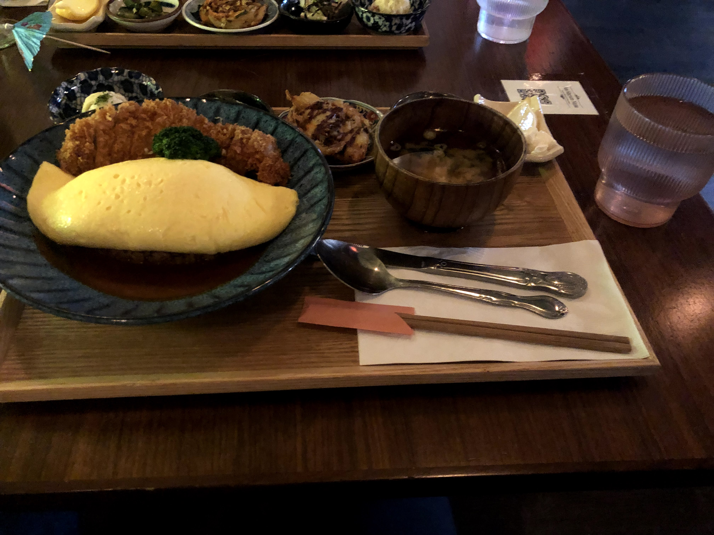

*Apologies for the day-late blog - my Sunday was insanely busy and I only found time to squeeze in what has been a ROLLERCOASTER of a week this Tuesday Monday night. Anyway, excited to share everything that's transpired in my first full week in the city. It's hilarious how only a week has passed, and yet it feels like a lifetime ago.* 

"New York is intense." 

Those are the words that a friend-of-a-friend said to be on Saturday night at a party, and it resonated with me. New York is the type of place that either breaks you or makes you, fills you with opportunities or loneliness and dread. It's what you make of it, but it's also a place that **amplifies** your experiences. It gives you the lowest lows, but also the highest highs. 

If pandemic life during covid was a stale cracker, then a summer in the city is like a shot of energy drink. It's a punch in the face.

# the city: \[title here]

On one hand, New York provides some amazing opportunities. From the people, the activities, it's all about dense convenience. In many senses, it's a microcosm of how I've found work at EY so far: overwhelming, stimulating, advancement. 

If there's one thing I love most, though, it's the spontaneity. It's the ability to take an impromptu walk down the street next to my house while munching on some snap! mallow! pop! ice cream, and enjoy the day. Or pause and gasp in awe at the gorgeous weather blanketing the city like it was straight from a movie.

Or it's stopping by a random, quaint coffee, getting into a conversation with the bartender about the best haircut spot in town, building a social life in a new city, and chatting with someone from a totally different walk of life.

Anyone who knows me well knows how much I love to constantly be on the move (they called this Zhuangzian style in my Ancient Chinese class). But some of my brightest moments have occurred in the innocuous, like stopping to admire some of my favorite stores on a chance walk.

I legitimately derived so much joy from stopping in Trader Joes and Uniqlo that I felt like I had ascended to some consumerist heaven.

# socially: \[title here]

It's liberating to move to a new city where no one knows you. You can reinvent yourself, shed off old baggage. But it's also terrifying and incredibly easy to become lonely, a migrant. But I'm lucky to have a few buddies from my past, who are there to ease me into my new life.

")

