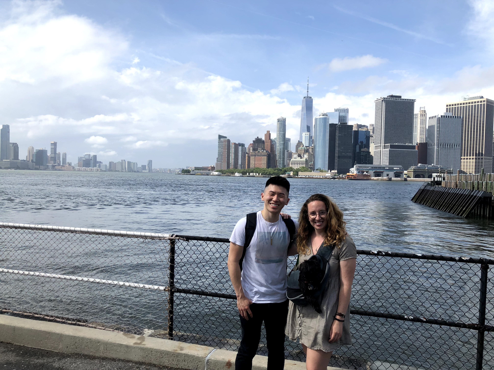

bet you liked that alliteration huh? ;)

One of the most memorable moments from this week (out of the many that there were) was exploring Greenwich Park at the beginning of the week. Such a simple gesture to get out of the house, but walking around a new area reminded me of that initial magic that struck me those first few days, of being a stranger in a foreign land. 

Especially those little joys of finding quaint neighborhoods to stroll and reflect in.

![[something about this being a quaint place]](../uploads/062121_greenwich_village.jpeg "[something about this being a quaint place]")

But while I love those spontaneous outings, recurring socializing was more the theme of this week. Take my hip hop dance class this week as an example. It's one of the best things I've joined so far while in the city. I've always wanted to learn how to dance better, and this summer being the summer of yes, i thought of pushing myself out of my comfort zone and learning something new. Helps that the class cost is included in my gym membership!

I've learned a lot about positive frames while here so far. I knew I was getting out of my comfort zone by joining the class, as I have two left feet. But by going in with a smile, and laughing at my badness and embracing it, I could feel my positive energy reverberating through the room. It's all about attitude. Whenever facing something negative, I've learned that facing it with humor and laughter goes a long way.

Luckily, the people in the dance class were not only SO good, but they were ALSO nonjudgmental. So there wasn't much negative energy emanating from outside. My mind was blown to have found a group of such cool people.

If there one thing that didn't start off necessarily on the right foot though, it was work. It was a lot of software development at the beginning, which honestly wasn't what I was looking for with this internship. That's why I left my SWEI role at PlayStation in the first place - to escape the debugging holes and walls of errors! However, I talked with my senior about my goals, and he said that he was willing to help make my internship more business and strategy and client-facing, which I'm happy about. In this sense, the EY work environment has been pretty supportive so far. I've been trying to ask more questions at work, and schedule meetings with more PPMDDs (high level executives).

Nonetheless, work is work, and its still pretty exhausting to debug all day. The new client-facing stuff doesn't begin until after the company holiday. It's been a balance to establish a routine at home, like eating pre-cooked meals on a schedule for my nutrition plan, while changing things up each week to keep it interesting, like rotating the recipes. Monotony is the killer of joy.

In the spirit of change, since it was the summer, I said screw it and got a new haircut too this week! I followed up on my lead from last weekend and went to see AJ at Village Cuts on a Wednesday evening as specifically recommended by Andrew. Glad I did, since he was WAY more open, hospitable, and cool than my other barber. 

It's funny how I met him - as I stepped up the stairs, I had to sidestep two guys on the stairs smoking, with one of them smiling at me and directing me to the store entrance. After stepping inside, I asked for AJ, only to find out that the guys who smiled at me on the stairs was him! He finished his cig and we got started, stilting into a more organic conversation. We talked about his family and how he was from Kyrgyzstan, and also how we were both into building our own PCs! We also talked about cool food spots in the city, and his life ever since moving here. Super, super cool guy, and also, he took almost a full hour to methodically do my haircut. I really respected that he took his time, being precise, and it reflected in my haircut, which was CLEAN. Definitely going to come back. 

It was surprisingly tough to fit something as trivial as a haircut into my schedule though. Weekday evenings, I'm soooo busy. Sometimes after working out and finishing errands and eating dinner, I'm not done until like 9 pm. Yet, on those nights, I still push myself to go out, like on Thursday, when at 9 pm i decided to take a train up to midtown in a 24h cafe and chip away at my blogs. It was a nostalgia trip, listened to radwimps and romanticized my experience here in the Big Apple.

Exploring might also look more organized, like when i traveled halfway across the city to play on red clay tennis courts. I would've never explored this area before ... its more residential for sure, but its always nice to see new parts of Manhattan.

The hitting session all came together when a guy named Ming, who graduated from Harvard, reached out to me on FB. I had only posted once in that group chat, and so I was surprised, because I wasn't expecting much from it. But, I i was so so glad he did, because apparently we already had a really good mutual friend in one of my old bboy buddies, and I ended up having the time of my life that Friday evening.

What made it so special? I didn't find out until that morning that the courts weren't just normal tennis courts ... they were INDOOR RED CLAY courts. yes, you read that right, real, sliding, dirty, red clay.

The best part? The courts didn't require any additional fees and were FREE to the public if you had a permit. I thought a place as elite as this would cost an additional $70/hr, but the permit was only $100 for the entire season, so it was a STEAL.

Not to mention, the match itself was a mental slugfest. Ming and I went the distance for 2 hours, with me saving like 4 match points to clinch it 6-2 4-6 7-5. I was slipping and sliding, panting hard, hitting groundies, chasing after balls ... it was an absolute blast, and I felt like a kid in a candy store. I was sooo happy, and Ming was a great hitting partner. In fact, he's probably one of the few guys who I've met who shares the same passion for not just playing tennis, but also WATCHING it super closely. It's probably too early to tell, but we might even go to the US open together, my first time going with a friend!! Ain't that crazy to have finally met a fellow tennis affectionado?

The match was draining, and I was so tired that afterwards, despite wanting to go to an intern meetup at a bar, I decided to take it easy and sleep. Despite all the fun, it's important to pace myself. 

But in true new york style, the marathon wasn't over. on Saturday, Meg had invited me to Governors Island. So a little after noon, I rushed to meet her on the ferry, and we were off.

We ended up walking around and just hanging for a couple of hours. There was a cool food area with a ton of people, and, in the spirit of trying something new, I got some Ethiopian food which I had never tried before ... it was alright but I was glad I tried it out.

But my favorite part was sitting in the grass with Meg on a picnic blanket, just people watching, chilling, staring at the sky in silence, and taking it easy. There was even a harp player sitting on a nearby bench playing a few notes, adding to the ambience. It was an amazing change of pace from the frenetic lifestyle of the city.

Course, nothing great can last forever, and the moment was disrupted by a sudden burst of rain that hit the island and caused everyone to go scampering for cover under the giant arch ... but hey, it was so nice while it lasted.

Overall, it was a great time visiting someplace new with a great friend and good company.

The crazy thing about new york is how much stuff you can do to add to a previously basic plan. I thought gov island would be it, but we both decided to say fuck it, let's get some food and dessert. So we stopped by a place called golden diner which was apparently really well-renowned, and got some food. Walking around gov island in a sunstorm does a number for your appetite.

, for meg, chicken katsu sandwich (japanese x western fusion) yum!!")

We chatted a lot, and had fun talking, but overall, i think it was the desserts that stole the show.

That green tea coffee cake was godly. the symphony of flavors is indescribable ... i could go full anthony bourdain on that tiny piece of heaven.

You know, i thought that would be the end of my day, and I felt ready to go home, but in a moment of spontaneity, I decided to go shopping for some clothes in soho. I had been meaning to get all my basic shirts colors from uniqlo for a while, but what I didn't expect was a short "window shipping" moment in zara to turn into a full two hour shopping fest.

I had been searching for summer shirts in all types of stores for a long while .. the summery, fun ones ... to no avail. Never did I think that zara would literally have EXACTLY what i was looking for. Finally, I felt like I'd filled a hole in my wardrobe and could dress now for the heat.

\[TRANSITION]?

If there's a theme of the week, its being so busy that I didn't get any work done. That includes errands, blogs, online classes ... all of the stuff that kept me occupied at home. But honestly, I can't complain. I feel like I'm living a full life. 

Normally Sunday would be my days off to do these types of errands and recharge from being social, but this week was different, in that I spent most of Sunday afternoon hanging out with Chris, an old YUCG president and buddy I hadn't talked to in a long while. That's been one of my minor goals this summer: catch up with old friends from university since so many of them are in the city! For this trip in particular, we went to the south street seaport, an area popping with bars, museums, shops, and other cool things, and a place I had always wanted to visit and a place that Chris had also never been to before.

I went in with no plan, but I didn't need to ... there were so many things to do.

From getting FREE admission to a ship museum...

and exploring the hull and decks like a true sailor...

to walking around to see all the different bars...

to checking out all the stores in the dope mall...

to just soaking in the view of the skyline...

to just chatting about life, catching up, and sharing future goals, it was just a great way to spend a Sunday afternoon in the city.

")

It's only in my brief moments of downtime I have time to do all of the little things needed to keep my life functioning ... cooking. laundry, groceries, errands, cleaning shoes, etc. But, I'm glad that my busy-ness pushes into that time, because it means I'm really trying to make the most of my time here. Sacrificing sleep for living a better, more stimulating life. And what else could you ask for? 

Jeffrey off; see you next week.

P.S. as for romance - propelled by dating app successes ... its a real drag getting dozens and dozens of ghosts, but I've been pushing through, keeping my head up. You miss 100% of the shots you don't take, even if the chances are low. It's all about not taking these ghosts too seriously or personally ... it's hard, but its something I have to keep reminding myself of. Also got some first dates this week??? will keep you lovely readers updated xoxo