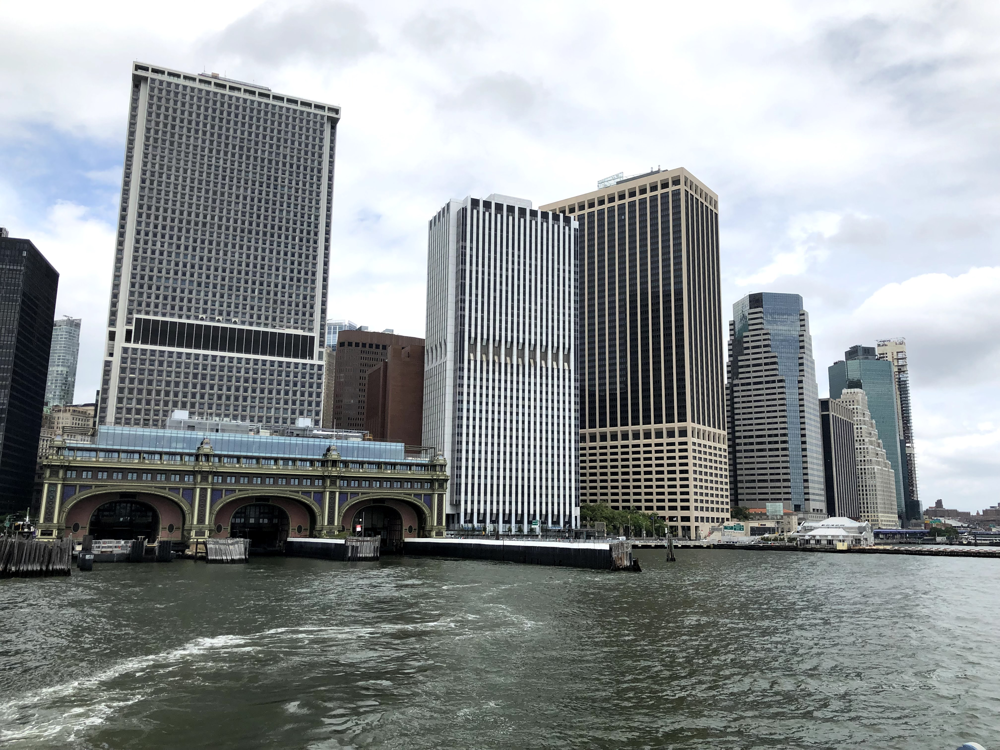
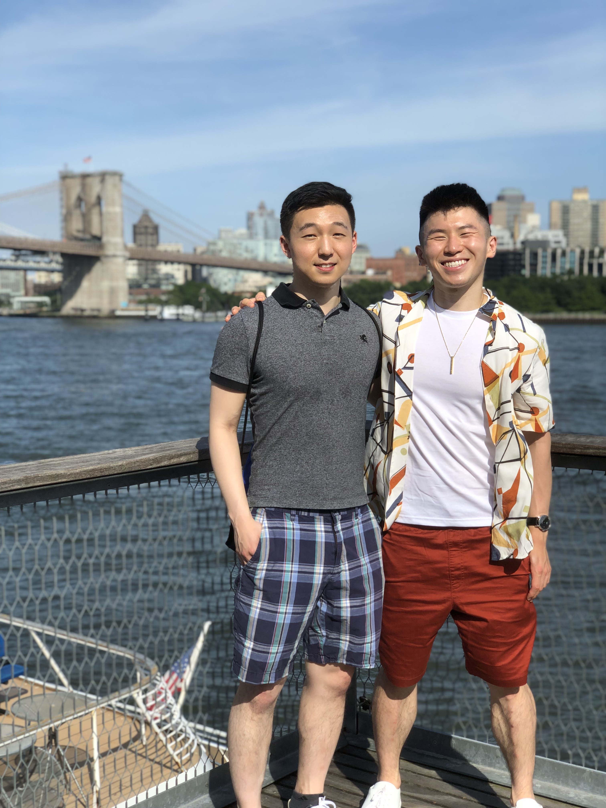

bet you liked that alliteration huh? ;)

\[exploring greenwich park, getting out of the house, DON'T mention the cold approach I did] 

![[something about this being a quaint place]](../uploads/062121_greenwich_village.jpeg "[something about this being a quaint place]")

[going along the theme of organized spontaneity ... hip hop dance class was one of the best things I've joined so far. always wanted to learn how to dance better, and this summer being the summer of yes, i thought of pushing myself out of my comfort zone and learning, especially because its included in my gym membership![

[i've learned a lot about positive frames while here - i knew i was getting out of my comfort zone and have two left feet, but by going in with a smile no matter how goofy I looked, laughing at my badness and embracing it, then this positive energy reverberates through the room. its all about attitude. whenever facing something negative, facing it with humor and laughter goes a long way\

\[luckily, the people in the dance class are SO good and ALSO nonjudgmental - my mind was blown]

\[work - started off doing a lot of software dev, which honestly wasn't what I was looking for with this internship. however, i talked with my senior, and he said that he was willing to make it more business and strategy and client-facing, which i'm happy about. also have been trying to ask more questions at work. but other than that, work is kinda exhausting, just debugging all day]

\[kind of balancing the home life by also eating pre-cooked meals - pre-prepared ones, but trying to change it up each week]

![[description of meals here]](../uploads/062321_preprepared_meals.jpeg)

\[Also thought since it was the summer, I could say screw it, let's get a new haircut too! So I followed up on my lead from last weekend and went to see AJ at Village Cuts on a Wed evening as specifically recommended by Andrew, and yeah, he was WAY more open, hospitable, and cool than my other barber. it's funny how I met him - as i stepped up the stairs, i had to sidestep two guys on the stairs smoking. one of them even smiled at me. after stepping into the cuts place, i asked for aj, only to find out that one of the guys who smiled at me on the stairs was him!  I got into a conversation with him about his family and how he was from Kyrgyzstan, and apparently how we were both into building our own PCs! also talked about cool food spots in the city, and his life ever since moving here. super, super cool guy, also, he took almost a full hour to my haircut and was really methodical about it, taking his time, being precise. so my haircut was way better, and im definitely gonna come back]

\[weekday evenings I'm soooo busy. sometimes after working out and finishing errands and eating dinner, im not done until like 9 pm. but on those nights i push myself to go out, like on Thursday, when at 9 pm i decided to take a train up to midtown in a 24h cafe and chip away at my blogs. listened to radwimps and romanticized my experience]

\[or exploring might look more organized, like when i traveled halfway across the city to play on red clay tennis courts. i would've never explored this area before ... its more residential for sure, but its nice to see different parts of manhattan i would have never went to.]

\[this guy named Ming who graduated from Harvard reached out to me on FB, and while i only posted once in that group chat, i was surprised, bc i wasn't expecting much from it. but i was so so glad he did, because apparently we already had a really good mutual friend in one of my old bboy buddies, and i ended up having the time of my life that friday evening.]

\[i didn't find out until that morning that the courts weren't just normal tennis courts ... they were INDOOR RED CLAY courts. yes, you read that right, real, sliding, dirty, red clay.]

\[best part? the courts dont' require any additional fee and are FREE to the public if you have a permit ... i thought a place as elite as this would cost an additional $70/hr, but the permit was only $100 for the entire season, so its a STEAL.]

\[not to mention, the match itself was a mental slugfest. we went the distance for 2 hours, with me saving like 4 match points to clinch it 6-2 4-6 7-5. i was slipping and sliding, panting hard, hitting groundies ... it was an absolute blast, and i felt like a kid in a candy store. i was sooo happy and ming was a great hitting partner. in fact, he's probably one of the few guys who i've met who shares the same passion for not just playing tennis, but also WATCHING it super closely. it's probably too early to tell, but we might even go to the us open together, my first time going with a friend!! ain't that crazy to have finally met a fellow tennis affectionado.]

\[i was so tired that afterwards, despite wanting to go to an intern meetup at a bar, i decided to take it easy and sleep. it's important to pace myself. im learning how to organize daytime activities now, but when i turn 21 in the fall, ill learn nighttime activities as well.]

\[but in true new york style, the marathon wasn't over. on saturday, meg had invited me to governors island. so a .little after noon, i headed to meet her on the ferry there, and we were off.]

\[we ended up walking around and just hanging for a couple of hours. there was a cool food area with a ton of people, and, in the spirit of trying something new, I got some ethiopan food which I had never tried before (it was alright but i was glad i tried it out)]

\[but one of my favorite parts? sitting in the grass with meg on a picnic blanket, just people watching, chilling, staring at the sky in silence, taking it easy. there was even a harp player sitting on a nearby bench playing a few notes, adding to the ambience. an amazing change of pace from the frenetic lifestyle of the city.]

\[course, it was disrupted by a sudden burst of rain that hit the island and caused everyone to go scampering for cover under the giant arch, but hey, it was so nice while it lasted]

\[it was a great time visiting someplace new with a great friend and good company]

\[the crazy thing about new york is how much stuff u can do to add to a previously basic plan. i thought gov island would be it, but we both decided to say fuck it, let's get some food and dessert. so we stopped by a place called golden diner which was apparently really well-renowned, and got some food. walking around gov island does a number for your appetite.]

\[we chatted a lot, had fun talking, but overall, i think it was the desserts that stole the show]

\[that green tea coffee cake was godly. the symphony of flavors is indescribable ... i could go full anthony bourdain on that tiny piece of heaven.]

\[you know, i thought that would be the end of my day, and i felt ready to go home, but in a moment of spontaneity, i decided to go shopping for some clothes in soho. i had been meaning to get all my basic shirts colors from uniqlo for a while, but what i didn't expect was a short "window shipping" moment in zara to turn into a full two hour shopping fest.]

\[i had been searching for summer shirts in all types of stores for a long while .. the summery, fun ones ... to no avail. never did i think that zara would literally have EXACTLY what i was looking for. i finally feel like ive filled a hole in my wardrobe and can dress now for the heat.]

\[if there's a theme of the week, its being so busy that i didn't get any work done. that includes errands, blogs, online classes ... all of the stuff that kept me occupied at home. but honestly, i can't complain. i feel like im living way more at the moment]

\[normally sunday would be my days off to do these types of errands and recharge from being social, but this week was different, in that i spent most of sunday afternoon hanging out with Chris, an old YUCG president and buddy I hadn't talked to in a long while. that's been one of my minor goals this summer: catch up with old friends from university since so many of them are in the city! for this trip in particular, we went to the south street seaport, an area popping with bars, museums, shops, and other cool things, and a place i had always wanted to visit and a place that chris had never been to before.]

\[i went in with no plan, but i didn't need to ... there were so many things to do]

\[from getting FREE admission to a ship museum...]

\[and exploring the hull and decks like a true sailor...]

\[to walking around to see all the different bars]

\[to checking out all the stores in the dope mall]

\[to just soaking in the view of the skyline]

\[and just chatting about life, catching up, hearing about future goals, it was just a great way to spend a sunday afternoon in the city.]

\[its only in my brief moments of downtime i have time to do all of the little things needed to keep my life functioning ... cooking. laundry, groceries, errands, cleaning shoes, etc. but im glad that my busy-ness pushes into that time, because it means i'm really trying to make the most of my time here. sacrificing sleep for living a better, more stimulating life.]

\[some type of heartfelt and thoughtful conclusion here]

P.S.

\[as for romance - propelled by dating app successes ... its a real drag getting dozens and dozens of ghosts, but pushing through, keeping my head up. u miss 100% of the shots u don't take, even if the chances are low. it's all about not taking these ghosts too seriously or personally ... it's hard, but its something i have to keep reminding myself of. also some first dates this week??? will keep u updated xoxo]