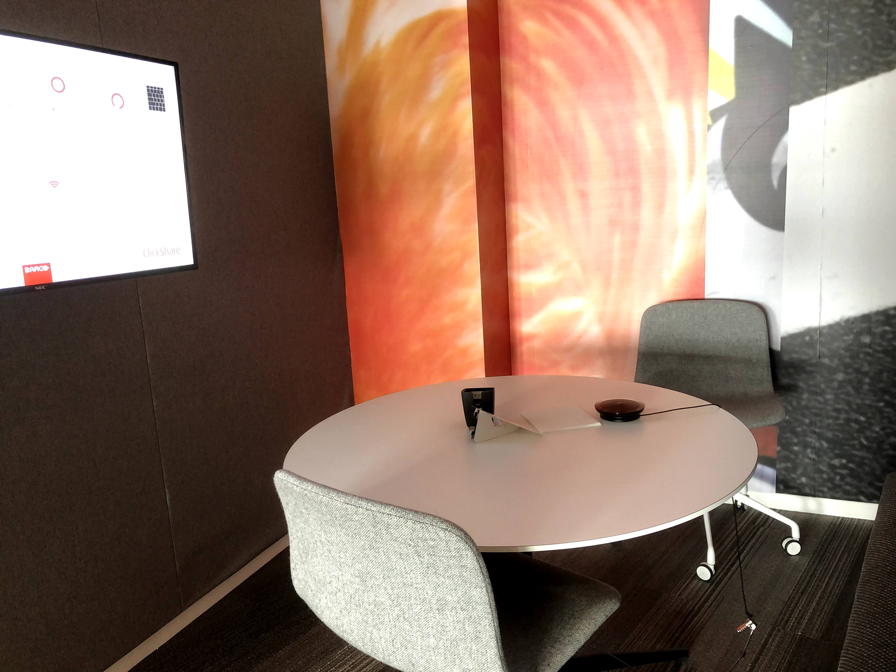
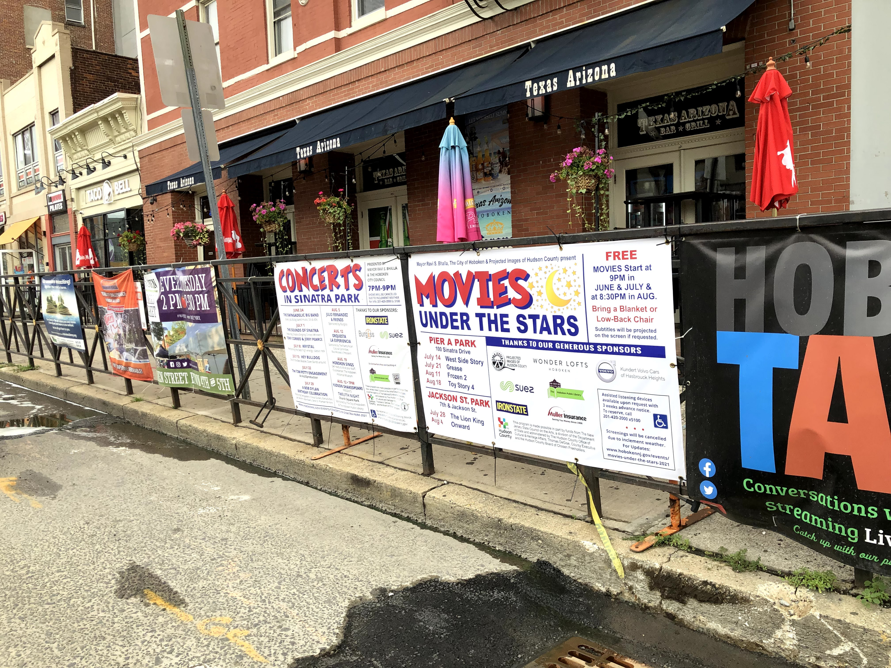
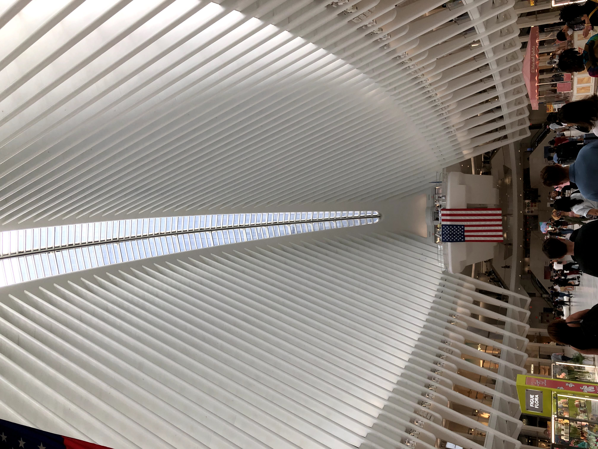
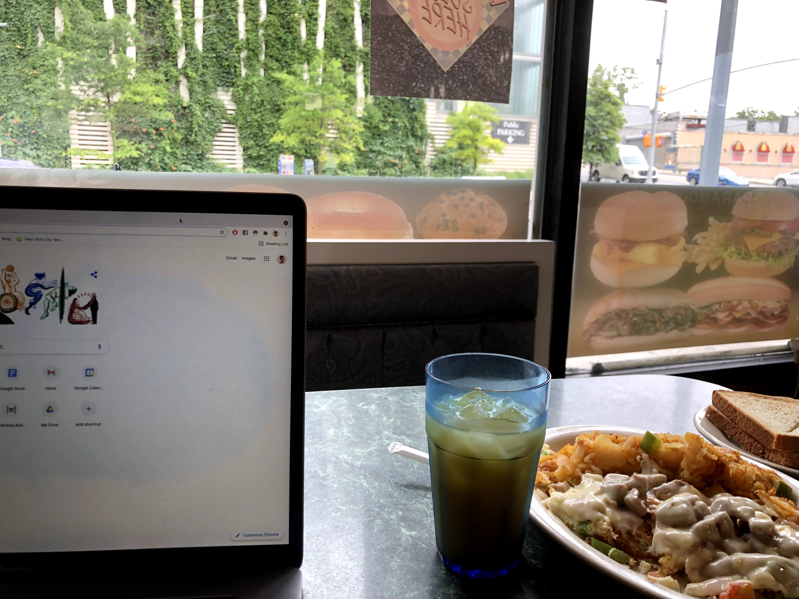
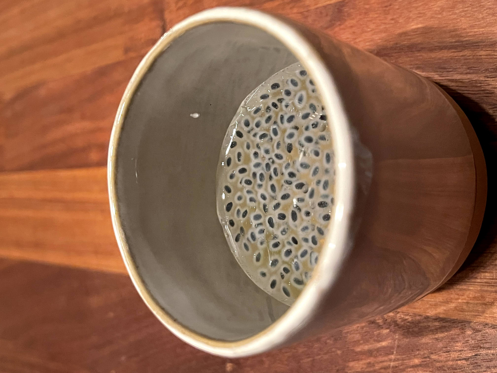
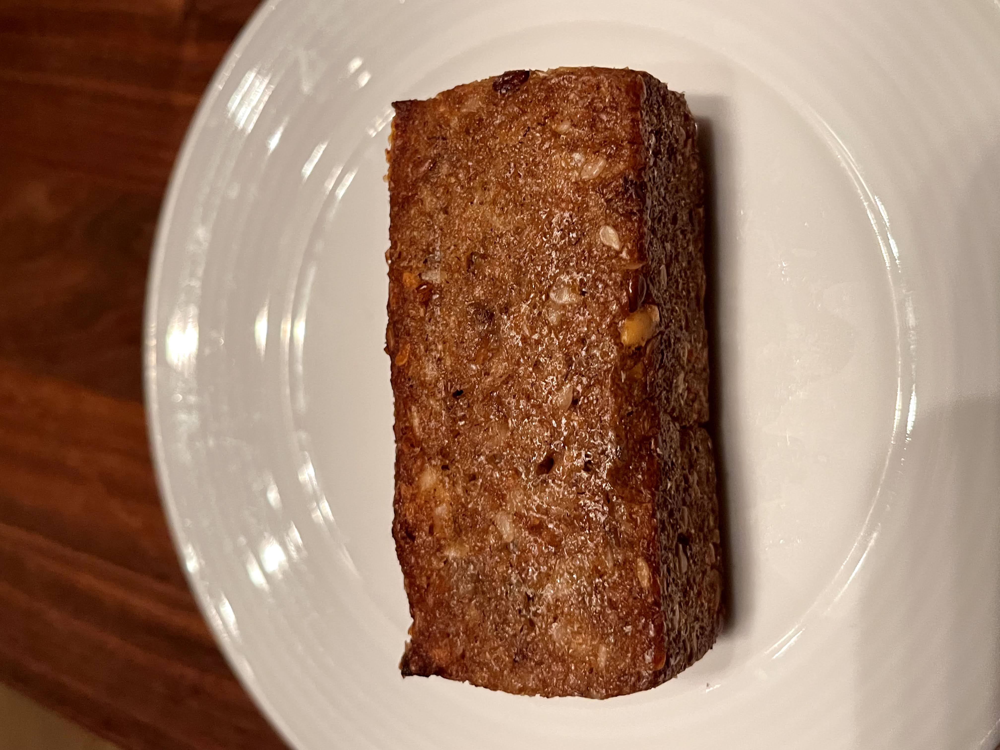
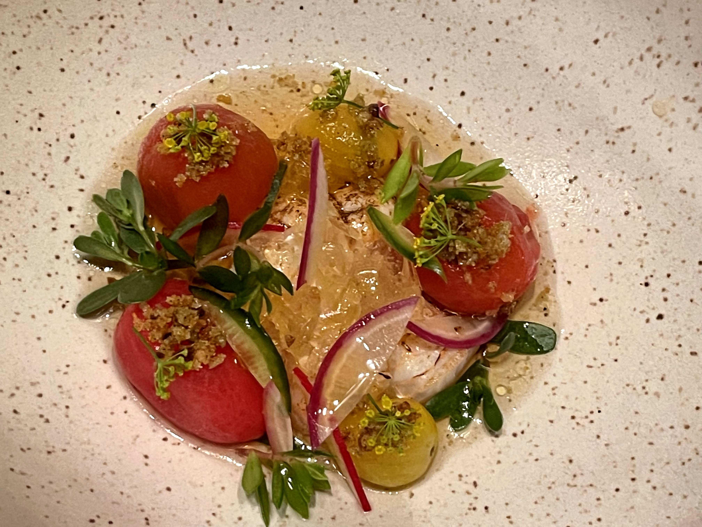
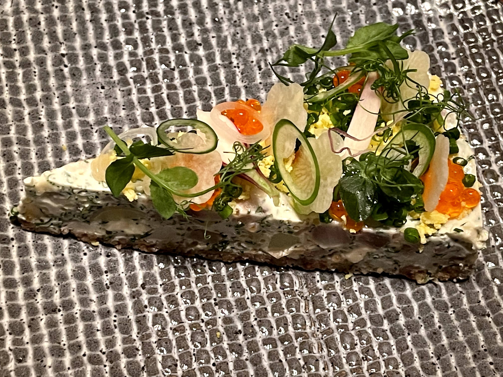

A massive heat wave hit the city this week, with temps pushing into the high 90s, and as my friend Meg put it tongue-in-cheek, it's "Your first NYC heat wave <3." After weathering the bitterly cold upstate winters all year, it caught me off guard to be so close to nature's might by being outside again. But honestly, the heat really wasn't that bad by dressing appropriately - it was more than manageable, in fact. I'm glad I got my summer clothes early, because I would be suffocating in jeans and jackets.

Not to mention, it was gorgeous outside.

I could only take so much gorgeousness though before needing to escape to some air-conditioned haven, though. Luckily, this cute Italian pastry shop I found in SoHo did the trick. Perfect place to sit down, enjoy a light dessert, and blog for a couple hours.

Things got spicy again when I headed to my hip hop dance class on Tuesday, and we learned a new set of moves. This week, feeling more comfortable, I actually started getting the hang of it. It helped that no one else had done this set of moves before, but also, I just think practice makes perfect, and Russell (the teacher) was great at taking the class at a slower pace. It was also, as always, so dang fun, and got me buzzed afterwards. 

Skipping over Wednesday for now, let's go to Thursday. Decided to go to an intern hangout in the Hoboken office, and wowie, I'm glad I did. 

After spending a year WFH, I couldn't believe how much I loved returning to one. I'm more productive - having three monitors is soo helpful, along with a dedicated place to work. I'm more happy - being around people and having small talk are things I really missed as an omnivert. And finally, the professional opportunities - it is SO much easier to do coffee chats and hallway conversations this way than scheduling it on a calendar.

Not to mention, the office is just damn aesthetic. Photo dump incoming.

\[I wanted to get out of the apartment, so I headed to office again on Friday after seeing how much I loved it. events in hoboken setup]

\[something about it being ominous that the office was empty ... although the view was amazing]

\[as for other amazing views, I stopped by the WTC subway station on the way back from the office, and was thrilled to finally see the Oculus]

[That was pretty much the end of my self-exploration though, as I spent the rest of the week with other people. My mom was in town since Thursday, so after a busy work day on Friday, we headed for some touristy sites. Mom loves flowers, so she wanted to visit the New York Botanical Garden. Personally, I'm not a big fan, so we mutually agreed to split up, with her walking around without me as baggage while I headed to a cafe to catch up on some work, including blogs. It was an hour commute, but it was great to get out of the Manhattan area.

If breakfast was simple, though, dinner was anything but. Mom and I are huge foodies, so we went to a Michelin 2-star Scandanavian restaurant called Aquavit for dinner. We were both gonna get the 5-course tasting menus, but we decided to split two prix-fixe three-course menus for the variety and price. Needless to say, it was absolutely insane in quality, and I just closed my eyes and enjoyed the depth and dimension of flavors in each dish.

