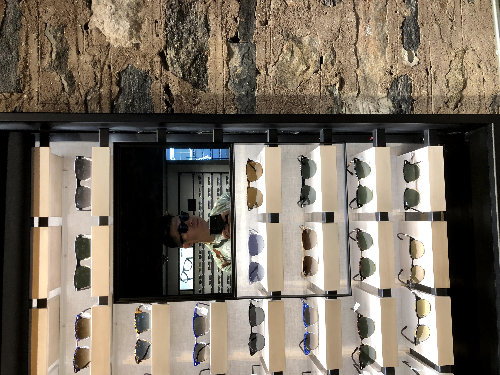
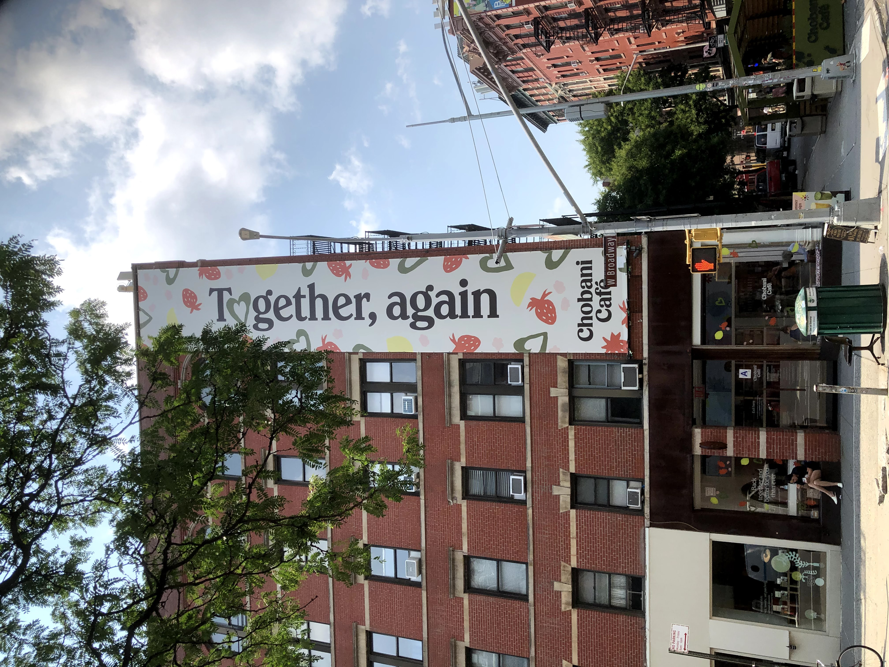
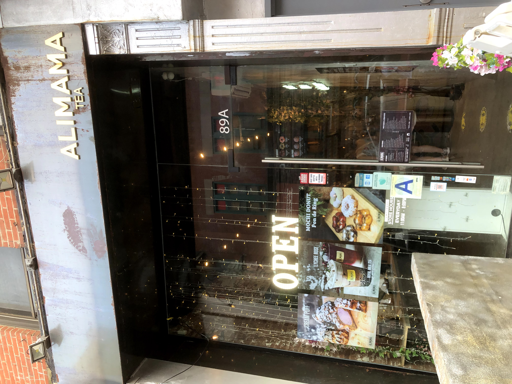
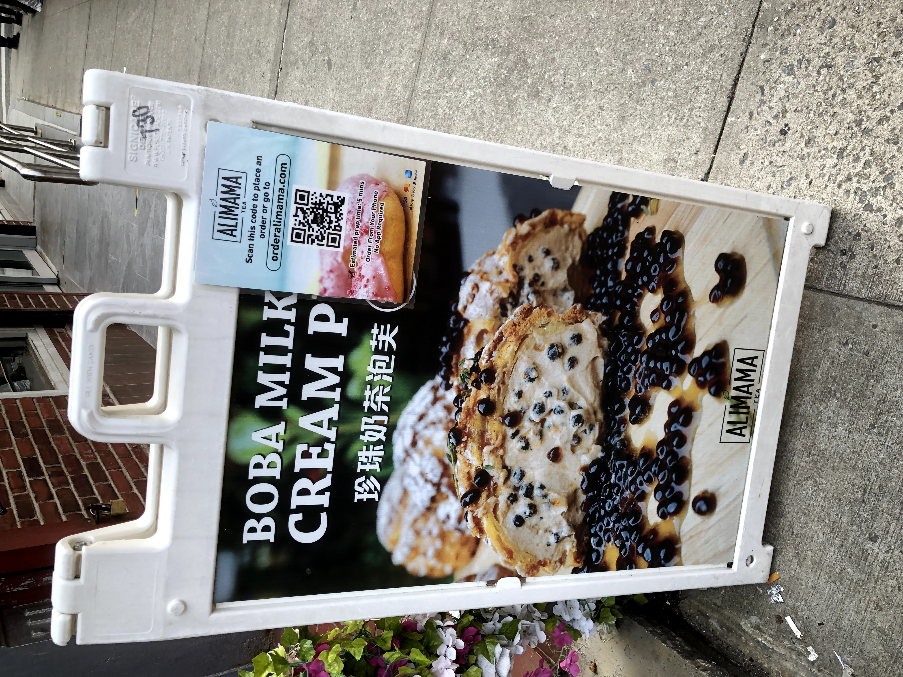
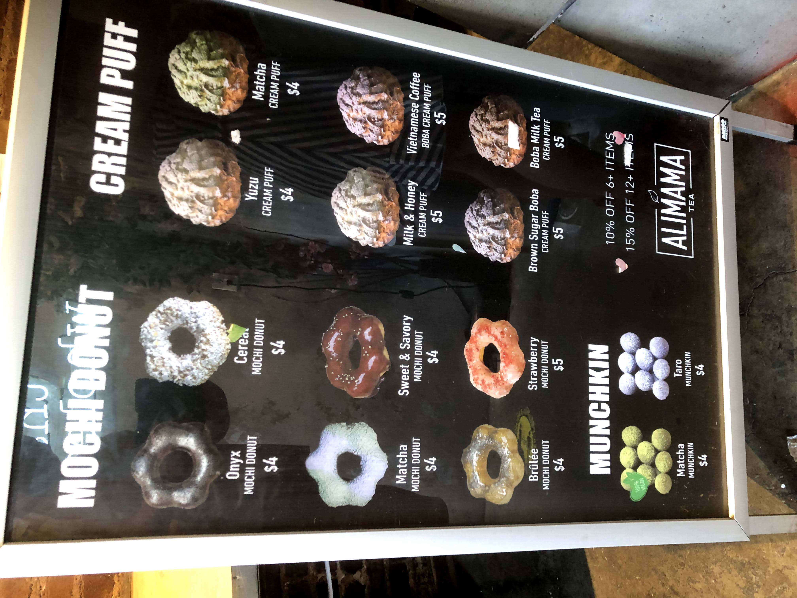
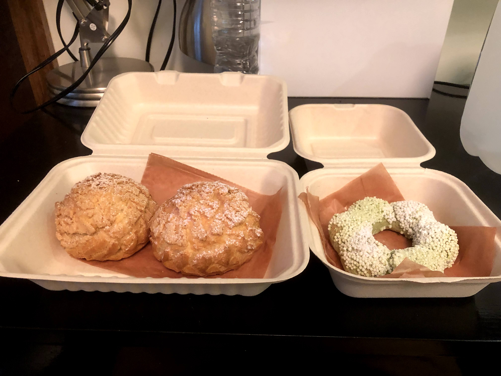
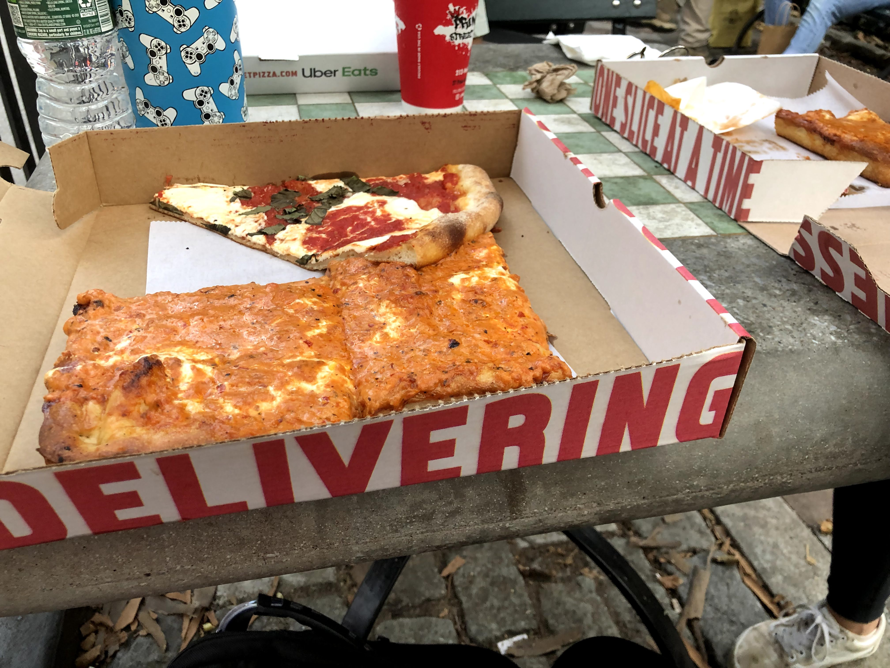
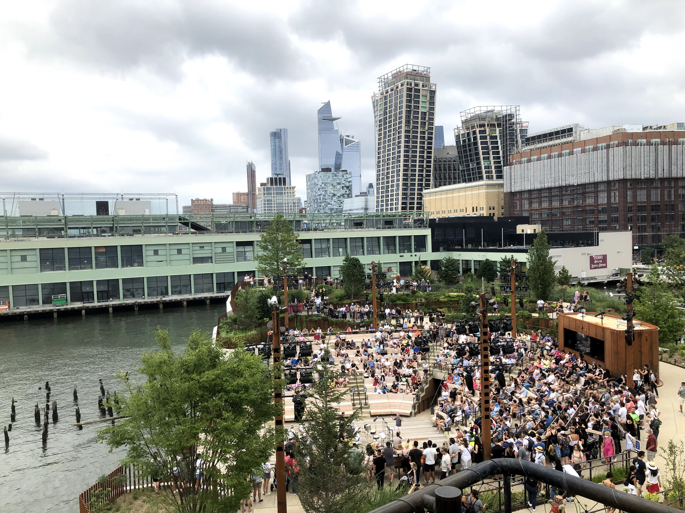

I didn't think it was possible to peak into my summer experience this early on, but I think I've done so. I've never been higher -- quite literally -- in terms of quality of life, busy-ness, and stimulation. Those are all qualities of my ideal lifestyle, and I think this week was a microcosm of that.

As always, an insane week always starts with a slow ebb, and Monday was no exception. It was filled with rather tedious errands, chilling, and by little actions that would have larger repercussions later in the week. 

Those little moments of downtime and normalcy, though, were so critical for holding together my life during the crazier, more spontaneous moments. Calm and crazy, productive and unproductive, they work together like yin and yang, where you can't have one without the other. Well, maybe you could have unproductivity without productivity :) but thats besides the point ... all I have to say is that these little non-insane highlighted moments are important.

But in any case, by the middle and latter end of the week, things started to shift away from productivity and towards the exploratory end of the spectrum. For example, while going on a couple first dates, I ran into a bunch of areas I didn't even know existed ... what a pleasant surprise!

My favorite place was trudging around Chinatown while feeling gloomy on a Wednesday evening, and remembering a wicked cool place I had seen on IG...

They had ... and yes, you're seeing this right ...

Boba and other Asiatic-flavored cream puffs and mochi donuts?? I could die in heaven right now. Diet that I am on, I couldn't resist trying out some of the unique flavors, and it was totally worth the extra cals.

In order of increasing oishi-ness, it would be matcha mochi donut, boba cream puff, and milk and honey cream puff. I was actually surprised that I wasn't blown away by the boba cream puff -- it tasted good, don't get me wrong, but there was no "wow" factor. It tasted just like boba in a donut. BUT, the milk and honey cream puff ... now THAT was absolutely delicious. I'm a sucker for dairy, and the cream was nothing like I had ever had before. Even if the others were more of a novelty, that one was a 10/10, must try. Definitely gotta go back at some point to try the other flavors.

# outside of comfort zone

Changing topics, that same night I indulged in those asiatic flavors from wonderland, I also stumbled upon one of the most inspiring TED talks I had seen a while. "What I Learned from 100 Days of Rejection" popped up in my YT recommended, and I watched it, not expecting much. But it ended up resonating with me on multiple wavelengths. 

<iframe width="560" height="315" src="https://www.youtube.com/embed/-vZXgApsPCQ?rel=0" allow="accelerometer; autoplay; encrypted-media; gyroscope; picture-in-picture" allowfullscreen></iframe>

I've always been held back my fears; fears of heights, of performance, of making scenes in public, of failure. My friend Kevin put it aptly when he said that the kids who get into places like Yale aren't accustomed to failing, or else they wouldn't be in the place they are now. And for me, it couldn't hold up more truly. I've been afraid of failing since I was a kid, and despite an external facade of success, failure has stung me on multiple occasions. Like even though I got into Yale, getting rejected from UPenn, my ED school, despite having legacy and being statistically "easier" to get into, was one of the most crushing moments of my life. I remember bursting into tears that night, and never wanting to experience that feeling again.

The thing is, failure is one of the most important catalysts for self growth, and it's been the one area of my self-development that I haven't worked on as consciously. Adopting a healthy attitude towards self-growth. And the only way to develop that type of internal courage and strength is through confronting it head on. 

That's what drew me to this video so much. [The 100 Days of Rejection Therapy](https://www.rejectiontherapy.com/100-days-of-rejection-therapy) is an **actionable** plan to directly confront one of my deepest mental obstacles. It's silly on the surface, but actually incredibly meaningful and brave. I left my Wednesday night inspired and ready to step out of my comfort zone.

And the very first place to start was my fear of heights, through skydiving. Although to be honest, the signs did not look good all week. It was raining, with a tropical storm coming through New York, hitting hard and even [flooding the subways](https://www.nytimes.com/2021/07/08/nyregion/flooding-subways-nyc.html). Not only was it a rocky start to the date I had that day, but it also put an ominous cloud (quite literally) over my Friday plans.

You see, I've always wanted to take skydiving off of my bucket list. I didn't ever think this would be the summer to do it, except I saw a reddit post one day in r/nycmeetups from a 18F girl who wanted to go skydiving with people. I didn't think much of it - in fact I laughed it off - but as I thought about it more, I started to change my mind. If my goal this summer was to be a summer of yes, to embrace spontaneity ... what was holding me back? I could think of a few reasons to say no - the sketchiness of going with strangers - but also a million reasons to say yes. 

I weighted the risks and potential rewards. What was I risking? One lost day of spending an awkward time with people I didn't really like. The potential rewards? An epic story after my summer after a year locked up at home, skydiving with strangers from Reddit.

So on Friday morning, on a rainy, overcast day in New York, I headed from my apartment on a fateful trip to GCT (Grand Central Terminal). My mind was filled with doubts. I had already had four friends who had initially committed drop out last second, due to personal reasons, weather, or something else. Was I making the right choice by going alone? What if these strangers flaked? or were creeps? or were weird people? What if it rained? What if I wasted my money? What I had to spend the next few hours of my day hanging out awkwardly with people I didn't want to be with? Was I making the right decision?

There I was, hanging out in the main lobby, waiting for these three mysterious strangers, who I only knew by usernames and first names, to come by. I tapped my foot, waiting, wondering. And then I felt a tap on my shoulder. It was a relatively short, Asian girl with glasses looking inspectively at me. "Are you Jeff?" with a crinkle in her eyes giving away a smile under her mask. She looked completely normal! I smiled, and said yes. I had met the first Redditor!

The other Redditors started to fall in. Fun, a tall, energetic guy in his late 20s. Das, a mid-20s chill guy who worked in tech. And Sarah, a quirky 18 year old with an insatiable desire for thrill.

Soon we were off. The skydiving ranch was in upstate NY, and I thought the two hour train ride up to Poughkeepsie would be awkward and closed off. But no - we VIBED. Far from the introverted recluse, these Redditors were some of the most extroverted people I'd met. It was unbelievable. We went from playing cards to sharing our excitement about thrills to talking about relationships. The train ride passed by in no time -- in fact, we missed our initially planned train stop because we were having such a blast.

As we grabbed lunch in a sushi place, we looked outside and couldn't believe our luck. The overcast skies in the city from the morning were clearing up, being replaced by a clear blue sky. Our hopes were alive! Squeezing into a Lyft car, we were off to the races.

It didn't really hit that we would be jumping out of a plane until I saw just how gorgeous the weather was when I got to the skydiving place. It was probably once after I had geared up, met my instructor Igor with 37+ years of experience, and prepared to board the plane, that I realized: the dream was taking on a whole new dimension of reality. 

I felt my heart fill with wonder and excitement as we ascended 2500, 5000, 7500 feet into the air, glimpsing sweeping views of Poughkeepsie and the Hudson River...

And also melt into a flicker of nervousness as we got to the "red zone" of 13,500 feet, the jump off zone.

But when the moment came, that flicker surprisingly didn't rage into an inferno as I watched Das jump off, and feel my own body inch closer to the precipice.

Perhaps it was just done so fast that I didn't have time to process. In any case, all I remember was the sensation of freefalling through the air, plummeting and feeling my ears pop from the pressure change.

The dive was INSANE ... I've never felt so much air whoosh against my body before. I could barely keep my eyes open from the force of it against my goggles.

To be honest, it was an uncomfortable feeling, and I think I'd have to go again to truly enjoy the freefall. But once the parachute was released, I re-entered familiar territory. It was paragliding, just like in Taiwan more than a year ago... just a couple extra thousand feet in the air.

It was at that point that I could finally start to really enjoy the experience. We swooped and dived, glided and admired, and even touched and tasted a cloud! all while we inched closer to the ground.

And as I landed, I and the others felt a rush of emotions hit me: the wonder, the joy, the disbelief that a group of strangers that had met just a few hours ago had just pulled it off.

What a thrill of a day. As we Ubered back, I passed out in the car- my introverted omnivert batteries needed a recharge. But the day wasn’t over, because as we headed back on the train to the city, we decided to grab some food to extend the day together. While Fun had to leave, Das, Sarah, and I decided to head to SoHo’s best pizza place: Prince Street Pizza. 

I was STARVING, so the vodka pizza from one of the best pizza places in NYC absolutely smacked. After searching for 20 minutes, we eventually found a park nearby, settled, and proceeded to chat until the night fell. Yep, until 9 pm, and we were physically kicked out of the park. It was a chat with silliness, roleplaying, relationships, goals… and just a great time with unlikely friends in a big city. 

As I conked out on my bed that night after returning home, all I could think of was all my doubts at the beginning, and just how crazy it would have been to have went home early from the rain. This was the BEST risk I couldd have taken, and I would have never imagined I would have actually jumped, vibes, and actually connected with a complete group of strangers. Just WOW. I was on top of the clouds … just so happy.

# winding do... or so you thought

But if you thought I would end one of the most thrilling, stimulating days of my life with something easy, you’re totally wrong. No, for the next two days, I would end up walking around the city with a dear friend of mine from the past: Yunnie, my co-mentor from teaching abroad in Tokyo two summers back. She was in town from Boston, and she crashed at my place for the weekend as I brought her to all of the coolest spots in the city. When we met, I somehow mustered the energy to vibe with Yunnie right off the bat (thanks Jake for my healthy nutrition + exercise plan!), and it was like we had never split up from that fateful teaching camp all those years ago.

We explored, and I brought her to all of my favorite spots in the city, along withs one new ones.

