I didn't think it was possible to peak into my summer experience this early on, but I think its happened. I've never been higher -- quite literally -- in terms of quality of life, busy-ness, and stimulation. In other words, I think this week was a microcosm of my ideal and dream lifestyle.

As always, an insane week always starts with a slow ebb, and Monday was no exception. It was filled with  tedious errands, general chilling, and by little actions that would have larger repercussions later on. 

Those little moments of downtime and normalcy, though, were so critical for holding together my life during the crazier, more spontaneous moments. Calm and crazy, productive and unproductive, they work together like yin and yang, where you can't have one without the other. Well, maybe you could have unproductivity without productivity :) but thats besides the point ... all I have to say is that these little non-insane highlighted moments are important.

But in any case, by the middle and latter end of the week, things started to shift away from productivity and towards exploration. For example, while going on a couple first dates, I ran into a bunch of areas I didn't even know existed ... what a pleasant surprise!

My favorite gem was trudging around Chinatown while feeling gloomy on a Wednesday evening, and remembering a wicked cool place I had seen on IG...

They had ... and yes, you're seeing this right ...

[Asiatic-flavored cream puffs and mochi donuts](https://www.alimamanyc.com/)?? I could die in heaven right now. Diet that I am on, I couldn't resist trying out some of the unique flavors, and it was totally worth the mini cheat day.

In order of increasing oishi-ness, it would be matcha mochi donut, boba cream puff, and milk and honey cream puff. I was actually surprised that I wasn't blown away by the boba cream puff -- it tasted good, don't get me wrong, but there was no "wow" factor. It tasted just like boba in a donut. BUT, the milk and honey cream puff ... now THAT was absolutely delicious. I'm a sucker for dairy, and the cream was nothing like I had ever had before. Even if the others were more of a novelty, that one was a 10/10, must try. Definitely gotta go back at some point to try the other flavors.

# outside of comfort zone

Changing topics, that same night I indulged in those asiatic flavors from wonderland, I also stumbled upon one of the most inspiring TED talks I had seen a while. "What I Learned from 100 Days of Rejection" popped up in my YT Recommended, and I watched it, not expecting much. But it ended up resonating with me on multiple wavelengths. 

<iframe width="560" height="315" src="https://www.youtube.com/embed/-vZXgApsPCQ?rel=0" allow="accelerometer; autoplay; encrypted-media; gyroscope; picture-in-picture" allowfullscreen></iframe>

I've always been held back my fears; fears of heights, of performance, of making scenes in public, of failure. My friend Kevin put it aptly when he said that the kids who get into places like Yale aren't accustomed to failing, or else they wouldn't be in the place they are now. And for me, it couldn't hold up more truly. I've been afraid of failing since I was a kid, and despite an external facade of success, failure has stung me on multiple occasions. Like even though I got into Yale, getting rejected from UPenn, my ED school, despite having legacy and being statistically "easier" to get into, was one of the most crushing moments of my life. I remember bursting into tears that night, and never wanting to experience that feeling again.

The thing is, failure is one of the most important catalysts for self growth, and it's been the one area of my self-development that I haven't worked on as consciously. Adopting a healthy attitude is critical. And the only way to develop that type of internal courage and strength is through confronting it head on. 

That's what drew me to this video so much. [The 100 Days of Rejection Therapy](https://www.rejectiontherapy.com/100-days-of-rejection-therapy) is an **actionable** plan to directly confront one of my deepest mental obstacles. It's silly on the surface, but actually incredibly meaningful and brave. I left my Wednesday night inspired and ready to step out of my comfort zone.

And the very first place to start was my fear of heights, through skydiving. Although to be honest, the signs did not look good all week. It was raining, with a tropical storm coming through New York, hitting hard and even [flooding the subways](https://www.nytimes.com/2021/07/08/nyregion/flooding-subways-nyc.html). Not only was it a rocky start to the date I had that day, but it also put an ominous cloud (quite literally) over my Friday plans.

You see, I've always wanted to take skydiving off of my bucket list. I didn't ever think this would be the summer to do it, except I saw a reddit post one day in r/nycmeetups from a 18F girl who wanted to go [skydiving](https://skydivetheranch.com/) with people. I didn't think much of it - in fact I laughed it off - but as I thought about it more, I started to change my mind. If my goal this summer was to be a summer of yes, to embrace spontaneity ... what was holding me back? I could think of a few reasons to say no - the sketchiness of going with strangers - but also a million reasons to say yes. 

I weighted the risks and potential rewards. What was I risking? One lost day, spending time with people I didn't really like. The potential rewards? An epic story after my summer after a year locked up at home: skydiving with strangers from Reddit.

So on Friday morning, on a rainy, overcast day in New York, I headed from my apartment on a fateful trip to GCT (Grand Central Terminal). My mind was filled with doubts. I had already had four friends who had initially committed drop out last second, due to personal reasons, weather, or something else. Was I making the right choice by going alone? What if these strangers flaked? or were creeps? or were weird people? What if it rained? What if I wasted my money? What I had to spend the next few hours of my day hanging out awkwardly with people I didn't want to be with? Was I making the right decision?

There I was, hanging out in the main lobby, waiting for these three mysterious strangers, who I only knew by usernames and first names, to come by. I tapped my foot, waiting, wondering. And then I felt a tap on my shoulder. It was a petite Asian girl with glasses looking inspectively at me. "Are you Jeff?" with a crinkle in her eyes giving away a smile under her mask. She looked completely normal! I smiled, and said yes. I had met the first Redditor!

The other Redditors started to fall in. Fun (aka Alan), a tall, energetic guy in his late 20s. Das, a mid-20s chill guy who worked in tech. And Sarah, the quirky 18 year old with an insatiable desire for thrill.

Soon we were off. The skydiving ranch was in upstate NY, and I thought the two hour train ride up to Poughkeepsie would be awkward and closed off. But no - we VIBED. Far from introverted recluses, these Redditors were some of the most extroverted people I'd met. It was unbelievable. We went from playing cards to sharing our excitement about thrills to talking about relationships. The train ride passed by in no time -- in fact, we missed our initially planned train stop because we were having such a blast!

As we grabbed lunch in a sushi place, we looked outside and couldn't believe our luck. The overcast skies in the city from the morning were clearing up, being replaced by a clear blue sky. Our hopes were alive! Squeezing into a Lyft car, we were off to the races.

It didn't really hit me that we would be jumping out of a plane until I saw just how gorgeous the weather was when we got to the skydiving place. It was a brilliant blue. After a 40 minute wait filled with paperwork and gawking at the people in front of us gliding out of the sky, they called our team up one at a time. It was only once  I had geared up, met my instructor Igor who had 37+ years of experience, and prepared to board the plane, that I realized: the dream was taking on a dimension of reality. 

As the plane shuddered and pushed off the tarmac, I felt my heart fill with wonder and excitement as we ascended 2500, 5000, 7500 feet into the air, glimpsing beautiful sweeping views of Poughkeepsie and the Hudson River...

And also sensed a flicker of nervousness appear as we got to the "red zone" of 13,500 feet, the jump off zone.

But that flicker surprisingly didn't rage into an inferno, even after I watched Das jump off, and felt Igor urge my own body closer to the precipice.

Perhaps it was just done so fast that I didn't have time to process. In any case, all I remember was a sudden heave, and then the sensation of freefalling through the air, feeling my ears pop from the drastic pressure change. I was skydiving!

The dive was INSANE ... I've never felt so much air whoosh against my body before. In fact, I could barely keep my eyes open from the force of it against my goggles.

To be honest, it was an uncomfortable feeling, and I think I'd have to try again a few times before truly enjoying the freefall experience. But once the parachute was released, I re-entered familiar territory. It was paragliding, [just like in Taiwan more than a year ago](https://www.jeffreyyu.me/2020/06/01/a-week-that-had-it-all/)... just a couple extra thousand feet in the air.

It was at that point that I could finally start to really enjoy the experience. We swooped and dived, glided and admired, and even touched and tasted a cloud! all while we inched closer to the ground.

And as I landed, a rush of emotions hit me: the wonder, the joy, the disbelief that a group of strangers that had met just a few hours ago had just dove out of the sky together.

What a thrill of a day. As we Ubered back, I passed out in the car- my introverted omnivert batteries needed a recharge. But the hangout wasn't over, because as we headed back on the train to the city, we decided to grab some food to extend the day together. While Fun had to leave, Das, Sarah, and I decided to head to SoHo’s best pizza place: Prince Street Pizza. 

I was STARVING, so the vodka pizza from one of the best pizza places in NYC absolutely smacked. After searching for 20 minutes, we eventually found a park nearby, settled, and proceeded to chat until the night fell around us. Yep, for two straight hours until 9 pm, and only when we were physically kicked out of the park. It was a chat with silliness, roleplaying, relationships, goals… and a great time with unlikely friends in a big city. 

As I conked out on my bed that night after returning home, all I could think of was all my doubts at the beginning, and just how crazy it would have been to have gone home early from the rain. This was the BEST risk I could have taken, and I would have never imagined I would have actually jumped, vibed, and actually connected with a complete group of strangers. Just WOW. My head was in the clouds ... physically and emotionally.

# winding dow... or so you thought

But if you thought I would end one of the most thrilling, stimulating days of my life with something calm and restorative, you’re totally wrong. No, for the next two days, I ended up walking around the city with a dear friend of mine from the past: Yunnie, my co-mentor from [teaching abroad in Tokyo](https://www.youtube.com/watch?v=gk-naVek41Y&ab_channel=HLAB) two summers back. She was in town from Boston, and she crashed at my place for the weekend as I brought her to all of the coolest spots in the city. Somehow, I had enough energy to muster to hang out (thanks Jake for my healthy nutrition + exercise plan!), and we vibed like we had never split up from summer school.

What did we do? I brought her to all of my favorite spots in the city, along with some new ones.

One funny anecdote is that on the walk, I just happened to have things in my bag that Yunnie needed. In fact, this became a theme of the trip. For example, Yunnie’s feet were bruised from walking on the high line so much, but I had a pair of socks placed in there from days before. This was TOTALLY by coincidence, but I felt happy from unintentionally being a good host.

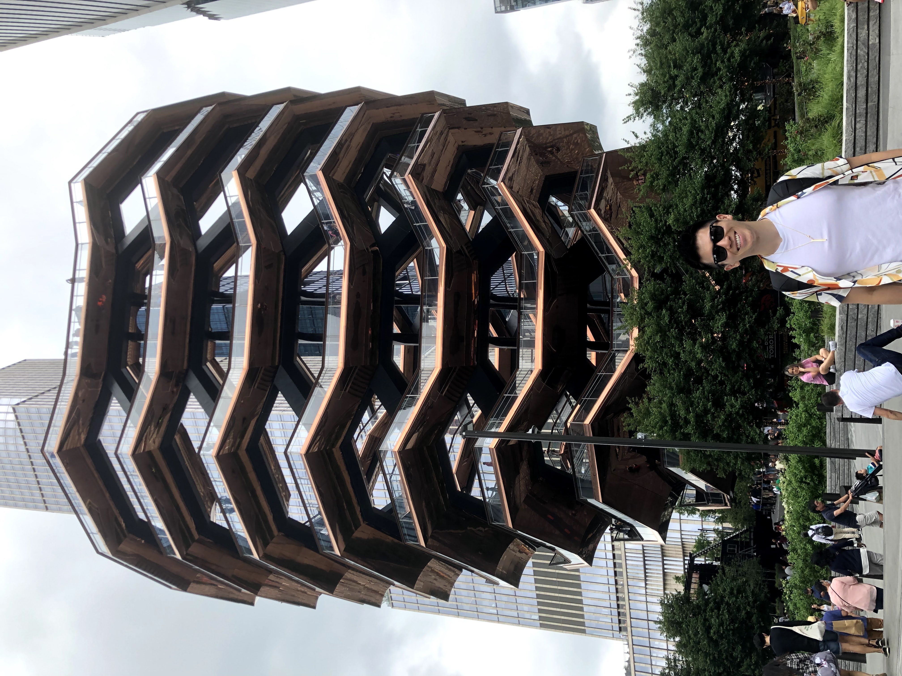

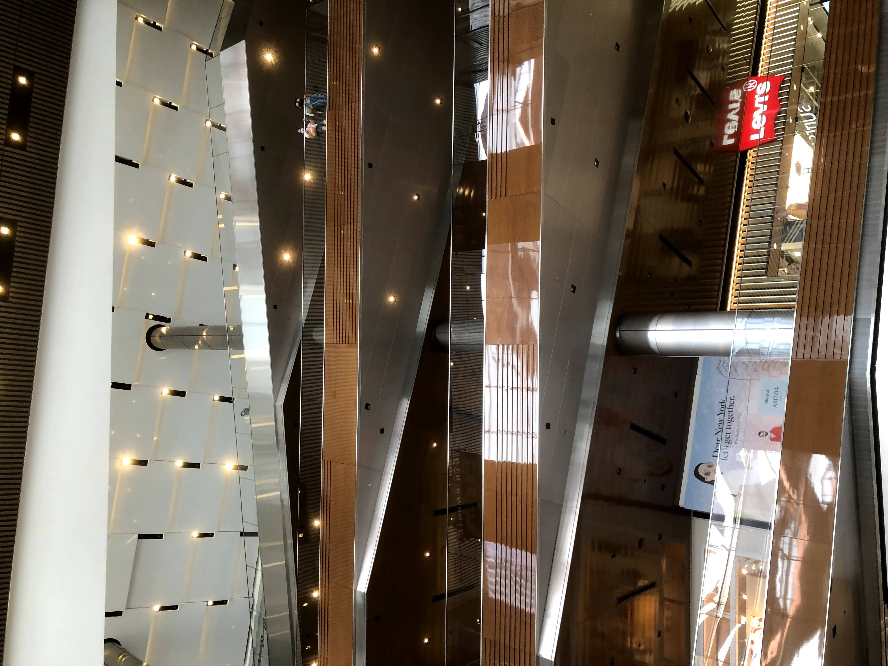

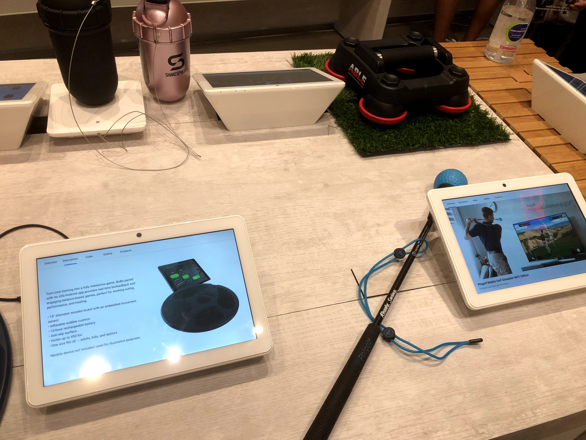

We walked home at that point, after waiting for a bus that was over FORTY FIVE MINUTES LATE. (\*rolls eyes at nyc metro transportation system\*) We had walked tens of thousands of steps, and talked for over four hours straight, and we both needed some rest time. For Yunnie, that meant passing out, and for me, that meant eating a meal in solitude and going to work out. 

Post-nap and post-workout, though, we had restored our health, and were ready to tackle our next escapade: Queens Night Market. 

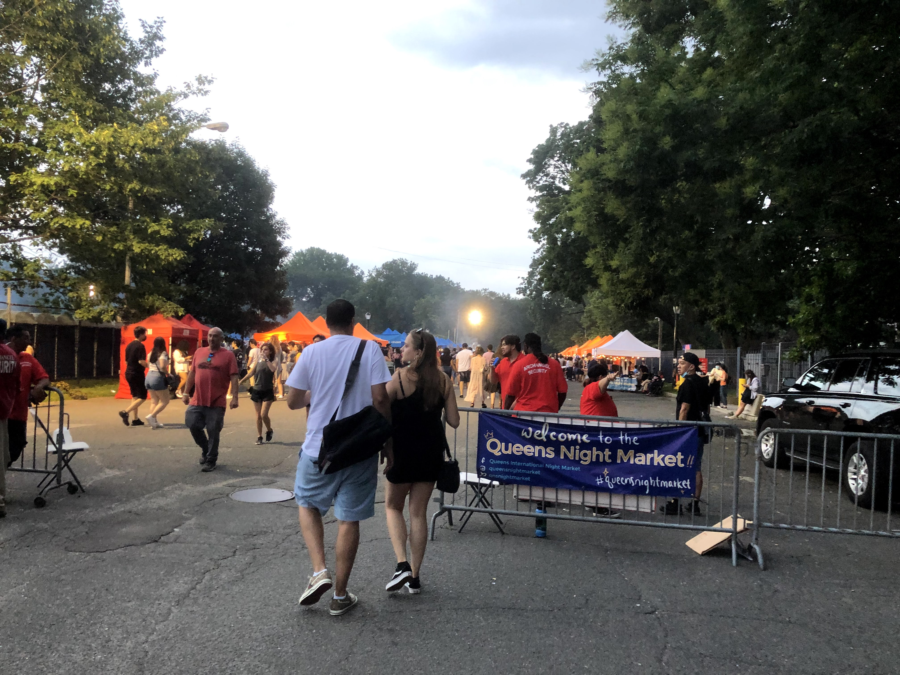

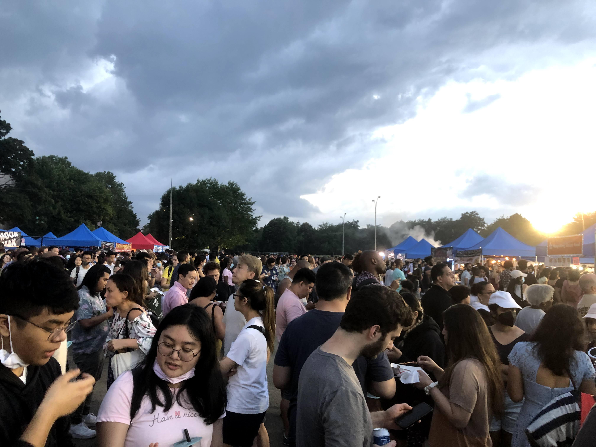

It was a night market like from Taiwan, but with a New York twist: the stalls represented cuisines from around the world.

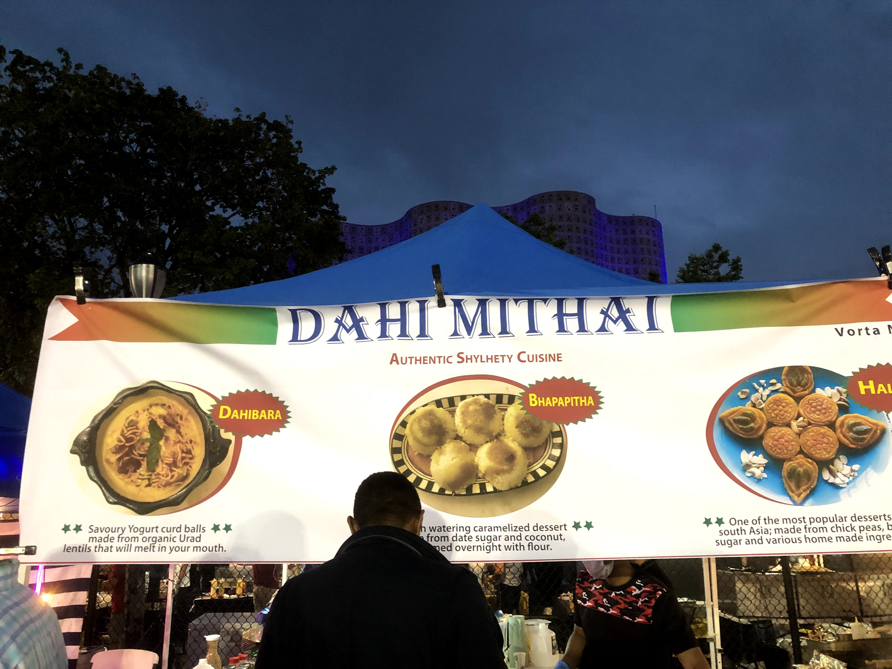

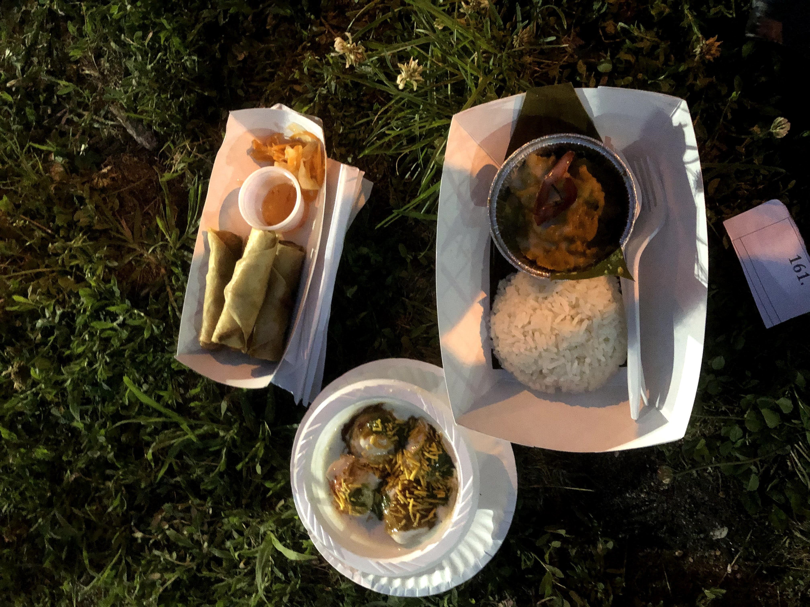

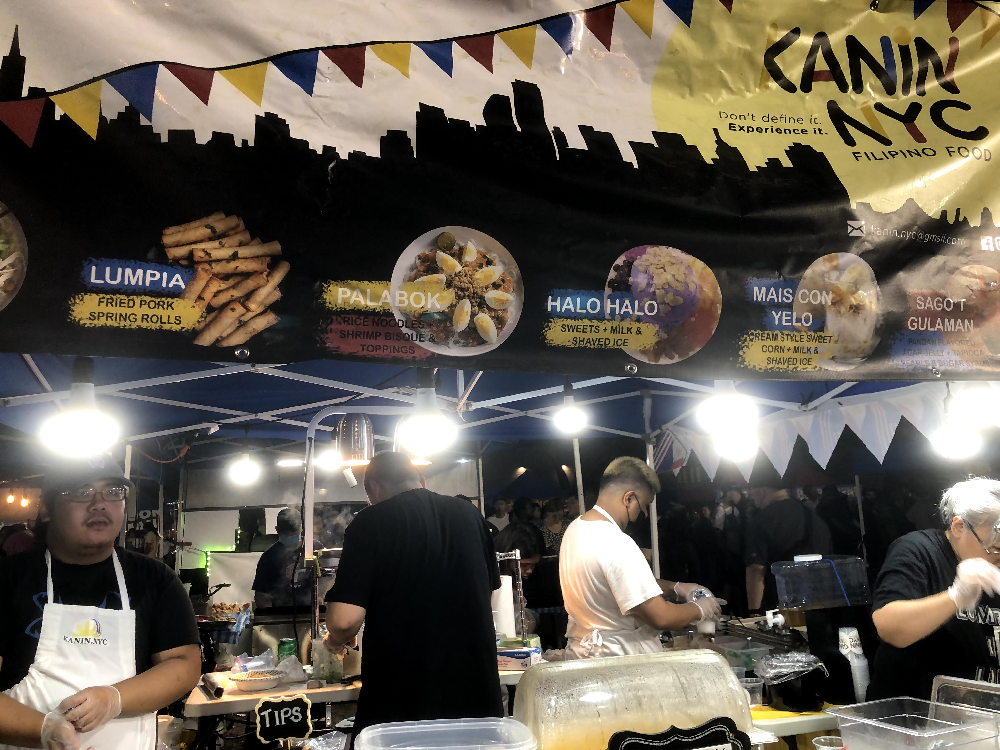

What a great way to bring things full circle. Two travelers trying cuisines from around the world, from Tokyo all the way to New York.

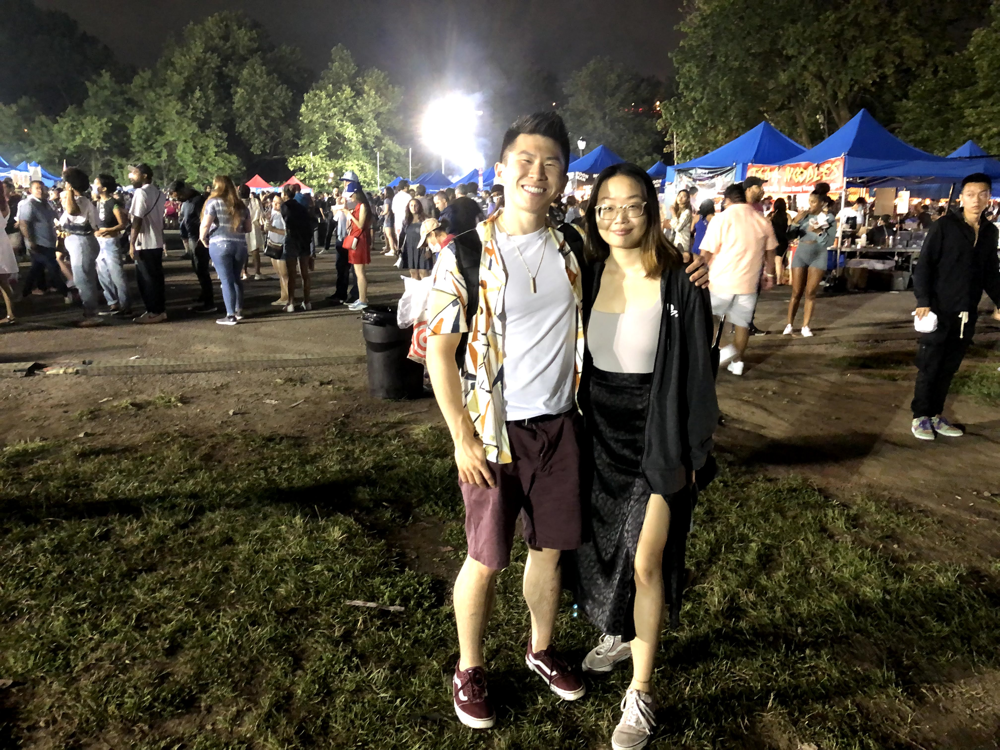

My favorite memories? Us vibing, and sharing our favorite characteristics in each other. Yunnie said I was a positive person with a ton of drive, and that made me smile because it was validation for what had been a long, uncertain two year journey. If only my high school self could see me now. And funniest memory? Yunnie being cold, and me conveniently having a jacket in my backpack in preparation for rain. Idk why, but those little coincidences made me laugh. I just like being a better host. Apparently my personality, [Protagonists](https://www.16personalities.com/enfj-personality), love to bring joy to other people. And that was certainly true for this weekend.

Saturday was the day that I hung out most with Yunnie, but even though we enjoyed hanging out together, I had a lot of other stuff on Sunday, and Yunnie had other friends she wanted to hang with. So that day, we parted ways temporarily. I was exhausted and sleep-deprived and needed some more low-energy time anyway.

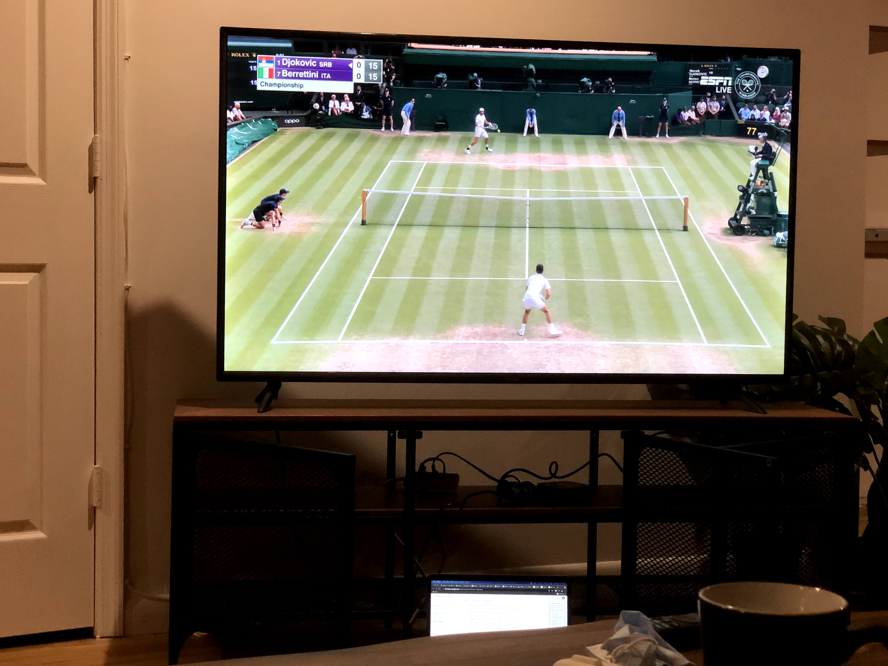

Beyond indulging in some high-quality grass court tennis, I used the free time to make a run to TJs and also head to my [first ever comedy improv class](https://magnettheater.com/class/improv-level-one/). There was an incredible diversity of people and skillsets, and it was SO fun. We played bonding games, maintained an upbeat vibe, and just had a blast. For once, I was actually itching to get on the stage - that’s how much I enjoyed it, which blew me away. Needless to say, it picked up my mood, and by the evening I was ready for another round.

But Yunnie was tired from a day of wandering around the city with other friends, and we ended our weekend with a chill meal. In particular, we went to a nearby Spanish tapas bar and got a fancy 6 tapas prix-fixe meal.

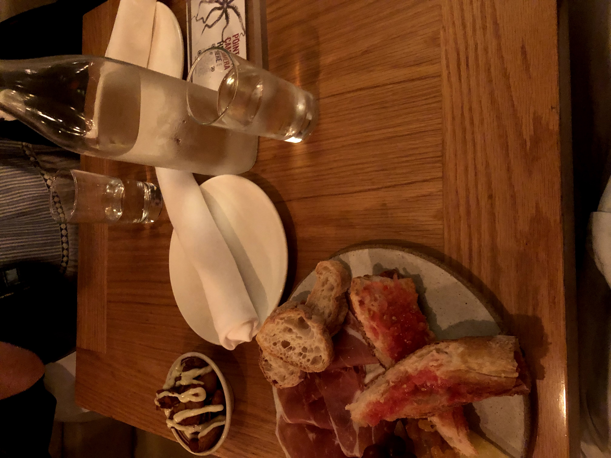

It was good, and a nice calm end to what was a rich week of diverse experiences.