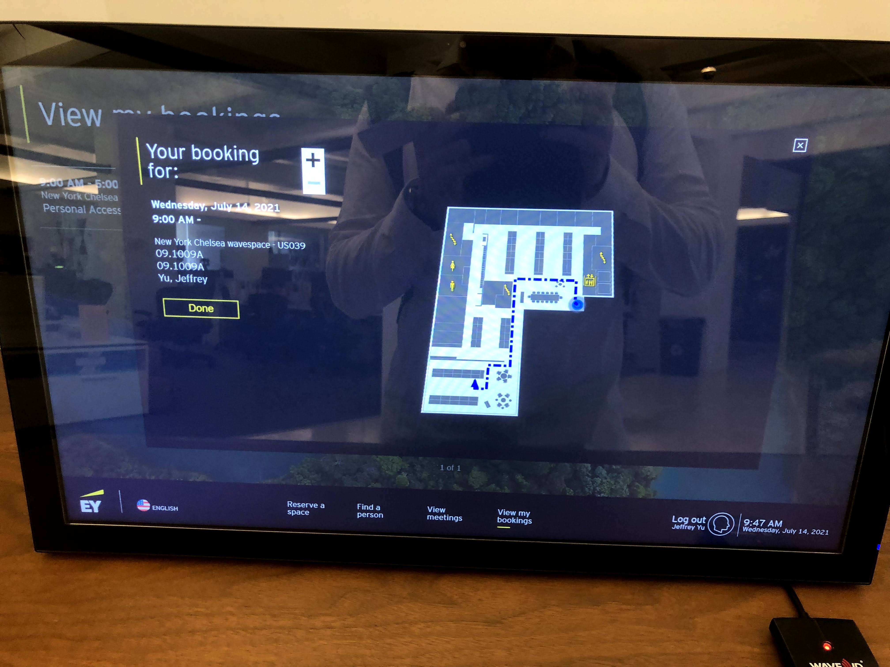
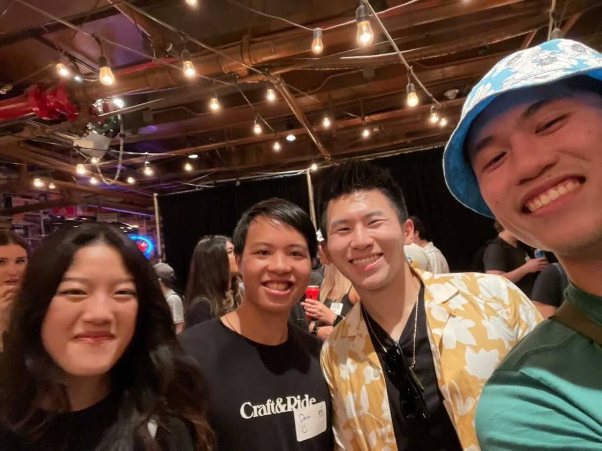

This week was not my best week, but that’s to be expected after peaking from such an insane week with skydiving. It started off slow and uneventful, with things simmering up in intensity up until the middle of the week.

I spent my Monday morning tidying to errands around the house, like opening packages, shipping stuff that Yunnie left behind after her stay, and such. I was going to go out to find cafe to work, but since I had to make up a workout, I decided to stay in for the evening to do my blog and reflection. 

Tuesday was a little bit more eventful, with dance being fun as always.  

Wednesday was when things started to pick up again. It turns out that one of EY’s offices in Manhattan is located in Chelsea, and its literally a sub-five minute walk from my house. It’s soooo convenient, and thus when I saw that there was a group setting up to go into the office, I knew there was no way I could pass up on the opportunity. While objectively, it wasn’t quite as nice as the Hoboken one, the location gave it a +10 in my mind. 

Plus, since it was a beautiful day, the views weren’t that bad …

And neither was the company that I hung out with that day :)

Post-Chelsea meetup work was a flurry of activity, consisting of changing out of work clothes, putting my dry-ice sealed meals into the freezer. Why was I in such a rush, you my ask? Well, because I had something new and exciting for the first time in a while … a social volleyball league! \[link to NYC social here]

In my search to be more social and keep my weeks more packed, I’d found this league online and decided, screw it, let’s join. It was pretty far from where I lived, located in Riverside Park, but it was the only one that really worked with my schedule. Also, I figured it gave me an excuse to visit a new part of the city (UWS) that I wouldn’t normally visit! 

On the walk to the courts (during which I got promptly lost), I was nervous about the type of people I would encounter, but everyone was pretty chill and semi-close to my age, in their 20s. There were university students, working professionals, but what was common to everyone was a sense of sociability and friendliness and encouragement. Even though I was really rusty at volleyball (don’t even get me started on my first serve), it was nice to know that people were there for reasons beyond the game. Everyone in particular was super high energy, and I felt myself matching that mood right from the get-go. It’s kind of crazy to think I was hanging out with extroverts after being an introvert not just two years ago. 

Things got really busy on Thursday. Not only did I start getting a lot of things to do at work, but my mind was pre-occupied with what would happen *after* work.

Normally don't touch upon dating that much in these blogs, but I’ll offer a small glimpse into what happened that evening. First of all, yes, I’ve been going on dates throughout all these blogs, although I’ve omitted pictures of the girls out of confidentiality, of course. Basically, my strategem for dating has been to visit places on my list of 101 things to do that I’ve never been to. It’s not only fun for me, but it gives an excuse to bring my date to some really cool places in the city. For today, I visited the Vessel, a spiraling honeycomb structure in Hudson Yards, a self-proclaimed blueprint for an idealistic city. The neighborhood features shops, parks, eco-friendly office buildings, but this public structure in the center is the most iconic.

As someone afraid of heights, I won’t lie and deny that I was sketched out walking up to the top. Even after skydiving from 13,500 feet just the week before, this felt … different.

But I can’t deny that the views were absolutely gorgeous.

The nice thing about the Vessel is that it’s also right next to the High Line, an iconic hybrid urban-nature walkway that stretches from Hudson Yards all the way to Chelsea. A romantic place to take for a nighttime stroll, and also a wonderful place to geek out about the city at night.

Friday was equally packed and intense. It was the day of the long-awaited EY mid-internship social. The 3 hour event was the first (and likely only) in-person internship event hosted officially by EY, and it was a group scavenger hunt around Greenwich Village followed by an hour BBQ reception. 

It was a brilliantly sunny, but hot, day, and after a truncated work week, I biked and headed to Washington Square Park.

The group of interns wasn’t that hard to fine. There were hundreds of interns in the EY office alone, and the group of people sporting yellow and black EY swag gave away the location.

I’d love to lie and say that the next two hours were a blast, but to be honest, they were more of a sweaty mess. The riddles and clues were really cool and challenging, to my surprise, so it wasn’t that the activity was organized badly. Moreso, it was that we were wandering around in the 90+ degree NYC summer heat, which sapped our energy pretty closely. It *was* still fun to converse and bond — well, bond as much as you could with strangers in two hours — but the walking and thinking burned us out quickly. It got to the point where we had half an hour left and had only done 33 percent of all the riddles, and decided to just go to the BBQ place to chill. 

That BBQ place was NOT what I expected. After a long day of trudging in the heat, I was expecting a nice air-conditioned sit-down meal with a speech or so. You know, the perfect thing for a group of interns with tired feet. But instead, the food ended up being a standing “apps and drinks” type of social. In other words, a typical networking event. The food was alright, and it was nice to stroll around and talk to new groups of interns while munching on hors d’ouevres. It gave me “club” and “college party” vibes for the first time in years … I hadn’t been in that type of social situation in forever. 

But one nice side effect of it being an official, large networking event, was that I got a chance to see more interns from my zoom meetings in person, as they made the long commute up for the event. I’m not sure if the club and “tons of people” type of social scene is for me, but that’s one nice benefit anyways.

One of the things I won't forget from Friday though was one of the best feelings I’ve had in a while … inclusivity. While having all these social events going on, my phone kept getting spammed by messages. From the EY intern group, from my skydiving group, and from my volleyball group. I normally keep messages to sub-10 alerts, but I got up to 60 this time. 

After spending a year at home by myself, isolated, I couldn’t help but get a warm fuzzy feeling in my stomach from being included in all of these events. I felt valued, and socially belonging. I guess it’s a byproduct of me being inclusive myself in terms of inviting people to events, but still, it was a completely unexpected gift for me on that day.

Not all my actions led to such good outcomes though. Late that night, I headed to Meg’s house for another hangout. I won’t go into too much detail, but I’ve realized I’m definitely not a “nighttime going out” person in a traditional sense. To be honest, it wasn’t that fun to go back to my freshman year lifestyle after a 2.5 hiatus. Upon reflection, I’ve discovered that I’m definitely more of a sober activity person than a drunk club and bar hopper. I like the fullness and clarity of experience that comes with sobriety. It makes me feel truly alive to jump out of a plane with strangers, rather than wait in a noisy, crowded line at 1 am to a club I don’t really want to go to. Maybe that makes me the outlier to my age group, that “going out” on Friday and Saturday nights in a traditional sense never really appealed to me. But what’s definitely true is that it’s an indicator of how much I’ve changed since freshman year. 

That being said I, what HAS appealed to me is having something to do on late Friday and Saturday nights. And nothing confirmed it more than what happened the next day, on a rainy Saturday afternoon.

I didn't have any plans that day, and thought it would just be some time to myself to chill. But this is where investments in the past had influences on my present. What do I mean by this?

My old skydiving group set up something spontaneously that day, and within an hour of planning nothing, we were heading to a board game cafe together. Why board games, you might ask? 

There's this board game cafe in the r/nycmeetups subreddit that is a semi-meme, called Hex & Co. There are weekly meetups that happen there, and while I never went to the recurring one, I thought it'd be cool to check out and burn a few hours on a rainy day.

We played Trivial Pursuit and Apples to Apples, and it was a chill, fun social time. I had to leave early because I had planned a makeup match with Ming. But I was surprised, but they all wanted to come with me, even though they were just beginners to the sport. I’d never met anyone who actually wanted to join me for my favorite sport, so I was hesitant and skeptical at first for why they would want to join. But I guess they were just social people and were the types to constantly want new stimulating things to do, because they seemed genuine in just wanting to play some tennis with me. So I put my doubts aside, and we planned to meetup at the tennis dome while I rushed home and changed.

Sure enough, when I arrived at Sutton East Tennis Courts, there they were, hanging out in the lobby and rearing to go. They even bought day passes to play! Das had to leave early, but as Ming and I played, Sarah and Guy alternated between hitting on their own on an adjoining court and watching the match between us. It felt so cool to have friends over engaging in a sport I had a major passion in, and even semi-cheering me on for a match, even if it was a friendly. After Ming had to retire early from a lasting scooter injury earlier that day, I used the time to show Guy some serves and groundstrokes, in a callback to my tennis clinic days. Skill disparities aside, it was nice to share my passion for the sport with other people. 

But it was what happened that night that solidified me as a nighttime activity guy. Post-tennis, I offered for all of us to grab ice cream, and while Ming had to go home to recover, the trio of us ended up walking around for a solid hour in the rain trying to find a place that was open. Not what I was expecting, but hey, we all wanted to continue hanging out. It wasn't pleasant to get soaked, but hey, huddling under a single umbrella in the pouring rain builds character and camraderie! 

Luckily, we DID manage to find a Baskin Robbins open that late, and we could finally sit down and shelter from the elements outside. 

Now I'm not gonna exaggerate and be like "we became BFFs that night," because the reality is that these two Redditors were still more like strangers than close friends. BUT what I can say is that we definitely got to know each other better, and we talked until 1 am in the morning about the most random things. Those late night deep talks and laughs are what I love the most. 

But if opening up with new people is something I enjoy, another thing I learned this week is that not everyone is willing to open up. I'd consider myself a pretty open person, but I noticed a pattern of some people like Guy not willing to open up as much on a first encounter. Which is fair ... it's not like I'm spilling my deepest darkest secrets either. But my tolerance is definitely higher, and some people's are lower ... way lower.

Like at my comedy improv class, there was this incident with one of the attendees, who I’ll call Amy (although that wasn’t her real name). The prompt had to do with rollerskating, so I acted like a drunk rollerblader. To enhance the act, I pretend-stumbled into her and grabbed her shoulders to catch my balance. I touch people’s shoulders all the time, not only with friends, but even with strangers. It's no big deal. But Amy blew it up and considered it an invasion of boundaries. Of course, I apologized and was respectful of it for the future, but it just made me realize that some people just are more closed off in general. (And granted, this was in line with my read of her relatively difficult personality)

But besides that little bit of drama, the end of the week was chill. I did errands, laundry, and cooking on Sunday evening after my class. I also had an hour long call with Tommy and Rita, my older brother and sister-in-law, about dating and being in NYC. Sometimes I don't know if I'm moving in the right direction — all I'm trying to do is keep putting myself out there. But I'm so lucky to have them in my life, as they’re people who will give me honest feedback when I ask. And I always ask, since that’s the life I want to live. One where I’m constantly working on my weaknesses or confronting my fears.

To end this week’s blog, rather than reflect about the past, I’ll talk about the future. Overall, I was pretty tired throughout, and so, I’ve decided to take the next week to chill and let my body recover. It’s been fast paced in New York, and I love it, but I need a break once in a while. A mental reset for dating and socializing and life in general.