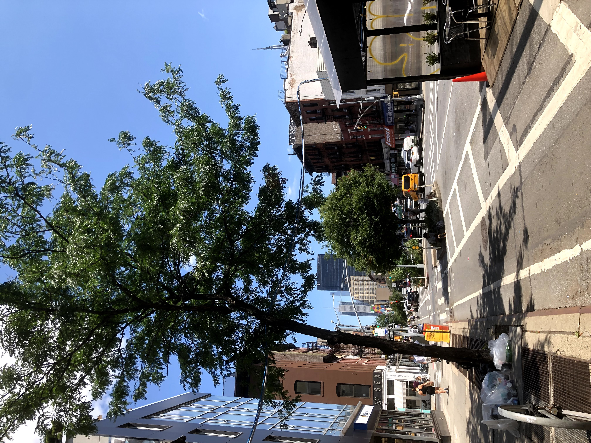

There's no other place like New York City, especially for a gap year. It's special for a reason, because it's the type of place where you can kick off the week with a tranquil walk outside, a visit to a chocolate-aficionado's dream store, and multi-hour chess match with strangers, all within a 0.5 mile radius and singular evening.

I just wish this spontaneous living in the moment expanded to every part of my day. I'd be lying if I said this was representative of all aspects of city and off-academic life. While work has improved with my latest data viz assignment, the traditional corporate 9-5 has a rather bland blend of boredom and busywork. As much as I recognize the need for a job like that to put a roof over my head, I can't help but wonder whether there's a way to sit back, coast along, and enjoy the ride for not just post-work activities, but also work itself. 

My mind spends more time in the future than the present, which is a blessing and a curse. I never really understood why, what I was missing that made my mind keep searching and thinking, until Thursday, a fateful day at work.

It started out innocuously enough, as I munched on some eccentric Cambodian food sponsored by EY.

The Olympics in Tokyo were hot in the news, so my eyes pored over highlights on YouTube as my taste buds worked away at the feast in front of me. Seeing those athletes and fellow young people achieve such incredible feats was inspiring ... not just from the POV of an onlooker, but also from a young person making their mark on the world. Like Ego, it shook me to my core.

Everything clicked. I wanted to be doing something that took up 110% of my energy. Not just my academic energy, but my mental, physical, emotional, and creative energy. That was the spark I had been missing, an all-encompassing drive and ambition to change the world.

Now saying that was one thing, but figuring out a way to do it was another. Luckily, my EY peer buddy Connor had some thoughts on the topic during our lunch chat. 

I'd given myself a lot of burden figuring out what to do during my gap year. I would receive a lot of conflicting advice and opinions on what the best way to spend 12 months was. I was open to advice because largely, I didn't even know what I was doing myself. What if I spent time doing the wrong things and wasted it all?

Connor was the first person I talked to about it, and what he said that Friday afternoon chat was intended to be a simple reassurance, but it was surprisingly poignant. I had been dealing with the issue of what to spend my time on during my gap year. Resume-padding volunteering? Classes? Work? Developing skills? 

To Connor, though, the answer was none of the above. To him, it would be totally cool to take the gap year and away from work-related items, and do things instead that brought me joy, like hobbies and travel. After all, I had my entire life to work, and I could really do no wrong at this point. As someone who's always placed career aspirations at the front and foremost, this was an answer I was not expecting.

# The upshot of freedom

Those words stuck with me as I headed into the weekend. Work or leisure, classes or travel, one belief had remained unchanged: creating your own luck. If I didn't get my butt out of my house, any opportunity would remain within the confines of my aparmtent.

So on a Friday night, I hauled myself to a pool party at Ming's house. No, not pool as in swimming pool, but pool as in pool table. The backstory is too much to explain in this post, but let it be known that it was a multi-week endeavor worth celebration.  

As I moved around the room and mingled, I realized I was doing things I hadn't done before. I was cracking jokes, avoiding pit traps of hanging around the same people, and even mustering the courage to talk to strangers, both guys and girls. Of course I had down moments, especially in the middle of the night as I wandered aimlessly, almost shameful for not being actively engaged in a group conversation. When everyone else knew each other, I didn't want to be the one breaking the rapport.

But I pushed on, and as I headed home, some new Instagram connections in hand, I took the night as a net positive. It wasn't my best night, but it was still a massive improvement from my earlier self in college. It reminded me that my mistakes from the past could be learning opportunities for the future, and things to learn from. It had been true for Ming's party, but in the context of Connor's advice, it would be true as well. No matter what I did, what mistakes I made, it would only be a learning experience.

The applicability of the universal truth extended into the weekend, as I headed to play volleyball with Redditors on a stupidly beautiful Saturday.

As I looked outside at the city scenery on the 7 train to Flushing, I felt a sense of adventure and freedom stir within me, not unlike what I felt in Tokyo. It was a treat to get out of Manhattan on an hour-long commute journey like this. It was a call to the adventurer inside me.

The scenery was certainly beautiful, no doubt about it.

But it was the people that were truly memorable. Every Redditor I met had a distinct personality, and their pedigrees were surprisingly impressive. A John Hopkins road raging veterinarian. A shy Harvard grad school post doc statistician researcher. A software engineer at Bloomberg. Working professionals, all united together by volleyball, laser tag, and beautiful night views.

While I don't know if I'm going to hang out with this group of people again, and I'm not sure if I'm leaving the weekend with new friendships, I do know I'm leaving the day with a newfound appreciation for the people in the city I've called home.

If there was one memory I could use to capture the spirit of my gap year, it would be biking down the Manhattan Bridge that night with Das, a total stranger just a few weeks ago and now someone I'd jumped out of a plane with. 

Freedom and opportunity. What makes this year so special is the freedom to choose whatever path, with whatever strangers I meet along the way.

I think [John Fish](https://www.youtube.com/watch?v=ZnC8fitF3jo&t=484s) puts it most beautifully. Cherish what I have now, a year to myself, with opportunities left and right. But also recognize that life is inherently messy, and that I shouldn't kick myself for not taking the best possible route each time. 

Sometimes I have control over the route I take, like heading to a Taiwanese bakery on a Sunday night to blog.

But a lot of the time, I don't always have to know what's in front of me all the time. Like the street fair that popped up outside my house at the end of the week.

But it's in these detours that life's most valuable memories are made. And I think that's beautiful.