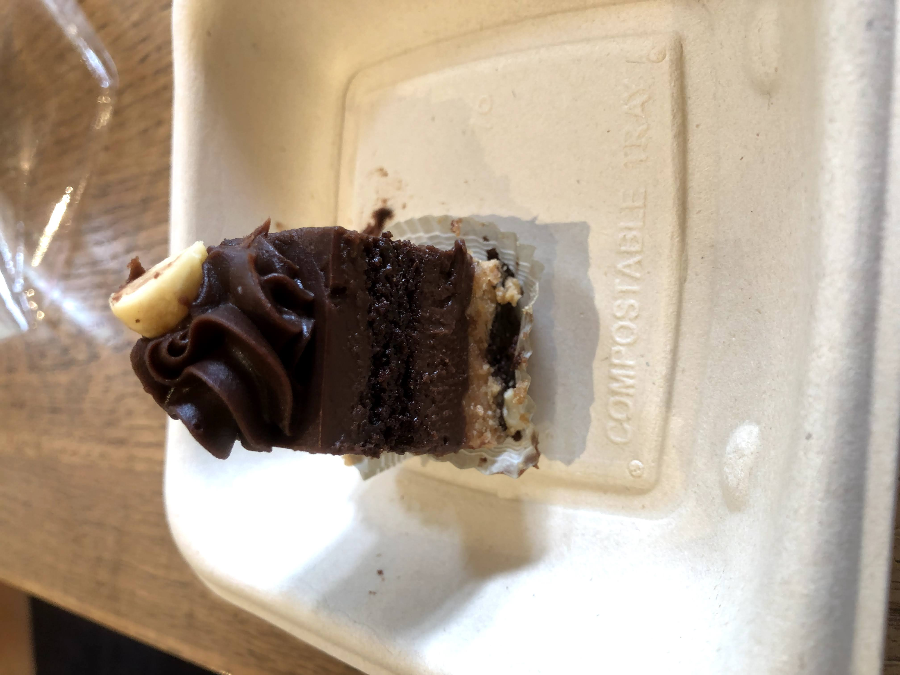
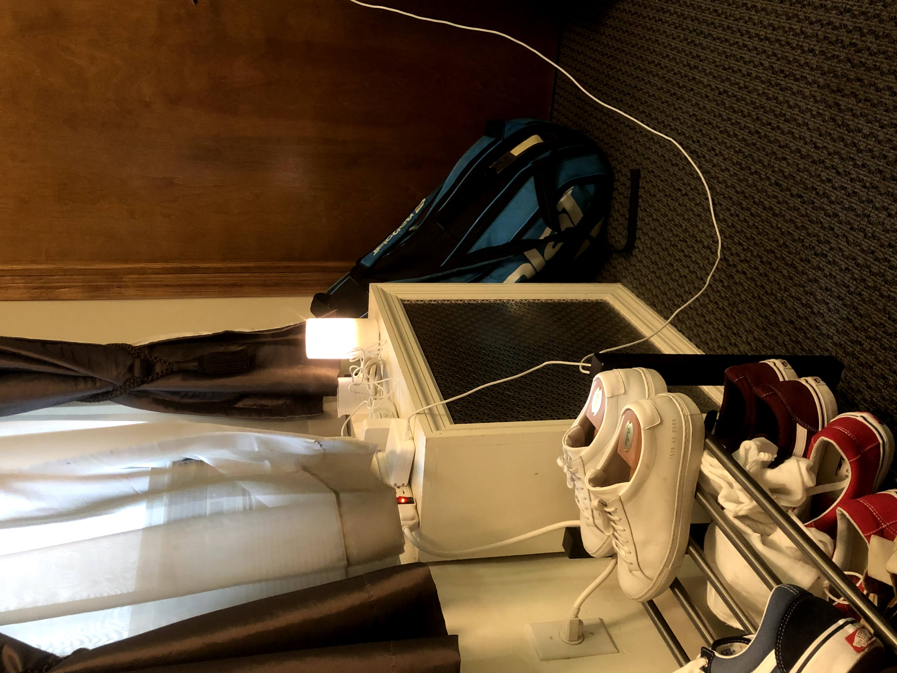
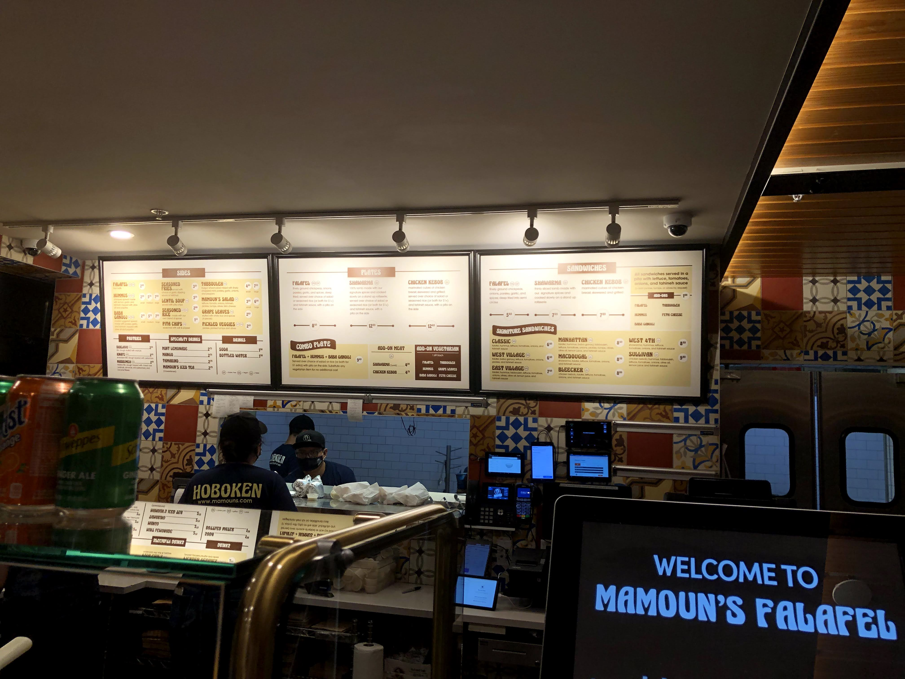

The theme of this week is racing through the present at the expense of the future. What do I mean by this? Well, my original goal for this week was to plan for my gap year, and stick mostly to the reflective, thoughtful aspect of myself. Instead, I ended up living in the present. Almost the entire week, my days were filled with chaos and wonder.

Take Monday as an example. I spent the first three hour block in the day doing errands. It was a beautiful day out though.

And on the way back home, I saw I was close to some cool places on my “to visit” list, so I went. And what was supposed to be a day of work turned into a day of self exploration. 

Eataly was the first place on my spontaneous trip. Eataly is an Italian grocer, supermarket, and cafe all in one. Think of Wegmans but all Italian. It felt like I was walking through a cultural wonderland.

In a break from my diet, I even got a mini dessert. It was small enough that I could eat it guilt-free. Well, mostly.

I also stopped in front of the Harry Potter store, which had a virtual queue of 360 people …

And finally, made an active effort to head into my local Muji Chelsea and purchase an aroma diffuser.

The day wasn’t over though, as I headed into a Tous Les Jours bakery to work, only to discover I was surrounded by HMarts and Korean BBQs. My work session had unintentionally turned into my first time in KTown!

It was deload week for my fitness program, which meant a week-long slackening of nutrition limits and easing of weightlifting loads, so my food diet did go off the rails a little bit. Froyo became the indulgence of choice for this week … more than once.

My normally strict, organized schedule, which was supposed to be reserved totally for figuring out my life, also went off-track as well. I had a volleyball match, a date, but the rafting trip took the cake for most off the walls. On Thursday, I headed to the Poconos in upstate New York for a whitewater rafting trip with Ram, one of my fellow interns. If EY wouldn’t give us Disney, we would go to our own version of Disney ourselves. 

Now that was a crazy day, diet, schedule, everything wise. But it didn’t stop there. On Friday I had a hangout with some old HLAB friends while one of them was visiting in the city. In what had been the culmination of multiple hours of research, we visited Arcadia Earth, another place on my list, a museum dedicated to environmental sustainability. It was great, for the message and mission, for the IG-worthy pictures, and for the bonding experience.

\[pic of us 4 in the aqua exhibit]
\[pic of us 4 on the chair]
\[pic of us 3 in the VR exhibit]
\[pic of us 3 in the trash exhibit]
\[pic of us 4 in the nature exhibit]
\[pic of Jeff at the “waste no food” exhibit]

My nutritionist is going to groan, but we also took a few food pit stops. Cannolis and mango mango were involved.

\[us at the cannoli place
[us at mango mango]

Additional food was present on Sunday, as I satiated my cravings for Japanese food with a multiple hour hunt for a Japanese grocery store with authentic onigiri. 

\[park ave]
\[katagiri grocery outside]
\[katagiri grocery inside]
\[gonbei menu]
\[sunshine market outside]
\[onigiri photo all]
\[onigii photo zoom in]

As shown in my previous blog posts, I’ve been chasing freedom and untetheredness, yet ironically been tethered in living in the moment to the point where I haven’t had time to think about the future. 

In the end, I was surprised what I’ve spent time on this week mostly — tutoring, social events, meditation — is so different from what I originally set out to do — gap year planning and the housing search.

Okay, maybe it’s not as bad as I’m making it out to be. I have been re-envisioning life in the city longer term. With my Light Fellowship abroad plans not falling through, what will I do logistically? Volunteering? Tutoring? Startups? But also less logistically, I’m also pondering the abstract. Like visiting new buildings, crafting a new identity. NYC is a true city of opportunity, and I’m really only limited by what I really want to do while here and the time I put into thinking about it. I could become a sous chef. A pop up restaurant owner. A comedian.

It’s about passion in the present and future. Like with ZhenEd. 

For context, my friend Kevin Zhen, who was my breakdancing coach when I joined freshman year, reached out to me this week with an opportunity: life coaching middle school and early high schoolers. But it was more than just a typical college consulting job— no, we would be working on a Charisma University-esque platform to democratize these principles to kids everywhere. In other words, I would be doing something I already love, teaching, which I’ve already done before while teaching motivation, passion, and leadership to HSers in Tokyo. I’d be doing things I was already somewhat skilled at or interested in, like software development of the website, and amateur video editing for the online classes. I’d be doing this all while working towards my dream to revolutionize education, AND have the the flexibility to enjoy my life. 

I can’t believe breakdancing freshman year led to this, and how much happened in the course of one week. I went from nothing planned to doing a bunch of things with friends while tutoring almost 10 kids life coaching. What a dream - getting paid to teach what I love to do anyway, and possibly making a lifestyle out of it? Life really does have a funny way flipping on its head, WHEN I create my own luck. My freshman year self would never even considered that this could become a post-grad opportunity — escaping the 9-5 toil with a scalable education lifestyle business, while having time to travel, and while doing work that doesn’t even feel like work. 

But is ZhenEd the future future? Or is what I’m all planning right now the future future? Am I laying out the groundwork for post-grad life? For all I know right now, yes, but I’m wondering for NYC in the fall, how I’ll battle the bigger questions. Is this my only identity, the teacher? Are there other things I can become here while free from the constraints of school? Is this the lifestyle I want to live, or can I truly flirt with complete difference? 

There’s a question I asked Ram on our whitewater rafting trip. “If you could swap bodies with anyone, who would you swap bodies with?” My answer? Someone completely different in lifestyle with me, like a 6’2 WNBA player. I said it in jest, but maybe that answer doesn’t necessarily have to stay a fantasy for long. Maybe I can make it a reality and discover something new about myself.