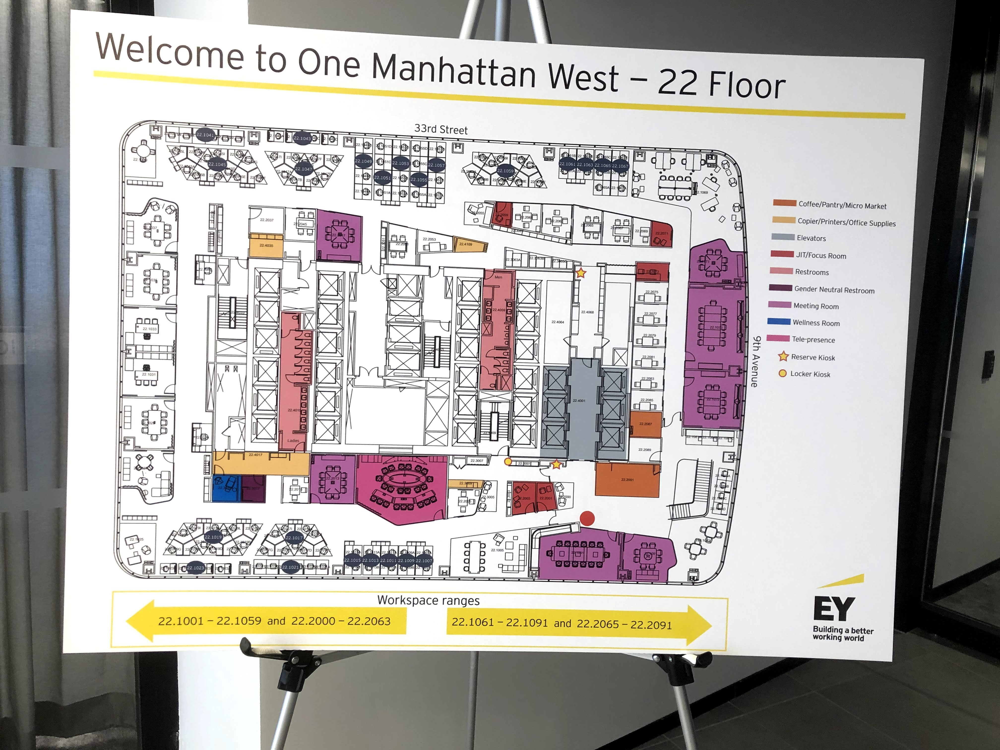

It was the last week of my internship at Ernst and Young, and while I wouldn’t say that I ended my tenure at the firm with a bang and lasting friendships, I would say that I’ve ended it with a renewed sense of hope and optimism for the future. For that, I have an Olympian and fellow consultant, to thank.

In lieu of an end-of-internship trip to Disneyland, EY decided instead to host a series of virtual workshops and webinars for its thousands of interns. There were magicians, coffee tastings, and all sorts of wacky topics. But, the type-A Yale student I was, I decided to sign up for the motivational chat with Michelle Carter, Rio 2016 gold medalist in shot-put. In the one and a half hour session, she talked about her journey growing up as an African-American woman in the American educational system, and her journey in becoming the best athlete in her respective field.

The most important thing she talked about and the key to her success? Sacrifice. Sacrifice is the price we all pay for success, and Michelle was one of the people who was willing to win so much, that her tolerance for sacrifice was higher than many others. In her own words:

> “Some people’s prices for success are higher than others. It’s all about how much you want it. Michelle gave up hundreds of parties, summer vacations, for 20 years, but in exchange she became the first American woman to win the Olympic event.”

It was inspiring. So inspiring, in fact, that I couldn’t stop thinking bout it for the rest of the week. This was an excerpt from my private journal on Friday as I mused to myself.

> “That’s my new mindset and mentality for achieving great things, like an Olympian: sacrifice. But what is sacrifice? It’s giving up present feelings of joy (e.g. working out) and also future points of joy (e.g. good food or a party) for the far future.”

Take my progress on weight loss as an example. I broke 165 lbs for the first time this week, but at the cost of not indulging in food at night, despite New York being a food-lovers dream. 

It’s the people that I meet along the path of sacrifice that define my journey, though. I ended my time at EY with a capstone, a case project that groups of interns are assigned to work on, that was, to be completely frank, quite a joke. I think a lot of us were disappointed that we weren’t traveling to Disney and celebrating our achievements, and rather just being handed more work, so morale was low. There was a ton of downtime, and I used the opportunity to do something I genuinely enjoyed and derived value from: spending time hanging out with other people. 

Luckily, the time was auspicious. 1 Manhattan West (!MW) had just opened up in Hudson Yards as EY’s new HQ, and it was brand-spanking new. 

Needless to say, the view was beautiful.

")

")

But what I loved most about the office wasn’t the scenery, but the opportunity to enjoy it with other people! I met up with interns throughout the week - Angelina from my training group, Lisa from Angelina’s capstone case team. 

Each had their own personality: Ameya was a peppy UC Berkeley CS girl who I couldn’t keep up with energy-wise. Minh was a self-composed kickboxer heading to his honeymoon in Hawaii next week with his fiancee. 

Even networking, an activity I previously despised, was transformed into an activity I looked forward to. I had forgotten how to do a handshake, but I hadn’t forgotten how to socialize in a professional environment like that, even if it was for work.

But I would say that networking is emblematic of what these professional relationships have been like so far: transient. While I’ve met people from all over, I probably won’t see most of these people again, despite our attempts at fitting in hangout time. 

Maybe that’s why I cherish moments with friends so much — new friends, who I can continue to build a deeper relationship with. Like hanging out with Han on a Saturday afternoon.

Or spontaneously getting ice cream with Meag on a Tuesday night.

These are the little allowances. I had to break my diet both times to hang out with the two, but I also stayed strong and restrained myself from gorging on even more food afterwards. Picking and choosing indulgences. Sacrificing in moderation. Caving and getting pizza, but only after burning it off by playing 2 hours of serve and volley tennis with Ming on a Friday night.

When I’m willing to keep progressing towards my goals by sacrificing in moderation, the limit of what is possible is my imagination. Ideas just kept popping into my head. Cold-emailing [YES Theory](https://www.youtube.com/c/yestheory) and moving cross-country to LA. Connecting with a Yale classmate about [MinKwon](http://minkwon.org/) and volunteering with the local Asian community in Flushing. Watching [Asian Boss](https://www.youtube.com/channel/UC2-_WWPT_124iN6jiym4fOw) videos and realizing I could be in Asia for the next few months, city-hopping, and putting my nostalgia for travel to a rest.

A lot of these ideas will fall through the cracks, and some are just straight pip dreams that will probably never come to fruition. But embracing my inner dreamer is a trait I hope I never give up, because it’s what’s gotten me to the point I am now. From the kid who didn’t know how to socialize or think he could get into a place like Yale, I’ve learned to keep pushing myself to believe that anything is possible, with enough focus, intellect, and hard work. 

Cheers to the little sacrifices in the present that lead to brighter futures.