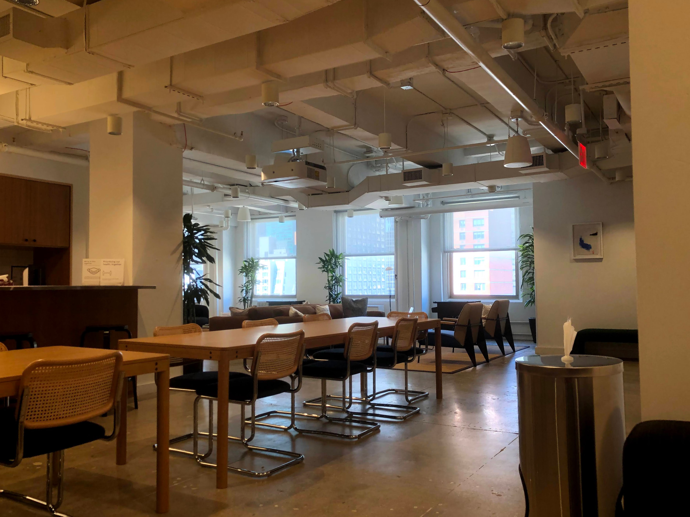
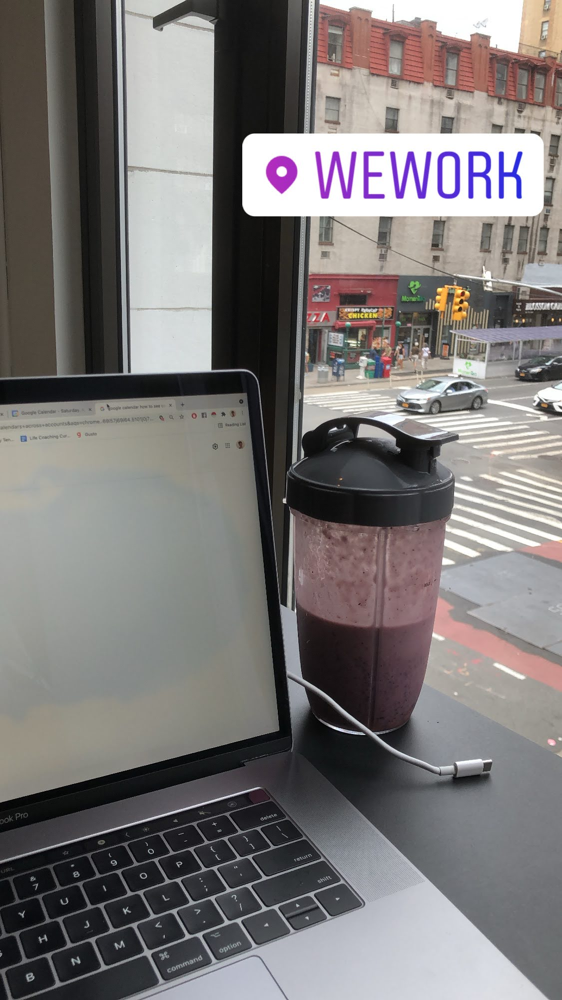
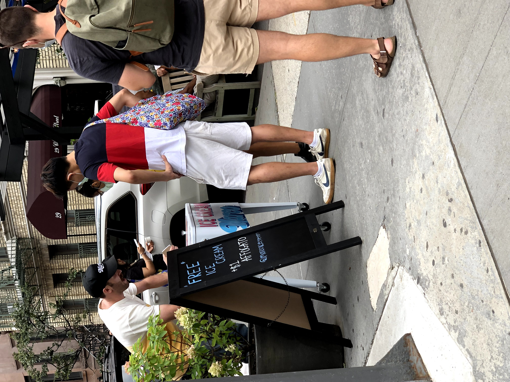
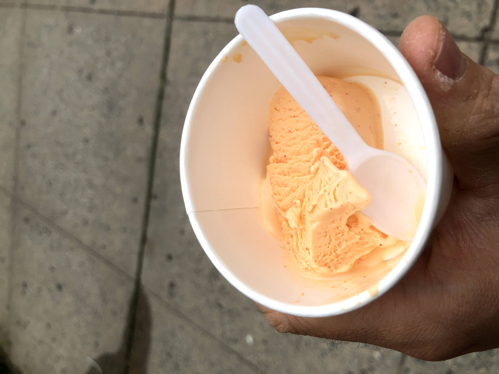
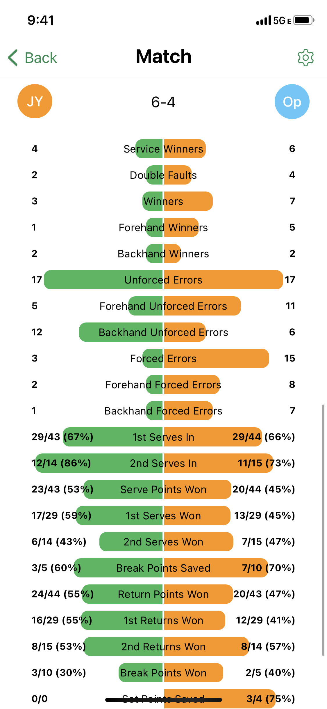
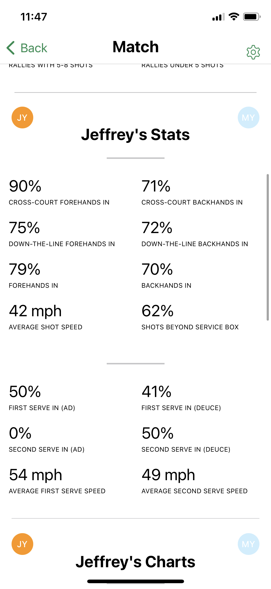

If there was one event to represent this week, it would be signing up for a WeWork subscription. Productivity came front and foremost. I’m not the type of person to spend money on materialistic joys like nice sports cars, super fancy collectibles, etc. it’s not the way I was raised. That being said, I’ve learned as I’ve matured that time is money, and co-working spaces offer a lot of “soft” value with real ROIs. Here’s an entry from my journal rationalizing the purchase out.

> (1) All of my work currently is remote, so I have the flexibility to work anywhere 
>
> (2) WeWorks are all over the city, giving me the option to explore more 
>
> (3) WeWorks would give me a microwave and emergency bathrooms throughout all of Manhattan 
>
> (4) If I travel to other cities for a weekend, I can work in the WeWorks in many of those locations 
>
> (5) My studio is tiny, and it would give me an excuse to get out of my room 
>
> (6) I feel much more productive within a WeWork, and it improves the quality of my lifestyle 

Getting a WeWork subscription was not that different from getting a CitiBike membership. It saves time, makes things more convenient, and allows me to focus on the more important work. It also makes me more happy, and happiness is priceless. Not to mention, sometimes with these kinds of purchases, you get other unexpected benefits, like a free upgrade to Lyft Pink and 15% off all rides! 

It was a big decision, but the moment I stepped into a WeWork for the first time on Tuesdays, all my doubts disappeared. The amenities, the atmosphere, the location … it was the perfect workspace for me. 

My favorite part of my All-Access membership plan was the flexibility. As someone who plans to travel on his gap year, access to offices globally is a super nice perk. It gave me the chance to see new neighborhoods and even attend events nearby.

The other thing I like about WeWork is that it shows the non-highlights of my life. Even though I put lots of social stuff and great pictures on this blog, the reality is the I grind or work 80% of the time. Whether the be planning, tutoring, whatever, there are plenty of sad or disappointing moments behind the scenes. (although definitely not as many as during my remote year at home)

For example, ever since I started tutoring, I’ve been working full-time on weekends, like from 12pm to 9pm this past Saturday. Sometimes I have sad moments that I try to block out, like when no one showed up to my comedy improv class show on Sunday. 

But it’s in these moments I try to stay positive, not focus on them, and try to move on rather than commiserate. For the full-time work on weekends, I remind myself it’s by my personal choice to move most of my hours then, and I’m lucky that I don’t have to work 40 hours. For the comedy improv class show, I reason it out and realize that it was pretty far from my Yale friends to come for just an hour long show, and my NYC friends were busy with other things.

I really try to adopt the mentality that “one door closing opens up another” to help me reframe negative moments. Like when I found out that my comedy improv class this fall had filled up, I took a storytelling class through the Magnet Theater instead. Or when I failed to find a wide angle lens in time to test out my new tennis app SwingVision, but ended up getting into a fantastic conversation with a Best Buy associate and resolving the dilemma over which camera lens to buy. Or not being able to go abroad for the spring, but finding out about the Schwartzmann Scholar program and how a lack fo Chinese in-person experience could actually help my application.

With life changes like WeWork, It was refreshing to see my fall lifestyle come to life before my eyes, and figuring out how roadblocks in the present could benefit me down the road. 

This week’s blog post was a little bit shorter, largely because next week, my gap year truly kicks off on my 8/31 bday. With the time on the clock ticking away, I really had to sit down and put my life together. Don’t worry though, because next week, I plan on kicking my gap year off with a bang. Stay tuned!