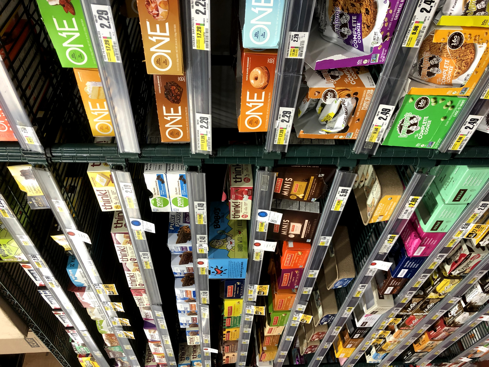

As I reviewed the photos and journal entries for this blog post, I realized I was in a dilemma. Unlike earlier weeks, there was no strong lesson, theme, or moral that I could extract to properly encapsulate it. Sure, there were recurring themes from before, but I wasn’t interested in belaboring old patterns of thought. The only thing that stood out this week to me were moments. 

When I look at some of my administrative, tedious photos or journal entries, my only thought usually is, “wow, I totally forgot about that.” Conversely, it’s when I look at poignant, emotional moments that I can relive exactly where I was, what I was feeling, how the world smelled, and all these other details.

For the analytical mind that I possess, I’m just as human as anyone else when I see that it’s emotional moments leave the most lasting impacts. As a very empathetic, sensitive person, it’s probably these character traits that explain why these emotions really hit me so strongly. 

As I look back, a lot of my day-to-day stressors don’t mean much at all in the grand scheme of things. Whether it be the stress from finding housing, or Apple almost losing my MBP, or a rude interaction with a tennis pro … if I cared then, the reality is that I don’t care now. 

Even the work sessions in random locations, as exotic as they may be, don’t stick out to me as particularly memorable. 

Memory is a limited unrenewable resource, and the space I have in my noggin to store the few memories I can is precious.

There were other nice moments that happened during the week beyond these reflective ones, don’t get me wrong.

I do appreciate these hangouts with people for how they refill my social batteries and fight off the ever-present demons of loneliness. 

Dates are also fun ways to explore with strangers :)

But even then, some of the poignant memories that stick out to me are the moments alone with my own thoughts on the way. 

Little errands and expeditions into the city to invest in myself were great …

\[pic of HMart aisles - caption: squeezing through the alleys of an HMart in the middle of a rainstorm, on the hunt]
\[pic of HMart seaweed - caption: target located: these bad seaweed boys]

And I couldn’t help but feel a rare flicker of pride from rare investments into my style…

\[trying on Timbs - caption: check out these new kicks]

That being said, some memories are just so strong that from journal words alone, I’m transported back to that moment in full. Like the midnight conversation I had with Ming on the way back from tennis, or the cozy feeling of being stuck inside with a Parts Unknown documentary and meal during a Saturday night rainstorm.

\[Moment 4: After a Sunday holed up inside from mother nature, I stepped outside to take out the trash, and saw the rain had stopped. The mellow lofi pulsating in my ears, I inhaled the fresh smell of rain and coolness of the city night. Truly therapeutic and liberating.]

I don’t know where I was going with this — there’s no moral, no grand lesson to extract. I just wanted to share moments, snapshots that stuck out to me. Thanks for bearing with me for this nontraditional blog post of my week. There was no better way to capture it.