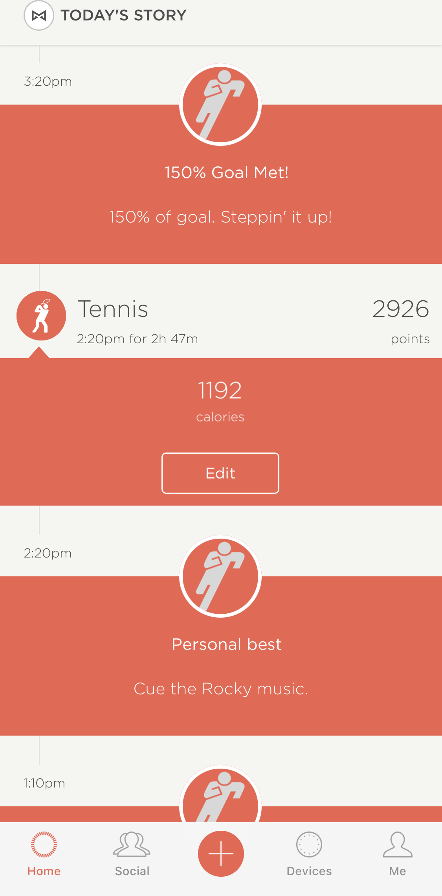
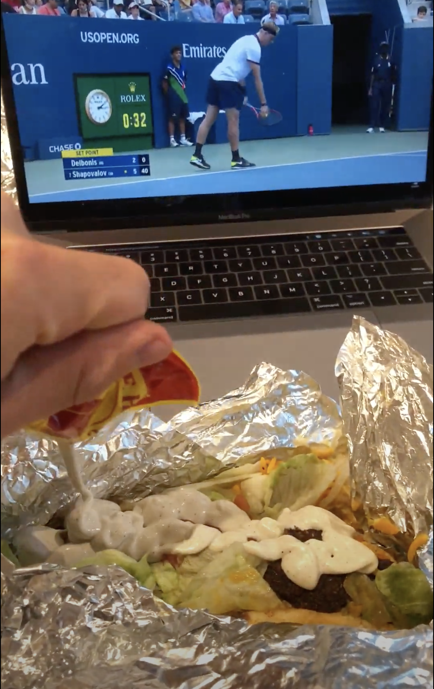
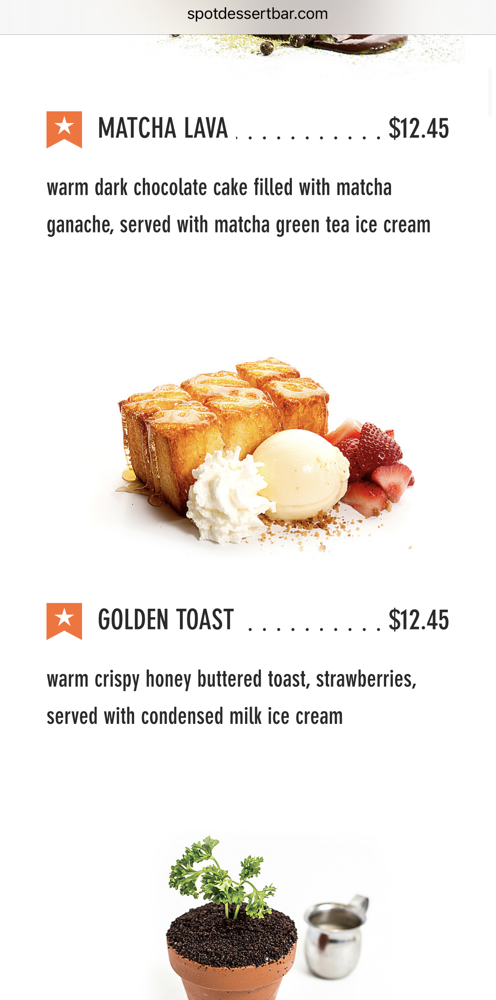

Indulgence. A week spent with family, food, and friends. Putting work aside for family. Throwing out my diet out the window. Having deep conversations with and partying with close friends. There were too many moments for the highlight reel to count. I know this week won’t be representative of what my gap year looks like, but I sure as hell hope it does. This one sets the bar.

A second a day for this week: \[One Second a Day for a Week video YouTube linked here]

I hit the ground running. Moving stuff from my Chelsea 1-bed apartment into my new studio in Greenwich Village on Monday was an all day affair. But by Tuesday morning, after I dropped off my keys, and rolled my suitcase down the street, it really felt like I was traveling to a new place again. Almost like the feeling I had when I came to New York for the first time. A new gap year, a new frontier.

Tuesday (my biological bday) was when things really kicked off though. Beyond the heartwarming stream of birthday wishes to me throughout the day, it was a crazy afternoon filled with my greatest passion: tennis. Specifically, 2 and a half HOURS of tennis, burning over a thousand calories.

Needless to say, I was starving afterwards, and as I set up shop in a nearby WeWork, I rewarded myself by some US Open highlights and my first cheat meal in weeks … Halal Guys. 

To be honest though, I was pretty depressed that I was going to be spending my biological birthday night by myself. My friend Bello was in town, but was too tired to come out, so in a complete shot in the dark, I asked if my friend Ming was willing to come out to grab some dessert at 8 pm. To my dumbfounded surprise, he said yes! And that made my bday.

We headed to my absolute favorite dessert spot in NYC so far, the one I had been saving for a special moment … the Spot in East Village. I think I wrote about them before in a blog post, but as a refresher, their specialty is Asian-American fusion desserts, and it absolutely slaps.

This time, I treated myself to a new dessert: golden toast. And as Ming put it in his own words, “this is one of the best desserts I’ve ever tasted.”

It was such a wholesome meal with Ming. We talked a lot about startups and his advice and experience in the industry. These are exactly the kinds of conversations I was hoping to have - ones where I can be stimulated, challenged, made to think. And it really warmed my heart to have someone to celebrate my biological bday with, especially last minute.

But the hangout with Ming wasn’t over. No, we would get up just a few hours later together … and spend an entire day at the US Open. It was my first time going to it with people just as passionate about the sport as me, and wow, I had an absolute blast.

A flash flood (Hurricane Ida) cancelled volleyball playoffs that night, but it was a much needed respite after a crazy day of walking all around the tennis grounds. And by crazy, I mean 30k steps crazy.

Luckily, I didn’t have to deal with the chaos Hurricane Ida had wrought over the city, and instead spent the next two days at home in upstate New York. There were logistical reasons — picking up my drivers license, credit card, winter clothes, etc. — but there was a deeper reason: celebrating my bday with my family, and my grandparents, who were now back in the US from China.

It was the busiest 24 hours home in my life. I helped my grandparents with their tech issues, ate a ton of good Chinese food, and had a nice peach cake from Wegmans. A sweet homestay.

With an insufficient amount of sleep, I was right back awake Friday morning. I was poised to return to NYC in the afternoon, but first, we squeezed in a family trip to our land.

The ginseng plants I had helped plant a few years ago were starting to flower …

And Mom, as she does, took the opportunity for a family photo op.

The timing of the visit to the land was perfect though, as it was harvest season!

After that packed morning, I was on a bus back into the city. But my day wasn’t over — far from it, actually. I passed out the entirety of the ride back, because I knew I would need the energy.

You see, Friday was the hyped opening night for one of the most important movies of the year to the Asian American community: Shang Chi and the Legend of the Ten Rings. For those of you who don’t know, Shang Chi is the first Marvel movie to headline an Asian lead superhero. Not only is it historically landbreaking in terms of AA representation in Hollywood, but it’s also a really amazing movie with terrific Rotten Tomatoes ratings. And since I was in NYC, I could see it on the big screens.

Oh, and when I say the big screens, I mean the REALLY big screens. As in, the absolutely huge IMAX screen at AMC Lincoln Square. The one that towers and is the largest one in North America. Here’s a scale diagram \[link here] to give you a sense of its size.

It was a pretty great movie overall. Not mind-blowing like endgame, but still pretty darn good. 

All of these things, though, had been samplers for the main event of the week- my bday party! You might be wondering, wait, Jeff, didn’t you celebrate already on your biological bday party, AND with your family? To that, I’d reply, yes, but this third celebration was arguably the most important, because it would be with close friends. 

I’m not a big party person, if you haven’t guessed already. In fact, I don’t usually host bday parties because I was always afraid that I wouldn’t have enough friends that would be willing to come. I was never hugely popular and capable of drawing dozens of people to an event like that. The last time I held a proper bday party was 4 or 5 years ago.

But this year, after a desolate year at home, I decided to say screw it, and take the plunge. So I booked an adventure park called Area53 to celebrate, and invited people to come.

The weeks leading up to the party were tumultuous. I sent out about a dozen invites, and only expected 2-4 people to actually show up. I had extremely low expectations - who would even be willing to make the effort? But I was touched when I had not 2, not 3, not 4, but FIVE* people come out that night to celebrate. Two of them were even buddies back at Yale who took the 2h+ commute to make it to the park. And that feeling of belonging was probably the best birthday gift I could have ever gotten. *\*My friend Meag also would’ve come, but she mixed up the dates.* 

I spent the entire day preparing for it. Namely, I went to trader joes to carefully curate a list of 21 snacks. Those damn snacks had tempted me for the past few weeks each time I passed through the store, and if I were to cheat on my diet for a day, I would go all out.

Once we got to the venue, Area53, there were so many things to do. There was rock climbing, 

Ropes course, 

zip lining, 

battle boarding, 

And more!

But that wasn’t all. We also did the ProZD 21 snacks challenge and got it all on tape, and shoveled down a melted ice cream cake.

, Danielle (YA class), Yours Truly, Mai (HLAB SA), Ram (EY internship)")

Above all, though, the best gift was the fact that everyone showed up. Seeing everyone from completely different parts of my life - my internship, my clubs, my classes, my teaching abroad - together … it was beautiful. 

Our time at the park was over before I knew it, and Ram Mai and Audrey had to go soon early after. But someone was \~now legal\~, I wanted to go out. Amazingly, my friend Danielle also did, so we went to a rooftop bar.

In one of the biggest twists of the night, we ended up meeting a random guy and a girl in line in their 30s and 40s who we hung out with and celebrated. It was crazy - we were all dancing, but also chatting about work and life in the city, and they were even buying bday drinks and shots for me. I had a Long Island iced tea, a few new cocktails … it was wild. But let me tell you about these guys. The dude was a promoter and member of the NFL and snuck us into all the rooftop bars past the lines by bribing the doorsmen with free giants tickets, and he ALSO invited us to his private yacht party with free drinks on Sept 17, two weekends from now. Like what??

Throughout the night, I was in that happy Goldilocks range of buzzed and tipsy but not vomit level. Danielle was at her limit tho and I paced myself to make sure she got back safe, as a good friend and host would do. Eventually, we got home and then passed out at 4 am.

Danielle and I only ended up getting like 3 hours of sleep because we had to get up at 7 am for her to catch her train. Fighting through the tiredness and hangover, we travelled together on the subway, got her a bagel, and dropped her off on the Metro North back to New Haven.

Dehydrated and sleepy, I went back home and promptly passed out until 1 pm. My house was an absolute mess, my schedule was a mess, and I had to tutor. But I was happy.

I knew after waking up after such a great happy night though, I was gonna go through a mini depressive period on Sunday as the serotonin wore off. And sure enough I did, and it sucked. But as I headed to my nearest WeWork to get some tutoring work done, and distract my own on more productive things.

But then I got a text from Audrey.

I was depressed, but after Audrey said she felt the same way, I could feel myself more or less snap out of it. I spent a lesson teaching the kids, and felt my social battery recovering. I wasn’t alone. I had a group of close friends.