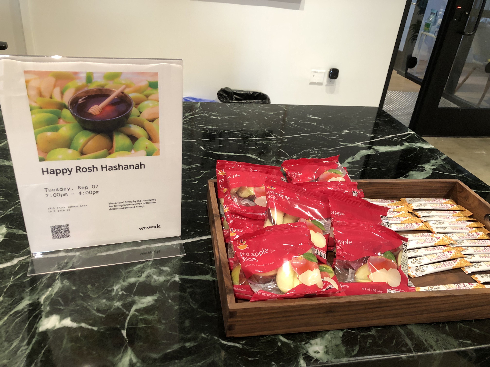
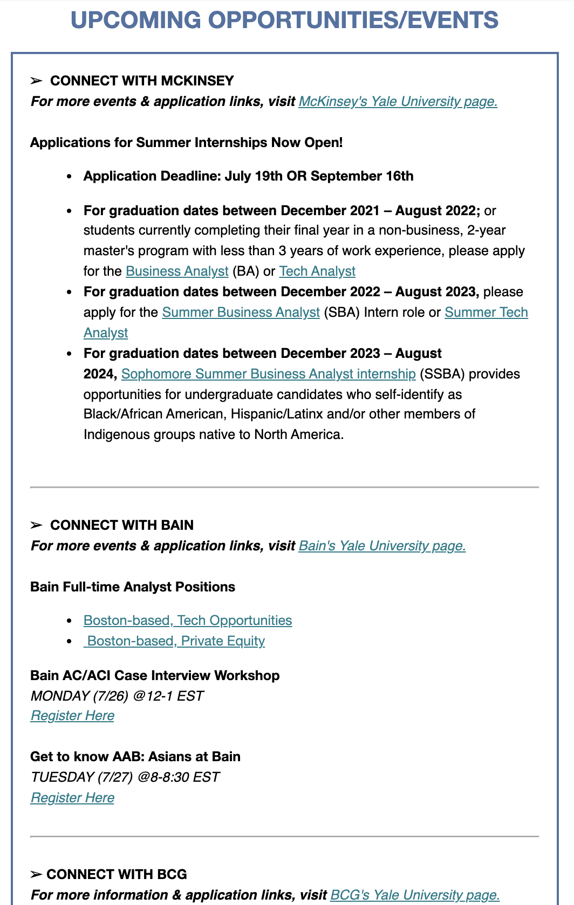
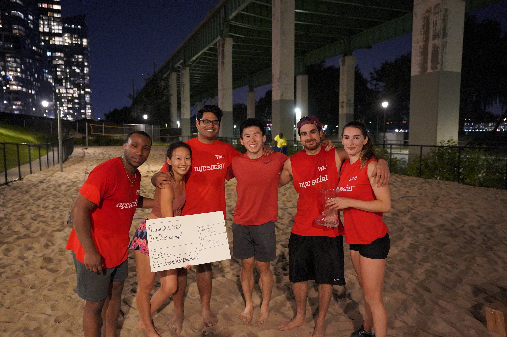
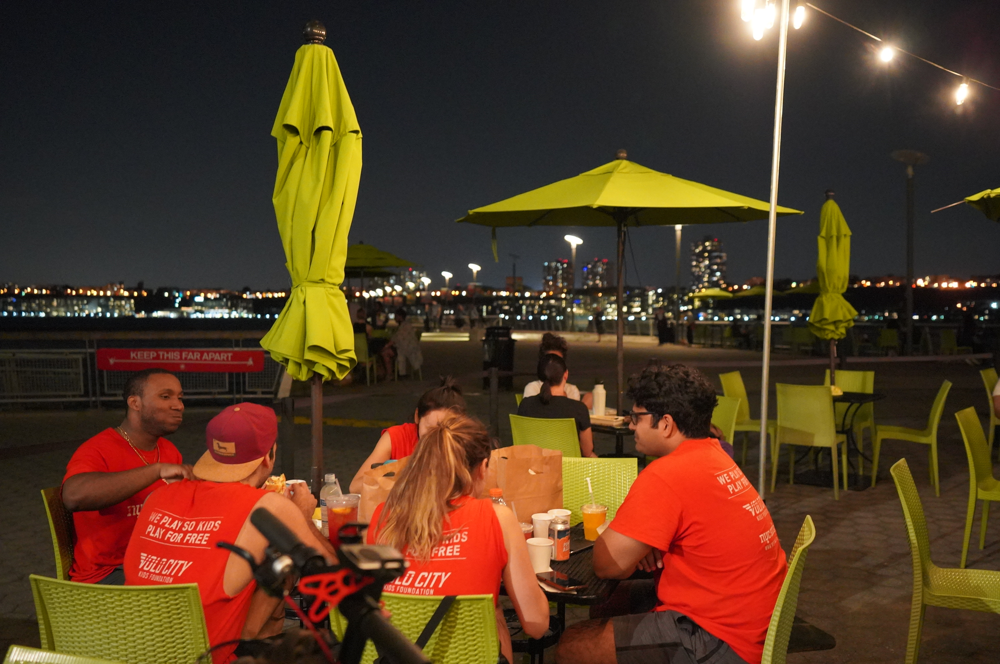
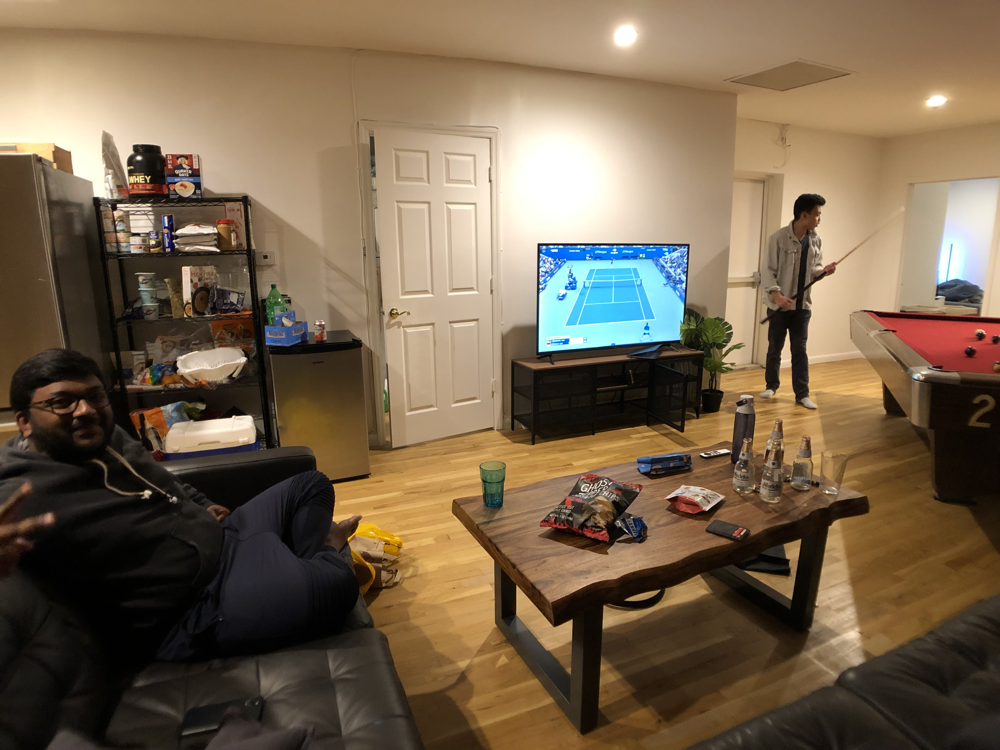

After an [indulgent first week filled with fun](https://www.jeffreyyu.me/2021/09/05/indulgence/), this week I sat down and began my gap year in earnest. Specifically, my structured gap year habits started to hit in full force. From setting up all my video equipment to ramping up my tutoring job at ZhenEd, I’ve begun to incorporate some new habits into my day. In adding all of these activities, I’ve learned that what I value most in my schedule is flexibility. 

<iframe width="560" height="315" src="https://www.youtube.com/embed/xpWNI3q2CjU?rel=0" allow="accelerometer; autoplay; encrypted-media; gyroscope; picture-in-picture" allowfullscreen></iframe>

From hopping events hosted by different WeWork locations ….

To grabbing dessert with Meaghan, who missed my birthday party, and also spontaneously going to my first standup comedy show right after …

It’s great to know how productivity would integrate into my ideal lifestyle. 

On the other hand, productivity can sometimes come at the cost of joy. Loneliness hit me hard again even at the start, on Labor Day. I wanted to be out celebrating the holiday and doing something social, but instead I chose to take the week off to catch up on reflection stuff and other work because I was so far behind (I was planning to have this all done by September 1!). I also put off recruiting for corporate summer jobs to focus on gap year planning. I was guilty and fearful of first for going off the traditional path of recruiting. I’ve rationalized it, though, by trying to tell myself that I can always do traditional recruiting next year, but I only have one gap year.

But, the [sacrifice](https://www.jeffreyyu.me/2021/08/08/sacrifice-and-success/) turned out to be a great investment, because I did some complete strategy shifts in how I planned to spend the rest of my year. I’ve felt paralyzed by choice recently. With an extra year of time, spare cash, and no geographic obligations, I could be a DJ or promoter in New York, or a goat farmer. In Switzerland, or a fake Yalie in New Haven … you get the idea. There are so many options and that in itself has been stressing me out. 

But, I talked to my friend Zach from Taiwan about it, and he had some great advice.

> “Pretend you’ve worked for 40 years, and now you have a year off to do all the things you regret not doing. What would you do?”

Like for Zach, he said he would be an apprentice to a French chef for 6 months.

That really put things into perspective for me. I’m never really going to have this kind of opportunity to travel and have total freedom once I’m locked down into a 40hr/wk job and need to save money. So what’s the move? Moving. 

I want to [Workaway](https://www.workaway.info/) hop after the winter when my lease in New York ends. I’ve always been fascinated by the [digital nomad](https://www.nytimes.com/2019/02/27/travel/how-to-become-a-digital-nomad.html) lifestyle, and with a remote job, remote classes, and extra cash, I can live it myself. I could spend 3-4 weeks in each country with other international transplants, getting a chance to meet interesting people while also really getting to know the local culture and cuisine (compared to just visiting a billion cities for 2-3 days each, that is). All of a sudden, my gap year became exciting again.

Fortunately for me, while the excitement for my 2022 gap year plans helped temper loneliness, my week was about to get a lot better and more social. To kick off the transformation was something I had been looking forward to all week: the NYC Social volleyball playoffs. And, to our benefit, it exceeded expectations.

What makes me say that? Well, to describe the volleyball playoffs in one word? Epic. Not only did we have some insanely close games, like a 27-26 sudden death set in the first match, but we also came back from a set down to beat the undefeated team in the league for the first time. It was absolutely bonkers, and I got most of it on film!

I still remember the sense of disbelief we all shared at the post-playoffs victory meal together by the pier.

I got home sweaty and sandy that night. That Wednesday night was actually perfect. I watched the [Djokovic USO quarterfinal](https://youtu.be/KV_W8QMkMwA) on my phone, I checked the absolutely sick video footage from the volleyball match that day, and I was still riding the high from a full evening of socializing. Heaven.

Sports really were the theme this week— not just volleyball, but also tennis. This week featured one of the most historic US Opens in the Open Era, as it wrapped up two blockbuster tournaments on both the women’s and men’s side. For example, Thursday night was absolutely heavenly. I watched highlights from the two women’s semifinals while munching on some leftover chocolate babka from my bday party. The two teens, Emma Raducanu and Leylah Fernandez had mowed down the rest of the field to produce one of the youngest and anticipated finals, ever. Raducanu had won 10 matches in a row from qualifiers without even dropping a set, while Fernandez had single-handedly knocked out four of the top seeds in the tournament. I never watch WTA tennis, but this was a fairytale I couldn’t miss.

Friday night was also filled with tennis, as I watched the equally historic [USO semifinal between Djokovic and Zverev.](https://youtu.be/o3SUc6x_qSg) Djokovic, the reigning world #1 and one of the greatest tennis players of all time, was chasing a historic 21st Grand Slam to complete the Calendar Year Slam, where one player wins all four major Grand Slams in a year consecutively. It’s one of the most difficult feats to pull off in tennis, and few have accomplished it. There were a lot of stakes going into the match, and luckily, it lived up to the hype, in what ended up being an epic 5 setter.

Loneliness is an old demon that likes to peek up its head, though. While we had bonded over tennis from the past few weeks, there wasn’t enough for Ming to think of inviting me to go clubbing together afterwards. It was fair and reasonable, as friendships take time to develop, but it did sting a bit.

Luckily, I’ve really started to settle into hanging out with my best friend: myself. The weekend nights this week were chill. I spent Friday and Saturday night editing video clips from the week together, trimming down the footage down to five seconds. That was so, so fun, and I’m thrilled to put it all together eventually. Hope you enjoyed the video for this week and the accompanying blog post as much as I enjoyed putting it all together!