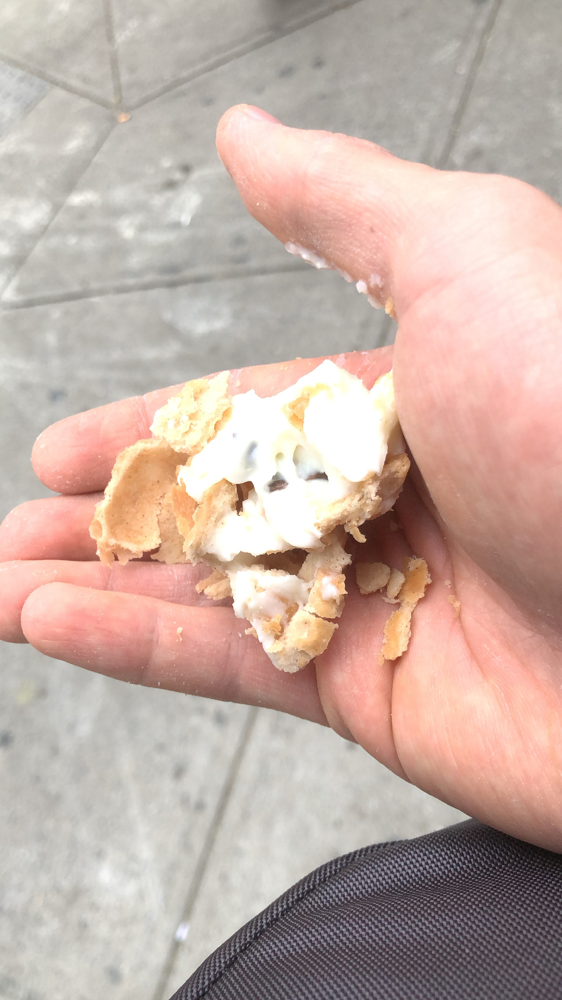

This week, as I caught up on my blog posts, the central dilemma I grappled with was how to spend the winter, spring and summer of my gap year? Specifically, I was deciding between:

(a) recruiting on the traditional path for safe industries like consulting or tech, or 
(b) something crazier like workaway hopping and visit 10 countries in 8 months.

Right now I’m moving away from (a) and towards (b). The reason why is encapsulated in a TED Talk I saw by Adam Poswolsky.

<iframe width="560" height="315" src="https://www.youtube.com/embed/ddek3gQVt9Y?rel=0" allow="accelerometer; autoplay; encrypted-media; gyroscope; picture-in-picture" allowfullscreen></iframe>

More young people of our generation are facing quarter-life crises than ever. Why? Because we are the purpose generation.

Never would I have considered that I could be making it in life while not in a corporate job. Never would I have considered that I could be making a difference in the world, while doing something I was genuinely passionate about. Work at ZhenEd so far has been super rewarding, in disseminating all of the things I wish I knew in school to high schoolers, and this gap year made me seriously reconsider my post-graduation career path.

On a related note, I watched another entrepreneurial video this week on YouTube inspiring me to embrace specific habits in my 20s. The most important resource and skill shocked me.

<iframe width="560" height="315" src="https://www.youtube.com/embed/o-sl7m75L98?rel=0" allow="accelerometer; autoplay; encrypted-media; gyroscope; picture-in-picture" allowfullscreen></iframe>

Time. It’s so obvious, but it makes so much sense.

Even though I’m an extremely organized person already, I’ve been developing even better time management. For example, reading audiobooks while multitasking, or working by the 70% rule, a mindset Kevin taught me where it’s more efficient to get a lot of things done with 70% effort than one or two things with 95% effort. 

It might look like I’m forcing all this self-improvement. “Just go with the flow, Jeff.” “Stop overthinking things, Jeff.” The reason why it comes across as overthinking became clear after a deep talk with Ankan, a fellow volleyball player from last week.

As he puts it, we are playing different games in life. It’s like we’re all playing difficulty levels in Mario Kart. Some people grow up in an environment where all this info is spoon-feed to them. Others are left to fend for themselves and figure it out. I was somewhere in the middle. 

The point of that analogy is, some people were born to play the traditionalist game of moving up the corporate ladder. After trying out that ladder for myself, I’m not sure if that’s the game for me. For now at least, I want to play off the beaten path, and be a non-traditionalist. After fighting toxic mindsets on social media by chasing validation, I’ve started to think that I don’t have to follow the pack. I can forge my own and play a game that I enjoy more.

A byproduct of this change is the feeling of being lost and ambling along without purpose. I felt this a couple of times throughout the week and couldn’t put a pin on it, but I think it’s because by going off this path, I’m having to find my own direction myself. It’s a byproduct of indecisiveness, like walking through a path full of weeds and not knowing where to go. Whether that be something as micro as deciding whether or not to go the yacht party that night or what the hell to do for the spring of my gap year, it’s expected.

It’s all about trial and error. I’ve learned there’s things I really do enjoy a lot, like checking out the cannoli eating contest and wandering around the festive streets of the Feast of San Gennaro. 

It’s interesting because what I enjoy, many of my friends don’t enjoy. After going on a nighttime yacht cruise party until 5 am, although my company was all nice people - a 40y.o. and 30y.o. bouncer pair I met a few weeks earlier - I felt out of place and realized the party clubbing scene was not for me, even though it thrived in New York.

\[party yacht]
\[dumbo at night]
\[Statue of Liberty]
\[trashy photo of Jeff at Statue of Liberty - caption: trashy photo, I know, but hey, it was 2:30 am]

Beyond joys, I learned things and weaknesses in myself that I sucked at, now glaringly obvious now that the beaten path had cleared out the visage of working away just at a job. I wasn’t good at flirting with cute girls - not a train wreck, but just not polarizing or great at it - at parties.

But it’s these very moments of absolute sucking and feeling awful and sadness that have inspired me to take up habits to fight it. I’m restarting my cold approach habit and sticking with it, putting it here for accountability. The best way I’ve heard it: I’m gonna give myself permission to fail. Permissions to make mistakes. Permission to try things out that aren’t conventional or traditional. Permission to be awkward or creepy. Permission to take a break - just think of the donut after my record breaking diet milestone of 159.0 lbs! 

\[donut pub]

Because it’s in these moments of fucking up and living off what is considered normal that I’ve truly felt like I’ve grown and lived true to myself. 

Yes, I know that my new path isn’t that nontraditional and is pretty cushy. But as someone who thought that his path in life was working at a corporate job for 40 years in SWE for the rest of his life, this is a MAJOR break in my life philosophy up to this point. 

Off the beaten path, I’ve started to hit some other milestones as well. I recorded my first ever hip hop dance video \[link to google drive video here] with the boys - a promotion I never thought I would get. 

Hip hop and working holiday visas and workaways were shots of serotonin this week. The night out until 5 am and fail-flirting over the weekend were withdrawals of serotonin. I’m gonna just keep hitting and missing to forge and find my path forward.